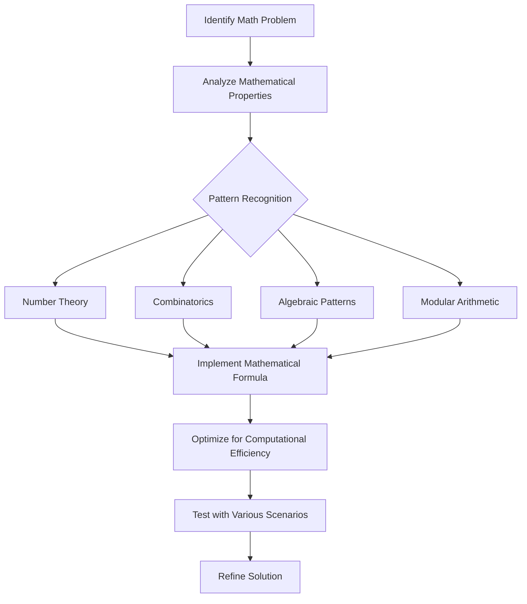

# Math Problem Strategies

Mathematics is a fundamental component of many algorithmic problems on platforms like LeetCode. Having a strong grasp of mathematical concepts and problem-solving strategies can significantly enhance your ability to tackle a wide range of coding challenges. This guide will explore common mathematical patterns and approaches used in programming competitions and technical interviews.

## Introduction to Mathematical Problems in Programming

Mathematical problems in coding often require translating a mathematical concept or formula into code. These problems test not only your coding abilities but also your understanding of mathematical principles and how to apply them efficiently.

Many developers find math-heavy problems intimidating, but with the right strategies and practice, these challenges become approachable and even enjoyable. Let's dive into the key approaches that can help you conquer mathematical coding problems.

## Common Mathematical Strategies

### 1. Number Theory Fundamentals

Number theory problems frequently appear in coding challenges. Understanding these core concepts is essential:

#### Greatest Common Divisor (GCD) and Least Common Multiple (LCM)

The GCD of two numbers is the largest positive integer that divides each of them without a remainder. The LCM is the smallest positive integer that is divisible by both numbers.

```javascript
// Euclidean algorithm for GCD
function gcd(a, b) {
    while (b !== 0) {
        const temp = b;
        b = a % b;
        a = temp;
    }
    return a;
}

// Calculate LCM using GCD
function lcm(a, b) {
    return (a * b) / gcd(a, b);
}

// Example usage
console.log(gcd(48, 18)); // Output: 6
console.log(lcm(48, 18)); // Output: 144
```

#### Prime Numbers

Prime numbers are natural numbers greater than 1 that are divisible only by 1 and themselves.

```javascript
// Check if a number is prime
function isPrime(n) {
    if (n <= 1) return false;
    if (n <= 3) return true;
    
    // Check if n is divisible by 2 or 3
    if (n % 2 === 0 || n % 3 === 0) return false;
    
    // Check all numbers of form 6k ± 1 up to sqrt(n)
    for (let i = 5; i * i <= n; i += 6) {
        if (n % i === 0 || n % (i + 2) === 0) return false;
    }
    return true;
}

console.log(isPrime(17)); // Output: true
console.log(isPrime(15)); // Output: false
```

#### Sieve of Eratosthenes

An efficient algorithm for finding all prime numbers up to a given limit.

```javascript
function sieveOfEratosthenes(n) {
    // Create a boolean array "isPrime[0..n]"
    const isPrime = new Array(n + 1).fill(true);
    isPrime[0] = isPrime[1] = false;
    
    for (let p = 2; p * p <= n; p++) {
        // If isPrime[p] is not changed, it's prime
        if (isPrime[p]) {
            // Mark all multiples of p as non-prime
            for (let i = p * p; i <= n; i += p) {
                isPrime[i] = false;
            }
        }
    }
    
    // Collect all prime numbers
    const primes = [];
    for (let i = 2; i <= n; i++) {
        if (isPrime[i]) {
            primes.push(i);
        }
    }
    return primes;
}

console.log(sieveOfEratosthenes(20)); // Output: [2, 3, 5, 7, 11, 13, 17, 19]
```

### 2. Modular Arithmetic

Modular arithmetic is crucial for many algorithmic problems, especially when dealing with large numbers that might cause overflow.

#### Basic Modular Operations

```javascript
const MOD = 1000000007; // Common modulo value in problems

// Addition with modulo
function addMod(a, b, mod = MOD) {
    return (a + b) % mod;
}

// Multiplication with modulo
function mulMod(a, b, mod = MOD) {
    return (a * b) % mod;
}

// Modular exponentiation (fast power)
function powMod(base, exponent, mod = MOD) {
    if (exponent === 0) return 1;
    
    let result = 1;
    base = base % mod;
    
    while (exponent > 0) {
        // If exponent is odd, multiply result with base
        if (exponent & 1) {
            result = (result * base) % mod;
        }
        
        // Exponent = exponent/2
        exponent = exponent >> 1;
        
        // Base = base^2
        base = (base * base) % mod;
    }
    return result;
}

console.log(powMod(2, 10)); // Output: 1024
console.log(powMod(2, 1000)); // Output: 601953
```

### 3. Combinatorics

Combinatorial problems involve counting, arranging, and selecting objects from a set.

#### Factorial Calculation

```javascript
// Calculate factorial with modulo
function factorial(n, mod = MOD) {
    let result = 1;
    for (let i = 2; i <= n; i++) {
        result = (result * i) % mod;
    }
    return result;
}

console.log(factorial(5)); // Output: 120
```

#### Combinations (nCr)

The number of ways to choose r items from a set of n items without regard to order.

```javascript
// Calculate nCr with modulo
function nCr(n, r, mod = MOD) {
    if (r > n) return 0;
    if (r === 0 || r === n) return 1;
    
    // nCr = n! / (r! * (n-r)!)
    let num = 1, den = 1;
    
    // r = min(r, n-r) for optimization
    r = Math.min(r, n - r);
    
    for (let i = 0; i < r; i++) {
        num = (num * (n - i)) % mod;
        den = (den * (i + 1)) % mod;
    }
    
    // Calculate num * den^(mod-2) (modular inverse)
    return (num * powMod(den, mod - 2, mod)) % mod;
}

console.log(nCr(5, 2)); // Output: 10 (5 choose 2)
```

### 4. Matrix Operations

Matrices are powerful tools for solving various algorithmic problems.

```javascript
// Matrix multiplication (2D arrays)
function multiplyMatrix(A, B) {
    const n = A.length;
    const m = B[0].length;
    const p = B.length;
    
    const C = new Array(n).fill(0).map(() => new Array(m).fill(0));
    
    for (let i = 0; i < n; i++) {
        for (let j = 0; j < m; j++) {
            for (let k = 0; k < p; k++) {
                C[i][j] += A[i][k] * B[k][j];
            }
        }
    }
    
    return C;
}

// Matrix exponentiation (useful for Fibonacci and other sequence problems)
function powMatrix(A, exponent) {
    const n = A.length;
    
    // Identity matrix
    let result = new Array(n).fill(0).map((_, i) => {
        const row = new Array(n).fill(0);
        row[i] = 1;
        return row;
    });
    
    while (exponent > 0) {
        if (exponent & 1) {
            result = multiplyMatrix(result, A);
        }
        A = multiplyMatrix(A, A);
        exponent >>= 1;
    }
    
    return result;
}
```

## Real-World Applications

Let's explore some common LeetCode problems that employ these mathematical strategies.

### Example 1: Count Primes (LeetCode #204)

**Problem**: Count the number of prime numbers less than a non-negative number, n.

```javascript
/**
 * @param {number} n
 * @return {number}
 */
function countPrimes(n) {
    if (n <= 2) return 0;
    
    // Use Sieve of Eratosthenes
    const isPrime = new Array(n).fill(true);
    isPrime[0] = isPrime[1] = false;
    
    // Only need to check up to sqrt(n)
    const sqrt = Math.sqrt(n);
    for (let i = 2; i <= sqrt; i++) {
        if (isPrime[i]) {
            // Mark all multiples as non-prime
            for (let j = i * i; j < n; j += i) {
                isPrime[j] = false;
            }
        }
    }
    
    // Count prime numbers
    let count = 0;
    for (let i = 2; i < n; i++) {
        if (isPrime[i]) {
            count++;
        }
    }
    
    return count;
}

// Example usage
console.log(countPrimes(10)); // Output: 4 (The primes are 2, 3, 5, 7)
console.log(countPrimes(0));  // Output: 0
console.log(countPrimes(1));  // Output: 0
```

### Example 2: Fibonacci Number (LeetCode #509)

**Problem**: Calculate the nth Fibonacci number where F(0) = 0, F(1) = 1, and F(n) = F(n-1) + F(n-2) for n > 1.

While there are multiple approaches, we'll use matrix exponentiation for efficiency:

```javascript
/**
 * @param {number} n
 * @return {number}
 */
function fib(n) {
    if (n <= 1) return n;
    
    // Define the transformation matrix [[1,1],[1,0]]
    const matrix = [[1, 1], [1, 0]];
    
    // Calculate matrix^(n-1)
    const resultMatrix = powMatrix(matrix, n - 1);
    
    // The result is in the top-left corner
    return resultMatrix[0][0];
}

// Matrix exponentiation helper function
function powMatrix(A, exponent) {
    if (exponent === 0) {
        return [[1, 0], [0, 1]]; // Identity matrix
    }
    
    if (exponent % 2 === 0) {
        const halfPow = powMatrix(A, exponent / 2);
        return multiplyMatrix(halfPow, halfPow);
    } else {
        const halfPow = powMatrix(A, Math.floor(exponent / 2));
        const temp = multiplyMatrix(halfPow, halfPow);
        return multiplyMatrix(temp, A);
    }
}

// Matrix multiplication
function multiplyMatrix(A, B) {
    const C = [[0, 0], [0, 0]];
    
    for (let i = 0; i < 2; i++) {
        for (let j = 0; j < 2; j++) {
            for (let k = 0; k < 2; k++) {
                C[i][j] += A[i][k] * B[k][j];
            }
        }
    }
    
    return C;
}

// Example usage
console.log(fib(2));  // Output: 1
console.log(fib(3));  // Output: 2
console.log(fib(10)); // Output: 55
```

### Example 3: PowerMod (Solving a typical contest problem)

**Problem**: Calculate (base^exponent) % MOD efficiently, even for large values of exponent.

```javascript
/**
 * @param {number} base
 * @param {number} exponent
 * @param {number} mod
 * @return {number}
 */
function powerMod(base, exponent, mod) {
    if (exponent === 0) return 1;
    
    // Ensure base is within mod
    base = base % mod;
    
    // If base is divisible by mod
    if (base === 0) return 0;
    
    let result = 1;
    
    while (exponent > 0) {
        // If exponent is odd, multiply result with base
        if (exponent & 1) {
            result = (result * base) % mod;
        }
        
        // Exponent = exponent/2
        exponent >>= 1;
        
        // Base = base^2
        base = (base * base) % mod;
    }
    
    return result;
}

// Example usage
console.log(powerMod(2, 10, 1000)); // Output: 24
console.log(powerMod(3, 5, 100));   // Output: 43
console.log(powerMod(123456789, 987654321, 1000000007)); // Handles large numbers
```

## Mathematical Patterns Recognition

One of the most valuable skills in solving mathematical problems is recognizing patterns. Here are some common patterns to watch for:

### Linear Relationship Patterns

Many problems involve a direct linear relationship that can be expressed as a formula.

```javascript
/**
 * Example: Sum of first n natural numbers
 * Pattern: sum = n*(n+1)/2
 */
function sumOfNaturalNumbers(n) {
    return n * (n + 1) / 2;
}

console.log(sumOfNaturalNumbers(10)); // Output: 55
```

### Geometric Progression Patterns

```javascript
/**
 * Example: Sum of geometric series 1 + r + r^2 + ... + r^(n-1)
 * Pattern: sum = (1 - r^n) / (1 - r) for r ≠ 1
 */
function sumOfGeometricSeries(r, n) {
    if (r === 1) return n;
    return (1 - Math.pow(r, n)) / (1 - r);
}

console.log(sumOfGeometricSeries(2, 5)); // Output: 31 (1 + 2 + 4 + 8 + 16)
```

### Cycle Detection

Many mathematical sequences repeat after a certain point. Finding this cycle can optimize solutions dramatically.

```javascript
/**
 * Detect cycle in a sequence and use it to calculate large values
 * Example: Finding the last digit of Fibonacci(n) for large n
 * (Fibonacci numbers have a cycle of 60 in their last digits)
 */
function lastDigitOfFib(n) {
    const cycle = 60; // The cycle length for last digit of Fibonacci
    
    n = n % cycle; // Reduce n to within the cycle
    
    let a = 0, b = 1;
    for (let i = 2; i <= n; i++) {
        const temp = (a + b) % 10;
        a = b;
        b = temp;
    }
    
    return n === 0 ? 0 : b;
}

console.log(lastDigitOfFib(15)); // Output: 0 (As Fibonacci(15) = 610)
console.log(lastDigitOfFib(1000000000)); // Output: 5 (Using cycle detection)
```

## Problem-Solving Framework for Math Problems

When tackling a mathematical problem in programming, follow these steps:

1. **Understand the problem thoroughly**
   - Identify the inputs, outputs, and constraints
   - Look for mathematical patterns or formulas that apply

2. **Simplify with examples**
   - Work through small examples by hand
   - Try to identify patterns or relationships

3. **Develop a mathematical formula or approach**
   - Convert your observations into a general formula
   - Consider edge cases and verify the formula works

4. **Optimize for computation**
   - Consider time and space complexity
   - Use mathematical properties to optimize (e.g., modular arithmetic properties)

5. **Implement and test**
   - Code your solution with careful attention to detail
   - Test with examples, including edge cases

## Visualization of Problem-Solving Strategy



## Summary

Mathematical strategies are essential tools in a programmer's problem-solving arsenal. By mastering:

- **Number theory concepts** (primes, GCD, LCM)
- **Modular arithmetic** techniques for handling large numbers
- **Combinatorial mathematics** for counting problems
- **Matrix operations** for certain recursive structures
- **Pattern recognition** and mathematical relationships

You'll significantly expand your ability to solve a wide range of algorithmic problems efficiently.

## Practice Exercises

To strengthen your mathematical problem-solving skills, try these challenges:

1. Implement an algorithm to find all prime factors of a number.
2. Calculate C(n,k) mod m for large values of n and k.
3. Implement a function to find the nth Catalan number.
4. Create an algorithm to check if a number is a perfect square without using the built-in square root function.
5. Implement an algorithm to find the number of integers less than n that are coprime to n.

## Additional Resources

- [Number Theory for Competitive Programming](https://www.geeksforgeeks.org/number-theory-competitive-programming/)
- [Mathematics for Computer Science (MIT OpenCourseWare)](https://ocw.mit.edu/courses/electrical-engineering-and-computer-science/6-042j-mathematics-for-computer-science-fall-2010/)
- [Project Euler](https://projecteuler.net/) - A series of challenging mathematical/computer programming problems
- "Concrete Mathematics: A Foundation for Computer Science" by Graham, Knuth, and Patashnik

Remember, mathematical problem-solving improves with practice. The more you solve, the better your pattern recognition becomes, allowing you to tackle increasingly complex problems with confidence.