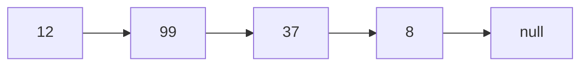
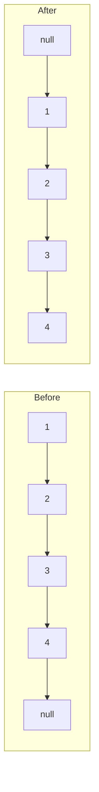

# Linked List Problem Strategies

Linked lists are among the most fundamental data structures you'll encounter in computer programming, and they appear frequently in coding interviews and LeetCode challenges. Unlike arrays, linked lists don't store elements in contiguous memory locations but instead use references (or "pointers") to connect nodes together in a sequence.

## Introduction to Linked Lists

A linked list is a linear data structure where each element (node) contains:
1. Data (the value)
2. A reference to the next node



In its simplest form, a linked list node in JavaScript might look like:

```javascript
class ListNode {
  constructor(val = 0, next = null) {
    this.val = val;
    this.next = next;
  }
}
```

## Common Linked List Problem Patterns

When working with linked lists on LeetCode, you'll encounter several recurring patterns. Mastering these will help you solve a wide range of problems.

### 1. Two-Pointer Technique

The two-pointer (or runner) technique is perhaps the most versatile approach for linked list problems.

#### Slow and Fast Pointers

This technique uses two pointers moving at different speeds:

```javascript
function findMiddle(head) {
  if (!head) return null;
  
  let slow = head;
  let fast = head;
  
  // Fast moves twice as quickly as slow
  while (fast && fast.next) {
    slow = slow.next;
    fast = fast.next.next;
  }
  
  // When fast reaches the end, slow is at the middle
  return slow;
}
```

**Example: Detecting a Cycle**

LeetCode Problem #141: Linked List Cycle

```javascript
function hasCycle(head) {
  if (!head || !head.next) return false;
  
  let slow = head;
  let fast = head;
  
  while (fast && fast.next) {
    slow = slow.next;
    fast = fast.next.next;
    
    // If there's a cycle, fast will eventually catch up to slow
    if (slow === fast) return true;
  }
  
  return false;
}
```

### 2. Dummy Node Technique

Using a dummy node can simplify operations that might modify the head of a linked list.

```javascript
function removeElements(head, val) {
  // Create a dummy node
  const dummy = new ListNode(0);
  dummy.next = head;
  
  let current = dummy;
  
  while (current.next) {
    if (current.next.val === val) {
      current.next = current.next.next;
    } else {
      current = current.next;
    }
  }
  
  return dummy.next;
}
```

**Example: Merge Two Sorted Lists**

LeetCode Problem #21: Merge Two Sorted Lists

```javascript
function mergeTwoLists(list1, list2) {
  const dummy = new ListNode(0);
  let tail = dummy;
  
  while (list1 && list2) {
    if (list1.val < list2.val) {
      tail.next = list1;
      list1 = list1.next;
    } else {
      tail.next = list2;
      list2 = list2.next;
    }
    tail = tail.next;
  }
  
  // Attach the remaining list
  tail.next = list1 || list2;
  
  return dummy.next;
}
```

### 3. Reverse Linked List Pattern

Reversing a linked list or parts of it is another common operation.

```javascript
function reverseList(head) {
  let prev = null;
  let current = head;
  
  while (current) {
    const next = current.next;
    current.next = prev;
    prev = current;
    current = next;
  }
  
  return prev;
}
```

**Visual Representation of Reversal:**



### 4. Recursion with Linked Lists

Many linked list operations can be elegantly expressed using recursion:

```javascript
function reverseListRecursively(head) {
  // Base case
  if (!head || !head.next) return head;
  
  // Recursive case
  const newHead = reverseListRecursively(head.next);
  head.next.next = head;
  head.next = null;
  
  return newHead;
}
```

## Advanced Linked List Strategies

### 1. Intersection and Cycle Detection

Finding the intersection point of two linked lists or detecting cycles requires clever pointer manipulation:

```javascript
function getIntersectionNode(headA, headB) {
  if (!headA || !headB) return null;
  
  let pointerA = headA;
  let pointerB = headB;
  
  // This approach ensures both pointers will travel the same total distance
  while (pointerA !== pointerB) {
    pointerA = pointerA ? pointerA.next : headB;
    pointerB = pointerB ? pointerB.next : headA;
  }
  
  return pointerA; // Either the intersection or null
}
```

### 2. In-place Modifications

Some problems require modifying the list without using extra space:

**Example: Reorder List**

LeetCode Problem #143: Reorder List

```javascript
function reorderList(head) {
  if (!head || !head.next) return;
  
  // Step 1: Find the middle
  let slow = head;
  let fast = head;
  while (fast.next && fast.next.next) {
    slow = slow.next;
    fast = fast.next.next;
  }
  
  // Step 2: Reverse the second half
  let prev = null;
  let current = slow.next;
  slow.next = null; // Break the list into two parts
  
  while (current) {
    const next = current.next;
    current.next = prev;
    prev = current;
    current = next;
  }
  
  // Step 3: Merge the two lists
  let first = head;
  let second = prev;
  
  while (second) {
    const temp1 = first.next;
    const temp2 = second.next;
    first.next = second;
    second.next = temp1;
    first = temp1;
    second = temp2;
  }
}
```

## Practical Applications of Linked Lists

Linked lists are used extensively in real-world programming:

1. **Browser History Navigation**: Forward and backward functionality in browsers use a linked list structure.

2. **Memory Management**: The operating system uses linked lists to keep track of allocated and free memory blocks.

3. **Music Player Playlists**: Songs in a playlist can be implemented as a linked list, allowing easy addition and removal.

**Example: Simple Playlist Implementation**

```javascript
class Song {
  constructor(title, artist, next = null) {
    this.title = title;
    this.artist = artist;
    this.next = next;
  }
}

class Playlist {
  constructor() {
    this.head = null;
    this.tail = null;
    this.length = 0;
  }
  
  addSong(title, artist) {
    const newSong = new Song(title, artist);
    
    if (!this.head) {
      this.head = newSong;
      this.tail = newSong;
    } else {
      this.tail.next = newSong;
      this.tail = newSong;
    }
    
    this.length++;
    return this;
  }
  
  playSongs() {
    let current = this.head;
    let playlist = [];
    
    while (current) {
      playlist.push(`${current.title} by ${current.artist}`);
      current = current.next;
    }
    
    return playlist;
  }
}

// Usage
const myPlaylist = new Playlist();
myPlaylist.addSong("Bohemian Rhapsody", "Queen");
myPlaylist.addSong("Stairway to Heaven", "Led Zeppelin");
myPlaylist.addSong("Hey Jude", "The Beatles");

console.log(myPlaylist.playSongs());
// Output: ["Bohemian Rhapsody by Queen", "Stairway to Heaven by Led Zeppelin", "Hey Jude by The Beatles"]
```

## Common Pitfalls and How to Avoid Them

1. **Null Pointer Exceptions**: Always check for `null` before accessing the `.next` property.

2. **Losing References**: When modifying links, store temporary references to avoid losing parts of the list.

3. **Off-by-One Errors**: Be careful when counting nodes or traversing to specific positions.

4. **Infinite Loops**: When dealing with cycles, ensure your termination conditions are correct.

## Problem-Solving Framework for Linked Lists

When approaching any linked list problem, consider this systematic framework:

1. **Identify the Pattern**: Is this a two-pointer problem? Do you need to reverse the list?

2. **Handle Edge Cases**: Empty list? Single node? Cycles?

3. **Draw It Out**: Visualize the operations on a simple example.

4. **Consider Space Complexity**: Can you solve it in-place?

5. **Test Your Approach**: Trace through your algorithm with a simple example.

## Summary and Practice

Linked lists offer a flexible data structure for organizing sequential data. The strategies we've covered—two-pointers, dummy nodes, reversal techniques, and recursion—form a comprehensive toolkit for solving a wide range of linked list problems.

To truly master these concepts, consistent practice is key. Try solving these classic problems:

1. Reverse a linked list (LeetCode #206)
2. Detect a cycle (LeetCode #141)
3. Find the middle node (LeetCode #876)
4. Merge two sorted lists (LeetCode #21)
5. Remove the nth node from the end (LeetCode #19)

Remember that linked list problems often test your ability to manipulate pointers carefully and efficiently. By understanding the patterns and practicing deliberately, you'll develop the intuition needed to tackle even the most complex linked list challenges.

## Additional Resources

- [Grokking the Coding Interview: Patterns for Coding Questions](https://www.educative.io/courses/grokking-the-coding-interview)
- [Cracking the Coding Interview](http://www.crackingthecodinginterview.com/)
- [LeetCode's Linked List Explore Card](https://leetcode.com/explore/learn/card/linked-list/)

The key to mastery is consistent practice and understanding the underlying patterns. Happy coding!