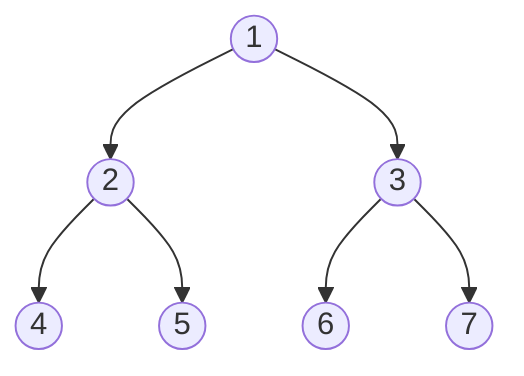

# Tree Problem Strategies

## Introduction

Trees are one of the most common and important data structures in computer science. Whether you're preparing for coding interviews or trying to improve your algorithmic problem-solving skills, mastering tree problems is essential. This guide will walk you through common strategies for solving tree problems on LeetCode and similar platforms.

Tree problems appear frequently in coding interviews because they:
- Test your understanding of recursive thinking
- Evaluate your ability to work with hierarchical data
- Require you to visualize and manipulate complex relationships between nodes
- Often have elegant solutions that demonstrate coding proficiency

By the end of this guide, you'll have a toolkit of strategies to approach almost any tree problem you encounter.

## Understanding Tree Basics

Before diving into strategies, let's quickly refresh our understanding of trees.

### What is a Tree?

A tree is a hierarchical data structure consisting of nodes connected by edges. Each tree has a root node, and every node can have zero or more child nodes.



### Binary Trees

Most LeetCode problems involve binary trees, where each node has at most two children: left and right.

```javascript
// Common Binary Tree Node definition
class TreeNode {
    constructor(val = 0, left = null, right = null) {
        this.val = val;
        this.left = left;
        this.right = right;
    }
}
```

## Core Tree Problem Strategies

### Strategy 1: Tree Traversals

Mastering the three main traversal approaches is fundamental:

#### 1. Depth-First Search (DFS)

DFS explores as far as possible along a branch before backtracking. There are three main types:

**Preorder Traversal (Root → Left → Right)**

```javascript
function preorderTraversal(root) {
    const result = [];
    
    function traverse(node) {
        if (!node) return;
        
        // Visit node
        result.push(node.val);
        // Traverse left subtree
        traverse(node.left);
        // Traverse right subtree
        traverse(node.right);
    }
    
    traverse(root);
    return result;
}
```

**Inorder Traversal (Left → Root → Right)**

```javascript
function inorderTraversal(root) {
    const result = [];
    
    function traverse(node) {
        if (!node) return;
        
        traverse(node.left);
        result.push(node.val);
        traverse(node.right);
    }
    
    traverse(root);
    return result;
}
```

**Postorder Traversal (Left → Right → Root)**

```javascript
function postorderTraversal(root) {
    const result = [];
    
    function traverse(node) {
        if (!node) return;
        
        traverse(node.left);
        traverse(node.right);
        result.push(node.val);
    }
    
    traverse(root);
    return result;
}
```

#### 2. Breadth-First Search (BFS)

BFS explores all nodes at the current depth before moving to nodes at the next depth level.

```javascript
function levelOrderTraversal(root) {
    if (!root) return [];
    
    const result = [];
    const queue = [root];
    
    while (queue.length > 0) {
        const levelSize = queue.length;
        const currentLevel = [];
        
        for (let i = 0; i < levelSize; i++) {
            const node = queue.shift();
            currentLevel.push(node.val);
            
            if (node.left) queue.push(node.left);
            if (node.right) queue.push(node.right);
        }
        
        result.push(currentLevel);
    }
    
    return result;
}
```

**Example: Level Order Traversal**

Input:
```
    3
   / \
  9  20
    /  \
   15   7
```

Output:
```
[
  [3],
  [9, 20],
  [15, 7]
]
```

### Strategy 2: The Recursive Approach

Many tree problems lend themselves naturally to recursive solutions because:

1. Trees are recursive structures by nature (subtrees are trees)
2. Solutions often follow similar patterns at each node
3. Base cases are usually well-defined (empty nodes)

The key to recursive approaches is to:

1. Define the base case (usually when the node is null)
2. Define what happens at the current node
3. Recursively apply the same logic to children
4. Combine results as needed

**Example: Maximum Depth of Binary Tree**

```javascript
function maxDepth(root) {
    // Base case
    if (!root) return 0;
    
    // Recursively find depth of left and right subtrees
    const leftDepth = maxDepth(root.left);
    const rightDepth = maxDepth(root.right);
    
    // Combine results: current node adds 1 to the max depth of subtrees
    return Math.max(leftDepth, rightDepth) + 1;
}
```

### Strategy 3: The Bottom-Up Approach

Sometimes it's easier to solve problems by starting from the leaf nodes and working your way up to the root:

1. Start by solving the problem for leaf nodes
2. Combine these solutions to solve for parent nodes
3. Continue up until reaching the root

**Example: Check if a Binary Tree is Balanced**

```javascript
function isBalanced(root) {
    // Returns [isBalanced, height]
    function checkBalance(node) {
        if (!node) return [true, 0];
        
        const left = checkBalance(node.left);
        const right = checkBalance(node.right);
        
        // If any subtree is unbalanced, entire tree is unbalanced
        const balanced = left[0] && right[0] && Math.abs(left[1] - right[1]) <= 1;
        const height = Math.max(left[1], right[1]) + 1;
        
        return [balanced, height];
    }
    
    return checkBalance(root)[0];
}
```

### Strategy 4: The Top-Down Approach

In contrast, sometimes it's better to start from the root and work downward:

1. Start processing at the root
2. Pass needed information down to child nodes
3. Process nodes as you go

**Example: Path Sum**

```javascript
function hasPathSum(root, targetSum) {
    if (!root) return false;
    
    // If it's a leaf node, check if the remaining sum equals the node value
    if (!root.left && !root.right) {
        return targetSum === root.val;
    }
    
    // Recursively check if either subtree has the path with remaining sum
    const remainingSum = targetSum - root.val;
    return hasPathSum(root.left, remainingSum) || hasPathSum(root.right, remainingSum);
}
```

### Strategy 5: Using Helper Data Structures

Many tree problems can be simplified by using additional data structures:

#### Using Stacks for Iterative DFS

```javascript
function inorderTraversalIterative(root) {
    const result = [];
    const stack = [];
    let current = root;
    
    while (current || stack.length > 0) {
        // Traverse to leftmost node
        while (current) {
            stack.push(current);
            current = current.left;
        }
        
        // Process the node
        current = stack.pop();
        result.push(current.val);
        
        // Move to the right child
        current = current.right;
    }
    
    return result;
}
```

#### Using Hashmap for Path Tracking

```javascript
function pathSum(root, targetSum) {
    // Map to store prefix sums and their frequencies
    const prefixSumCount = new Map();
    prefixSumCount.set(0, 1); // Empty path has sum 0
    
    let count = 0;
    
    function dfs(node, currentSum) {
        if (!node) return;
        
        // Current path sum
        currentSum += node.val;
        
        // If there was a prefix with sum (currentSum - targetSum), 
        // it means there's a valid path ending at current node
        if (prefixSumCount.has(currentSum - targetSum)) {
            count += prefixSumCount.get(currentSum - targetSum);
        }
        
        // Update prefix sum map
        prefixSumCount.set(currentSum, (prefixSumCount.get(currentSum) || 0) + 1);
        
        // Traverse children
        dfs(node.left, currentSum);
        dfs(node.right, currentSum);
        
        // Backtrack: remove current path from prefixSumCount
        prefixSumCount.set(currentSum, prefixSumCount.get(currentSum) - 1);
    }
    
    dfs(root, 0);
    return count;
}
```

## Common Tree Problem Patterns

### Pattern 1: Tree Construction Problems

These involve building a tree from given information.

**Example: Construct Binary Tree from Preorder and Inorder Traversal**

```javascript
function buildTree(preorder, inorder) {
    if (!preorder.length || !inorder.length) return null;
    
    // Root is the first element in preorder
    const rootVal = preorder[0];
    const root = new TreeNode(rootVal);
    
    // Find position of root in inorder array
    const rootIndex = inorder.indexOf(rootVal);
    
    // Recursively build left and right subtrees
    root.left = buildTree(
        preorder.slice(1, rootIndex + 1),
        inorder.slice(0, rootIndex)
    );
    
    root.right = buildTree(
        preorder.slice(rootIndex + 1),
        inorder.slice(rootIndex + 1)
    );
    
    return root;
}
```

### Pattern 2: Tree Comparison Problems

Problems that involve comparing two different trees.

**Example: Same Tree**

```javascript
function isSameTree(p, q) {
    // If both are null, they're the same
    if (!p && !q) return true;
    
    // If only one is null, they're different
    if (!p || !q) return false;
    
    // Check values and both subtrees recursively
    return p.val === q.val && 
           isSameTree(p.left, q.left) && 
           isSameTree(p.right, q.right);
}
```

### Pattern 3: Path Problems

Problems involving paths from one node to another.

**Example: Binary Tree Maximum Path Sum**

```javascript
function maxPathSum(root) {
    let maxSum = -Infinity;
    
    function findMaxPathSum(node) {
        if (!node) return 0;
        
        // Get max path sum from left and right subtrees
        // If negative, we don't include that path (use 0)
        const leftMax = Math.max(0, findMaxPathSum(node.left));
        const rightMax = Math.max(0, findMaxPathSum(node.right));
        
        // Update global max (might include both left and right paths)
        maxSum = Math.max(maxSum, node.val + leftMax + rightMax);
        
        // Return max path sum that can be extended upward (can only choose one path)
        return node.val + Math.max(leftMax, rightMax);
    }
    
    findMaxPathSum(root);
    return maxSum;
}
```

## Real-World Applications

### 1. File System Organization

Tree structures mirror how file systems work on computers. Directories can contain files or other directories, forming a hierarchical tree.

```javascript
class FileSystemNode {
    constructor(name, isDirectory = false) {
        this.name = name;
        this.isDirectory = isDirectory;
        this.children = []; // For directories
        this.content = null; // For files
    }
    
    addChild(child) {
        if (this.isDirectory) {
            this.children.push(child);
        } else {
            throw new Error("Cannot add child to a file");
        }
    }
    
    findNodeByPath(path) {
        if (path.length === 0) return this;
        
        const nextNodeName = path[0];
        const childNode = this.children.find(child => child.name === nextNodeName);
        
        if (!childNode) return null;
        return childNode.findNodeByPath(path.slice(1));
    }
}
```

### 2. DOM Manipulation

Web browsers represent HTML documents as trees (DOM - Document Object Model). Understanding tree operations helps in web development.

```javascript
function countElementsByType(rootElement, targetType) {
    let count = 0;
    
    function traverse(element) {
        if (element.tagName.toLowerCase() === targetType) {
            count++;
        }
        
        // Traverse all child nodes
        for (let i = 0; i < element.children.length; i++) {
            traverse(element.children[i]);
        }
    }
    
    traverse(rootElement);
    return count;
}
```

### 3. Decision Trees

Trees are used in artificial intelligence for decision-making processes.

```javascript
class DecisionNode {
    constructor(attribute = null, value = null, isLeaf = false, prediction = null) {
        this.attribute = attribute;
        this.value = value;
        this.isLeaf = isLeaf;
        this.prediction = prediction;
        this.branches = {}; // Map of attribute values to child nodes
    }
    
    addBranch(attributeValue, childNode) {
        this.branches[attributeValue] = childNode;
    }
    
    classify(dataPoint) {
        if (this.isLeaf) {
            return this.prediction;
        }
        
        const attributeValue = dataPoint[this.attribute];
        if (attributeValue in this.branches) {
            return this.branches[attributeValue].classify(dataPoint);
        } else {
            // Default prediction when we don't have a branch for this value
            return Object.values(this.branches)[0].classify(dataPoint);
        }
    }
}
```

## Common Pitfalls and How to Avoid Them

1. **Forgetting Base Cases**: Always handle the null node case explicitly.

2. **Stack Overflow**: Be cautious with deeply nested trees. Consider iterative approaches for very deep trees.

3. **Not Considering All Paths**: In problems involving paths, ensure you're considering paths through the parent, not just from parent to children.

4. **Modifying the Tree Unintentionally**: Be careful when modifying tree nodes in-place.

5. **Inefficient Traversals**: Choose the right traversal type for your problem.

## Summary

Tree problems form a significant category in algorithmic interviews and LeetCode challenges. By mastering:

- Different traversal methods (DFS, BFS)
- Recursive, bottom-up, and top-down approaches
- Common patterns like construction, comparison, and path finding
- Use of helper data structures

You'll be well-equipped to tackle almost any tree problem. Remember to:

1. Start by identifying the most suitable traversal approach
2. Consider recursive solutions but be aware of their limitations
3. Draw out examples to visualize the problem
4. Think about information needed at each node and how to propagate it

## Practice Exercises

To solidify your understanding, try solving these common tree problems on LeetCode:

1. Maximum Depth of Binary Tree
2. Validate Binary Search Tree  
3. Symmetric Tree
4. Binary Tree Level Order Traversal
5. Construct Binary Tree from Preorder and Inorder Traversal
6. Convert Sorted Array to Binary Search Tree
7. Path Sum
8. Lowest Common Ancestor of a Binary Tree
9. Serialize and Deserialize Binary Tree
10. Binary Tree Maximum Path Sum

## Additional Resources

- **Books**: "Cracking the Coding Interview" by Gayle Laakmann McDowell has an excellent chapter on trees.
- **Courses**: Algorithms specializations on platforms like Coursera often have dedicated sections on tree algorithms.
- **Visualization Tools**: Using tools like [Visualgo](https://visualgo.net/) can help you understand tree operations better.
- **Practice**: Create a regular practice routine focusing on one tree pattern at a time.

With consistent practice using these strategies, you'll develop the intuition to recognize patterns and apply the right approach to any tree problem you encounter.