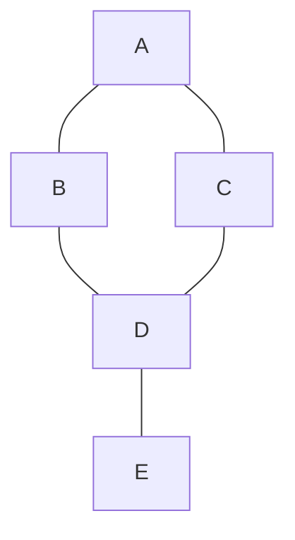

# Graph Problem Strategies

## Introduction

Graphs are one of the most versatile and powerful data structures in computer science. They represent connections between objects and are used to model a wide range of real-world scenarios, from social networks to road systems, from web page links to dependencies in software projects.

In coding interviews and platforms like LeetCode, graph problems appear frequently and test not just your understanding of graph algorithms but also your ability to model problems as graphs in the first place. This guide aims to provide you with a solid foundation for tackling graph problems, explaining both the theory and practical approaches.

## Graph Basics

### What is a Graph?

A graph is a collection of nodes (also called vertices) connected by edges. Graphs can be:

- **Directed** (edges have direction) or **Undirected** (edges have no direction)
- **Weighted** (edges have values/weights) or **Unweighted** (all edges have equal importance)
- **Cyclic** (contains at least one cycle) or **Acyclic** (no cycles)
- **Connected** (there is a path between any two vertices) or **Disconnected**

### Graph Representations

There are two primary ways to represent graphs in code:

#### 1. Adjacency Matrix

An adjacency matrix is a 2D array where `matrix[i][j]` indicates whether there's an edge from vertex `i` to vertex `j`.

```javascript
// Adjacency Matrix for an undirected graph with 4 vertices
const adjMatrix = [
  [0, 1, 0, 1],  // Vertex 0 is connected to 1 and 3
  [1, 0, 1, 0],  // Vertex 1 is connected to 0 and 2
  [0, 1, 0, 1],  // Vertex 2 is connected to 1 and 3
  [1, 0, 1, 0]   // Vertex 3 is connected to 0 and 2
];
```

**Pros:**
- Simple for small graphs
- Checking if two vertices are connected is O(1)
- Easy to implement

**Cons:**
- Uses O(V²) space, inefficient for sparse graphs
- Adding/removing vertices requires rebuilding the matrix

#### 2. Adjacency List

An adjacency list stores a list of adjacent vertices for each vertex in the graph.

```javascript
// Adjacency List for the same undirected graph
const adjList = {
  0: [1, 3],
  1: [0, 2],
  2: [1, 3],
  3: [0, 2]
};
```

**Pros:**
- Space-efficient for sparse graphs (O(V+E))
- Adding a vertex is easier
- Iterating over all edges is efficient

**Cons:**
- Checking if two vertices are connected takes O(degree) time

## Graph Traversal Algorithms

The foundation of most graph problems is traversing the graph. There are two main traversal techniques:

### Breadth-First Search (BFS)

BFS explores all neighbors at the current depth before moving to vertices at the next depth level. It's implemented using a queue.

**When to use BFS:**
- Finding shortest path in unweighted graphs
- Level-order traversal
- Finding connected components

```javascript
function bfs(graph, startNode) {
  const visited = new Set();
  const queue = [startNode];
  visited.add(startNode);
  
  while (queue.length > 0) {
    const currentNode = queue.shift();
    console.log(currentNode); // Process node
    
    // Visit all neighbors
    for (const neighbor of graph[currentNode]) {
      if (!visited.has(neighbor)) {
        visited.add(neighbor);
        queue.push(neighbor);
      }
    }
  }
}
```

### Depth-First Search (DFS)

DFS explores as far as possible along each branch before backtracking. It can be implemented using recursion or a stack.

**When to use DFS:**
- Detecting cycles
- Topological sorting
- Pathfinding in mazes
- Strongly connected components

```javascript
// Recursive DFS implementation
function dfs(graph, currentNode, visited = new Set()) {
  visited.add(currentNode);
  console.log(currentNode); // Process node
  
  // Visit all neighbors
  for (const neighbor of graph[currentNode]) {
    if (!visited.has(neighbor)) {
      dfs(graph, neighbor, visited);
    }
  }
}

// Iterative DFS using a stack
function dfsIterative(graph, startNode) {
  const visited = new Set();
  const stack = [startNode];
  
  while (stack.length > 0) {
    const currentNode = stack.pop();
    if (!visited.has(currentNode)) {
      visited.add(currentNode);
      console.log(currentNode); // Process node
      
      // Add all unvisited neighbors to the stack
      for (const neighbor of graph[currentNode]) {
        if (!visited.has(neighbor)) {
          stack.push(neighbor);
        }
      }
    }
  }
}
```

## Common Graph Problem Patterns

### 1. Connected Components

Finding separate groups of connected vertices in an undirected graph.

```javascript
function countConnectedComponents(graph) {
  const visited = new Set();
  let count = 0;
  
  for (const node in graph) {
    if (!visited.has(parseInt(node))) {
      dfs(graph, parseInt(node), visited);
      count++;
    }
  }
  
  return count;
}
```

**LeetCode Example: [Number of Islands](https://leetcode.com/problems/number-of-islands/)**

### 2. Cycle Detection

Determining if a graph contains a cycle.

```javascript
function hasCycle(graph) {
  const visited = new Set();
  const inStack = new Set(); // For directed graph cycle detection
  
  for (const node in graph) {
    if (!visited.has(parseInt(node))) {
      if (hasCycleUtil(graph, parseInt(node), visited, inStack)) {
        return true;
      }
    }
  }
  
  return false;
}

function hasCycleUtil(graph, node, visited, inStack) {
  visited.add(node);
  inStack.add(node);
  
  for (const neighbor of graph[node]) {
    if (!visited.has(neighbor)) {
      if (hasCycleUtil(graph, neighbor, visited, inStack)) {
        return true;
      }
    } else if (inStack.has(neighbor)) {
      return true; // Cycle detected
    }
  }
  
  inStack.delete(node); // Remove from recursion stack
  return false;
}
```

**LeetCode Example: [Course Schedule](https://leetcode.com/problems/course-schedule/)**

### 3. Topological Sort

Ordering vertices such that for every directed edge (u, v), vertex u comes before v in the ordering.
Only works for Directed Acyclic Graphs (DAGs).

```javascript
function topologicalSort(graph) {
  const visited = new Set();
  const order = [];
  
  for (const node in graph) {
    if (!visited.has(parseInt(node))) {
      topoSortUtil(graph, parseInt(node), visited, order);
    }
  }
  
  return order.reverse(); // Reverse to get the correct order
}

function topoSortUtil(graph, node, visited, order) {
  visited.add(node);
  
  for (const neighbor of graph[node]) {
    if (!visited.has(neighbor)) {
      topoSortUtil(graph, neighbor, visited, order);
    }
  }
  
  // Add current node after all its dependencies
  order.push(node);
}
```

**LeetCode Example: [Course Schedule II](https://leetcode.com/problems/course-schedule-ii/)**

### 4. Shortest Path Algorithms

#### Dijkstra's Algorithm (for weighted graphs)

Finds the shortest path from a source vertex to all other vertices.

```javascript
function dijkstra(graph, start) {
  const distances = {};
  const visited = new Set();
  const minHeap = new MinPriorityQueue();
  
  // Initialize distances
  for (const node in graph) {
    distances[node] = Infinity;
  }
  distances[start] = 0;
  
  minHeap.enqueue(start, 0);
  
  while (!minHeap.isEmpty()) {
    const { element: currentNode, priority: currentDistance } = minHeap.dequeue();
    
    if (visited.has(currentNode)) continue;
    visited.add(currentNode);
    
    for (const [neighbor, weight] of graph[currentNode]) {
      if (visited.has(neighbor)) continue;
      
      const distance = currentDistance + weight;
      if (distance < distances[neighbor]) {
        distances[neighbor] = distance;
        minHeap.enqueue(neighbor, distance);
      }
    }
  }
  
  return distances;
}
```

**LeetCode Example: [Network Delay Time](https://leetcode.com/problems/network-delay-time/)**

#### Bellman-Ford Algorithm

Handles graphs with negative edge weights (but no negative cycles).

```javascript
function bellmanFord(graph, V, E, start) {
  const distances = Array(V).fill(Infinity);
  distances[start] = 0;
  
  // Relax all edges V-1 times
  for (let i = 0; i < V - 1; i++) {
    for (const [u, v, w] of E) {
      if (distances[u] !== Infinity && distances[u] + w < distances[v]) {
        distances[v] = distances[u] + w;
      }
    }
  }
  
  // Check for negative cycles
  for (const [u, v, w] of E) {
    if (distances[u] !== Infinity && distances[u] + w < distances[v]) {
      console.log("Graph contains negative weight cycle");
      return;
    }
  }
  
  return distances;
}
```

**LeetCode Example: [Cheapest Flights Within K Stops](https://leetcode.com/problems/cheapest-flights-within-k-stops/)**

### 5. Union-Find (Disjoint Set)

Used for operations on disjoint sets, particularly useful for:
- Finding if two vertices are connected
- Detecting cycles in an undirected graph
- Minimum spanning trees

```javascript
class UnionFind {
  constructor(n) {
    this.parent = Array.from({ length: n }, (_, i) => i);
    this.rank = Array(n).fill(0);
    this.count = n;
  }
  
  find(x) {
    if (this.parent[x] !== x) {
      this.parent[x] = this.find(this.parent[x]); // Path compression
    }
    return this.parent[x];
  }
  
  union(x, y) {
    const rootX = this.find(x);
    const rootY = this.find(y);
    
    if (rootX === rootY) return false;
    
    // Union by rank
    if (this.rank[rootX] < this.rank[rootY]) {
      this.parent[rootX] = rootY;
    } else if (this.rank[rootX] > this.rank[rootY]) {
      this.parent[rootY] = rootX;
    } else {
      this.parent[rootY] = rootX;
      this.rank[rootX]++;
    }
    
    this.count--;
    return true;
  }
  
  isConnected(x, y) {
    return this.find(x) === this.find(y);
  }
  
  getCount() {
    return this.count;
  }
}
```

**LeetCode Example: [Number of Connected Components in an Undirected Graph](https://leetcode.com/problems/number-of-connected-components-in-an-undirected-graph/)**

## Visualizing Graphs

For better understanding, let's visualize a simple graph:



This undirected graph has 5 vertices (A, B, C, D, E) and 5 edges connecting them.

## Practical Example: Solving a LeetCode Problem

Let's tackle a classic graph problem step by step: **Clone Graph** (LeetCode #133).

**Problem**: Given a reference of a node in a connected undirected graph, return a deep copy (clone) of the graph.

```javascript
/**
 * Definition for a Node.
 * function Node(val, neighbors) {
 *     this.val = val === undefined ? 0 : val;
 *     this.neighbors = neighbors === undefined ? [] : neighbors;
 * }
 */

/**
 * @param {Node} node
 * @return {Node}
 */
var cloneGraph = function(node) {
    if (!node) return null;
    
    const visited = new Map(); // Maps original nodes to their clones
    
    // DFS function to clone the graph
    function dfs(originalNode) {
        // If we've already visited this node, return its clone
        if (visited.has(originalNode)) {
            return visited.get(originalNode);
        }
        
        // Create a clone of the current node
        const cloneNode = new Node(originalNode.val, []);
        
        // Mark as visited by storing the mapping
        visited.set(originalNode, cloneNode);
        
        // Clone all neighbors
        for (const neighbor of originalNode.neighbors) {
            cloneNode.neighbors.push(dfs(neighbor));
        }
        
        return cloneNode;
    }
    
    return dfs(node);
};
```

**Explanation:**
1. We use DFS to traverse the original graph
2. We maintain a mapping between original nodes and their clones using a Map
3. When we encounter an unvisited node, we create a clone and recursively clone its neighbors
4. If we revisit a node, we return its already-created clone from the Map

## Real-World Applications of Graphs

Graph algorithms are not just theoretical concepts; they power many real-world technologies:

1. **Social Networks**: Facebook uses graphs to represent friendships, suggest new friends, and show relevant content.

2. **GPS Navigation**: Google Maps uses weighted graphs to find the shortest/fastest route between locations.

3. **Recommendation Systems**: Amazon, Netflix, etc., use graphs to model relationships between users and items.

4. **Web Indexing**: Search engines use web pages as nodes and links as edges to rank pages.

5. **Network Routing**: Routers use shortest path algorithms to direct traffic efficiently.

6. **Fraud Detection**: Financial institutions build graphs of transactions to detect suspicious patterns.

## Advanced Graph Concepts

Once you're comfortable with the basics, consider exploring:

- **Strongly Connected Components**: Kosaraju's or Tarjan's Algorithm
- **Minimum Spanning Trees**: Kruskal's and Prim's Algorithms
- **Maximum Flow**: Ford-Fulkerson Algorithm
- **Bipartite Graphs**: Two-colorability
- **Network Flow**: For optimization problems
- **Graph Coloring**: Assigning labels to graph elements

## Common Mistakes to Avoid

1. **Forgetting to handle disconnected graphs**: Always check if all nodes are visited.

2. **Not marking nodes as visited**: Can lead to infinite loops in graphs with cycles.

3. **Using BFS when DFS is more appropriate** (or vice versa): Choose the right algorithm for your problem.

4. **Incorrect graph representation**: Choose adjacency matrix or list depending on your graph's properties.

5. **Not considering edge cases**: Empty graphs, single-node graphs, etc.

## Summary

In this guide, we've covered:

- Graph representations (adjacency matrix and adjacency list)
- Graph traversal algorithms (BFS and DFS)
- Common graph problem patterns (connected components, cycle detection, topological sort, shortest path)
- Union-Find data structure
- Practical examples through LeetCode problems

Graph problems can seem intimidating at first, but with a solid understanding of basic concepts and patterns, you'll be able to tackle a wide range of graph challenges. Remember that many problems that don't initially appear to be graph problems can often be modeled as such, making graph algorithms an essential tool in your problem-solving toolkit.

## Practice Problems

To strengthen your skills, try these LeetCode problems:

1. Easy: [Find the Town Judge](https://leetcode.com/problems/find-the-town-judge/)
2. Medium: [All Paths From Source to Target](https://leetcode.com/problems/all-paths-from-source-to-target/)
3. Medium: [Redundant Connection](https://leetcode.com/problems/redundant-connection/)
4. Medium: [Pacific Atlantic Water Flow](https://leetcode.com/problems/pacific-atlantic-water-flow/)
5. Hard: [Word Ladder](https://leetcode.com/problems/word-ladder/)
6. Hard: [Alien Dictionary](https://leetcode.com/problems/alien-dictionary/)

## Additional Resources

- [Graph Theory Basics](https://www.khanacademy.org/computing/computer-science/algorithms/graph-representation/a/representing-graphs)
- [Visualizing Algorithms](https://visualgo.net/en/graphds)
- [Introduction to Algorithms](https://mitpress.mit.edu/books/introduction-algorithms-third-edition) (CLRS) chapters on Graph Algorithms
- [Graph Theory and Algorithms](https://www.coursera.org/learn/algorithms-on-graphs) course on Coursera

Keep practicing, and you'll become proficient at recognizing and solving graph problems in no time!