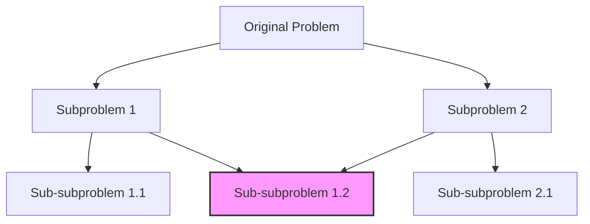

# Dynamic Programming Strategies

## Introduction

Dynamic Programming (DP) is a powerful technique for solving complex problems by breaking them down into simpler overlapping subproblems. It's one of the most important algorithmic paradigms for solving optimization and counting problems efficiently.

In this guide, we'll explore different dynamic programming strategies that will help you tackle a wide range of LeetCode problems. By the end, you'll understand:

- When and why to use dynamic programming
- Top-down vs. bottom-up approaches
- State design principles
- Common DP patterns
- Optimization techniques

## What is Dynamic Programming?

Dynamic programming works by:

1. Breaking a problem into overlapping subproblems
2. Solving each subproblem just once
3. Storing the solutions to avoid redundant calculations
4. Building up the final solution from these stored results

A problem is suitable for DP when it exhibits two key properties:

1. **Optimal Substructure**: The optimal solution to the problem can be constructed from optimal solutions of its subproblems.
2. **Overlapping Subproblems**: The same subproblems are solved multiple times when using a naive recursive approach.

## Core DP Strategies

### Top-Down Approach (Memoization)

Memoization is a top-down approach where we start with the original problem and recursively break it down, storing results as we go.

#### Steps for Implementing Memoization:

1. Define a recursive function that solves the problem
2. Create a data structure (typically a hash map or array) to store computed results
3. Before computation, check if the result is already stored
4. After computation, store the result before returning

#### Example: Fibonacci Sequence

```javascript
function fib(n, memo = {}) {
  // Base cases
  if (n <= 1) return n;
  
  // Check if already computed
  if (n in memo) return memo[n];
  
  // Compute and store result
  memo[n] = fib(n - 1, memo) + fib(n - 2, memo);
  return memo[n];
}

console.log(fib(10)); // Output: 55
```

The time complexity improves from O(2^n) to O(n) with memoization!

### Bottom-Up Approach (Tabulation)

Tabulation is a bottom-up approach where we start from the smallest subproblems and iteratively build up to the original problem.

#### Steps for Implementing Tabulation:

1. Define an array or table to store results
2. Initialize the table with base cases
3. Iterate through the problem space, filling the table
4. Return the final cell or value that represents the solution

#### Example: Fibonacci Sequence (Tabulation)

```javascript
function fibTabulation(n) {
  if (n <= 1) return n;
  
  // Create table and initialize with base cases
  const dp = new Array(n + 1);
  dp[0] = 0;
  dp[1] = 1;
  
  // Fill the table
  for (let i = 2; i <= n; i++) {
    dp[i] = dp[i-1] + dp[i-2];
  }
  
  return dp[n];
}

console.log(fibTabulation(10)); // Output: 55
```

### Choosing Between Top-Down and Bottom-Up

| Top-Down (Memoization) | Bottom-Up (Tabulation) |
|------------------------|------------------------|
| Easier to implement initially | Usually more efficient |
| Only computes needed values | Computes all values in range |
| Uses recursion and might cause stack overflow | Iterative approach, no stack overflow risk |
| Better for sparse problems | Better for dense problems |

## State Design for DP Problems

The most crucial step in solving DP problems is designing the state properly. Your state must uniquely represent each subproblem.

### State Design Principles:

1. **Identify what uniquely defines a subproblem**
2. **Keep states minimal but sufficient**
3. **Choose appropriate data structures for memo/table**

### Common State Parameters:

- Position/index in array/string
- Remaining value (e.g., remaining capacity)
- Previous decisions or constraints
- Multiple dimensions (common in matching or 2D grid problems)

## Classic DP Patterns

### 1. Linear Sequence DP

Used for optimizing a sequence of decisions.

#### Example: Climbing Stairs (LeetCode #70)

```javascript
function climbStairs(n) {
  if (n <= 2) return n;
  
  const dp = new Array(n + 1);
  dp[1] = 1;
  dp[2] = 2;
  
  for (let i = 3; i <= n; i++) {
    dp[i] = dp[i-1] + dp[i-2]; // Ways to reach step i
  }
  
  return dp[n];
}

console.log(climbStairs(5)); // Output: 8
```

### 2. Two-Dimensional Grid DP

Used for pathfinding, area calculation, or configuration counting in grids.

#### Example: Minimum Path Sum (LeetCode #64)

```javascript
function minPathSum(grid) {
  const m = grid.length;
  const n = grid[0].length;
  
  // Create DP table
  const dp = Array(m).fill().map(() => Array(n).fill(0));
  
  // Initialize
  dp[0][0] = grid[0][0];
  
  // Fill first row
  for (let j = 1; j < n; j++) {
    dp[0][j] = dp[0][j-1] + grid[0][j];
  }
  
  // Fill first column
  for (let i = 1; i < m; i++) {
    dp[i][0] = dp[i-1][0] + grid[i][0];
  }
  
  // Fill the rest of the table
  for (let i = 1; i < m; i++) {
    for (let j = 1; j < n; j++) {
      dp[i][j] = grid[i][j] + Math.min(dp[i-1][j], dp[i][j-1]);
    }
  }
  
  return dp[m-1][n-1];
}

const grid = [
  [1, 3, 1],
  [1, 5, 1],
  [4, 2, 1]
];
console.log(minPathSum(grid)); // Output: 7
```

### 3. Interval DP

Used for problems involving intervals or subarrays.

#### Example: Burst Balloons (LeetCode #312) - Simplified

```python
def maxCoins(nums):
    # Add boundary balloons with value 1
    nums = [1] + nums + [1]
    n = len(nums)
    
    # dp[i][j] represents maxCoins for interval (i,j)
    dp = [[0] * n for _ in range(n)]
    
    # Iterate over all possible lengths of intervals
    for length in range(2, n):
        for left in range(0, n - length):
            right = left + length
            
            # Try each balloon as the last to burst
            for k in range(left + 1, right):
                dp[left][right] = max(
                    dp[left][right],
                    dp[left][k] + dp[k][right] + nums[left] * nums[k] * nums[right]
                )
    
    return dp[0][n-1]

print(maxCoins([3, 1, 5, 8]))  # Output: 167
```

### 4. Subset and Combination DP

Used for counting or optimizing combinations and selections.

#### Example: Coin Change (LeetCode #322)

```javascript
function coinChange(coins, amount) {
  // Initialize dp array with amount+1 (greater than max possible value)
  const dp = Array(amount + 1).fill(amount + 1);
  dp[0] = 0;
  
  for (let i = 1; i <= amount; i++) {
    for (const coin of coins) {
      if (coin <= i) {
        dp[i] = Math.min(dp[i], dp[i - coin] + 1);
      }
    }
  }
  
  return dp[amount] > amount ? -1 : dp[amount];
}

console.log(coinChange([1, 2, 5], 11)); // Output: 3 (5 + 5 + 1)
```

### 5. State Machine DP

Used for problems where decisions depend on previous states or actions.

#### Example: Best Time to Buy and Sell Stock with Cooldown (LeetCode #309)

```javascript
function maxProfit(prices) {
  if (prices.length <= 1) return 0;
  
  let n = prices.length;
  
  // hold[i]: max profit if we are holding stock on day i
  // sold[i]: max profit if we sold stock on day i
  // rest[i]: max profit if we're in cooldown on day i
  const hold = Array(n).fill(0);
  const sold = Array(n).fill(0);
  const rest = Array(n).fill(0);
  
  // Base cases
  hold[0] = -prices[0]; // buy on day 0
  sold[0] = 0;          // can't sell on day 0
  rest[0] = 0;          // rest on day 0
  
  for (let i = 1; i < n; i++) {
    hold[i] = Math.max(hold[i-1], rest[i-1] - prices[i]);
    sold[i] = hold[i-1] + prices[i];
    rest[i] = Math.max(rest[i-1], sold[i-1]);
  }
  
  // Final answer is max of sold or rest on last day
  return Math.max(sold[n-1], rest[n-1]);
}

console.log(maxProfit([1, 2, 3, 0, 2])); // Output: 3
```

## Space Optimization in DP

Many DP solutions can be optimized for space complexity. Here are some common techniques:

### 1. Rolling Array Technique

Instead of keeping the entire DP table, you can often keep just the last few rows/elements.

#### Example: Fibonacci with O(1) Space

```javascript
function fibOptimized(n) {
  if (n <= 1) return n;
  
  let prev = 0;
  let curr = 1;
  
  for (let i = 2; i <= n; i++) {
    const next = prev + curr;
    prev = curr;
    curr = next;
  }
  
  return curr;
}

console.log(fibOptimized(10)); // Output: 55
```

### 2. In-place Updates

For problems where we need to build a 2D table but the dependency is simple, we can sometimes update the array in-place.

## Visualization of DP Solutions

Visualizing the DP structure can often help understand the logic better:



The highlighted node represents an overlapping subproblem that gets calculated multiple times in naive recursion but only once with DP.

## Common Pitfalls and How to Avoid Them

1. **Incorrect State Definition**: Make sure your states uniquely identify subproblems
2. **Missing Base Cases**: Always double-check initialization values
3. **Wrong Transition Function**: Verify the recurrence relation carefully
4. **Out of Bounds Errors**: Be careful with array indexing
5. **Integer Overflow**: For problems requiring large numbers, use appropriate data types

## Real-World Applications of DP

Dynamic programming isn't just for competitive programming! It's used in:

1. **Resource Allocation**: Optimizing resource distribution in cloud computing
2. **Bioinformatics**: Sequence alignment algorithms like Smith-Waterman
3. **Financial Modeling**: Portfolio optimization and risk management
4. **Natural Language Processing**: Viterbi algorithm for POS tagging
5. **Operations Research**: Scheduling and logistics optimization

## Practice Strategy for DP Problems

1. **Start with simpler problems**: Begin with linear DP problems
2. **Draw out examples**: Visualize the subproblems and transitions
3. **Identify the states**: What variables fully define each subproblem?
4. **Write the recurrence relation**: How do subproblems relate?
5. **Code the solution**: Implement either top-down or bottom-up
6. **Optimize if needed**: Look for space or time optimizations

## Summary

Dynamic programming is a powerful technique that can transform exponential solutions into polynomial ones. The key aspects to master are:

- Identifying when to use dynamic programming
- Properly defining states that capture subproblems
- Establishing correct recurrence relations
- Choosing between top-down and bottom-up implementations
- Optimizing your solution for time and space efficiency

With practice, you'll develop an intuition for recognizing and solving DP problems, making them one of your strongest tools in competitive programming and interviews.

## Additional Resources

- Try these practice problems on LeetCode:
  - Easy: Maximum Subarray (#53), Climbing Stairs (#70)
  - Medium: Unique Paths (#62), Coin Change (#322)
  - Hard: Edit Distance (#72), Regular Expression Matching (#10)

- Books:
  - "Introduction to Algorithms" by Cormen, Leiserson, Rivest, and Stein
  - "Algorithms" by Robert Sedgewick and Kevin Wayne

## Practice Exercises

1. Implement the solution for "House Robber" (LeetCode #198)
2. Solve "Longest Increasing Subsequence" (LeetCode #300) using both approaches
3. Try to optimize the space complexity of any 2D DP problem we discussed
4. Create your own problem that can be solved with dynamic programming
5. Identify a problem you've solved before that could have been solved more efficiently using DP

Remember that dynamic programming mastery comes through practice. Start with simpler problems and gradually tackle more complex ones as you build your understanding.