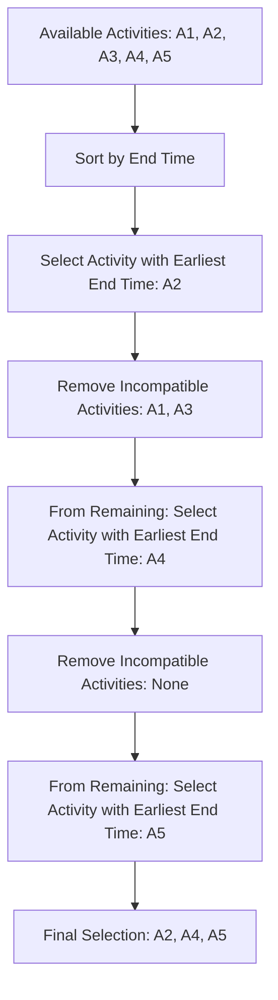

# Greedy Problem Strategies

## Introduction

Greedy algorithms are a powerful problem-solving technique that make locally optimal choices at each step with the hope of finding a global optimum solution. Unlike dynamic programming or divide-and-conquer approaches, greedy algorithms don't reconsider previous choices - they simply make the best decision at each step and move forward.

Greedy approaches are particularly valuable for optimization problems, where you're trying to find the maximum or minimum of something. They're often more efficient than exhaustive search methods, but they don't always guarantee the optimal solution. The trick is knowing when a greedy approach will work.

In this guide, we'll explore:
- The fundamental principles of greedy algorithms
- When to use (and when not to use) greedy algorithms
- Common greedy algorithm patterns
- Step-by-step examples of solving LeetCode problems with greedy approaches
- Real-world applications of greedy algorithms

## Greedy Algorithm Fundamentals

### Core Principles

A greedy algorithm follows five key principles:

1. **Greedy Choice Property**: A global optimum can be reached by making locally optimal choices.
2. **Optimal Substructure**: An optimal solution contains optimal solutions to its subproblems.
3. **Safe Move**: Each greedy choice leads to a valid solution.
4. **Feasible Solution**: The algorithm produces a solution that satisfies all constraints.
5. **Optimal Solution**: The final solution is optimal (or close to optimal, in some cases).

### When to Use Greedy Algorithms

Greedy algorithms are appropriate when:

1. The problem exhibits optimal substructure and the greedy choice property.
2. Local decisions lead to an optimal global solution.
3. Each decision narrows down the search space effectively.

### When NOT to Use Greedy Algorithms

Avoid greedy approaches when:

1. The problem requires considering all possible combinations.
2. Future consequences of a choice might invalidate what initially seemed optimal.
3. The problem has complex constraints that can't be satisfied by making locally optimal choices.

## Common Greedy Patterns

### Pattern 1: Selection Sort

In this pattern, we select the best available option at each step.

**Example**: Choosing the smallest element in an array repeatedly to build a sorted array.

```javascript
function selectionSort(arr) {
  for (let i = 0; i < arr.length - 1; i++) {
    // Find minimum element in the unsorted portion
    let minIdx = i;
    for (let j = i + 1; j < arr.length; j++) {
      if (arr[j] < arr[minIdx]) {
        minIdx = j;
      }
    }
    // Swap the found minimum with the first unsorted element
    [arr[i], arr[minIdx]] = [arr[minIdx], arr[i]];
  }
  return arr;
}

// Example usage
const unsortedArray = [64, 25, 12, 22, 11];
console.log(selectionSort(unsortedArray)); // Output: [11, 12, 22, 25, 64]
```

### Pattern 2: Interval Scheduling

In this pattern, we make selections from a set of intervals to optimize some criteria.

**Example**: Select the maximum number of non-overlapping activities.

### Pattern 3: Fractional Knapsack

In this pattern, we select items based on their value-to-weight ratio.

### Pattern 4: Huffman Coding

In this pattern, we build an optimal prefix tree for data compression.

## LeetCode Examples

### Example 1: Jump Game (LeetCode #55)

**Problem**: Given an array of non-negative integers, you are initially positioned at the first index of the array. Each element represents the maximum jump length at that position. Determine if you are able to reach the last index.

**Input**: nums = [2,3,1,1,4]
**Output**: true
**Explanation**: Jump 1 step from index 0 to 1, then 3 steps to the last index.

**Greedy Approach**: Keep track of the furthest index you can reach. If at any point your current position exceeds your furthest reachable position, return false.

```javascript
function canJump(nums) {
  let maxReach = 0;
  
  for (let i = 0; i < nums.length; i++) {
    // If current position is beyond our max reach, we can't reach here
    if (i > maxReach) return false;
    
    // Update the furthest we can reach from current position
    maxReach = Math.max(maxReach, i + nums[i]);
    
    // If we can reach the end, return true
    if (maxReach >= nums.length - 1) return true;
  }
  
  return true;
}

// Examples
console.log(canJump([2,3,1,1,4])); // Output: true
console.log(canJump([3,2,1,0,4])); // Output: false
```

**Time Complexity**: O(n) where n is the length of the array.
**Space Complexity**: O(1) as we only use a single variable.

### Example 2: Task Scheduler (LeetCode #621)

**Problem**: Given a characters array `tasks`, representing the tasks a CPU needs to do, where each letter represents a different task. Tasks could be done in any order. Each task takes one unit of time. For each unit of time, the CPU could complete either one task or be idle. However, there is a non-negative integer `n` that represents the cooldown period between two same tasks (the same letter in the array); that is, there must be at least `n` units of time between any two same tasks.

Return the least number of units of time that the CPU will take to finish all the given tasks.

**Input**: tasks = ["A","A","A","B","B","B"], n = 2
**Output**: 8
**Explanation**: 
A -> B -> idle -> A -> B -> idle -> A -> B
The CPU needs 8 units of time to finish all tasks.

**Greedy Approach**: Focus on the most frequent task and build the schedule around it.

```javascript
function leastInterval(tasks, n) {
  // Count frequency of each task
  const freq = Array(26).fill(0);
  for (const task of tasks) {
    freq[task.charCodeAt(0) - 'A'.charCodeAt(0)]++;
  }
  
  // Sort frequencies in descending order
  freq.sort((a, b) => b - a);
  
  // Max frequency
  const maxFreq = freq[0];
  
  // Count how many tasks have the max frequency
  let maxCount = 0;
  for (const f of freq) {
    if (f === maxFreq) {
      maxCount++;
    } else {
      break;
    }
  }
  
  // Calculate the minimum time required
  return Math.max(
    tasks.length,
    (maxFreq - 1) * (n + 1) + maxCount
  );
}

// Examples
console.log(leastInterval(["A","A","A","B","B","B"], 2)); // Output: 8
console.log(leastInterval(["A","A","A","A","A","A","B","C","D","E","F","G"], 2)); // Output: 16
```

**Time Complexity**: O(n) where n is the number of tasks.
**Space Complexity**: O(1) as the frequency array has a fixed size of 26.

### Example 3: Minimum Number of Arrows to Burst Balloons (LeetCode #452)

**Problem**: There are some spherical balloons spread in 2D space. For each balloon, provided input is the start and end coordinates of the horizontal diameter. Since it's horizontal, y-coordinates don't matter, and hence the x-coordinates of start and end of the diameter suffice. The start is always smaller than the end.

An arrow can be shot up exactly vertically from different points along the x-axis. A balloon with `xstart` and `xend` bursts by an arrow shot at `x` if `xstart ≤ x ≤ xend`. There is no limit to the number of arrows that can be shot. An arrow once shot keeps traveling up infinitely.

Given an array `points` where `points[i] = [xstart, xend]`, return the minimum number of arrows that must be shot to burst all balloons.

**Input**: points = [[10,16],[2,8],[1,6],[7,12]]
**Output**: 2
**Explanation**: 
Shoot one arrow at x=6 (bursting balloons [2,8] and [1,6]) and another at x=11 (bursting balloons [10,16] and [7,12]).

**Greedy Approach**: Sort balloons by their end points and shoot arrows optimally.

```javascript
function findMinArrowShots(points) {
  if (points.length === 0) return 0;
  
  // Sort by end points
  points.sort((a, b) => a[1] - b[1]);
  
  let arrows = 1;
  let prevEnd = points[0][1];
  
  for (let i = 1; i < points.length; i++) {
    // If current balloon starts after the end of previous one,
    // we need a new arrow
    if (points[i][0] > prevEnd) {
      arrows++;
      prevEnd = points[i][1];
    }
    // Otherwise, current balloon can be burst by the same arrow
  }
  
  return arrows;
}

// Example
console.log(findMinArrowShots([[10,16],[2,8],[1,6],[7,12]])); // Output: 2
console.log(findMinArrowShots([[1,2],[3,4],[5,6],[7,8]])); // Output: 4
```

**Time Complexity**: O(n log n) due to the sorting operation.
**Space Complexity**: O(1) excluding input storage.

## Visualizing Greedy Algorithm Decision-Making

Let's visualize how a greedy algorithm makes decisions in the "Activity Selection" problem:



## Real-World Applications

Greedy algorithms solve many practical problems:

1. **Network Routing**: Dijkstra's algorithm finds the shortest path in a network.
2. **Data Compression**: Huffman coding creates efficient data compression schemes.
3. **Task Scheduling**: Applications like CPU scheduling use greedy approaches.
4. **Coin Systems**: Making change with the minimum number of coins.
5. **Resource Allocation**: Efficiently distributing limited resources.

### Example: Optimal Conference Room Scheduling

Imagine you need to schedule as many meetings as possible in a single conference room:

```javascript
function maxMeetings(start, end) {
  const meetings = [];
  for (let i = 0; i < start.length; i++) {
    meetings.push([start[i], end[i]]);
  }
  
  // Sort by end time
  meetings.sort((a, b) => a[1] - b[1]);
  
  let count = 0;
  let lastEndTime = 0;
  
  for (const [startTime, endTime] of meetings) {
    if (startTime >= lastEndTime) {
      count++;
      lastEndTime = endTime;
    }
  }
  
  return count;
}

// Example
const startTimes = [10, 12, 20];
const endTimes = [20, 25, 30];
console.log(maxMeetings(startTimes, endTimes)); // Output: 2
```

This real-world example demonstrates how a simple greedy choice (selecting meetings with the earliest end time) leads to an optimal solution.

## Common Pitfalls and How to Avoid Them

When implementing greedy algorithms, watch out for:

1. **Assuming greedy will always work**: Always verify that the greedy approach is valid for your problem.
2. **Incorrect greedy choice**: Make sure your greedy choice actually leads to the optimal solution.
3. **Not sorting data properly**: Many greedy algorithms require proper sorting as the first step.
4. **Off-by-one errors**: Be careful with boundary conditions and index manipulation.
5. **Forgetting edge cases**: Test with empty inputs, single elements, or extreme values.

## Problem-Solving Strategy

When approaching a potential greedy problem, follow these steps:

1. **Identify the objective function**: What are you trying to maximize or minimize?
2. **Define the greedy choice**: What's the best choice at each step?
3. **Prove correctness**: Can you show that your greedy approach leads to the optimal solution?
4. **Implement the algorithm**: Code it up with clear, efficient logic.
5. **Test with examples**: Verify your solution with diverse test cases.

## Summary

Greedy algorithms offer an elegant approach to solving optimization problems by making the best choice at each step. While they don't work for all problems, when applicable they provide efficient solutions with straightforward implementations.

Key takeaways:
- Greedy algorithms make locally optimal choices at each step.
- They're efficient but don't always guarantee the global optimum.
- Common patterns include interval scheduling, selection sort, and fractional knapsack.
- Verify that the greedy choice property holds for your problem.
- Real-world applications include task scheduling, networking, and resource allocation.

## Additional Resources and Exercises

### Resources
- "Introduction to Algorithms" by Cormen, Leiserson, Rivest, and Stein
- "Algorithms" by Robert Sedgewick and Kevin Wayne
- [Stanford University's Greedy Algorithm course material](https://www.youtube.com/watch?v=xqivZDTVgwc)

### Practice Exercises
Try solving these LeetCode problems using greedy approaches:

1. **Easy**: Maximum Subarray (LeetCode #53)
2. **Easy**: Best Time to Buy and Sell Stock (LeetCode #121)
3. **Medium**: Gas Station (LeetCode #134)
4. **Medium**: Partition Labels (LeetCode #763)
5. **Hard**: Minimum Number of Refueling Stops (LeetCode #871)

Remember that practicing different problem patterns will strengthen your ability to identify when greedy algorithms are appropriate and how to implement them effectively.

Happy coding!