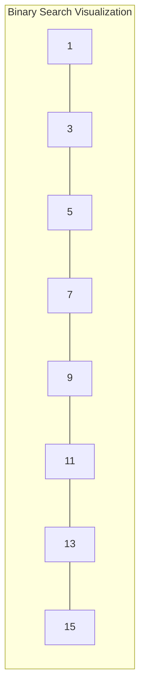

# Binary Search Applications

Binary search is one of the most powerful and frequently used algorithms in competitive programming and software development. While the basic concept seems simple, applying binary search to diverse problems requires understanding its variations and recognizing when and how to use it.

## Introduction to Binary Search

Binary search is an efficient algorithm for finding a target value within a sorted array. Instead of checking each element sequentially, binary search repeatedly divides the search space in half, eliminating half of the remaining elements in each step.

The standard binary search algorithm has:
- Time Complexity: O(log n)
- Space Complexity: O(1)

### Basic Implementation

```java
public int binarySearch(int[] nums, int target) {
    int left = 0;
    int right = nums.length - 1;
    
    while (left <= right) {
        int mid = left + (right - left) / 2; // Prevents overflow
        
        if (nums[mid] == target) {
            return mid; // Target found
        } else if (nums[mid] < target) {
            left = mid + 1; // Search in the right half
        } else {
            right = mid - 1; // Search in the left half
        }
    }
    
    return -1; // Target not found
}
```

## Common Binary Search Patterns on LeetCode

### 1. Exact Match Search

The most straightforward application is finding if a value exists in a sorted array.

**Example: LeetCode #704 - Binary Search**

```python
def search(nums, target):
    left, right = 0, len(nums) - 1
    
    while left <= right:
        mid = left + (right - left) // 2
        
        if nums[mid] == target:
            return mid
        elif nums[mid] < target:
            left = mid + 1
        else:
            right = mid - 1
            
    return -1

# Example usage:
# Input: nums = [-1,0,3,5,9,12], target = 9
# Output: 4
```

### 2. Finding Insertion Position

When we need to find where a value should be inserted to maintain sorted order.

**Example: LeetCode #35 - Search Insert Position**

```python
def searchInsert(nums, target):
    left, right = 0, len(nums) - 1
    
    while left <= right:
        mid = left + (right - left) // 2
        
        if nums[mid] == target:
            return mid
        elif nums[mid] < target:
            left = mid + 1
        else:
            right = mid - 1
            
    return left  # This is the insertion position

# Example usage:
# Input: nums = [1,3,5,6], target = 5
# Output: 2
```

### 3. Binary Search on Answer Space

Sometimes we apply binary search on possible answer ranges rather than the input array.

**Example: LeetCode #1011 - Capacity to Ship Packages Within D Days**

```python
def shipWithinDays(weights, days):
    def canShip(capacity):
        day_count = 1
        current_weight = 0
        
        for weight in weights:
            if current_weight + weight > capacity:
                day_count += 1
                current_weight = 0
            current_weight += weight
            
            if day_count > days:
                return False
                
        return True
    
    # Binary search on the possible capacity
    left = max(weights)  # Minimum capacity must be at least the heaviest package
    right = sum(weights)  # Maximum capacity would be shipping all at once
    
    while left < right:
        mid = left + (right - left) // 2
        if canShip(mid):
            right = mid  # Try a smaller capacity
        else:
            left = mid + 1  # Need a larger capacity
            
    return left

# Example usage:
# Input: weights = [1,2,3,4,5,6,7,8,9,10], days = 5
# Output: 15
```

### 4. Finding Boundaries (First and Last Position)

Sometimes we need to find the first or last occurrence of a value.

**Example: LeetCode #34 - Find First and Last Position of Element in Sorted Array**

```python
def searchRange(nums, target):
    def findLeftBoundary():
        left, right = 0, len(nums) - 1
        result = -1
        
        while left <= right:
            mid = left + (right - left) // 2
            if nums[mid] == target:
                result = mid  # Save the potential result
                right = mid - 1  # Continue searching to the left
            elif nums[mid] < target:
                left = mid + 1
            else:
                right = mid - 1
                
        return result
    
    def findRightBoundary():
        left, right = 0, len(nums) - 1
        result = -1
        
        while left <= right:
            mid = left + (right - left) // 2
            if nums[mid] == target:
                result = mid  # Save the potential result
                left = mid + 1  # Continue searching to the right
            elif nums[mid] < target:
                left = mid + 1
            else:
                right = mid - 1
                
        return result
    
    return [findLeftBoundary(), findRightBoundary()]

# Example usage:
# Input: nums = [5,7,7,8,8,10], target = 8
# Output: [3,4]
```

### 5. Binary Search in Rotated Sorted Arrays

A classic problem is searching in a rotated sorted array, which requires a modified binary search.

**Example: LeetCode #33 - Search in Rotated Sorted Array**

```python
def search(nums, target):
    left, right = 0, len(nums) - 1
    
    while left <= right:
        mid = left + (right - left) // 2
        
        if nums[mid] == target:
            return mid
            
        # Check if the left part is sorted
        if nums[left] <= nums[mid]:
            # Check if target is in the left sorted part
            if nums[left] <= target < nums[mid]:
                right = mid - 1
            else:
                left = mid + 1
        # Otherwise, the right part is sorted
        else:
            # Check if target is in the right sorted part
            if nums[mid] < target <= nums[right]:
                left = mid + 1
            else:
                right = mid - 1
                
    return -1

# Example usage:
# Input: nums = [4,5,6,7,0,1,2], target = 0
# Output: 4
```

## Advanced Binary Search Applications

### 1. Binary Search in 2D Matrix

Binary search can be applied to 2D matrices if they have a specific sorted property.

**Example: LeetCode #74 - Search a 2D Matrix**

```python
def searchMatrix(matrix, target):
    if not matrix or not matrix[0]:
        return False
    
    rows, cols = len(matrix), len(matrix[0])
    left, right = 0, rows * cols - 1
    
    while left <= right:
        mid = left + (right - left) // 2
        # Convert 1D index to 2D coordinates
        row, col = mid // cols, mid % cols
        
        if matrix[row][col] == target:
            return True
        elif matrix[row][col] < target:
            left = mid + 1
        else:
            right = mid - 1
            
    return False

# Example usage:
# Input: matrix = [[1,3,5,7],[10,11,16,20],[23,30,34,60]], target = 3
# Output: True
```

### 2. Binary Search with Floating Point Numbers

Binary search can be used with floating-point values, but requires a precision tolerance.

**Example: Square Root Calculation**

```python
def squareRoot(n, precision=1e-10):
    if n < 0:
        return None  # Handling negative numbers
    
    left, right = 0, max(1, n)  # Initial range
    
    while right - left > precision:
        mid = left + (right - left) / 2
        mid_squared = mid * mid
        
        if mid_squared > n:
            right = mid
        else:
            left = mid
            
    return left

# Example usage:
# Input: n = 8
# Output: ~2.82842712474619 (approximation of √8)
```

### 3. Binary Search for Peak Finding

Binary search can find peaks in arrays that first increase then decrease.

**Example: LeetCode #162 - Find Peak Element**

```python
def findPeakElement(nums):
    left, right = 0, len(nums) - 1
    
    while left < right:
        mid = left + (right - left) // 2
        
        # If mid element is greater than the next element, 
        # then we are in the decreasing part of the array
        if nums[mid] > nums[mid + 1]:
            right = mid  # Peak must be at mid or to the left
        else:
            left = mid + 1  # Peak must be to the right
            
    return left  # At this point, left == right which is the peak

# Example usage:
# Input: nums = [1,2,1,3,5,6,4]
# Output: 5 (index of the peak element 6)
```

## Visualizing Binary Search

Let's visualize how binary search works on a sorted array:



When searching for the value 7:

1. Compare with middle element (7) → Found!
2. If searching for 10:
   - Compare with middle element (7)
   - 10 > 7, so search right half [9, 11, 13, 15]
   - Compare with middle element of this subarray (11)
   - 10 < 11, so search left half [9]
   - Compare with 9
   - 10 > 9, not found (would be inserted after 9)

## Common Pitfalls and Tips

### 1. Overflow in mid calculation

```java
// Incorrect (potential overflow)
int mid = (left + right) / 2;

// Correct
int mid = left + (right - left) / 2;
```

### 2. Off-by-one errors

Pay attention to how you update `left` and `right` boundaries and the loop termination condition (`left <= right` vs `left < right`).

### 3. Infinite loops

Make sure your search space reduces in each iteration, especially when using `left < right` as the condition.

## Real-World Applications

Binary search isn't just a coding exercise; it has practical applications:

1. **Database Systems**: Indexes in databases often use binary search tree variants for quick lookups

2. **Version Control**: Git's "bisect" command uses a binary search algorithm to find which commit introduced a bug

3. **Library Functions**: Many programming languages implement binary search in their standard libraries:
   ```python
   # Python's bisect module
   import bisect
   sorted_list = [1, 3, 5, 7, 9]
   insert_position = bisect.bisect_left(sorted_list, 4)  # Returns 2
   ```

4. **Network Routing**: Some routing algorithms use binary search to find optimal paths

5. **Machine Learning**: Decision trees and some optimization algorithms leverage binary search concepts

## Summary

Binary search is a versatile algorithm that extends far beyond simple element lookup in sorted arrays. Its logarithmic time complexity makes it invaluable for problems that would otherwise require linear or worse time complexity.

Key takeaways:
- Binary search requires a sorted array or a monotonic function
- Time complexity is O(log n), making it highly efficient for large datasets
- The technique can be applied to the answer space, not just the input array
- Variations like finding boundaries or searching in rotated arrays are common in interviews
- Watch out for common implementation pitfalls like overflow and off-by-one errors

## Practice Problems

To solidify your understanding, try these LeetCode problems:
1. LeetCode #69: Sqrt(x)
2. LeetCode #153: Find Minimum in Rotated Sorted Array
3. LeetCode #875: Koko Eating Bananas
4. LeetCode #1283: Find the Smallest Divisor Given a Threshold
5. LeetCode #1482: Minimum Number of Days to Make m Bouquets

## Additional Resources

- [Binary Search Interactive Visualization](https://visualgo.net/bn/binarysearch)
- "Algorithms" by Robert Sedgewick (Princeton University)
- "Introduction to Algorithms" by Cormen, Leiserson, Rivest, and Stein (CLRS)

Remember, the key to mastering binary search is recognizing when to use it and understanding its variations. Practice is essential to develop this intuition!