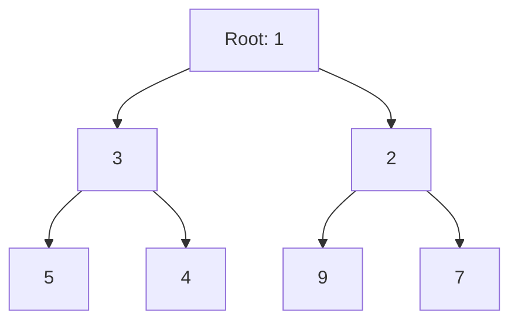

# Heap Applications

## Introduction

Heaps are specialized tree-based data structures that satisfy the heap property. They are the backbone of priority queues and are extremely useful for solving various algorithmic problems efficiently. Heaps provide O(log n) time complexity for insertion and deletion of the minimum (or maximum) element, making them particularly useful when we need to repeatedly find or remove the smallest/largest element from a collection.

In this tutorial, we'll explore common heap applications with LeetCode problem examples, learn when to use heaps, and understand the implementation patterns that can help you recognize when a heap is the right data structure for a problem.

## What is a Heap?

A heap is a complete binary tree where each node follows a specific ordering property:

1. **Min-heap**: Every parent node has a value less than or equal to its children
2. **Max-heap**: Every parent node has a value greater than or equal to its children

Most programming languages provide heap implementations. In Python, we use the `heapq` module (which implements a min-heap), while Java provides `PriorityQueue` class.

## When to Use Heaps

Consider using heaps when:

1. You need to find the k smallest/largest elements
2. You need to frequently access the minimum/maximum element
3. You're dealing with a "k-way merge" scenario
4. You need to implement scheduling algorithms
5. You're working on graph algorithms like Dijkstra's shortest path

## Common Heap Operations

```python
import heapq

# Creating a heap
nums = [3, 1, 4, 1, 5, 9, 2, 6]
heapq.heapify(nums)  # transforms list into a heap in-place
print(nums)  # [1, 1, 2, 3, 5, 9, 4, 6]

# Insert element
heapq.heappush(nums, 0)
print(nums)  # [0, 1, 2, 3, 1, 9, 4, 6, 5]

# Remove and return smallest element
smallest = heapq.heappop(nums)
print(smallest)  # 0
print(nums)  # [1, 1, 2, 3, 5, 9, 4, 6]

# Access smallest element without removing
print(nums[0])  # 1
```

## Common Heap Patterns on LeetCode

### Pattern 1: K Largest/Smallest Elements

**Example: LeetCode 215 - Kth Largest Element in an Array**

```python
def findKthLargest(nums, k):
    # Min heap approach
    min_heap = []
    for num in nums:
        heapq.heappush(min_heap, num)
        if len(min_heap) > k:
            heapq.heappop(min_heap)
    
    # The root of the heap is the kth largest
    return min_heap[0]
```

**How it works:**
1. Maintain a min-heap of size k
2. For each element, push it onto the heap
3. If heap size exceeds k, remove the smallest element
4. After processing all elements, the smallest element in our heap is the kth largest in the array

**Example with input `[3,2,1,5,6,4]` and `k=2`:**
- Push 3 → heap: [3]
- Push 2 → heap: [2,3]
- Push 1 → heap: [1,3,2], then pop 1 → heap: [2,3]
- Push 5 → heap: [2,3,5], then pop 2 → heap: [3,5]
- Push 6 → heap: [3,5,6], then pop 3 → heap: [5,6]
- Push 4 → heap: [4,5,6], then pop 4 → heap: [5,6]
- Return 5 (the smallest in our heap) which is the 2nd largest element

### Pattern 2: Merge K Sorted Lists

**Example: LeetCode 23 - Merge k Sorted Lists**

```python
def mergeKLists(lists):
    # Define ListNode for clarity
    # class ListNode:
    #     def __init__(self, val=0, next=None):
    #         self.val = val
    #         self.next = next
    
    # Custom class to make ListNode comparable
    class CompareNode:
        def __init__(self, node):
            self.node = node
        
        def __lt__(self, other):
            return self.node.val < other.node.val
    
    # Initialize heap and result head
    heap = []
    dummy = ListNode(0)
    current = dummy
    
    # Add the first node from each list to the heap
    for head in lists:
        if head:
            heapq.heappush(heap, CompareNode(head))
    
    # Process nodes
    while heap:
        # Get the smallest node
        node_wrapper = heapq.heappop(heap)
        node = node_wrapper.node
        
        # Add to result list
        current.next = node
        current = current.next
        
        # If there are more nodes in this list, add the next one
        if node.next:
            heapq.heappush(heap, CompareNode(node.next))
    
    return dummy.next
```

**How it works:**
1. We use a min-heap to always have access to the smallest element across all lists
2. We initialize the heap with the first node from each list
3. Repeatedly extract the smallest node, add it to our result, and add the next node from its list to the heap

### Pattern 3: Task Scheduling

**Example: LeetCode 621 - Task Scheduler**

```python
def leastInterval(tasks, n):
    # Count task frequencies
    task_counts = {}
    for task in tasks:
        task_counts[task] = task_counts.get(task, 0) + 1
    
    # Create a max-heap (using negative counts for min-heap)
    max_heap = [-count for count in task_counts.values()]
    heapq.heapify(max_heap)
    
    time = 0
    queue = []  # (count, time_available)
    
    while max_heap or queue:
        time += 1
        
        if max_heap:
            count = heapq.heappop(max_heap) + 1  # Execute one instance of task
            if count < 0:  # If task still has instances
                queue.append((count, time + n))  # Available after cooldown
        
        # Check if any task is now available after cooldown
        if queue and queue[0][1] <= time:
            heapq.heappush(max_heap, queue.pop(0)[0])
    
    return time
```

**How it works:**
1. Count the frequency of each task
2. Use a max-heap to prioritize tasks with the highest frequency
3. Also use a queue to track when tasks will be available again after cooldown
4. Process tasks one unit of time at a time, always taking the most frequent available task

### Pattern 4: Median Finding

**Example: LeetCode 295 - Find Median from Data Stream**

```python
class MedianFinder:
    def __init__(self):
        # Max heap for the lower half
        self.small = []  # Max heap (negated values)
        # Min heap for the upper half
        self.large = []  # Min heap

    def addNum(self, num):
        # Push to max heap
        heapq.heappush(self.small, -num)
        
        # Balance: ensure max of small <= min of large
        if self.small and self.large and -self.small[0] > self.large[0]:
            val = -heapq.heappop(self.small)
            heapq.heappush(self.large, val)
        
        # Balance sizes: they differ by at most 1
        if len(self.small) > len(self.large) + 1:
            val = -heapq.heappop(self.small)
            heapq.heappush(self.large, val)
        if len(self.large) > len(self.small):
            val = heapq.heappop(self.large)
            heapq.heappush(self.small, -val)

    def findMedian(self):
        if len(self.small) > len(self.large):
            return -self.small[0]
        else:
            return (-self.small[0] + self.large[0]) / 2
```

**How it works:**
1. We maintain two heaps: a max-heap for smaller half and a min-heap for larger half
2. We balance these heaps so they differ in size by at most 1
3. The median is either the root of the larger heap (if sizes are unequal) or the average of both roots

## Heap Implementation Visualization



The above represents a min-heap. The key property is that each parent node is smaller than its children.

## Real-world Applications of Heaps

1. **Operating Systems**: Process scheduling where the highest priority process needs to be selected
2. **Network Routing**: Dijkstra's algorithm for finding shortest paths
3. **Data Compression**: Huffman encoding algorithm uses heaps to build optimal prefix codes
4. **Event-driven Simulation**: Keeping track of future events to process
5. **Graph Algorithms**: Prim's algorithm for minimum spanning tree uses heaps

## Time and Space Complexity

| Operation | Time Complexity |
|-----------|----------------|
| Heapify   | O(n)           |
| Insert    | O(log n)       |
| Delete    | O(log n)       |
| Find min/max | O(1)        |
| Increase key | O(log n)    |
| Decrease key | O(log n)    |

## Common Mistakes to Avoid

1. **Using the wrong type of heap**: Make sure you're using a min-heap when you need the smallest element, and max-heap when you need the largest.

2. **Not considering custom comparators**: When heap elements are complex objects, define how they should be compared.

3. **Forgetting heap property maintenance**: After modifications, ensure the heap property is maintained.

4. **Using heap when it's unnecessary**: For small datasets or when you only need to find the minimum/maximum once, sorting might be simpler.

## Summary

Heaps are powerful data structures for problems involving repeated access to minimum or maximum elements. The key to identifying heap problems is to look for phrases like "kth largest," "merge sorted," "find median," or anything requiring efficient access to extreme values.

Common heap patterns include:
- Finding kth largest/smallest elements
- Merging k sorted collections
- Implementing scheduling algorithms
- Finding running medians
- Graph algorithms like Dijkstra's

By recognizing these patterns, you'll be able to efficiently solve many algorithmic problems on LeetCode and in real-world applications.

## Practice Problems

To solidify your understanding, try these LeetCode problems:

1. 347: Top K Frequent Elements
2. 973: K Closest Points to Origin  
3. 1046: Last Stone Weight
4. 703: Kth Largest Element in a Stream
5. 451: Sort Characters By Frequency

## Additional Resources

- [Heap Data Structure - GeeksforGeeks](https://www.geeksforgeeks.org/heap-data-structure/)
- [Priority Queues - Princeton University](https://algs4.cs.princeton.edu/24pq/)
- [Heaps and Priority Queues - UC Berkeley CS61B](https://inst.eecs.berkeley.edu/~cs61b/sp20/docs/61b-heaps_and_priority_queues.pdf)

Happy heap problem solving!