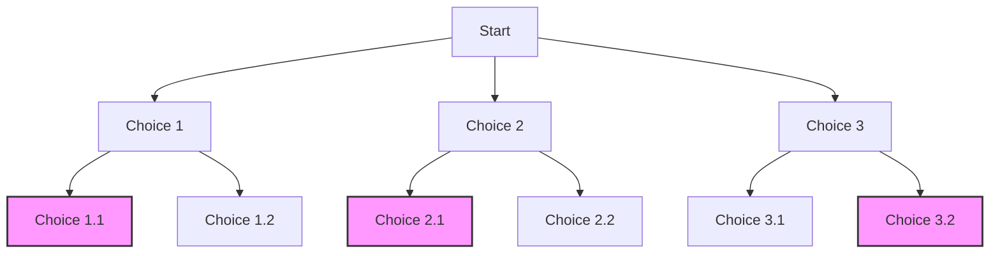

# Backtracking Problems

## Introduction to Backtracking

Backtracking is a powerful algorithmic technique used to find all (or some) solutions to computational problems, particularly those that require exploring all potential candidates for the solution. The approach works by incrementally building candidates to the solutions, and abandoning a candidate ("backtracking") as soon as it determines that the candidate cannot possibly be completed to a valid solution.

Think of backtracking like exploring a maze with many paths - if you reach a dead end, you go back to the previous junction and try another path. This systematic exploration ensures that all possibilities are considered.

## When to Use Backtracking?

Backtracking is particularly useful for problems that exhibit these characteristics:

1. **Choice-based problems**: When we need to make a series of decisions, each with multiple options
2. **Constraint satisfaction**: When solutions must meet certain criteria
3. **Combinatorial problems**: Finding all possible combinations or permutations
4. **Complete search**: When we need to search through all possibilities

## The Backtracking Framework

Every backtracking algorithm follows a similar structure:

```
function backtrack(currentState, choices):
    if isGoalReached(currentState):
        addToResults(currentState)
        return
    
    if isInvalidState(currentState):
        return
    
    for choice in choices:
        make(choice)
        backtrack(newState, remainingChoices)
        unmake(choice)  // backtrack step
```

The key elements that make backtracking work are:

- **State building**: Incrementally constructing a potential solution
- **Constraint checking**: Verifying if the current state violates any constraints
- **Backtracking**: Undoing choices to explore different paths
- **Base cases**: Determining when to stop (either we've found a solution or hit a dead end)

## Classic Backtracking Problems on LeetCode

### 1. Generating Permutations (LeetCode #46)

Let's implement a solution to generate all permutations of a given array of distinct integers.

```javascript
/**
 * @param {number[]} nums
 * @return {number[][]}
 */
const permute = function(nums) {
    const result = [];
    
    function backtrack(current, remaining) {
        // Base case: if no numbers remain, we have a complete permutation
        if (remaining.length === 0) {
            result.push([...current]);
            return;
        }
        
        // Try each remaining number
        for (let i = 0; i < remaining.length; i++) {
            // Choose
            current.push(remaining[i]);
            const newRemaining = [...remaining.slice(0, i), ...remaining.slice(i + 1)];
            
            // Explore
            backtrack(current, newRemaining);
            
            // Un-choose (backtrack)
            current.pop();
        }
    }
    
    backtrack([], nums);
    return result;
};
```

**Example:**

Input: `[1, 2, 3]`
Output: `[[1,2,3], [1,3,2], [2,1,3], [2,3,1], [3,1,2], [3,2,1]]`

**Explanation:**
- We start with an empty array `[]` as our current permutation and `[1,2,3]` as remaining numbers
- For each step, we try each remaining number, add it to our current permutation, and recursively generate all permutations with the remaining numbers
- After exploring all possibilities with a particular number in a position, we backtrack (remove the number) and try other combinations

### 2. Generating Subsets (LeetCode #78)

The subsets problem asks us to return all possible subsets of a given array.

```javascript
/**
 * @param {number[]} nums
 * @return {number[][]}
 */
const subsets = function(nums) {
    const result = [];
    
    function backtrack(start, current) {
        // Add the current subset to our results
        result.push([...current]);
        
        // Try adding each remaining number
        for (let i = start; i < nums.length; i++) {
            // Choose
            current.push(nums[i]);
            
            // Explore
            backtrack(i + 1, current);
            
            // Un-choose (backtrack)
            current.pop();
        }
    }
    
    backtrack(0, []);
    return result;
};
```

**Example:**

Input: `[1, 2, 3]`
Output: `[[], [1], [2], [3], [1,2], [1,3], [2,3], [1,2,3]]`

**Explanation:**
- We start with an empty subset `[]`
- For each position, we have two choices: include the current number or skip it
- We build our subsets incrementally, ensuring we don't create duplicates by only considering elements after our current position

### 3. N-Queens Problem (LeetCode #51)

The N-Queens problem asks us to place N queens on an N×N chessboard such that no two queens attack each other.

```javascript
/**
 * @param {number} n
 * @return {string[][]}
 */
const solveNQueens = function(n) {
    const result = [];
    
    // Function to check if a queen can be placed at (row, col)
    function isValid(board, row, col) {
        // Check column
        for (let i = 0; i < row; i++) {
            if (board[i][col] === 'Q') return false;
        }
        
        // Check upper left diagonal
        for (let i = row - 1, j = col - 1; i >= 0 && j >= 0; i--, j--) {
            if (board[i][j] === 'Q') return false;
        }
        
        // Check upper right diagonal
        for (let i = row - 1, j = col + 1; i >= 0 && j < n; i--, j++) {
            if (board[i][j] === 'Q') return false;
        }
        
        return true;
    }
    
    function backtrack(row, board) {
        // Base case: If all queens are placed, add the solution
        if (row === n) {
            const solution = board.map(row => row.join(''));
            result.push(solution);
            return;
        }
        
        // Try placing queen in each column of current row
        for (let col = 0; col < n; col++) {
            if (isValid(board, row, col)) {
                // Choose
                board[row][col] = 'Q';
                
                // Explore
                backtrack(row + 1, board);
                
                // Un-choose (backtrack)
                board[row][col] = '.';
            }
        }
    }
    
    // Initialize empty board
    const board = Array(n).fill().map(() => Array(n).fill('.'));
    
    backtrack(0, board);
    return result;
};
```

**Example:**

Input: `4`
Output:
```
[
  [".Q..",
   "...Q",
   "Q...",
   "..Q."],
   
  ["..Q.",
   "Q...",
   "...Q",
   ".Q.."]
]
```

**Explanation:**
- We build the solution row by row, trying to place a queen in each column
- For each position, we check if placing a queen violates any constraints (same column, diagonal)
- If a position is valid, we place the queen and move to the next row
- If we reach the end, we've found a valid solution; otherwise, we backtrack and try other positions

## Pruning: Optimizing Backtracking

Backtracking can be computationally expensive as it explores many possibilities. Pruning is a technique to avoid exploring paths that will not lead to valid solutions:

1. **Early stopping**: Check constraints before making recursive calls
2. **Memoization**: Remember previously computed results to avoid duplicate work
3. **Constraint propagation**: Use constraints to reduce the search space

## Word Search Example (LeetCode #79)

The Word Search problem asks if a word exists in a 2D board of characters.

```javascript
/**
 * @param {character[][]} board
 * @param {string} word
 * @return {boolean}
 */
const exist = function(board, word) {
    if (!board.length || !board[0].length) return false;
    
    const rows = board.length;
    const cols = board[0].length;
    
    function dfs(r, c, index) {
        // Base cases
        if (index === word.length) return true;
        if (r < 0 || r >= rows || c < 0 || c >= cols || board[r][c] !== word[index]) return false;
        
        // Mark as visited
        const temp = board[r][c];
        board[r][c] = '#';
        
        // Explore in all four directions
        const found = dfs(r + 1, c, index + 1) || 
                      dfs(r - 1, c, index + 1) || 
                      dfs(r, c + 1, index + 1) || 
                      dfs(r, c - 1, index + 1);
        
        // Backtrack
        board[r][c] = temp;
        
        return found;
    }
    
    // Try each cell as a starting point
    for (let r = 0; r < rows; r++) {
        for (let c = 0; c < cols; c++) {
            if (dfs(r, c, 0)) return true;
        }
    }
    
    return false;
};
```

**Example:**

Input: 
- board = `[["A","B","C","E"],["S","F","C","S"],["A","D","E","E"]]`
- word = `"ABCCED"`

Output: `true`

**Explanation:**
- We perform a depth-first search from each cell in the board
- At each step, we mark the current cell as visited to avoid re-using it
- We explore all possible directions (up, down, left, right) to find the next character
- Once we've explored all options from a cell, we backtrack by unmarking it as visited

## Real-world Applications

Backtracking is widely used in real-world applications:

1. **Puzzle solvers**: Sudoku solvers, crossword puzzle generators
2. **Path finding**: Navigation systems finding all possible routes
3. **Game playing**: Chess engines exploring possible moves (with additional optimizations)
4. **Constraint satisfaction problems**: Scheduling systems, resource allocation
5. **Parsing**: Compiler construction and regular expression matching

## Common Patterns in Backtracking Problems

When approaching backtracking problems, look for these patterns:

1. **Choosing and unchoosing**: Always undo what you did before backtracking
2. **State tracking**: Keep track of your current state (often using recursion parameters)
3. **Constraint checking**: Validate the current state before continuing
4. **Base cases**: Define clear conditions for when to stop recursion

## Visualizing Backtracking with Decision Trees

Backtracking is often visualized as traversing a decision tree:



The colored nodes represent valid solutions found through backtracking.

## Summary

Backtracking is a powerful technique for solving problems that require exploring multiple possible solutions. The key concepts to remember are:

1. **Incrementally build solutions**: Start with an empty solution and add choices one by one
2. **Explore all valid choices**: Try all possibilities that satisfy constraints
3. **Backtrack when needed**: When you reach a dead end, undo your last choice and try another path
4. **Pruning**: Optimize by avoiding paths that won't lead to solutions

By mastering backtracking, you'll be equipped to solve a wide variety of combinatorial and constraint-based problems efficiently.

## Practice Problems

To strengthen your backtracking skills, try these LeetCode problems:

1. **Letter Combinations of a Phone Number** (LeetCode #17) - Medium
2. **Combination Sum** (LeetCode #39) - Medium
3. **Palindrome Partitioning** (LeetCode #131) - Medium
4. **Sudoku Solver** (LeetCode #37) - Hard
5. **Word Break II** (LeetCode #140) - Hard

## Additional Resources

- [Introduction to Algorithms](https://mitpress.mit.edu/books/introduction-algorithms-third-edition) - CLRS textbook has excellent coverage of backtracking
- [Algorithms, 4th Edition](https://algs4.cs.princeton.edu/) by Robert Sedgewick and Kevin Wayne
- [Backtracking on GeeksforGeeks](https://www.geeksforgeeks.org/backtracking-algorithms/)

Happy coding, and remember - when stuck, sometimes you need to take a step back to move forward!