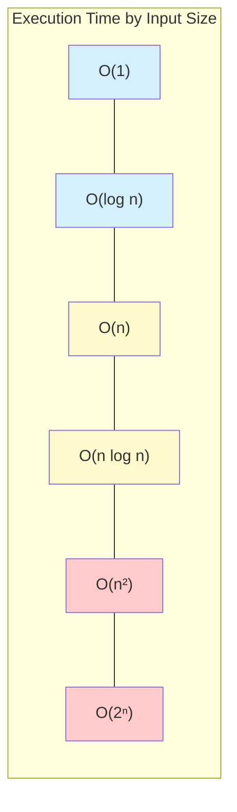

# Algorithm Benchmarking

## Introduction

Algorithm benchmarking is the process of systematically measuring and evaluating the performance of algorithms under various conditions. Just like you might test-drive several cars before making a purchase, benchmarking allows programmers to "test-drive" different algorithms to determine which one performs best for specific tasks and datasets.

In this tutorial, we'll explore how to properly benchmark algorithms, what metrics to consider, and how to interpret the results to make informed decisions about which algorithm to implement in your projects.

## Why Benchmark Algorithms?

Theoretical analysis of algorithms using Big O notation gives us insights into how algorithms scale with input size, but benchmarking provides concrete, real-world performance data that accounts for:

- Actual execution time on specific hardware
- Memory usage patterns
- Performance with real-world data
- Implementation-specific optimizations
- Cache behavior and other system-level effects

## Benchmarking Fundamentals

### Setting Up a Benchmark Environment

To get reliable benchmarking results, you need to:

1. **Isolate the environment**: Minimize background processes and system load
2. **Maintain consistency**: Use the same hardware and system configuration for all tests
3. **Repeat measurements**: Run multiple trials to account for variability
4. **Use appropriate test data**: Include various input sizes and types

### Key Metrics to Measure

When benchmarking algorithms, consider measuring:

1. **Execution time**: How long the algorithm takes to run
2. **Memory usage**: Peak memory consumption and allocation patterns
3. **Scalability**: How performance changes as input size increases
4. **Throughput**: Number of operations processed per time unit
5. **Latency**: Time to process individual operations

## Basic Benchmarking Example

Let's compare two sorting algorithms—bubble sort and merge sort—by benchmarking their performance with arrays of different sizes.

```python
import time
import random
import matplotlib.pyplot as plt
import numpy as np

def bubble_sort(arr):
    n = len(arr)
    for i in range(n):
        for j in range(0, n-i-1):
            if arr[j] > arr[j+1]:
                arr[j], arr[j+1] = arr[j+1], arr[j]
    return arr

def merge_sort(arr):
    if len(arr) <= 1:
        return arr
        
    mid = len(arr) // 2
    left = merge_sort(arr[:mid])
    right = merge_sort(arr[mid:])
    
    return merge(left, right)

def merge(left, right):
    result = []
    i = j = 0
    
    while i < len(left) and j < len(right):
        if left[i] < right[j]:
            result.append(left[i])
            i += 1
        else:
            result.append(right[j])
            j += 1
            
    result.extend(left[i:])
    result.extend(right[j:])
    return result

def benchmark_sorting(sizes):
    bubble_times = []
    merge_times = []
    
    for size in sizes:
        # Generate random array
        arr = [random.randint(0, 1000) for _ in range(size)]
        
        # Benchmark bubble sort
        arr_copy = arr.copy()
        start = time.time()
        bubble_sort(arr_copy)
        end = time.time()
        bubble_times.append(end - start)
        
        # Benchmark merge sort
        arr_copy = arr.copy()
        start = time.time()
        merge_sort(arr_copy)
        end = time.time()
        merge_times.append(end - start)
        
    return bubble_times, merge_times

# Run benchmark with different array sizes
sizes = [100, 500, 1000, 2000, 3000]
bubble_times, merge_times = benchmark_sorting(sizes)

# Print results
print("Array Size | Bubble Sort | Merge Sort")
print("----------|------------|----------")
for i in range(len(sizes)):
    print(f"{sizes[i]:<10} | {bubble_times[i]:.6f}s | {merge_times[i]:.6f}s")
```

**Sample Output:**

```
Array Size | Bubble Sort | Merge Sort
----------|------------|----------
100        | 0.001263s  | 0.000248s
500        | 0.030214s  | 0.001345s
1000       | 0.121560s  | 0.002931s
2000       | 0.483266s  | 0.006104s
3000       | 1.088412s  | 0.009551s
```

From this output, we can observe that merge sort significantly outperforms bubble sort as the array size increases, which aligns with their theoretical time complexities (O(n²) for bubble sort and O(n log n) for merge sort).

## Visualization of Benchmark Results

Visualizing benchmark results can provide clearer insights into performance differences:

```python
plt.figure(figsize=(10, 6))
plt.plot(sizes, bubble_times, 'o-', label='Bubble Sort')
plt.plot(sizes, merge_times, 'o-', label='Merge Sort')
plt.xlabel('Array Size')
plt.ylabel('Execution Time (seconds)')
plt.title('Sorting Algorithm Performance Comparison')
plt.legend()
plt.grid(True)
plt.show()
```

The visualization would show a steep increase in execution time for bubble sort, while merge sort's line would remain relatively flat, illustrating the difference in scalability.

## Advanced Benchmarking Techniques

### Statistical Analysis

For more robust benchmarking:

1. **Run multiple trials**: Execute each algorithm multiple times
2. **Calculate statistics**: Find mean, median, standard deviation
3. **Identify outliers**: Remove anomalous results

Here's an example of more statistically sound benchmarking:

```python
def statistical_benchmark(algorithm, input_data, trials=10):
    times = []
    
    for _ in range(trials):
        data_copy = input_data.copy()
        start = time.time()
        algorithm(data_copy)
        end = time.time()
        times.append(end - start)
    
    return {
        'mean': np.mean(times),
        'median': np.median(times),
        'std_dev': np.std(times),
        'min': np.min(times),
        'max': np.max(times)
    }

# Example usage
test_array = [random.randint(0, 1000) for _ in range(1000)]
bubble_stats = statistical_benchmark(bubble_sort, test_array)
merge_stats = statistical_benchmark(merge_sort, test_array)

print("Bubble Sort Statistics:")
for key, value in bubble_stats.items():
    print(f"  {key}: {value:.6f}s")

print("\nMerge Sort Statistics:")
for key, value in merge_stats.items():
    print(f"  {key}: {value:.6f}s")
```

### Memory Profiling

To benchmark memory usage, you can use specialized tools like `memory_profiler` in Python:

```python
# This code requires: pip install memory_profiler
from memory_profiler import profile

@profile
def test_bubble_sort():
    arr = [random.randint(0, 1000) for _ in range(5000)]
    bubble_sort(arr)

@profile
def test_merge_sort():
    arr = [random.randint(0, 1000) for _ in range(5000)]
    merge_sort(arr)

# Run with: python -m memory_profiler your_script.py
```

## Benchmarking in Real-World Scenarios

### Case Study: String Matching Algorithms

Let's compare three common string matching algorithms in a realistic scenario:

```python
def naive_search(text, pattern):
    occurrences = []
    n, m = len(text), len(pattern)
    
    for i in range(n - m + 1):
        match = True
        for j in range(m):
            if text[i + j] != pattern[j]:
                match = False
                break
        if match:
            occurrences.append(i)
            
    return occurrences

def kmp_search(text, pattern):
    # KMP algorithm implementation (more efficient)
    # ...implementation details omitted for brevity
    pass

def boyer_moore_search(text, pattern):
    # Boyer-Moore algorithm implementation (even more efficient)
    # ...implementation details omitted for brevity
    pass

def benchmark_string_matching(algorithms, text, pattern, trials=5):
    results = {}
    
    for name, algo in algorithms.items():
        total_time = 0
        
        for _ in range(trials):
            start = time.time()
            algo(text, pattern)
            end = time.time()
            total_time += (end - start)
            
        results[name] = total_time / trials
        
    return results

# Real-world example: searching in a large text file
with open('large_text_file.txt', 'r') as f:
    text = f.read()

pattern = "algorithm benchmarking"
algorithms = {
    'Naive': naive_search,
    'KMP': kmp_search,
    'Boyer-Moore': boyer_moore_search
}

results = benchmark_string_matching(algorithms, text, pattern)

for name, time in results.items():
    print(f"{name}: {time:.6f}s")
```

### Database Query Optimization

Another real-world application is benchmarking database query performance:

```python
import sqlite3
import time

def benchmark_query(query, connection, trials=10):
    cursor = connection.cursor()
    times = []
    
    # Warm up the cache
    cursor.execute(query)
    cursor.fetchall()
    
    # Actual benchmarking
    for _ in range(trials):
        start = time.time()
        cursor.execute(query)
        cursor.fetchall()
        end = time.time()
        times.append(end - start)
        
    return {
        'mean': np.mean(times),
        'median': np.median(times),
        'std_dev': np.std(times)
    }

# Example usage
conn = sqlite3.connect('example.db')

# Compare two different query approaches
query1 = "SELECT * FROM users WHERE age > 30"
query2 = "SELECT * FROM users WHERE age > 30 AND users.id IN (SELECT user_id FROM orders)"

stats1 = benchmark_query(query1, conn)
stats2 = benchmark_query(query2, conn)

print("Query 1 performance:")
for key, value in stats1.items():
    print(f"  {key}: {value:.6f}s")

print("\nQuery 2 performance:")
for key, value in stats2.items():
    print(f"  {key}: {value:.6f}s")
```

## Benchmarking Best Practices

To ensure your benchmarking provides meaningful results:

1. **Isolate what you're measuring**: Benchmark only the algorithm itself, not I/O or setup operations
2. **Use realistic data**: Test with data that mimics what you'll encounter in production
3. **Consider edge cases**: Include best-case, average-case, and worst-case scenarios
4. **Account for warm-up time**: Some algorithms or systems need warm-up runs before stabilizing
5. **Benchmark at scale**: Test with various input sizes to understand scaling characteristics
6. **Compare apples to apples**: Ensure all algorithms solve exactly the same problem

## Common Benchmarking Pitfalls

Avoid these common mistakes:

1. **Ignoring system variability**: Not accounting for background processes or system load
2. **Insufficient sample size**: Running too few trials leads to unreliable results
3. **Compiler optimizations**: Modern compilers may optimize away code that doesn't produce visible output
4. **Neglecting memory effects**: Not considering cache behavior and memory access patterns
5. **Using unrealistic test data**: Testing with data that doesn't represent real-world usage

## Performance Visualization

Let's visualize how different algorithms scale with input size using a mermaid chart:



## Benchmarking Tools

Several established tools can help with algorithm benchmarking:

1. **Language-specific profilers**:
   - Python: `cProfile`, `line_profiler`, `memory_profiler`
   - Java: JMH (Java Microbenchmark Harness)
   - C++: Google Benchmark
   - JavaScript: Benchmark.js

2. **Visualization tools**:
   - Flame graphs for call stack analysis
   - Performance dashboards

3. **System monitoring**:
   - `top`, `htop` for Linux systems
   - Activity Monitor (macOS)
   - Task Manager (Windows)

## Summary

Algorithm benchmarking is an essential skill for any programmer who needs to make informed decisions about implementation choices. By systematically measuring performance metrics like execution time and memory usage, you can:

- Validate theoretical complexity analysis with empirical data
- Identify bottlenecks in your implementations
- Make informed trade-offs between different algorithms
- Optimize for your specific use cases and environments

Remember that benchmarking is both a science and an art—it requires careful experimental design, statistical analysis, and thoughtful interpretation of results.

## Exercises

1. **Basic Benchmarking**: Compare the performance of linear search versus binary search on sorted arrays of various sizes.

2. **Memory Analysis**: Profile the memory usage of recursive versus iterative implementations of the Fibonacci sequence calculator.

3. **Real-World Application**: Choose a problem from your domain (e.g., image processing, text analysis) and benchmark at least two different algorithmic approaches.

4. **Advanced Challenge**: Implement a benchmarking framework that automatically generates performance graphs for different algorithms across various input sizes and characteristics.

## Additional Resources

- "The Art of Computer Programming, Volume 2: Seminumerical Algorithms" by Donald E. Knuth
- "Algorithms to Live By: The Computer Science of Human Decisions" by Brian Christian and Tom Griffiths
- [Python timeit module documentation](https://docs.python.org/3/library/timeit.html)
- [Google Benchmark library](https://github.com/google/benchmark)
- Online courses on algorithm analysis and optimization

Remember that benchmarking is most valuable when combined with theoretical analysis and a good understanding of the specific requirements of your application.