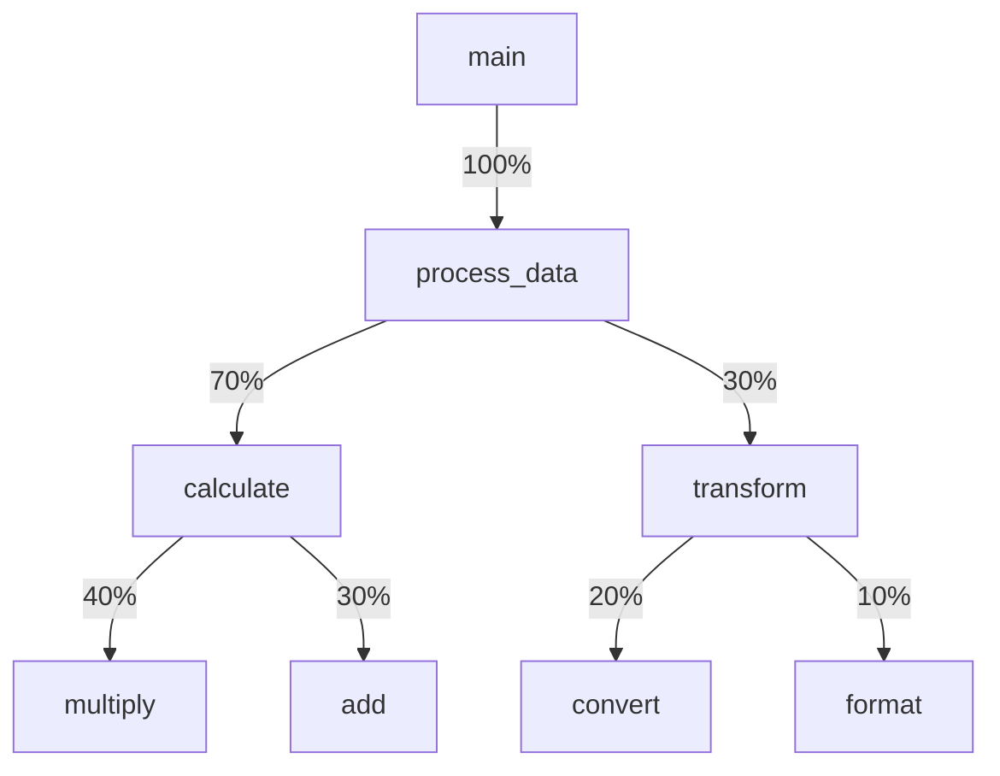

# Profiling Techniques

## Introduction

Have you ever written code that runs slower than expected? Or perhaps you're working on a large application and can't figure out which part is causing performance issues? This is where **profiling** comes into play.

Profiling is the process of analyzing your code's performance to identify bottlenecks - sections of code that consume excessive resources such as CPU time, memory, or network bandwidth. By using profiling techniques, you can make informed decisions about where to focus your optimization efforts, rather than making random changes that might not improve overall performance.

In this guide, we'll explore various profiling techniques for beginners, understand how to interpret profiling data, and apply these insights to optimize your algorithms.

## Why Profile Your Code?

Before diving into specific techniques, let's understand why profiling is essential:

1. **Performance Optimization**: Find where your code spends most of its time
2. **Resource Management**: Identify memory leaks or excessive memory usage
3. **Efficiency Analysis**: Determine if your algorithms are performing as expected
4. **Bottleneck Identification**: Locate specific functions or lines causing slowdowns
5. **Validation**: Confirm that your optimizations actually improve performance

Remember Donald Knuth's famous quote: "Premature optimization is the root of all evil." Profiling helps ensure you're optimizing the right parts of your code.

## Basic Profiling Techniques

### Timing Your Code

The simplest form of profiling is measuring execution time. Most programming languages offer built-in functionality for this:

#### Python Example

```python
import time

def slow_function():
    # Simulate a time-consuming operation
    total = 0
    for i in range(10000000):
        total += i
    return total

# Start timing
start_time = time.time()

# Call the function
result = slow_function()

# End timing
end_time = time.time()

# Calculate and display execution time
execution_time = end_time - start_time
print(f"Function executed in {execution_time:.6f} seconds")
print(f"Result: {result}")
```

**Output:**
```
Function executed in 0.756423 seconds
Result: 49999995000000
```

#### JavaScript Example

```javascript
function slowFunction() {
  // Simulate a time-consuming operation
  let total = 0;
  for (let i = 0; i < 10000000; i++) {
    total += i;
  }
  return total;
}

// Start timing
console.time('functionExecutionTime');

// Call the function
const result = slowFunction();

// End timing
console.timeEnd('functionExecutionTime');
console.log(`Result: ${result}`);
```

**Output:**
```
functionExecutionTime: 31.286ms
Result: 49999995000000
```

### Using Built-in Profiling Libraries

Most programming languages have libraries specifically designed for profiling:

#### Python's cProfile

The `cProfile` module provides detailed information about function calls:

```python
import cProfile

def fibonacci(n):
    if n <= 1:
        return n
    else:
        return fibonacci(n-1) + fibonacci(n-2)

# Profile the function
cProfile.run('fibonacci(30)')
```

**Output:**
```
         3318048 function calls (4 primitive calls) in 0.704 seconds

   Ordered by: standard name

   ncalls  tottime  percall  cumtime  percall filename:lineno(function)
        1    0.000    0.000    0.704    0.704 <string>:1(<module>)
3318045/1    0.704    0.000    0.704    0.704 <stdin>:1(fibonacci)
        1    0.000    0.000    0.704    0.704 {built-in method builtins.exec}
        1    0.000    0.000    0.000    0.000 {method 'disable' of '_lsprof.Profiler' objects}
```

In this output:
- `ncalls`: Number of calls made
- `tottime`: Total time spent in the given function (excluding time in subfunctions)
- `cumtime`: Cumulative time spent in this function and all subfunctions

## Advanced Profiling Techniques

### Memory Profiling

Memory profiling helps identify memory leaks or excessive memory usage.

#### Python Example with memory_profiler

```python
# You need to install memory_profiler first:
# pip install memory_profiler

from memory_profiler import profile

@profile
def memory_intensive_function():
    # Create a large list
    large_list = [i for i in range(10000000)]
    
    # Process the list
    result = sum(large_list)
    
    return result

# Call the function
memory_intensive_function()
```

**Output:**
```
Line #    Mem usage    Increment  Line Contents
================================================
     4     15.7 MiB     15.7 MiB @profile
     5                             def memory_intensive_function():
     6                                 # Create a large list
     7    397.9 MiB    382.2 MiB      large_list = [i for i in range(10000000)]
     8                             
     9                                 # Process the list
    10    397.9 MiB      0.0 MiB      result = sum(large_list)
    11                             
    12    397.9 MiB      0.0 MiB      return result
```

### Statistical Profiling

Statistical profilers sample the program state at regular intervals:

#### Python Example with pyinstrument

```python
# pip install pyinstrument

from pyinstrument import Profiler

def recursive_fibonacci(n):
    if n <= 1:
        return n
    return recursive_fibonacci(n-1) + recursive_fibonacci(n-2)

# Create a profiler
profiler = Profiler()
profiler.start()

# Run the function
result = recursive_fibonacci(30)

# Stop profiling
profiler.stop()

# Print the report
print(profiler.output_text(unicode=True, color=True))
```

The output shows a call tree with time percentages for each function call.

## Visualizing Profiling Results

Visualization makes it easier to interpret profiling results:

### Flame Graphs

Flame graphs represent call stacks where:
- The x-axis represents the stack population
- The y-axis represents stack depth
- The width of each function block is proportional to its time consumption



## Real-World Application: Optimizing a Sorting Algorithm

Let's profile and optimize a simple sorting implementation:

```python
import random
import time
import cProfile

# Inefficient bubble sort
def bubble_sort(arr):
    n = len(arr)
    for i in range(n):
        for j in range(0, n - i - 1):
            if arr[j] > arr[j + 1]:
                arr[j], arr[j + 1] = arr[j + 1], arr[j]
    return arr

# More efficient quicksort
def quick_sort(arr):
    if len(arr) <= 1:
        return arr
    pivot = arr[len(arr) // 2]
    left = [x for x in arr if x < pivot]
    middle = [x for x in arr if x == pivot]
    right = [x for x in arr if x > pivot]
    return quick_sort(left) + middle + quick_sort(right)

# Generate test data
data = [random.randint(0, 1000) for _ in range(1000)]
data_copy = data.copy()

# Profile bubble sort
print("Profiling bubble sort:")
cProfile.run('bubble_sort(data.copy())')

# Profile quicksort
print("\nProfiling quicksort:")
cProfile.run('quick_sort(data_copy)')

# Compare execution times
start = time.time()
bubble_sort(data.copy())
bubble_time = time.time() - start

start = time.time()
quick_sort(data_copy)
quick_time = time.time() - start

print(f"\nBubble sort time: {bubble_time:.6f} seconds")
print(f"Quick sort time: {quick_time:.6f} seconds")
print(f"Quicksort is {bubble_time/quick_time:.1f}x faster")
```

**Output:**
```
Profiling bubble sort:
         4 function calls in 0.119 seconds

Ordered by: standard name

ncalls  tottime  percall  cumtime  percall filename:lineno(function)
     1    0.000    0.000    0.119    0.119 <string>:1(<module>)
     1    0.119    0.119    0.119    0.119 <stdin>:4(bubble_sort)
     1    0.000    0.000    0.119    0.119 {built-in method builtins.exec}
     1    0.000    0.000    0.000    0.000 {method 'copy' of 'list' objects}

Profiling quicksort:
         3003 function calls (1007 primitive calls) in 0.004 seconds

Ordered by: standard name

ncalls  tottime  percall  cumtime  percall filename:lineno(function)
     1    0.000    0.000    0.004    0.004 <string>:1(<module>)
2997/1    0.003    0.000    0.004    0.004 <stdin>:14(quick_sort)
     1    0.000    0.000    0.004    0.004 {built-in method builtins.exec}
     4    0.000    0.000    0.000    0.000 {method 'copy' of 'list' objects}

Bubble sort time: 0.114288 seconds
Quick sort time: 0.003580 seconds
Quicksort is 31.9x faster
```

The profiling results clearly show that quicksort is significantly more efficient than bubble sort for this dataset. This is a simple example of how profiling can guide algorithm selection.

## Common Profiling Tools

Here are some popular profiling tools for different languages:

### Python
- **cProfile**: Standard library profiler
- **line_profiler**: Line-by-line profiling
- **memory_profiler**: Memory usage analysis
- **pyinstrument**: Low-overhead profiler with call tree visualization

### JavaScript
- **Chrome DevTools Performance**: Browser-based profiling
- **Node.js built-in profiler**: `--prof` flag
- **Clinic.js**: Suite of performance tools for Node.js

### Java
- **VisualVM**: Visual monitoring and profiling
- **JProfiler**: Commercial profiler with detailed insights
- **YourKit**: Comprehensive Java profiler

### C/C++
- **Valgrind**: Memory leak detection and profiling
- **gprof**: GNU profiler
- **Intel VTune**: Performance analysis tool

## When to Profile

Profiling should be done:

1. **When you have performance concerns**: If your application is slow, profiling can help identify why.
2. **During optimization phases**: After implementing basic functionality, profiling guides optimization efforts.
3. **After significant code changes**: Ensure changes don't negatively impact performance.
4. **For baseline measurements**: Establish performance benchmarks for future comparisons.

## Best Practices for Profiling

1. **Profile in a realistic environment**: Match your production environment as closely as possible.
2. **Use representative data**: Test with data similar to what your program will handle in production.
3. **Focus on the biggest bottlenecks first**: Follow the "80/20 rule" - 80% of performance issues come from 20% of your code.
4. **Measure before and after optimizing**: Verify that your changes actually improve performance.
5. **Look for patterns**: Sometimes similar issues appear in multiple places.
6. **Consider the trade-offs**: Some optimizations might make code less readable or maintainable.

## Summary

Profiling is an essential skill for any programmer serious about writing efficient code. By systematically analyzing your code's performance, you can:

- Identify performance bottlenecks
- Make data-driven optimization decisions
- Validate that your optimizations actually work
- Understand your code's resource usage patterns

Remember that profiling should guide your optimization efforts. Rather than making random changes or prematurely optimizing code that isn't causing performance issues, use profiling data to focus on the parts of your code that will benefit most from improvement.

## Exercises

1. Profile a recursive and an iterative implementation of the Fibonacci sequence calculation. Which is more efficient and why?
2. Write a program that creates a large data structure and profile its memory usage.
3. Find an inefficient algorithm in your codebase and use profiling to identify bottlenecks.
4. Compare the performance of different data structures (e.g., list vs. set in Python) for a specific operation using profiling.
5. Create a simple web application and use browser developer tools to profile its client-side performance.

## Additional Resources

- [Python Profiling Documentation](https://docs.python.org/3/library/profile.html)
- ["High Performance JavaScript" by Nicholas C. Zakas](https://www.oreilly.com/library/view/high-performance-javascript/9781449382308/)
- [The Definitive Guide to Java Performance Tuning](https://www.oracle.com/technical-resources/articles/java/architect-benchmarking.html)
- [Chrome DevTools Performance Analysis](https://developers.google.com/web/tools/chrome-devtools/evaluate-performance)
- [Flame Graphs](http://www.brendangregg.com/flamegraphs.html) by Brendan Gregg

By mastering profiling techniques, you'll develop a data-driven approach to optimization that will serve you well throughout your programming career.