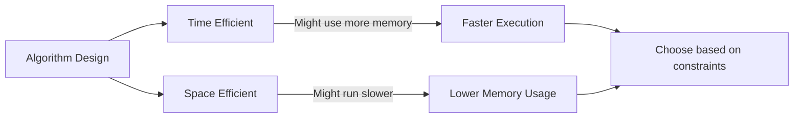

# Memory-Efficient Implementations

## Introduction

When developing software, we often focus on making our code run faster (time complexity), but another critical aspect of algorithm design is how efficiently we use memory (space complexity). Memory-efficient implementations are algorithms and data structures that accomplish their tasks while minimizing memory usage.

As data sizes grow and applications run on various devices with different memory constraints, writing memory-efficient code becomes increasingly important. Whether you're developing for embedded systems with limited RAM, mobile devices, or processing large datasets that might not fit in memory, these techniques can be crucial for your application's success.

This guide will help you understand:
- Why memory efficiency matters
- Common memory optimization techniques
- How to analyze space complexity
- Practical implementations with examples
- Trade-offs between time and space complexity

## Why Memory Efficiency Matters

### Resource Constraints

Memory is a finite resource in any computing environment. Using it efficiently allows:

1. **Running on devices with limited memory**: Mobile devices, IoT devices, and embedded systems often have strict memory constraints.
2. **Processing larger datasets**: Efficient algorithms can handle larger inputs without running out of memory.
3. **Improved cache performance**: Memory-efficient code often has better cache locality, which can significantly improve performance.

### Environmental Impact

Memory usage directly correlates with power consumption:
- Less memory used = less power consumed
- More efficient algorithms = greener computing

## Space Complexity Analysis

Before optimizing, we need to understand how to measure memory usage:

### Basic Space Complexity Notation

Similar to time complexity, we use big-O notation to describe space complexity:

- **O(1)** or constant space: Memory usage doesn't increase with input size
- **O(n)** or linear space: Memory usage grows proportionally with input
- **O(n²)** or quadratic space: Memory usage grows with the square of input size

### Example: Analyzing Space Complexity

Let's analyze a simple function that sums array elements:

```javascript
function sum(arr) {
  let total = 0; // O(1) space - single variable
  
  for (let i = 0; i < arr.length; i++) {
    total += arr[i];
  }
  
  return total;
}
```

Space complexity: O(1) - Uses constant space regardless of input size.

Compare with:

```javascript
function createDoubles(arr) {
  let doubles = []; // O(n) space - will grow with input size
  
  for (let i = 0; i < arr.length; i++) {
    doubles.push(arr[i] * 2);
  }
  
  return doubles;
}
```

Space complexity: O(n) - Creates a new array proportional to the input size.

## Memory Optimization Techniques

### 1. In-place Algorithms

In-place algorithms transform data within the original structure without requiring significant auxiliary data structures.

#### Example: In-place Array Reversal

```javascript
function reverseArrayInPlace(arr) {
  let left = 0;
  let right = arr.length - 1;
  
  while (left < right) {
    // Swap elements
    const temp = arr[left];
    arr[left] = arr[right];
    arr[right] = temp;
    
    // Move pointers
    left++;
    right--;
  }
  
  return arr; // The original array is modified
}

// Example usage:
const myArray = [1, 2, 3, 4, 5];
reverseArrayInPlace(myArray);
console.log(myArray); // Output: [5, 4, 3, 2, 1]
```

Space complexity: O(1) - Only uses a few variables regardless of array size.

### 2. Iterative Solutions vs. Recursive Solutions

Recursive solutions can consume a lot of memory due to the call stack. Converting recursive algorithms to iterative ones often reduces space complexity.

#### Example: Factorial Calculation

**Recursive (higher space usage)**:

```javascript
function factorialRecursive(n) {
  if (n <= 1) return 1;
  return n * factorialRecursive(n - 1);
}

console.log(factorialRecursive(5)); // Output: 120
```

Space complexity: O(n) due to n recursive calls on the stack.

**Iterative (lower space usage)**:

```javascript
function factorialIterative(n) {
  let result = 1;
  for (let i = 2; i <= n; i++) {
    result *= i;
  }
  return result;
}

console.log(factorialIterative(5)); // Output: 120
```

Space complexity: O(1) - Uses constant space regardless of n.

### 3. Bit Manipulation

Using bit operations can dramatically reduce memory usage for certain problems.

#### Example: Check if a number is even or odd

```javascript
function isEven(num) {
  return (num & 1) === 0;
}

console.log(isEven(42)); // Output: true
console.log(isEven(17)); // Output: false
```

#### Example: Using Bit Maps

Instead of using an array of booleans (which typically consumes 1 byte per element), we can use a bitmap where each bit represents a boolean value:

```javascript
class BitMap {
  constructor(size) {
    // Each number can store 32 bits, so we need size/32 numbers
    this.data = new Uint32Array(Math.ceil(size / 32));
  }

  set(position, value) {
    const index = Math.floor(position / 32);
    const bitPosition = position % 32;
    
    if (value) {
      // Set the bit (OR operation)
      this.data[index] |= (1 << bitPosition);
    } else {
      // Clear the bit (AND with inverse)
      this.data[index] &= ~(1 << bitPosition);
    }
  }

  get(position) {
    const index = Math.floor(position / 32);
    const bitPosition = position % 32;
    // Check if the bit is set
    return (this.data[index] & (1 << bitPosition)) !== 0;
  }
}

// Example usage:
const bitmap = new BitMap(100); // Can store 100 boolean values
bitmap.set(42, true);
console.log(bitmap.get(42)); // Output: true
console.log(bitmap.get(43)); // Output: false
```

This approach uses about 32 times less memory than a standard boolean array!

### 4. String Interning

For applications that handle many duplicate strings, string interning (storing only one copy of each unique string) can save substantial memory.

```javascript
class StringInterner {
  constructor() {
    this.strings = new Map();
  }

  intern(str) {
    if (!this.strings.has(str)) {
      this.strings.set(str, str);
    }
    return this.strings.get(str);
  }
}

// Example usage:
const interner = new StringInterner();
const s1 = "hello world";
const s2 = "hello world";

const i1 = interner.intern(s1);
const i2 = interner.intern(s2);

console.log(i1 === i2); // Output: true
```

### 5. Streaming and Lazy Evaluation

When dealing with large datasets, process data in chunks rather than loading everything into memory at once.

#### Example: File Processing

```javascript
const fs = require('fs');
const readline = require('readline');

async function countLines(filePath) {
  const fileStream = fs.createReadStream(filePath);
  const rl = readline.createInterface({
    input: fileStream,
    crlfDelay: Infinity
  });

  let count = 0;
  for await (const line of rl) {
    // Process each line one at a time
    count++;
  }
  return count;
}

// Example usage:
countLines('largefile.txt')
  .then(count => console.log(`File has ${count} lines`))
  .catch(err => console.error(err));
```

This approach uses minimal memory regardless of file size!

## Real-World Applications

### 1. Image Processing: In-Place Transformations

When processing large images, in-place algorithms can save significant memory:

```javascript
function grayscale(imageData) {
  // imageData is a Uint8ClampedArray containing RGBA values
  // Each pixel takes 4 bytes: R, G, B, A
  for (let i = 0; i < imageData.length; i += 4) {
    // Calculate grayscale value
    const gray = 0.299 * imageData[i] + 0.587 * imageData[i + 1] + 0.114 * imageData[i + 2];
    
    // Set RGB channels to the grayscale value
    imageData[i] = gray;     // R
    imageData[i + 1] = gray; // G
    imageData[i + 2] = gray; // B
    // Alpha channel (imageData[i + 3]) remains unchanged
  }
  // No need to create a new array - we modified the original
}
```

### 2. Database Query Optimization: Lazy Loading

```javascript
class DatabaseConnection {
  constructor(connectionString) {
    this.connectionString = connectionString;
    this.connection = null;
  }

  // Lazy connection - only connect when needed
  getConnection() {
    if (this.connection === null) {
      console.log("Establishing database connection...");
      this.connection = /* actual connection code */;
    }
    return this.connection;
  }

  query(sql) {
    const conn = this.getConnection();
    // Execute query using conn
    return results;
  }
}
```

### 3. Text Processing: Trie Data Structure

When working with large dictionaries or spell checkers, a trie (prefix tree) is much more memory-efficient than storing complete words:

```javascript
class TrieNode {
  constructor() {
    this.children = new Map();
    this.isEndOfWord = false;
  }
}

class Trie {
  constructor() {
    this.root = new TrieNode();
  }

  insert(word) {
    let current = this.root;
    
    for (const char of word) {
      if (!current.children.has(char)) {
        current.children.set(char, new TrieNode());
      }
      current = current.children.get(char);
    }
    
    current.isEndOfWord = true;
  }

  search(word) {
    let current = this.root;
    
    for (const char of word) {
      if (!current.children.has(char)) {
        return false;
      }
      current = current.children.get(char);
    }
    
    return current.isEndOfWord;
  }
}

// Example usage:
const dictionary = new Trie();
dictionary.insert("hello");
dictionary.insert("world");

console.log(dictionary.search("hello")); // Output: true
console.log(dictionary.search("hell"));  // Output: false
```

## Time-Space Tradeoffs

Memory efficiency often comes at the cost of time efficiency, and vice versa. Understanding these tradeoffs is crucial:



### Example: Memoization vs. Recalculation

**Time-efficient approach using more memory (memoization)**:

```javascript
function fibonacciWithMemoization(n) {
  const memo = new Array(n + 1).fill(0);
  memo[1] = 1;
  
  for (let i = 2; i <= n; i++) {
    memo[i] = memo[i - 1] + memo[i - 2];
  }
  
  return memo[n];
}

console.log(fibonacciWithMemoization(10)); // Output: 55
```

Space complexity: O(n), Time complexity: O(n)

**Space-efficient approach recalculating values**:

```javascript
function fibonacciSpaceEfficient(n) {
  if (n <= 1) return n;
  
  let prev = 0;
  let current = 1;
  
  for (let i = 2; i <= n; i++) {
    const next = prev + current;
    prev = current;
    current = next;
  }
  
  return current;
}

console.log(fibonacciSpaceEfficient(10)); // Output: 55
```

Space complexity: O(1), Time complexity: O(n)

## Profiling and Monitoring Memory Usage

To optimize memory usage, you need to measure it. Tools vary by language, but most environments offer memory profiling:

- JavaScript: Chrome DevTools Memory panel, Node.js `--inspect` flag
- Python: `memory_profiler` module
- Java: JVisualVM, Java Flight Recorder

Example Node.js memory usage tracking:

```javascript
function checkMemoryUsage() {
  const memoryUsage = process.memoryUsage();
  console.log(`Heap Total: ${Math.round(memoryUsage.heapTotal / 1024 / 1024)} MB`);
  console.log(`Heap Used: ${Math.round(memoryUsage.heapUsed / 1024 / 1024)} MB`);
}

// Example usage
checkMemoryUsage();
// Create some objects to use memory
const bigArray = new Array(1000000).fill("memory test");
checkMemoryUsage();
```

## Summary

Memory-efficient implementations are crucial for applications running under resource constraints or processing large volumes of data. Key takeaways:

1. **Analyze space complexity** to understand your algorithm's memory usage patterns
2. **Use in-place operations** to avoid additional memory allocation
3. **Prefer iterative approaches** over recursive ones when stack space is a concern
4. **Consider bit manipulation** for boolean data and compact storage
5. **Process data in streams** when dealing with large datasets
6. **Understand time-space tradeoffs** to make appropriate optimization decisions
7. **Profile your code** to identify memory bottlenecks

By applying these techniques, you can create algorithms that not only run efficiently but also use memory responsibly, enabling your applications to handle larger datasets and run on a wider range of devices.

## Additional Resources

- Book: "Algorithms to Live By" by Brian Christian and Tom Griffiths
- Book: "Programming Pearls" by Jon Bentley
- Online Course: "Algorithms Specialization" on Coursera by Stanford University
- Website: GeeksForGeeks' Space Complexity articles

## Exercises

1. **Transform-in-place**: Implement an in-place algorithm to remove all occurrences of a specific value from an array.

2. **Memory comparison**: Write two versions of a function that finds duplicate numbers in an array - one with O(n) time and O(n) space, and another with O(n²) time but O(1) space.

3. **Bit manipulation**: Implement a function that determines if a number is a power of 2 using only bit operations and constant space.

4. **Stream processing**: Create a function that finds the median value in a large file of numbers without loading the entire file into memory.

5. **Space-time tradeoff**: Implement both a recursive (with memoization) and an iterative solution for computing binomial coefficients, and compare their performance and memory usage.