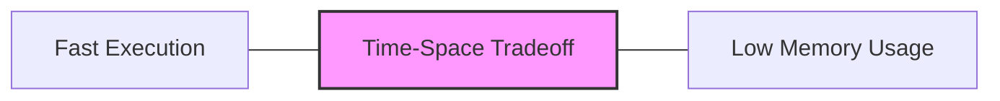

# Time Space Tradeoffs

When developing algorithms, you'll often face a fundamental choice: Do you want your code to run faster (time efficiency) or use less memory (space efficiency)? This concept, known as the **time-space tradeoff**, is a core principle in algorithm design and optimization.

## Introduction to Time-Space Tradeoffs

A time-space tradeoff is a situation where you can decrease an algorithm's execution time by using more memory, or reduce memory usage by accepting longer execution times. Understanding these tradeoffs is crucial for writing efficient code, especially when working with large datasets or constrained environments.

The relationship between time and space can be visualized as:



## Fundamental Concepts

### Time Complexity

Time complexity measures how an algorithm's execution time grows relative to the input size. We typically express this using Big O notation:

- O(1): Constant time
- O(log n): Logarithmic time
- O(n): Linear time
- O(n log n): Linearithmic time
- O(n²): Quadratic time
- O(2^n): Exponential time

### Space Complexity

Space complexity represents the total memory an algorithm needs relative to input size, including:

- Input space: Memory for storing input data
- Auxiliary space: Extra memory used during execution 
- Output space: Memory for storing the result

## Classic Examples of Time-Space Tradeoffs

### Example 1: Finding Duplicates in an Array

Let's examine two approaches to find duplicates in an array:

#### Approach 1: Nested Loops (Time-Intensive)

```javascript
function findDuplicateTimeIntensive(arr) {
    for (let i = 0; i < arr.length; i++) {
        for (let j = i + 1; j < arr.length; j++) {
            if (arr[i] === arr[j]) {
                return arr[i]; // Found duplicate
            }
        }
    }
    return null; // No duplicates
}

// Example usage:
const numbers = [3, 1, 4, 1, 5, 9];
console.log(findDuplicateTimeIntensive(numbers)); // Output: 1
```

**Complexity Analysis:**
- Time Complexity: O(n²) - We use nested loops to compare each element with others
- Space Complexity: O(1) - We only use a constant amount of extra space

#### Approach 2: Using a Hash Set (Space-Intensive)

```javascript
function findDuplicateSpaceIntensive(arr) {
    const seen = new Set();
    
    for (let num of arr) {
        if (seen.has(num)) {
            return num; // Found duplicate
        }
        seen.add(num);
    }
    
    return null; // No duplicates
}

// Example usage:
const numbers = [3, 1, 4, 1, 5, 9];
console.log(findDuplicateSpaceIntensive(numbers)); // Output: 1
```

**Complexity Analysis:**
- Time Complexity: O(n) - We only need to iterate through the array once
- Space Complexity: O(n) - In the worst case, we might need to store nearly all elements in our set

This example perfectly illustrates the time-space tradeoff: the second approach runs significantly faster but requires more memory.

### Example 2: Computing Fibonacci Numbers

Let's look at different approaches to calculate the nth Fibonacci number:

#### Approach 1: Recursive Calculation (Time-Intensive)

```javascript
function fibRecursive(n) {
    if (n <= 1) return n;
    return fibRecursive(n - 1) + fibRecursive(n - 2);
}

console.log(fibRecursive(10)); // Output: 55
```

**Complexity Analysis:**
- Time Complexity: O(2^n) - Exponential due to redundant calculations
- Space Complexity: O(n) - Maximum depth of the recursion stack

#### Approach 2: Dynamic Programming with Memoization (Balanced)

```javascript
function fibMemoized(n, memo = {}) {
    if (n in memo) return memo[n];
    if (n <= 1) return n;
    
    memo[n] = fibMemoized(n - 1, memo) + fibMemoized(n - 2, memo);
    return memo[n];
}

console.log(fibMemoized(10)); // Output: 55
console.log(fibMemoized(40)); // Can calculate larger values efficiently
```

**Complexity Analysis:**
- Time Complexity: O(n) - Each fibonacci value is calculated just once
- Space Complexity: O(n) - We store n values in our memoization table

#### Approach 3: Iterative Solution (Space-Efficient)

```javascript
function fibIterative(n) {
    if (n <= 1) return n;
    
    let a = 0, b = 1, temp;
    for (let i = 2; i <= n; i++) {
        temp = a + b;
        a = b;
        b = temp;
    }
    
    return b;
}

console.log(fibIterative(10)); // Output: 55
console.log(fibIterative(100)); // Can calculate very large values
```

**Complexity Analysis:**
- Time Complexity: O(n) - Linear time to iterate from 2 to n
- Space Complexity: O(1) - We only use a constant amount of variables regardless of input size

This example demonstrates how we can choose different implementations based on our priorities - the recursive approach is elegant but inefficient, the memoized version balances time and space, while the iterative solution is both time and space-efficient.

## Real-World Applications

### Web Development: Caching

Web applications frequently use caching to improve performance:

```javascript
// Simple cache implementation
class SimpleCache {
    constructor(maxSize = 100) {
        this.cache = new Map();
        this.maxSize = maxSize;
    }
    
    get(key) {
        if (this.cache.has(key)) {
            return this.cache.get(key);
        }
        return null; // Cache miss
    }
    
    set(key, value) {
        // Simple eviction policy: remove random entry if full
        if (this.cache.size >= this.maxSize) {
            const keyToRemove = this.cache.keys().next().value;
            this.cache.delete(keyToRemove);
        }
        this.cache.set(key, value);
    }
}

// Usage example
const dataCache = new SimpleCache(10);
function fetchUserData(userId) {
    // Check if data is in cache
    const cachedData = dataCache.get(userId);
    if (cachedData) {
        console.log("Cache hit!");
        return cachedData;
    }
    
    console.log("Cache miss! Fetching from database...");
    // In a real application, this would make a database query
    const userData = { id: userId, name: `User ${userId}`, /* other data */ };
    
    // Store in cache for future use
    dataCache.set(userId, userData);
    return userData;
}

// First request - cache miss
console.log(fetchUserData(123));
// Second request for same ID - cache hit
console.log(fetchUserData(123));
```

In this example, we're trading memory (storing data in a cache) for speed (avoiding expensive database queries).

### Mobile Development: Image Processing

On mobile devices with limited resources, you might need to make different tradeoffs:

```javascript
class ImageProcessor {
    // Space-intensive approach: pre-compute all filters
    processWithPrecomputation(image) {
        // Pre-compute all possible filter variations
        const filters = this.generateAllFilters();
        
        // Apply the appropriate filter (instant application)
        return this.applyFilterFromPrecomputed(image, filters);
        
        // Takes more memory but application is instant
    }
    
    // Time-intensive approach: compute on demand
    processOnDemand(image, filterSettings) {
        // Generate the specific filter needed on the fly
        const filter = this.generateSpecificFilter(filterSettings);
        
        // Apply the filter
        return this.applyFilter(image, filter);
        
        // Takes less memory but has processing delay
    }
}
```

## Making Smart Tradeoff Decisions

When deciding between time and space optimizations, consider:

1. **Environment constraints**: 
   - Limited memory? Prioritize space efficiency
   - Limited processing power? Prioritize time efficiency

2. **Usage patterns**: 
   - Frequent operations? Prioritize time efficiency
   - One-time operations? Space efficiency might be more important

3. **Scale requirements**:
   - Will your solution need to handle much larger inputs in the future?
   - How will your chosen approach scale?

## Practical Strategies

Here are some common techniques for managing time-space tradeoffs:

### 1. Caching and Memoization

Store results of expensive operations for reuse:

```javascript
function memoize(fn) {
    const cache = new Map();
    
    return function(...args) {
        const key = JSON.stringify(args);
        if (cache.has(key)) {
            return cache.get(key);
        }
        
        const result = fn(...args);
        cache.set(key, result);
        return result;
    };
}

// Example: Expensive calculation
function expensiveOperation(n) {
    console.log(`Computing for ${n}...`);
    let result = 0;
    for (let i = 0; i < n * 1000000; i++) {
        result += Math.sin(i);
    }
    return result;
}

const memoizedOperation = memoize(expensiveOperation);

// First call - slow
console.time("First call");
memoizedOperation(10);
console.timeEnd("First call");

// Second call with same argument - fast
console.time("Second call");
memoizedOperation(10);
console.timeEnd("Second call");
```

### 2. Precomputation

Calculate values in advance, especially when inputs have a limited range:

```javascript
// Precompute squares for numbers 1-100
const squares = Array(101).fill(0).map((_, i) => i * i);

function getSquare(n) {
    if (n >= 0 && n <= 100) {
        return squares[n]; // O(1) time
    }
    
    // Fallback for numbers outside precomputed range
    return n * n;
}

console.log(getSquare(7));  // Output: 49 (retrieved from precomputed array)
```

### 3. Data Structure Selection

Choose appropriate data structures based on your operations:

```javascript
// Example: Finding if an element exists in a collection

// Using an array - fast insertion, slow lookup
const arrayCollection = [1, 2, 3, 4, 5];
console.time("Array lookup");
const arrayHasFive = arrayCollection.includes(5); // O(n) time
console.timeEnd("Array lookup");

// Using a Set - slightly more memory, fast lookup
const setCollection = new Set([1, 2, 3, 4, 5]);
console.time("Set lookup");
const setHasFive = setCollection.has(5); // O(1) time
console.timeEnd("Set lookup");
```

### 4. Lazy Evaluation and Generators

Compute values only when needed:

```javascript
function* infiniteFibonacci() {
    let [a, b] = [0, 1];
    
    while (true) {
        yield a;
        [a, b] = [b, a + b];
    }
}

const fibGen = infiniteFibonacci();

// Get first 10 Fibonacci numbers on demand
const firstTen = [];
for (let i = 0; i < 10; i++) {
    firstTen.push(fibGen.next().value);
}

console.log(firstTen); // [0, 1, 1, 2, 3, 5, 8, 13, 21, 34]
```

## Finding the Right Balance

The "best" solution depends on your specific constraints and needs. Consider:

1. **User experience requirements**: What response times are acceptable?
2. **Hardware limitations**: What are the memory constraints?
3. **Scaling needs**: How will data volumes grow over time?
4. **Development time**: Sometimes a balanced approach is more practical to implement

## Summary

Time-space tradeoffs are at the heart of algorithm design. By understanding these tradeoffs, you can make informed decisions about:

- When to use memory-intensive solutions for speed
- When to accept slower performance to save memory
- How to choose the right balance for your specific use case

The key is to be intentional about your choices rather than optimizing blindly. Remember that in many real-world scenarios, a balanced approach works best.

## Exercises

1. Implement two different solutions for finding the longest substring without repeating characters in a string - one that prioritizes time efficiency and one that prioritizes space efficiency.

2. Create a function that checks if a given string is a palindrome. Implement it in two ways: one with O(n) space complexity and another with O(1) space complexity.

3. Implement a data structure that allows O(1) insertion, deletion, and lookup of elements, and explain the time-space tradeoffs involved.

## Additional Resources

- "Introduction to Algorithms" by Cormen, Leiserson, Rivest, and Stein
- "Algorithms" by Robert Sedgewick and Kevin Wayne
- "Cracking the Coding Interview" by Gayle Laakmann McDowell

Understanding time-space tradeoffs will make you a more thoughtful programmer, allowing you to choose the right solution for each unique problem based on your specific constraints and priorities.