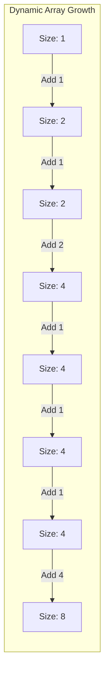
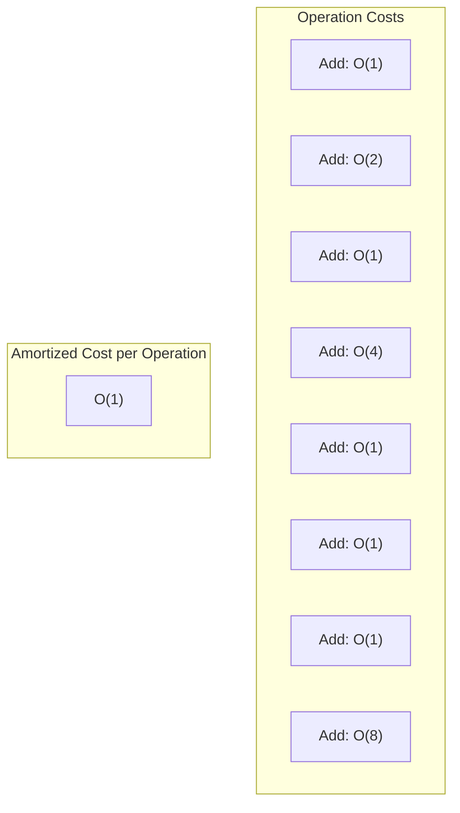

# Amortized Analysis

## Introduction

Have you ever encountered a data structure where some operations seem very expensive occasionally, but most operations are cheap? Or wondered why some seemingly inefficient algorithms actually perform well in practice? This is where **amortized analysis** comes in.

Amortized analysis is a method for analyzing the time complexity of algorithms where the focus is on the average performance over a sequence of operations, rather than the worst-case scenario of a single operation. Unlike standard worst-case analysis, amortized analysis provides a more realistic view of an algorithm's efficiency over time.

In this tutorial, we'll explore:
- What amortized analysis is and why it matters
- Common amortized analysis techniques
- Real-world examples where amortized analysis applies
- How to calculate amortized complexity

## Why Amortized Analysis Matters

Traditional algorithm analysis often focuses on the worst-case scenario for individual operations. However, this approach can be misleading for data structures where:

1. The worst-case rarely happens
2. Expensive operations are balanced out by many inexpensive ones
3. The cost of a sequence of operations is more important than individual ones

For example, in a dynamic array that grows when needed, occasional resize operations are expensive (O(n)) but happen so infrequently that the average cost per operation is actually much lower.

## Amortized Analysis Techniques

There are three main techniques used for amortized analysis:

1. **Aggregate Method**: Determine the total cost of a sequence of operations and divide by the number of operations.
2. **Accounting Method**: Assign different charges to different operations, some more and some less than their actual cost.
3. **Potential Method**: Use a potential function to track the "energy" or "potential" stored in the data structure.

Let's explore each of these with examples.

### Aggregate Method

In the aggregate method, we:
1. Calculate the total cost of n operations
2. Divide by n to get the average cost per operation

**Example: Dynamic Array**

Consider a dynamic array (like ArrayList in Java or vector in C++) that doubles in size when it's full:

```java
public class DynamicArray<T> {
    private T[] array;
    private int size;
    private int capacity;
    
    public DynamicArray() {
        this.array = (T[]) new Object[1]; // Start with capacity 1
        this.size = 0;
        this.capacity = 1;
    }
    
    public void add(T element) {
        // If array is full, resize
        if (size == capacity) {
            resize();
        }
        array[size++] = element;
    }
    
    private void resize() {
        capacity *= 2;
        T[] newArray = (T[]) new Object[capacity];
        // Copy elements to new array
        for (int i = 0; i < size; i++) {
            newArray[i] = array[i];
        }
        array = newArray;
    }
}
```

Let's analyze the cost of n add operations:

- Most add operations cost O(1) time
- Occasionally, we need to resize, which costs O(n) time
- Resizing happens when size reaches 1, 2, 4, 8, ..., 2^k

The total cost of n add operations is:
1 + 1 + 2 + 1 + 4 + 1 + 1 + 1 + ... = O(n)

Therefore, the amortized cost per operation is O(n)/n = O(1).

### Accounting Method

In the accounting method:
1. We charge each operation a fixed amortized cost
2. Some operations cost more than their amortized cost, some less
3. We save the extra cost as "credit" to use later

**Example: Dynamic Array Resizing**

For our dynamic array example:
- Charge each add operation 3 units
- Actual cost of add without resizing is 1 unit
- Store the extra 2 units as credit
- Use the accumulated credit to pay for the expensive resize operations

When we resize, we need to copy all elements, but we've already saved enough credit to cover this cost.

### Potential Method

The potential method uses a potential function Φ(D) that maps the data structure D to a non-negative real number, representing the "potential energy" stored in the structure.

For an operation i changing the data structure from Di-1 to Di:
- The amortized cost = actual cost + Φ(Di) - Φ(Di-1)

**Example: Binary Counter**

Consider a binary counter where we need to count from 0 to n, flipping bits as needed:

```python
def increment(counter):
    i = 0
    while i < len(counter) and counter[i] == 1:
        counter[i] = 0
        i += 1
    if i < len(counter):
        counter[i] = 1
    return counter
```

Let's define the potential function Φ(counter) as the number of 1s in the counter.

When we increment:
- The actual cost is the number of bits flipped
- Φ(Di) - Φ(Di-1) = number of 1s after - number of 1s before

For example, when incrementing from 0111 to 1000:
- Actual cost: 4 bits flipped
- Φ(1000) - Φ(0111) = 1 - 3 = -2
- Amortized cost = 4 + (-2) = 2

Over n increments, the amortized cost is O(1) per increment.

## Real-World Examples

### 1. Dynamic Arrays

As we've already seen, dynamic arrays (like ArrayList in Java, vector in C++, or list in Python) use amortized analysis to achieve O(1) append operations despite occasional O(n) resize operations.

```python
# Python list append demonstration
my_list = []
for i in range(10000):
    my_list.append(i)  # Occasional O(n) resize, but O(1) amortized
```

### 2. Hash Table Resizing

Hash tables (like HashMap in Java, unordered_map in C++, or dict in Python) also use amortized analysis for their operations:

```javascript
// JavaScript object (hash table) example
const hashTable = {};
for (let i = 0; i < 10000; i++) {
    hashTable[`key${i}`] = i;  // O(1) amortized despite occasional rehashing
}
```

### 3. Splay Trees

Splay trees are self-adjusting binary search trees where recently accessed items move to the root:

```java
public void splay(Node x) {
    while (x.parent != null) {
        if (x.parent.parent == null) {
            // Zig case
            if (x == x.parent.left) {
                rightRotate(x.parent);
            } else {
                leftRotate(x.parent);
            }
        } else if (x == x.parent.left && x.parent == x.parent.parent.left) {
            // Zig-zig case
            rightRotate(x.parent.parent);
            rightRotate(x.parent);
        } else if (x == x.parent.right && x.parent == x.parent.parent.right) {
            // Zig-zig case
            leftRotate(x.parent.parent);
            leftRotate(x.parent);
        } else if (x == x.parent.right && x.parent == x.parent.parent.left) {
            // Zig-zag case
            leftRotate(x.parent);
            rightRotate(x.parent);
        } else {
            // Zig-zag case
            rightRotate(x.parent);
            leftRotate(x.parent);
        }
    }
}
```

While individual splay operations can be O(n) in the worst case, a sequence of m operations takes O(m log n) time, making the amortized cost per operation O(log n).

### 4. Union-Find with Path Compression

The Union-Find data structure uses path compression and union by rank to achieve nearly constant-time operations:

```java
public int find(int x) {
    if (parent[x] != x) {
        parent[x] = find(parent[x]);  // Path compression
    }
    return parent[x];
}
```

A sequence of m operations has an amortized time complexity of O(α(n)), where α is the inverse Ackermann function which grows extremely slowly.

## Visualizing Amortized Analysis

Let's visualize the amortized cost of adding elements to a dynamic array:





## How to Apply Amortized Analysis

To apply amortized analysis in your algorithms:

1. **Identify sequences** of operations rather than individual ones
2. **Choose the appropriate method**:
   - Aggregate method for simpler cases
   - Accounting method when you can assign "credits"
   - Potential method for more complex data structures
3. **Define your potential function** carefully (if using the potential method)
4. **Check worst-case scenarios** to ensure no hidden assumptions

## Practice Problem: Stack with Multi-Pop

Let's analyze a stack with the following operations:
- push(x): Push element x onto the stack (O(1))
- pop(): Pop the top element from the stack (O(1))
- multiPop(k): Pop up to k elements from the stack

Here's the implementation:

```java
public class Stack<T> {
    private ArrayList<T> elements = new ArrayList<>();
    
    public void push(T item) {
        elements.add(item);
    }
    
    public T pop() {
        if (elements.isEmpty()) {
            throw new EmptyStackException();
        }
        return elements.remove(elements.size() - 1);
    }
    
    public void multiPop(int k) {
        int popCount = Math.min(k, elements.size());
        for (int i = 0; i < popCount; i++) {
            elements.remove(elements.size() - 1);
        }
    }
}
```

What's the amortized cost of these operations?

Using the potential method, we can define Φ(S) = number of elements in the stack.

For push:
- Actual cost: 1
- Potential change: +1
- Amortized cost: 1 + 1 = 2 = O(1)

For pop:
- Actual cost: 1
- Potential change: -1
- Amortized cost: 1 - 1 = 0 = O(1)

For multiPop(k):
- Actual cost: min(k, size)
- Potential change: -min(k, size)
- Amortized cost: min(k, size) - min(k, size) = 0 = O(1)

Therefore, all operations have an amortized cost of O(1).

## Summary

Amortized analysis gives us a powerful tool for understanding the efficiency of algorithms and data structures over sequences of operations, instead of just focusing on worst-case scenarios. Through the aggregate method, accounting method, and potential method, we can show that operations which appear expensive in isolation might actually be efficient when considered as part of a sequence.

Key points to remember:
- Amortized analysis looks at the average performance over a sequence of operations
- It's particularly useful for data structures with occasional expensive operations
- Three main techniques: aggregate, accounting, and potential methods
- Many common data structures like dynamic arrays and hash tables benefit from amortized analysis

## Exercises

1. Analyze the amortized cost of incrementing a binary counter from 0 to n using the accounting method.
2. Consider a queue implemented with two stacks. Analyze the amortized cost of enqueue and dequeue operations.
3. Analyze the amortized cost of operations on a Fibonacci heap.
4. Design a data structure that supports insert, delete, and find-min operations with O(1) amortized time complexity.

## Additional Resources

- "Introduction to Algorithms" by Cormen, Leiserson, Rivest, and Stein (Chapter on Amortized Analysis)
- "Algorithm Design Manual" by Steven Skiena
- "Data Structures and Algorithm Analysis" by Mark Allen Weiss
- Stanford's CS 161 course materials on Amortized Analysis

Amortized analysis might seem complex at first, but it's an invaluable tool when designing efficient algorithms and data structures that need to perform well in practice over many operations.