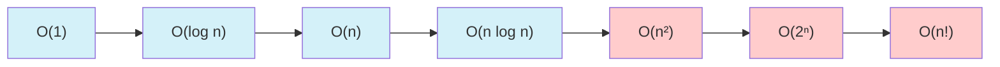

# Competitive Analysis

## Introduction

Competitive Analysis is the systematic approach to evaluating and optimizing algorithms for competitive programming scenarios, coding contests, and technical interviews. It involves understanding how your algorithm performs under various constraints and finding ways to improve its efficiency.

In competitive programming environments, you often face strict time and memory limitations. An algorithm that works perfectly for small inputs might completely fail when challenged with larger datasets. This is why understanding how to analyze and optimize your code is crucial.

## Why Competitive Analysis Matters

When you participate in programming contests or interviews, your solutions are typically judged on:

1. **Correctness**: Does your solution produce the right output?
2. **Time Efficiency**: Does it run within the allowed time constraints?
3. **Memory Usage**: Does it use memory within allowed limits?
4. **Code Clarity**: Is your solution readable and maintainable?

Mastering competitive analysis helps you write solutions that excel in all these dimensions.

## Time Complexity Analysis

Time complexity measures how the runtime of your algorithm grows as the input size increases.

### Common Time Complexities



| Complexity | Name         | Description                                | Example Algorithm                      |
|------------|--------------|--------------------------------------------|----------------------------------------|
| O(1)       | Constant     | Runtime doesn't change with input size     | Array access, arithmetic operations    |
| O(log n)   | Logarithmic  | Runtime grows logarithmically              | Binary search                          |
| O(n)       | Linear       | Runtime grows linearly with input          | Linear search                          |
| O(n log n) | Linearithmic | Slightly worse than linear                 | Merge sort, heap sort                  |
| O(n²)      | Quadratic    | Runtime grows with square of input         | Bubble sort, insertion sort            |
| O(2ⁿ)      | Exponential  | Runtime doubles with each additional input | Recursive Fibonacci, subset generation |
| O(n!)      | Factorial    | Runtime grows factorially                  | Permutation generation                 |

### Example: Linear vs. Binary Search

**Linear Search**:

```python
def linear_search(arr, target):
    for i in range(len(arr)):
        if arr[i] == target:
            return i
    return -1

# Example usage
array = [1, 3, 5, 7, 9, 11, 13, 15, 17, 19]
result = linear_search(array, 11)
print(f"Found at index: {result}")  # Output: Found at index: 5
```

Time complexity: O(n) - In the worst case, we need to check every element.

**Binary Search**:

```python
def binary_search(arr, target):
    left, right = 0, len(arr) - 1
    
    while left <= right:
        mid = (left + right) // 2
        
        if arr[mid] == target:
            return mid
        elif arr[mid] < target:
            left = mid + 1
        else:
            right = mid - 1
            
    return -1

# Example usage (requires sorted array)
array = [1, 3, 5, 7, 9, 11, 13, 15, 17, 19]
result = binary_search(array, 11)
print(f"Found at index: {result}")  # Output: Found at index: 5
```

Time complexity: O(log n) - We eliminate half of the remaining elements in each step.

## Space Complexity Analysis

Space complexity measures how much memory your algorithm requires relative to input size. Just like time complexity, it's described using Big O notation.

### Common Space Complexities

- **O(1)** - Constant space: The algorithm uses the same amount of space regardless of input size.
- **O(n)** - Linear space: Memory usage grows linearly with input size.
- **O(n²)** - Quadratic space: Memory usage grows with the square of input size.

### Example: In-place vs. Out-of-place Sorting

**In-place algorithm (Space efficient):**

```python
def bubble_sort(arr):
    n = len(arr)
    for i in range(n):
        for j in range(0, n - i - 1):
            if arr[j] > arr[j + 1]:
                arr[j], arr[j + 1] = arr[j + 1], arr[j]
    return arr

# Example usage
array = [64, 34, 25, 12, 22, 11, 90]
bubble_sort(array)
print(f"Sorted array: {array}")  # Output: Sorted array: [11, 12, 22, 25, 34, 64, 90]
```

Space complexity: O(1) - Uses only a fixed amount of extra space regardless of input size.

**Out-of-place algorithm (Higher space usage):**

```python
def merge_sort(arr):
    if len(arr) <= 1:
        return arr
        
    mid = len(arr) // 2
    left = merge_sort(arr[:mid])
    right = merge_sort(arr[mid:])
    
    return merge(left, right)

def merge(left, right):
    result = []
    i = j = 0
    
    while i < len(left) and j < len(right):
        if left[i] < right[j]:
            result.append(left[i])
            i += 1
        else:
            result.append(right[j])
            j += 1
    
    result.extend(left[i:])
    result.extend(right[j:])
    return result

# Example usage
array = [64, 34, 25, 12, 22, 11, 90]
sorted_array = merge_sort(array)
print(f"Sorted array: {sorted_array}")  # Output: Sorted array: [11, 12, 22, 25, 34, 64, 90]
```

Space complexity: O(n) - Requires additional space proportional to input size.

## Optimizing Algorithms for Competitive Programming

### 1. Choose the Right Data Structure

Selecting appropriate data structures can drastically improve performance:

| Data Structure | Best Use Cases | Time Complexities |
|----------------|----------------|-------------------|
| Array/List | Simple storage, direct access | Access: O(1), Search: O(n) |
| Hash Table (dict) | Fast lookup, counting | Access/Insert/Delete: O(1) average |
| Set | Unique elements, membership testing | Access/Insert/Delete: O(1) average |
| Stack | LIFO operations, tracking history | Push/Pop: O(1) |
| Queue | FIFO operations, breadth-first search | Enqueue/Dequeue: O(1) |
| Binary Heap | Priority queue | Insert: O(log n), Get-min: O(1) |
| Binary Search Tree | Ordered operations | Access/Insert/Delete: O(log n) average |

### Example: Counting Frequency

**Inefficient approach:**

```python
def count_occurrences(arr, target):
    count = 0
    for num in arr:
        if num == target:
            count += 1
    return count

# Example usage
array = [1, 2, 3, 1, 4, 1, 5, 1]
print(f"Occurrences of 1: {count_occurrences(array, 1)}")  # Output: Occurrences of 1: 4
```

Time complexity: O(n) for each query

**Optimized approach using a dictionary:**

```python
def count_frequencies(arr):
    frequency = {}
    for num in arr:
        if num in frequency:
            frequency[num] += 1
        else:
            frequency[num] = 1
    return frequency

# Example usage
array = [1, 2, 3, 1, 4, 1, 5, 1]
frequencies = count_frequencies(array)
print(f"Occurrences of 1: {frequencies.get(1, 0)}")  # Output: Occurrences of 1: 4
```

Time complexity: O(n) for preprocessing, then O(1) for each query

### 2. Use Algorithmic Tricks

#### Prefix Sums

Prefix sums allow for O(1) range sum queries after O(n) preprocessing.

```python
def build_prefix_sum(arr):
    prefix = [0] * (len(arr) + 1)
    for i in range(len(arr)):
        prefix[i + 1] = prefix[i] + arr[i]
    return prefix

def range_sum(prefix, left, right):
    # Returns sum of arr[left...right] inclusive
    return prefix[right + 1] - prefix[left]

# Example usage
array = [1, 3, 4, 8, 6, 1, 4, 2]
prefix = build_prefix_sum(array)
print(f"Sum of elements from index 2 to 5: {range_sum(prefix, 2, 5)}")  # Output: Sum of elements from index 2 to 5: 19
```

#### Two-Pointer Technique

Useful for problems involving pairs or subarrays.

```python
def find_pair_with_sum(arr, target_sum):
    arr.sort()  # Sort the array first
    left, right = 0, len(arr) - 1
    
    while left < right:
        current_sum = arr[left] + arr[right]
        if current_sum == target_sum:
            return (arr[left], arr[right])
        elif current_sum < target_sum:
            left += 1
        else:
            right -= 1
    
    return None

# Example usage
array = [8, 3, 5, 1, 11, 7]
result = find_pair_with_sum(array, 12)
print(f"Pair with sum 12: {result}")  # Output: Pair with sum 12: (1, 11)
```

### 3. Dynamic Programming Optimization

Dynamic programming often helps solve complex problems by breaking them into simpler subproblems.

**Example: Fibonacci with memoization**

```python
def fibonacci(n, memo={}):
    if n in memo:
        return memo[n]
    if n <= 1:
        return n
        
    memo[n] = fibonacci(n-1, memo) + fibonacci(n-2, memo)
    return memo[n]

# Example usage
print(f"10th Fibonacci number: {fibonacci(10)}")  # Output: 10th Fibonacci number: 55
```

Time complexity: O(n) instead of O(2ⁿ) for the naive recursive approach.

## Common Pitfalls and How to Avoid Them

### Pitfall 1: Unnecessary Recalculation

**Problem:**
```python
def calculate_power(a, n):
    result = 1
    for _ in range(n):
        result *= a
    return result
```

**Optimized Solution:**
```python
def fast_power(a, n):
    if n == 0:
        return 1
    if n % 2 == 0:
        half = fast_power(a, n // 2)
        return half * half
    else:
        half = fast_power(a, (n - 1) // 2)
        return a * half * half

# Example usage
print(f"2^10 = {fast_power(2, 10)}")  # Output: 2^10 = 1024
```

Time complexity improved from O(n) to O(log n).

### Pitfall 2: Inefficient String Operations

In languages like Python, strings are immutable. Repeatedly concatenating strings in a loop creates a new string each time.

**Inefficient:**
```python
def build_string(n):
    result = ""
    for i in range(n):
        result += str(i)
    return result
```

**Optimized:**
```python
def build_string_efficiently(n):
    result = []
    for i in range(n):
        result.append(str(i))
    return "".join(result)

# Example usage
print(build_string_efficiently(5))  # Output: 01234
```

## Real-World Application Example

### Problem: Efficient Anagram Checking

Anagrams are words that use the same letters but in different orders. Let's implement an efficient solution to check if two strings are anagrams.

```python
def are_anagrams(str1, str2):
    # Remove spaces and convert to lowercase for a fair comparison
    str1 = str1.replace(" ", "").lower()
    str2 = str2.replace(" ", "").lower()
    
    # Quick check: if lengths differ, they can't be anagrams
    if len(str1) != len(str2):
        return False
    
    # Count character frequencies
    char_count = {}
    
    # Count characters in first string
    for char in str1:
        if char in char_count:
            char_count[char] += 1
        else:
            char_count[char] = 1
    
    # Subtract counts for second string
    for char in str2:
        if char not in char_count:
            return False
        
        char_count[char] -= 1
        if char_count[char] == 0:
            del char_count[char]
    
    # If all characters were matched, the dictionary should be empty
    return len(char_count) == 0

# Example usage
print(are_anagrams("listen", "silent"))  # Output: True
print(are_anagrams("hello", "world"))    # Output: False
print(are_anagrams("Astronomer", "Moon starer"))  # Output: True
```

Time complexity: O(n), where n is the length of the input strings.

## Competition Strategy Tips

1. **Read the problem carefully**: Make sure you understand all requirements before coding.

2. **Start with brute force**: First solve the problem correctly, then optimize.

3. **Estimate complexity before coding**: Will your algorithm run within time limits?

4. **Test your solution with edge cases**:
   - Empty inputs
   - Single element inputs
   - Maximum size inputs
   - Inputs with repeated elements

5. **Pre-compute when possible**: Calculate and store values that will be used repeatedly.

6. **Know when to use which algorithm**:
   - Sorting? Consider quick sort, merge sort, or counting sort depending on data.
   - Searching? Linear search for small data, binary search for sorted data.
   - Graph traversal? BFS for shortest path, DFS for exploring all possibilities.

## Summary

Competitive Analysis involves understanding the time and space requirements of your algorithms and making strategic optimizations to meet competition constraints. Key concepts include:

1. **Time complexity analysis** - Determining how runtime scales with input size
2. **Space complexity analysis** - Understanding memory usage requirements
3. **Algorithm selection** - Choosing the right algorithm for the specific problem
4. **Data structure selection** - Using appropriate data structures to optimize operations
5. **Optimization techniques** - Applying tricks and transformations to improve performance

By mastering these skills, you'll be better equipped to tackle coding challenges and optimize real-world applications.

## Practice Exercises

1. **Basic**: Implement both recursive and iterative approaches for calculating factorial. Compare their time and space complexities.

2. **Intermediate**: Given an array of integers, find the contiguous subarray with the largest sum. Optimize for O(n) time complexity.

3. **Advanced**: Implement an algorithm to find all pairs of integers in an array that sum to a specific target. Optimize it to run in O(n) time.

4. **Challenge**: Given two sorted arrays of sizes n and m, find the median of the elements if they were merged into a single sorted array. Your algorithm should run in O(log(min(n, m))) time.

## Additional Resources

1. **Books**:
   - "Introduction to Algorithms" by Cormen, Leiserson, Rivest, and Stein
   - "Competitive Programming" by Steven Halim

2. **Online Platforms**:
   - LeetCode
   - Codeforces
   - HackerRank
   - AtCoder

3. **Courses**:
   - AlgoExpert
   - Coursera's Algorithms Specialization

Remember, improving your competitive programming skills takes practice! Regular participation in contests and solving varied problems will help you build intuition for algorithmic optimization.