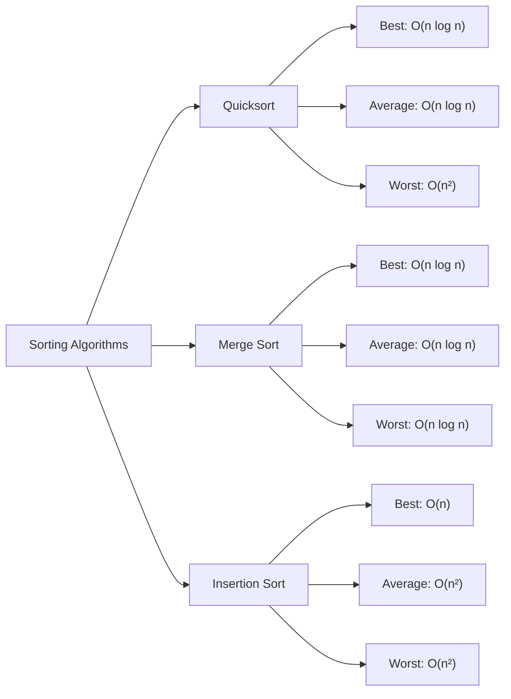

# Average Case Analysis

## Introduction

When analyzing algorithms, we often focus on the worst-case scenario—how an algorithm performs in the most challenging situations. However, the worst-case might be rare in practice, and the best-case might be too optimistic. This is where **Average Case Analysis** becomes crucial.

Average case analysis examines an algorithm's performance across all possible inputs, weighted by the probability of encountering each input. It provides a more realistic expectation of how an algorithm will perform in everyday use.

In this tutorial, we'll explore:
- What average case analysis is and why it matters
- How to calculate average case complexity
- Practical examples and comparisons with best and worst cases
- Real-world applications where average case analysis makes a difference

## Understanding Average Case Analysis

### What Is Average Case Analysis?

Average case analysis involves determining the expected performance of an algorithm across all possible input distributions. Unlike worst-case analysis (which focuses on the maximum time/space required) or best-case analysis (which focuses on the minimum), average case analysis considers the **expected** performance.

Think of it as calculating the "typical" performance you'll encounter in practice.

### The Mathematical Foundation

Average case analysis relies on probability theory. The average-case time complexity is the expected value of the running time across all possible inputs of size n:

```
T_avg(n) = ∑[T(I) × Pr(I)]
```

Where:
- T(I) is the time complexity for input I
- Pr(I) is the probability of encountering input I

### Why Average Case Analysis Matters

1. **Real-world relevance**: Most applications encounter a mix of inputs, not just worst-case scenarios
2. **Algorithm selection**: Some algorithms have terrible worst cases but excellent average cases
3. **Performance guarantees**: Provides more realistic expectations for typical usage patterns
4. **Resource allocation**: Helps in planning hardware and system requirements

## Calculating Average Case Complexity

Let's explore how to calculate average case complexity with some common examples.

### Example 1: Linear Search

Linear search looks for an element in an array by checking each element sequentially until finding a match.

```javascript
function linearSearch(array, target) {
  for (let i = 0; i < array.length; i++) {
    if (array[i] === target) {
      return i; // Element found at index i
    }
  }
  return -1; // Element not found
}
```

**Best case**: O(1) - Target is at the first position
**Worst case**: O(n) - Target is at the last position or not present

**Average case analysis**:
Assuming each position has an equal probability (1/n) of containing the target:

- If the element is present, we'll check on average n/2 elements
- If the element is not present, we'll check all n elements
- If we assume a 50% probability that the element exists, the average case is:
  0.5 × (n/2) + 0.5 × n = 0.75n = O(n)

So the average case complexity is O(n), but with a smaller constant factor than the worst case.

### Example 2: Binary Search

Binary search finds an element in a sorted array by repeatedly dividing the search space in half.

```javascript
function binarySearch(array, target) {
  let left = 0;
  let right = array.length - 1;
  
  while (left <= right) {
    const mid = Math.floor((left + right) / 2);
    
    if (array[mid] === target) {
      return mid; // Element found
    } else if (array[mid] < target) {
      left = mid + 1; // Search in right half
    } else {
      right = mid - 1; // Search in left half
    }
  }
  
  return -1; // Element not found
}
```

**Best case**: O(1) - Target is at the middle position
**Worst case**: O(log n) - Target is found after the maximum number of divisions
**Average case**: O(log n) - On average, we'll need to make log n comparisons

The average case stays O(log n) because regardless of the target element's position, binary search will perform roughly log n divisions of the array.

### Example 3: Quicksort

Quicksort is where average case analysis becomes particularly important.

```javascript
function quicksort(array, low = 0, high = array.length - 1) {
  if (low < high) {
    const pivotIndex = partition(array, low, high);
    quicksort(array, low, pivotIndex - 1);
    quicksort(array, pivotIndex + 1, high);
  }
  return array;
}

function partition(array, low, high) {
  const pivot = array[high];
  let i = low - 1;
  
  for (let j = low; j < high; j++) {
    if (array[j] <= pivot) {
      i++;
      [array[i], array[j]] = [array[j], array[i]]; // Swap
    }
  }
  
  [array[i + 1], array[high]] = [array[high], array[i + 1]]; // Place pivot
  return i + 1;
}
```

**Best case**: O(n log n) - Every partition splits the array in half
**Worst case**: O(n²) - Already sorted array with the last element as pivot
**Average case**: O(n log n) - Over all possible permutations of the input

The average case for quicksort is significantly better than its worst case. That's why quicksort is often preferred over other algorithms like merge sort in practice, despite having a worse worst-case complexity.

## Visualizing the Difference

Let's visualize how different sorting algorithms compare in terms of average, best, and worst cases:



This diagram shows why understanding average case is important: algorithms like quicksort shine in the average case despite having poor worst cases.

## Practical Applications

### Hash Tables

Hash tables are a perfect example of where average case analysis matters tremendously:

```javascript
class HashTable {
  constructor(size = 53) {
    this.keyMap = new Array(size);
  }
  
  _hash(key) {
    let total = 0;
    const PRIME = 31;
    for (let i = 0; i < Math.min(key.length, 100); i++) {
      const char = key[i];
      const value = char.charCodeAt(0) - 96;
      total = (total * PRIME + value) % this.keyMap.length;
    }
    return total;
  }
  
  set(key, value) {
    const index = this._hash(key);
    if (!this.keyMap[index]) {
      this.keyMap[index] = [];
    }
    this.keyMap[index].push([key, value]);
  }
  
  get(key) {
    const index = this._hash(key);
    if (!this.keyMap[index]) return undefined;
    
    for (let pair of this.keyMap[index]) {
      if (pair[0] === key) {
        return pair[1];
      }
    }
    return undefined;
  }
}
```

- **Best case**: O(1) - No collisions
- **Worst case**: O(n) - All keys hash to the same bucket
- **Average case**: O(1) - With a good hash function and load factor

Most operations on hash tables are O(1) on average, which is why they're so widely used despite having a theoretical worst case of O(n).

### Example Use Case: Web Server Performance

Imagine you're building a caching system for a web server. You need to decide between:

1. A hash table-based cache (great average case, poor worst case)
2. A balanced tree-based cache (consistent worst case)

Which should you choose?

```javascript
// Option 1: Hash Table Cache
class HashCache {
  constructor() {
    this.cache = {};
  }
  
  get(key) {
    return this.cache[key] || null;
  }
  
  set(key, value) {
    this.cache[key] = value;
  }
}

// Option 2: BST-based Cache (simplified)
class TreeCache {
  constructor() {
    this.root = null;
  }
  
  // Binary search tree implementation...
  // get() and set() would be O(log n) in worst case
}
```

In this scenario, average case analysis suggests the hash table is better for most web traffic, where consistent sub-millisecond response is more important than avoiding occasional slow responses.

### Real-world Impact: Example Measurements

Let's see a comparison of searching in different data structures with varying input sizes:

| Structure | Input Size | Best Case | Average Case | Worst Case |
|-----------|-----------|-----------|--------------|------------|
| Array (unsorted) | 10,000 | 0.001ms | 2.5ms | 5ms |
| Array (sorted) | 10,000 | 0.001ms | 0.02ms | 0.04ms |
| Hash Table | 10,000 | 0.003ms | 0.004ms | 3ms |
| BST (balanced) | 10,000 | 0.001ms | 0.03ms | 0.05ms |

Notice how the hash table has the best average performance despite having a worse worst case than the balanced BST.

## Probabilistic Analysis Techniques

To perform average case analysis properly, we need to understand probability distributions. Here are some common techniques:

### 1. Uniform Distribution Assumption

The simplest approach is to assume all inputs are equally likely:

```javascript
// Example: Finding the average number of comparisons in insertion sort
function averageComparisons(n) {
  // For each position i in array of size n
  let totalComparisons = 0;
  
  for (let i = 1; i < n; i++) {
    // Element i has to be compared with elements 0 to i-1
    // On average, we'll compare with i/2 elements
    totalComparisons += i / 2;
  }
  
  return totalComparisons; // Approximately n²/4
}
```

### 2. Recurrence Relations

For recursive algorithms, we can use recurrence relations:

```
T(n) = aT(n/b) + f(n)
```

For quicksort with random pivots, the average case recurrence would be:

```
T(n) = T(k) + T(n-k-1) + Θ(n)
```

where k is the random pivot position.

### 3. Randomized Algorithms

Some algorithms deliberately introduce randomness to ensure good average-case behavior regardless of the input:

```javascript
function randomizedQuicksort(array, low = 0, high = array.length - 1) {
  if (low < high) {
    // Choose random pivot
    const randomIndex = Math.floor(Math.random() * (high - low + 1)) + low;
    [array[randomIndex], array[high]] = [array[high], array[randomIndex]];
    
    const pivotIndex = partition(array, low, high);
    randomizedQuicksort(array, low, pivotIndex - 1);
    randomizedQuicksort(array, pivotIndex + 1, high);
  }
  return array;
}
```

This approach transforms the worst-case input into a rare event, making the average case the dominant scenario.

## Common Pitfalls in Average Case Analysis

When performing average case analysis, be aware of these common mistakes:

1. **Ignoring input distribution**: Different applications have different input patterns
2. **Focusing only on asymptotic growth**: Constants matter in real-world performance
3. **Overlooking memory access patterns**: Cache effects can dominate runtime in practice
4. **Not considering modern hardware**: Parallelism can change which algorithm performs best

## Summary

Average case analysis provides a middle ground between optimistic best-case and pessimistic worst-case analyses. It often delivers more realistic expectations for algorithm performance in everyday scenarios.

Key takeaways:
- Average case complexity considers the expected performance over all possible inputs
- It's essential for algorithms like quicksort and hash tables that have excellent average-case but poor worst-case behavior
- Calculating average case involves probability and expected values
- In practice, average case performance often matters more than worst-case guarantees

Understanding when to use average case analysis instead of worst-case analysis is a crucial skill for efficient algorithm design and selection.

## Exercises

1. Calculate the average case complexity of finding the minimum element in an unsorted array.
2. Analyze the average case of the `indexOf` method in JavaScript arrays.
3. Implement a hash table and measure its performance as the load factor increases. How does this match the theoretical average case?
4. Compare quicksort with and without random pivots on sorted arrays. How does randomization affect the average case?
5. Research how the average case of binary search trees changes when the tree becomes unbalanced.

## Additional Resources

- "Introduction to Algorithms" by Cormen, Leiserson, Rivest, and Stein (particularly Chapter 5 on Probabilistic Analysis)
- "Algorithms" by Robert Sedgewick and Kevin Wayne
- "The Art of Computer Programming, Volume 3: Sorting and Searching" by Donald Knuth
- Stanford's CS161 Course: Design and Analysis of Algorithms
- MIT OpenCourseWare 6.046: Design and Analysis of Algorithms

With average case analysis in your toolkit, you'll be better equipped to choose the right algorithms for real-world applications where typical performance matters more than theoretical worst-case guarantees.