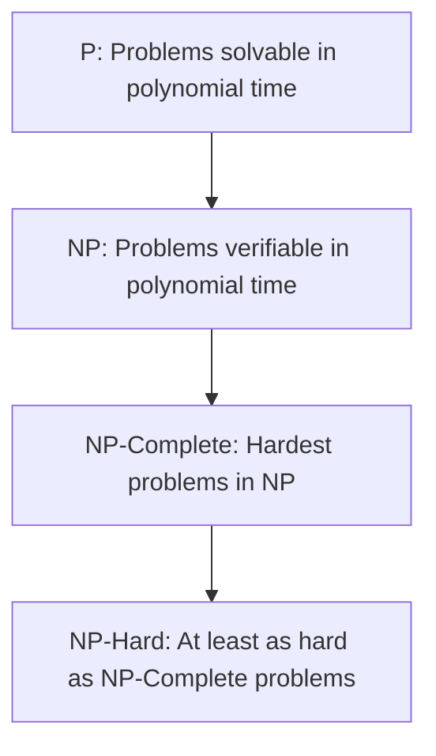

# NP-Completeness

## Introduction

Have you ever wondered why some computational problems seem impossible to solve efficiently, no matter how clever your algorithm is? Why can modern computers instantly sort millions of items, yet struggle to find the optimal solution for a traveling salesperson with just a few dozen cities?

NP-Completeness is a fundamental concept in computer science that helps explain these differences. It provides a framework for classifying computational problems based on their inherent difficulty, regardless of the algorithm used to solve them.

In this tutorial, we'll explore:
- What NP-Completeness means
- The classes P, NP, and NP-Complete
- How to recognize NP-Complete problems
- Practical approaches to dealing with NP-Complete problems

## Computational Complexity Classes

Before diving into NP-Completeness, let's establish some foundational concepts about computational complexity.

### The Class P

**P** (Polynomial Time) consists of problems that can be solved in polynomial time. More formally, a problem is in P if there exists an algorithm that can solve it in O(n^k) time, where n is the input size and k is a constant.

Examples of problems in P:
- Sorting arrays
- Finding shortest paths in a graph
- Determining if a number is prime

```javascript
// Example: Checking if a number is prime (in P)
function isPrime(n) {
  if (n <= 1) return false;
  if (n <= 3) return true;
  
  if (n % 2 === 0 || n % 3 === 0) return false;
  
  for (let i = 5; i * i <= n; i += 6) {
    if (n % i === 0 || n % (i + 2) === 0) return false;
  }
  return true;
}

// Usage
console.log(isPrime(17));  // Output: true
console.log(isPrime(20));  // Output: false
```

### The Class NP

**NP** (Non-deterministic Polynomial Time) consists of problems for which a proposed solution can be verified in polynomial time, even if finding the solution might take longer.

Every problem in P is also in NP (because if you can solve a problem quickly, you can certainly verify a solution quickly), but the big question is whether there are problems in NP that are not in P.

Examples of problems in NP:
- The Boolean satisfiability problem (SAT)
- The traveling salesperson problem
- The subset sum problem

```javascript
// Example: Verifying a solution to the Subset Sum problem (in NP)
function verifySubsetSum(arr, targetSum, subset) {
  // Check if the subset contains only elements from the array
  for (let num of subset) {
    if (!arr.includes(num)) return false;
  }
  
  // Check if the sum equals the target
  const sum = subset.reduce((a, b) => a + b, 0);
  return sum === targetSum;
}

// Usage
const array = [3, 34, 4, 12, 5, 2];
const target = 9;
const proposedSolution = [4, 5]; // 4 + 5 = 9

console.log(verifySubsetSum(array, target, proposedSolution));  // Output: true
```

### NP-Complete Problems

**NP-Complete** problems are the "hardest" problems in NP. A problem is NP-Complete if:
1. It is in NP
2. Every problem in NP can be reduced to it in polynomial time

This definition means that if you could solve any NP-Complete problem efficiently (in polynomial time), you could solve all problems in NP efficiently.

The first problem proven to be NP-Complete was the Boolean satisfiability problem (SAT), through the Cook-Levin theorem.

## Understanding NP-Completeness Through Examples

### The Boolean Satisfiability Problem (SAT)

SAT asks: "Given a Boolean formula, is there an assignment of truth values to variables that makes the entire formula true?"

```javascript
// Simplified SAT solver for demonstration (not efficient)
function satisfiable(formula) {
  // This is a brute force approach to check all possible assignments
  // Formula is represented as an array of clauses, each clause being an array of literals
  // Example: (x1 OR !x2) AND (x2 OR x3) would be [[x1, !x2], [x2, x3]]
  
  const variables = extractVariables(formula);
  const n = variables.length;
  
  // Try all possible truth assignments (2^n possibilities)
  for (let i = 0; i < (1 << n); i++) {
    const assignment = {};
    
    // Create this particular truth assignment
    for (let j = 0; j < n; j++) {
      assignment[variables[j]] = (i & (1 << j)) !== 0;
    }
    
    // Check if this assignment satisfies the formula
    if (evaluateFormula(formula, assignment)) {
      return true;
    }
  }
  
  return false;
}

// Helper functions would be needed to implement this completely
```

### The Traveling Salesperson Problem (TSP)

The TSP asks: "Given a list of cities and the distances between them, what is the shortest possible route that visits each city exactly once and returns to the origin city?"

```javascript
// Brute force approach to the TSP
function bruteForceTSP(distances) {
  const n = distances.length;
  const cities = Array.from({length: n - 1}, (_, i) => i + 1); // Cities 1 to n-1
  const allPermutations = generatePermutations(cities);
  
  let minDistance = Infinity;
  let bestRoute = null;
  
  for (const permutation of allPermutations) {
    // Add starting city (0) at beginning and end
    const route = [0, ...permutation, 0];
    
    // Calculate total distance
    let totalDistance = 0;
    for (let i = 0; i < route.length - 1; i++) {
      totalDistance += distances[route[i]][route[i + 1]];
    }
    
    // Update if this is better
    if (totalDistance < minDistance) {
      minDistance = totalDistance;
      bestRoute = route;
    }
  }
  
  return {route: bestRoute, distance: minDistance};
}

function generatePermutations(arr) {
  if (arr.length <= 1) return [arr];
  
  const result = [];
  for (let i = 0; i < arr.length; i++) {
    const current = arr[i];
    const remaining = [...arr.slice(0, i), ...arr.slice(i + 1)];
    const permutations = generatePermutations(remaining);
    
    for (const perm of permutations) {
      result.push([current, ...perm]);
    }
  }
  
  return result;
}
```

## Visualizing NP-Completeness

Here's a simple diagram showing the relationship between these complexity classes:



## Practical Implications of NP-Completeness

When faced with an NP-Complete problem in practice, we generally have several approaches:

### 1. Use Approximation Algorithms

For many NP-Complete problems, we can design algorithms that find solutions that are guaranteed to be within some factor of the optimal solution.

```javascript
// Example: A 2-approximation algorithm for Vertex Cover
function approximateVertexCover(graph) {
  const cover = new Set();
  const edges = [...graph.edges]; // Assume graph has an edges property
  
  while (edges.length > 0) {
    const [u, v] = edges.pop(); // Take any edge
    
    if (!cover.has(u) && !cover.has(v)) {
      cover.add(u);
      cover.add(v);
    }
  }
  
  return cover;
}
```

### 2. Use Heuristics

Heuristics are practical methods that often work well but don't guarantee optimality.

```javascript
// Example: Nearest Neighbor heuristic for TSP
function nearestNeighborTSP(distances) {
  const n = distances.length;
  const visited = new Set([0]); // Start at city 0
  const tour = [0];
  
  while (visited.size < n) {
    const lastCity = tour[tour.length - 1];
    let nearestCity = -1;
    let minDistance = Infinity;
    
    for (let i = 0; i < n; i++) {
      if (!visited.has(i) && distances[lastCity][i] < minDistance) {
        minDistance = distances[lastCity][i];
        nearestCity = i;
      }
    }
    
    tour.push(nearestCity);
    visited.add(nearestCity);
  }
  
  // Return to starting city
  tour.push(0);
  
  return tour;
}
```

### 3. Parameterized Algorithms

Some NP-Complete problems become tractable if certain parameters are fixed.

```javascript
// Example: Fixed-Parameter Tractable algorithm for Vertex Cover
// where k is the size of the cover we're looking for
function vertexCoverFPT(graph, k) {
  // Base case: if k is 0, we can only have a cover if there are no edges
  if (k === 0) {
    return graph.edges.length === 0 ? [] : null;
  }
  
  // If there are no edges, an empty set is a valid cover
  if (graph.edges.length === 0) {
    return [];
  }
  
  // Pick any edge (u, v)
  const [u, v] = graph.edges[0];
  
  // Either u or v must be in the cover
  // Try including u
  const graphWithoutU = removeVertex(graph, u);
  const coverWithU = vertexCoverFPT(graphWithoutU, k - 1);
  if (coverWithU !== null) {
    return [u, ...coverWithU];
  }
  
  // Try including v
  const graphWithoutV = removeVertex(graph, v);
  const coverWithV = vertexCoverFPT(graphWithoutV, k - 1);
  if (coverWithV !== null) {
    return [v, ...coverWithV];
  }
  
  // No solution of size k exists
  return null;
}
```

## Real-World Applications

NP-Completeness isn't just a theoretical concept; it has significant practical implications:

1. **Cryptography**: Many cryptographic protocols rely on the assumed difficulty of NP-hard problems. For example, the security of RSA encryption depends on the difficulty of integer factorization.

2. **Scheduling**: Optimal scheduling of tasks or resources often involves NP-Complete problems.

3. **Network Design**: Finding the most efficient way to connect network nodes is often an NP-Complete problem.

4. **Logistics**: The traveling salesperson problem directly relates to delivery route optimization.

5. **Genomics**: Many problems in DNA sequence alignment and protein folding are NP-Complete.

## A Practical Example: Sudoku

Sudoku is a popular puzzle that happens to be NP-Complete. Let's explore a simple backtracking algorithm to solve it:

```javascript
function solveSudoku(board) {
  const emptyCell = findEmptyCell(board);
  
  // If no empty cell is found, the puzzle is solved
  if (!emptyCell) return true;
  
  const [row, col] = emptyCell;
  
  // Try digits 1-9
  for (let num = 1; num <= 9; num++) {
    if (isValid(board, row, col, num)) {
      // Place the number
      board[row][col] = num;
      
      // Recursively try to solve the rest of the puzzle
      if (solveSudoku(board)) {
        return true;
      }
      
      // If placing this number doesn't lead to a solution,
      // backtrack and try another number
      board[row][col] = 0;
    }
  }
  
  // No valid solution found with any number at this position
  return false;
}

function findEmptyCell(board) {
  for (let i = 0; i < 9; i++) {
    for (let j = 0; j < 9; j++) {
      if (board[i][j] === 0) {
        return [i, j];
      }
    }
  }
  return null; // No empty cell found
}

function isValid(board, row, col, num) {
  // Check row
  for (let j = 0; j < 9; j++) {
    if (board[row][j] === num) return false;
  }
  
  // Check column
  for (let i = 0; i < 9; i++) {
    if (board[i][col] === num) return false;
  }
  
  // Check 3x3 box
  const boxRow = Math.floor(row / 3) * 3;
  const boxCol = Math.floor(col / 3) * 3;
  
  for (let i = 0; i < 3; i++) {
    for (let j = 0; j < 3; j++) {
      if (board[boxRow + i][boxCol + j] === num) return false;
    }
  }
  
  return true;
}
```

## The P vs NP Problem

The biggest open question in computational complexity theory is whether P = NP. In other words, can every problem whose solution can be quickly verified also be quickly solved?

If P = NP were proven true, it would revolutionize computing, making many currently intractable problems efficiently solvable. However, most computer scientists believe that P ≠ NP.

This question is so important that it's one of the seven Millennium Prize Problems, with a $1 million reward for its solution.

## Summary

NP-Completeness is a fundamental concept in algorithm analysis that helps us understand the inherent complexity of computational problems. Key takeaways include:

1. Problems in P can be solved efficiently (in polynomial time).
2. Problems in NP have solutions that can be verified efficiently.
3. NP-Complete problems are the hardest problems in NP.
4. If any NP-Complete problem can be solved efficiently, then P = NP.
5. When facing NP-Complete problems in practice, we typically use approximation algorithms, heuristics, or exploit problem structure.

Understanding NP-Completeness helps you make informed decisions about algorithm design and recognize when you're facing inherently difficult problems that likely require compromise solutions.

## Exercises

1. Prove that if problem A reduces to problem B, and B is in P, then A is also in P.
2. Implement a genetic algorithm approach for the Traveling Salesperson Problem.
3. Research and write about a real-world application where an NP-Complete problem had to be addressed using approximation algorithms.
4. Implement a simple SAT solver using the DPLL algorithm.
5. For a graph with 8 vertices, how many different Hamiltonian cycles can exist? Write a program to enumerate them all for a complete graph.

## Additional Resources

- **Books**:
  - "Introduction to the Theory of Computation" by Michael Sipser
  - "Computers and Intractability: A Guide to the Theory of NP-Completeness" by Garey and Johnson

- **Online Courses**:
  - Stanford's Algorithms specialization on Coursera
  - MIT OpenCourseWare's "Design and Analysis of Algorithms"

- **Websites**:
  - The Complexity Zoo: A catalog of complexity classes
  - P vs NP and the Computational Complexity Zoo (YouTube)

Understanding NP-Completeness gives you powerful insights into which problems are fundamentally difficult, helping you make better decisions about algorithm design and implementation strategies.