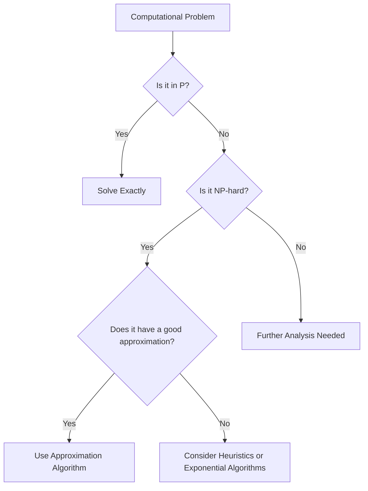

# Approximation Algorithms

## Introduction

When tackling computational problems, we often encounter scenarios where finding the exact optimal solution is computationally infeasible. These problems, typically classified as NP-hard, would require an impractical amount of time to solve exactly as the input size grows.

This is where **approximation algorithms** come to the rescue. Rather than seeking the perfect solution, these algorithms aim to find solutions that are "good enough" within reasonable time constraints.

In this tutorial, we'll explore:
- What approximation algorithms are and why they matter
- Types of approximation guarantees
- Common approximation techniques
- Real-world applications
- Implementation examples

## What Are Approximation Algorithms?

An approximation algorithm is a technique for tackling optimization problems that are computationally difficult (typically NP-hard) by finding solutions that are provably close to the optimal solution, but not necessarily optimal.

### Key Characteristics

- **Efficiency**: Runs in polynomial time
- **Approximation Guarantee**: Provides a bound on how far the solution could be from optimal
- **Practicality**: Trades perfection for feasibility

## Approximation Ratio and Guarantees

The quality of an approximation algorithm is typically measured by its **approximation ratio** (or **approximation factor**), often denoted by ρ.

For a minimization problem:
- If the algorithm guarantees a solution that is at most ρ times the optimal solution, we call it a ρ-approximation algorithm.

For a maximization problem:
- If the algorithm guarantees a solution that is at least 1/ρ of the optimal solution, we call it a ρ-approximation algorithm.

### Types of Approximation Schemes

1. **Constant-factor approximation**: Guarantees a solution within a constant factor of optimal
2. **Polynomial-time approximation scheme (PTAS)**: For any ε > 0, finds a solution within (1+ε) of optimal in polynomial time (though the exponent may depend on 1/ε)
3. **Fully polynomial-time approximation scheme (FPTAS)**: Like PTAS, but the running time is polynomial in both input size and 1/ε

## Common Approximation Techniques

### Greedy Algorithms

Greedy algorithms make locally optimal choices at each step, hoping to reach a globally optimal (or near-optimal) solution.

### Example: Set Cover Problem

The set cover problem asks for the minimum number of sets needed to cover all elements.

```python
def greedy_set_cover(universe, sets):
    """
    Approximation algorithm for the Set Cover problem
    universe: List of all elements
    sets: List of available sets (each set is a list of elements)
    Returns: List of set indices that form an approximate minimum cover
    """
    # Elements that still need to be covered
    elements_to_cover = set(universe)
    # Indices of sets selected for the cover
    selected_sets = []
    
    # Continue until all elements are covered
    while elements_to_cover:
        # Find the set that covers the most uncovered elements
        best_set_idx = -1
        best_coverage = 0
        
        for i, s in enumerate(sets):
            # Skip if this set is already selected
            if i in selected_sets:
                continue
                
            # Count how many uncovered elements this set would cover
            coverage = len(elements_to_cover.intersection(set(s)))
            
            if coverage > best_coverage:
                best_coverage = coverage
                best_set_idx = i
        
        # If we found a useful set, add it to our solution
        if best_set_idx >= 0:
            selected_sets.append(best_set_idx)
            elements_to_cover -= set(sets[best_set_idx])
        else:
            # If no set can cover more elements, we have a problem
            break
    
    return selected_sets
```

**Input:**
```
Universe: [1, 2, 3, 4, 5]
Sets: [[1, 2, 3], [2, 4], [3, 4, 5], [1, 5]]
```

**Output:**
```
Selected sets: [0, 2]  # These correspond to sets [1, 2, 3] and [3, 4, 5]
```

This greedy algorithm achieves a ln(n)-approximation for the set cover problem, where n is the number of elements.

### Linear Programming Relaxation

Many discrete optimization problems can be formulated as integer linear programs (ILPs). By relaxing the integer constraints, we can solve the problem as a standard linear program and then round the solution to get an approximation.

### Example: Vertex Cover Problem

```python
def lp_vertex_cover(graph):
    """
    A simplified representation of using LP relaxation for vertex cover.
    In practice, you would use an actual LP solver like PuLP or CVXPY.
    
    This is pseudocode to illustrate the approach.
    """
    # 1. Formulate the LP relaxation
    # minimize sum(x_v) for all vertices v
    # subject to:
    #   x_u + x_v ≥ 1 for all edges (u,v)
    #   0 ≤ x_v ≤ 1 for all vertices v
    
    # 2. Solve the LP relaxation (pseudocode)
    # lp_solution = solve_lp(lp_formulation)
    
    # 3. Round the fractional solution
    vertex_cover = []
    
    # Include all vertices v where x_v ≥ 0.5
    for vertex, value in lp_solution.items():
        if value >= 0.5:
            vertex_cover.append(vertex)
    
    return vertex_cover
```

The LP relaxation approach for vertex cover gives a 2-approximation algorithm.

### Primal-Dual Method

The primal-dual method uses the relationship between a linear program and its dual to construct approximate solutions.

### Randomized Rounding

This technique involves solving an LP relaxation and then using randomization to convert the fractional solution to an integer solution.

## Real-World Applications

### 1. Vehicle Routing Problems

Delivery companies like UPS and Amazon use approximation algorithms to plan routes for their delivery vehicles. The exact solution would require solving the Traveling Salesperson Problem, which is NP-hard.

```python
def nearest_neighbor_tsp(distances):
    """
    A simple approximation for the Traveling Salesperson Problem.
    distances: 2D array where distances[i][j] is the distance from city i to city j
    Returns: An approximation of the shortest tour visiting all cities
    """
    n = len(distances)
    unvisited = set(range(1, n))  # Start at city 0
    tour = [0]
    
    while unvisited:
        last = tour[-1]
        # Find nearest unvisited city
        nearest = min(unvisited, key=lambda city: distances[last][city])
        tour.append(nearest)
        unvisited.remove(nearest)
    
    # Return to starting city
    tour.append(0)
    return tour
```

### 2. Data Center Resource Allocation

Tech companies use approximation algorithms for bin packing problems when allocating virtual machines to physical servers.

```python
def first_fit_decreasing(items, bin_capacity):
    """
    First Fit Decreasing algorithm for the Bin Packing problem.
    items: List of item sizes
    bin_capacity: Capacity of each bin
    Returns: Number of bins used
    """
    # Sort items in decreasing order
    sorted_items = sorted(items, reverse=True)
    
    # Initialize bins (each bin contains the remaining capacity)
    bins = [bin_capacity]
    
    for item in sorted_items:
        # Try to place the item in the first bin where it fits
        placed = False
        for i in range(len(bins)):
            if bins[i] >= item:
                bins[i] -= item
                placed = True
                break
        
        # If the item doesn't fit in any existing bin, open a new bin
        if not placed:
            bins.append(bin_capacity - item)
    
    return len(bins)
```

### 3. Network Design

Telecommunications companies use approximation algorithms for the Steiner Tree Problem when designing network infrastructures.

## Implementing a Complete Example: Knapsack Problem

The 0/1 Knapsack Problem is a classic optimization problem: given a set of items with values and weights, find which items to include in a knapsack to maximize total value without exceeding the weight capacity.

The exact solution requires dynamic programming and runs in O(nW) time, where n is the number of items and W is the capacity. For large W, this becomes impractical.

Let's implement a simple greedy approximation algorithm:

```python
def greedy_knapsack(values, weights, capacity):
    """
    Greedy approximation for the 0/1 Knapsack problem.
    Takes items in order of value-to-weight ratio.
    
    values: List of item values
    weights: List of item weights
    capacity: Knapsack capacity
    Returns: Total value and list of selected items
    """
    # Calculate value-to-weight ratios
    ratios = [(values[i] / weights[i], i) for i in range(len(values))]
    # Sort by ratio in descending order
    ratios.sort(reverse=True)
    
    total_value = 0
    total_weight = 0
    selected_items = []
    
    for ratio, idx in ratios:
        if total_weight + weights[idx] <= capacity:
            # Take the whole item
            selected_items.append(idx)
            total_value += values[idx]
            total_weight += weights[idx]
    
    return total_value, selected_items

# Example usage
values = [60, 100, 120]
weights = [10, 20, 30]
capacity = 50

total_value, selected_items = greedy_knapsack(values, weights, capacity)
print(f"Total value: {total_value}")
print(f"Selected items: {selected_items}")
print(f"Optimal value (from dynamic programming): 220")
```

**Output:**
```
Total value: 240
Selected items: [0, 1, 2]
Optimal value (from dynamic programming): 220
```

In this example, the greedy approach happens to give an optimal solution, but this is not guaranteed for all instances of the Knapsack problem.

## Performance Analysis and Limitations

While approximation algorithms provide practical solutions to hard problems, it's essential to understand their limitations:

1. **Quality vs. Speed Trade-off**: Better approximations often require more computation time
2. **Problem-Specific**: Not all problems have good approximation algorithms
3. **Inapproximability**: Some problems cannot be approximated within certain factors unless P=NP



## Summary

Approximation algorithms provide a practical approach to solving computationally challenging problems by trading optimality for efficiency. They allow us to find "good enough" solutions within reasonable time constraints.

Key takeaways:
- They provide provable bounds on solution quality
- Common techniques include greedy algorithms, LP relaxation, and randomized methods
- Many real-world optimization problems rely on approximation algorithms
- The field continues to evolve with new techniques and applications

## Further Learning and Exercises

### Exercises

1. Implement a 2-approximation algorithm for the metric traveling salesperson problem using the minimum spanning tree approach.
2. Design and implement an approximation algorithm for the maximum cut problem.
3. Compare the practical performance of the greedy set cover algorithm against an exact algorithm on small instances.

### Resources for Further Learning

1. "Approximation Algorithms" by Vijay V. Vazirani
2. "The Design of Approximation Algorithms" by Williamson and Shmoys
3. Coursera: Approximation Algorithms Part I & II by École normale supérieure

Experiment with these algorithms on real-world problems to develop your intuition for when and how to apply approximation techniques in your programming projects.