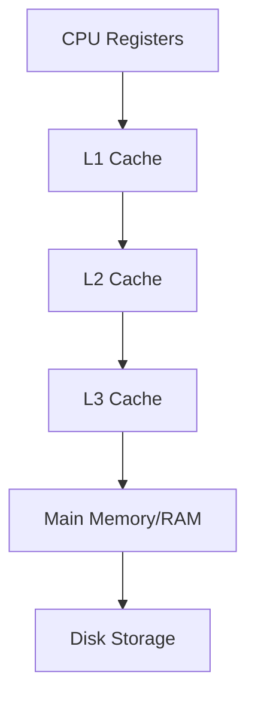

# Cache-Friendly Algorithms

## Introduction

Have you ever wondered why two algorithms with the same Big O complexity can have drastically different runtime performance in practice? The answer often lies in how they interact with the computer's memory hierarchy, particularly the cache.

Cache-friendly algorithms are designed to optimize memory access patterns, making efficient use of the CPU cache to minimize expensive main memory operations. This can lead to significant performance improvements, sometimes by orders of magnitude, even when the algorithmic complexity remains unchanged.

In this tutorial, we'll explore:
- How computer memory hierarchy affects algorithm performance
- Core principles for designing cache-friendly algorithms
- Practical techniques to optimize your code for better cache utilization
- Real-world examples and applications

## Understanding Memory Hierarchy

Before diving into cache-friendly algorithms, let's understand why caches matter in the first place.

### The Memory Hierarchy

Modern computers have a hierarchy of memory:



As we move down this hierarchy:
- Access time increases significantly
- Storage capacity increases
- Cost per byte decreases

Here's a typical comparison of access times:

| Memory Type | Approximate Access Time | Size |
|-------------|-------------------------|------|
| CPU Registers | < 1 ns | Bytes |
| L1 Cache | 1-2 ns | 32-64 KB |
| L2 Cache | 4-7 ns | 256 KB-1 MB |
| L3 Cache | 10-20 ns | 2-32 MB |
| Main Memory (RAM) | 100 ns | 8-32 GB |
| SSD | 25,000-100,000 ns | 500 GB-2 TB |
| HDD | 2-10 million ns | 1-16 TB |

The key insight is that accessing data from cache is **50-200 times faster** than from main memory! This is why cache optimization matters so much for performance.

## Core Principles of Cache-Friendly Algorithms

Let's explore the fundamental principles that make algorithms cache-friendly:

### 1. Spatial Locality

**Principle**: If a memory location is accessed, nearby memory locations are likely to be accessed soon.

Caches don't load individual bytes but rather entire "cache lines" (typically 64 bytes). Taking advantage of spatial locality means arranging your data so that related elements are stored close together.

### 2. Temporal Locality

**Principle**: If a memory location is accessed, it's likely to be accessed again soon.

Once data is in cache, we should try to perform as many operations on it as possible before it gets evicted.

### 3. Minimizing Cache Misses

A cache miss occurs when the CPU needs data that isn't in the cache, forcing it to wait for a slower memory fetch. Cache-friendly algorithms aim to minimize these costly cache misses.

## Common Cache-Friendly Techniques

### Technique 1: Sequential Access Patterns

Accessing memory sequentially (like walking through an array from start to finish) is much more cache-efficient than random access patterns.

#### Example: Array Traversal

```cpp
// Cache-friendly traversal
for (int i = 0; i < n; i++) {
    sum += array[i];
}

// Cache-unfriendly traversal
for (int i = 0; i < n; i += 16) {
    sum += array[i];
}
```

The first loop has excellent spatial locality because it accesses elements sequentially, maximizing the use of each cache line. The second loop skips elements, potentially causing a new cache line to be loaded for each iteration.

### Technique 2: Block Processing

Process data in blocks that fit in the cache rather than making multiple passes over a large dataset.

#### Example: Matrix Multiplication

Here's a naive matrix multiplication implementation:

```cpp
// Cache-unfriendly matrix multiplication
for (int i = 0; i < n; i++) {
    for (int j = 0; j < n; j++) {
        for (int k = 0; k < n; k++) {
            C[i][j] += A[i][k] * B[k][j];
        }
    }
}
```

This algorithm has poor cache performance because it accesses matrix B in a column-wise fashion, which doesn't match how multidimensional arrays are stored in memory (row-major order).

Here's a cache-friendly version using block processing:

```cpp
// Cache-friendly blocked matrix multiplication
int blockSize = 32; // Choose based on cache size
for (int i0 = 0; i0 < n; i0 += blockSize) {
    for (int j0 = 0; j0 < n; j0 += blockSize) {
        for (int k0 = 0; k0 < n; k0 += blockSize) {
            // Process a small block that fits in cache
            for (int i = i0; i < min(i0 + blockSize, n); i++) {
                for (int j = j0; j < min(j0 + blockSize, n); j++) {
                    for (int k = k0; k < min(k0 + blockSize, n); k++) {
                        C[i][j] += A[i][k] * B[k][j];
                    }
                }
            }
        }
    }
}
```

This version processes small blocks at a time, ensuring that the data we're working with fits in the cache.

### Technique 3: Array of Structures vs. Structure of Arrays

How you organize your data can significantly impact cache performance.

#### Example: Particle System

Consider a particle system with position, velocity, and color properties:

```cpp
// Array of Structures (AoS)
struct Particle {
    float x, y, z;       // position
    float vx, vy, vz;    // velocity
    float r, g, b, a;    // color
};

Particle particles[1000];

// Using AoS
for (int i = 0; i < 1000; i++) {
    // Update only positions
    particles[i].x += particles[i].vx;
    particles[i].y += particles[i].vy;
    particles[i].z += particles[i].vz;
}
```

This loads cache lines with velocity and color data we don't need for this operation. A better approach:

```cpp
// Structure of Arrays (SoA)
struct ParticleSystem {
    float x[1000], y[1000], z[1000];       // positions
    float vx[1000], vy[1000], vz[1000];    // velocities
    float r[1000], g[1000], b[1000], a[1000]; // colors
};

ParticleSystem particles;

// Using SoA
for (int i = 0; i < 1000; i++) {
    // Update only positions - better cache utilization
    particles.x[i] += particles.vx[i];
    particles.y[i] += particles.vy[i];
    particles.z[i] += particles.vz[i];
}
```

The SoA approach has better cache efficiency when operating on specific properties across many objects.

## Measuring Cache Performance

It's important to measure, not just guess, how your algorithms perform with respect to cache. Here are some tools to help:

1. **Profilers**: Tools like Valgrind/Cachegrind, Intel VTune, or AMD μProf can provide cache miss statistics.
2. **Hardware Performance Counters**: Modern CPUs have counters that can track cache hits and misses.

### Example: Using Cachegrind

```bash
valgrind --tool=cachegrind ./your_program
```

This will output detailed information about your program's cache behavior:

```
==12345== I   refs:      76,542,932
==12345== I1  misses:       823,401
==12345== LLi misses:         4,851
==12345== I1  miss rate:       1.07%
==12345== LLi miss rate:       0.01%
==12345== 
==12345== D   refs:      32,310,604  (21,654,726 rd   + 10,655,878 wr)
==12345== D1  misses:     1,156,675  (   786,739 rd   +    369,936 wr)
==12345== LLd misses:       255,389  (    52,547 rd   +    202,842 wr)
==12345== D1  miss rate:        3.6% (       3.6%     +        3.5%  )
==12345== LLd miss rate:        0.8% (       0.2%     +        1.9%  )
==12345== 
==12345== LL refs:        1,980,076  ( 1,610,140 rd   +    369,936 wr)
==12345== LL misses:        260,240  (    57,398 rd   +    202,842 wr)
==12345== LL miss rate:         0.2% (       0.1%     +        1.9%  )
```

## Real-World Applications

### Case Study 1: Web Browser JavaScript Engine

JavaScript engines like V8 (Chrome) and SpiderMonkey (Firefox) extensively use cache-friendly algorithms:

- They use linear arrays for objects where possible to improve cache locality
- They implement property access with hidden classes to make property lookups cache-friendly
- They arrange internal data structures to minimize cache misses during garbage collection

### Case Study 2: Database Systems

Database engines optimize query execution for cache efficiency:

- Column-oriented storage formats improve cache utilization for analytical queries
- Index structures like B+Trees are designed with page sizes that match cache line sizes
- Query optimization considers cache effects when deciding execution plans

### Case Study 3: Image Processing Libraries

Libraries like OpenCV optimize image processing algorithms:

```cpp
// Cache-unfriendly image processing (processing by columns)
for (int x = 0; x < width; x++) {
    for (int y = 0; y < height; y++) {
        processPixel(image[y][x]);
    }
}

// Cache-friendly image processing (processing by rows)
for (int y = 0; y < height; y++) {
    for (int x = 0; x < width; x++) {
        processPixel(image[y][x]);
    }
}
```

The second approach is significantly faster due to better cache utilization, as images are typically stored in row-major order.

## Practical Exercise: Optimizing Matrix Transpose

Let's apply our knowledge to optimize a matrix transpose operation:

```cpp
// Naive matrix transpose (potentially cache-unfriendly)
void transposeNaive(int n, float A[n][n], float B[n][n]) {
    for (int i = 0; i < n; i++) {
        for (int j = 0; j < n; j++) {
            B[j][i] = A[i][j];
        }
    }
}
```

This has poor cache performance due to non-sequential writes to B. Let's improve it:

```cpp
// Cache-friendly matrix transpose with blocking
void transposeBlocked(int n, float A[n][n], float B[n][n]) {
    int blockSize = 32;
    
    for (int i0 = 0; i0 < n; i0 += blockSize) {
        for (int j0 = 0; j0 < n; j0 += blockSize) {
            // Process a block that fits in cache
            for (int i = i0; i < min(i0 + blockSize, n); i++) {
                for (int j = j0; j < min(j0 + blockSize, n); j++) {
                    B[j][i] = A[i][j];
                }
            }
        }
    }
}
```

For a 4096×4096 matrix, the blocked version can be 2-4 times faster on typical hardware, despite both versions having the same O(n²) complexity.

## Summary

Cache-friendly algorithms leverage the hierarchical nature of computer memory to achieve better performance. The key principles we've explored include:

1. Maximize spatial locality by accessing memory sequentially
2. Leverage temporal locality by reusing data in cache
3. Process data in blocks that fit in the cache
4. Choose appropriate data structures (SoA vs AoS) based on access patterns
5. Minimize cache misses through careful algorithm design

These optimization techniques often lead to significant performance improvements without changing the algorithm's asymptotic complexity. In real-world applications, cache-friendly optimizations can mean the difference between a responsive and a sluggish user experience.

## Additional Resources

To deepen your understanding of cache-friendly algorithms, consider exploring:

1. **What Every Programmer Should Know About Memory** by Ulrich Drepper
2. **Computer Systems: A Programmer's Perspective** by Randal E. Bryant and David R. O'Hallaron
3. **Performance Analysis and Tuning** courses on platforms like Coursera or Udacity

## Exercises

1. Implement both the naive and blocked matrix multiplication algorithms. Measure and compare their performance for matrices of different sizes.
2. Optimize a binary search algorithm to be more cache-friendly.
3. Implement and compare AoS vs. SoA for a simple particle system simulation.
4. Profile a sorting algorithm of your choice using a tool like Cachegrind, then modify it to improve cache performance.
5. Experiment with different block sizes for the blocked matrix algorithms to find the optimal size for your specific hardware.

By applying these cache-friendly design principles, you can create algorithms that not only have good theoretical complexity but also perform excellently in practice.