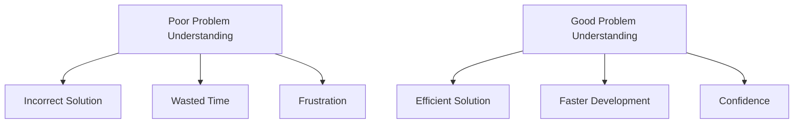

# Problem Understanding

## Introduction

When faced with a programming challenge, your first instinct might be to start coding immediately. However, the most crucial step in solving any problem effectively is understanding it thoroughly. Problem understanding forms the foundation of the entire problem-solving process and significantly impacts the quality of your solution.

In this guide, we'll explore what problem understanding entails, why it's important, and how to develop this critical skill as a beginner programmer.

## What is Problem Understanding?

Problem understanding involves comprehending:
- What the problem is asking for
- The inputs and expected outputs
- The constraints and edge cases
- Any assumptions or implicit requirements

Think of it as becoming a detective - gathering all the clues before attempting to solve the mystery.

## Why is Problem Understanding Important?



Without proper problem understanding:
- You might solve the wrong problem
- Your solution may handle only a subset of cases
- You'll likely need to rewrite your code multiple times
- You'll experience unnecessary frustration

## The Problem Understanding Process

### 1. Initial Reading

First, read the problem statement carefully from start to finish. Don't rush or skim through it.

Let's consider an example problem:

> Write a function that takes a list of integers and returns the sum of all even numbers in the list.

Instead of jumping to code, let's understand this problem step by step.

### 2. Identify Key Components

Break down the problem into its essential elements:

- **Input**: A list of integers
- **Output**: A single integer (the sum)
- **Process**: Filter for even numbers, then add them
- **Constraints**: Not specified, but should handle empty lists and lists with no even numbers

### 3. Clarify Ambiguities

Ask questions to resolve ambiguities:
- Should zero be treated as even? (Mathematically, yes)
- How should we handle an empty list? (Return 0 as there are no even numbers to sum)
- What about handling very large numbers or lists? (Depends on context)

### 4. Create Examples

Creating your own test cases helps deepen understanding:

```
// Example 1
Input: [1, 2, 3, 4, 5]
Expected output: 2 + 4 = 6 (only 2 and 4 are even)

// Example 2
Input: [1, 3, 5, 7]
Expected output: 0 (no even numbers)

// Example 3
Input: []
Expected output: 0 (empty list)
```

### 5. Consider Edge Cases

Edge cases are special situations that might cause problems:
- Empty lists
- Lists with all even or all odd numbers
- Lists with negative numbers (are they still even/odd?)
- Very large lists or numbers

## Practical Examples

Let's apply our problem understanding process to more complex problems:

### Example 1: FizzBuzz

**Problem Statement:**
> Write a program that prints numbers from 1 to 100. But for multiples of 3, print "Fizz" instead of the number, and for multiples of 5, print "Buzz". For numbers that are multiples of both 3 and 5, print "FizzBuzz".

**Understanding the Problem:**

1. **Key Components**:
- Input: Implicitly the numbers 1 to 100
- Output: A sequence of numbers and strings
- Process: Apply conditional logic based on divisibility
- Constraints: Range is 1 to 100

2. **Example Cases**:
```
1 → "1"
2 → "2"
3 → "Fizz"
4 → "4"
5 → "Buzz"
15 → "FizzBuzz"
   ```

3. **Potential Ambiguities**:
- Should we return a list or print one by one? (Print)
- Is the order important? (Yes, sequential from 1 to 100)

**After understanding, we can implement:**

```javascript
function fizzBuzz() {
  for (let i = 1; i <= 100; i++) {
    if (i % 3 === 0 && i % 5 === 0) {
      console.log("FizzBuzz");
    } else if (i % 3 === 0) {
      console.log("Fizz");
    } else if (i % 5 === 0) {
      console.log("Buzz");
    } else {
      console.log(i);
    }
  }
}

// Output (first 15 numbers):
// 1
// 2
// Fizz
// 4
// Buzz
// Fizz
// 7
// 8
// Fizz
// Buzz
// 11
// Fizz
// 13
// 14
// FizzBuzz
```

### Example 2: Valid Palindrome

**Problem Statement:**
> Determine if a given string is a valid palindrome, considering only alphanumeric characters and ignoring cases. A palindrome reads the same forward and backward.

**Understanding the Problem:**

1. **Key Components**:
- Input: A string
- Output: Boolean (true/false)
- Process: Check if the string reads the same forward and backward
- Constraints: Only consider alphanumeric characters, ignore case

2. **Example Cases**:
```
"A man, a plan, a canal: Panama" → true
"race a car" → false
" " → true (empty string is considered a palindrome)
   ```

3. **Potential Ambiguities**:
- How to handle spaces and punctuation? (Ignore them)
- What about empty strings? (Considered palindromes)
- Case sensitivity? (Ignore)

4. **Edge Cases**:
- Empty string
- String with only non-alphanumeric characters
- Single character string

**After understanding, we can implement:**

```javascript
function isPalindrome(s) {
  // Remove non-alphanumeric characters and convert to lowercase
  const cleanString = s.toLowerCase().replace(/[^a-z0-9]/g, '');
  
  // Check if the clean string is palindrome
  let left = 0;
  let right = cleanString.length - 1;
  
  while (left < right) {
    if (cleanString[left] !== cleanString[right]) {
      return false;
    }
    left++;
    right--;
  }
  
  return true;
}

console.log(isPalindrome("A man, a plan, a canal: Panama")); // Output: true
console.log(isPalindrome("race a car")); // Output: false
console.log(isPalindrome(" ")); // Output: true
```

## Common Mistakes in Problem Understanding

1. **Rushing to code**: Taking time to understand saves more time than fixing errors later
2. **Ignoring constraints**: Not paying attention to limits like time/space complexity
3. **Missing edge cases**: Not considering special scenarios
4. **Assuming too much**: Making unwarranted assumptions
5. **Not testing your understanding**: Not creating examples to verify understanding

## Techniques to Improve Problem Understanding

1. **Restate the problem** in your own words
2. **Draw diagrams** to visualize the problem
3. **Create example inputs and outputs**
4. **Ask clarifying questions** (to yourself or others)
5. **Break down complex problems** into smaller subproblems

## Real-world Application

Understanding problems thoroughly is not just an academic exercise—it's critical in real-world software development:

- **Requirements gathering**: Understanding client needs before building features
- **Bug fixing**: Thoroughly understanding the issue before attempting a fix
- **Code reviews**: Ensuring solutions actually solve the intended problems
- **Technical design**: Developing solutions that address all aspects of a problem

## Exercises to Practice Problem Understanding

1. **Problem decomposition**: Take a complex problem and break it down into subproblems
2. **Edge case identification**: For given problems, list all possible edge cases
3. **Assumption listing**: For ambiguous problems, list all assumptions you need to make
4. **Test case creation**: Write test cases that would verify a solution works correctly

## Summary

Problem understanding is the foundation of effective problem-solving. By taking time to thoroughly analyze problems before coding, you'll develop more accurate, efficient, and robust solutions. The techniques covered in this guide—identifying key components, clarifying ambiguities, creating examples, and considering edge cases—will help you build a strong problem-solving mindset.

Remember: the time spent understanding a problem is never wasted. It's an investment that pays dividends throughout the development process.

## Additional Resources

- Practice platforms like LeetCode and HackerRank provide problems with varying complexities
- "How to Solve It" by George Pólya (classic book on problem-solving)
- "Think Like a Programmer" by V. Anton Spraul (explores problem-solving mindset)
- Join coding communities where you can discuss problem interpretations

By mastering problem understanding, you'll not only become a better programmer but also develop critical thinking skills valuable in all aspects of life.