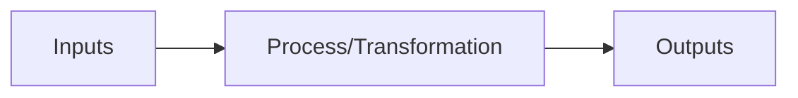

# Input Output Analysis

## Introduction

Input-Output Analysis is a fundamental problem-solving methodology in programming that involves understanding the relationship between a program's inputs and its expected outputs. This approach helps programmers dissect complex problems into manageable components by focusing on the transformation of data.

When faced with a programming challenge, one of the first steps should be to clearly identify:

1. What information is provided to the program (inputs)
2. What result the program needs to produce (outputs)
3. How to transform the inputs into the required outputs (processing)

This methodology is particularly valuable for beginners as it provides a structured approach to problem-solving regardless of the programming language being used.

## Understanding Input-Output Analysis

### What is Input-Output Analysis?

Input-Output Analysis is a systematic approach to understanding and solving programming problems by focusing on:



- **Input**: The data provided to your program (e.g., user entries, file contents, sensor data)
- **Process**: The transformation or calculations your program performs
- **Output**: The result your program produces (e.g., screen display, file creation, data transmission)

### Why is Input-Output Analysis Important?

- **Clarifies requirements**: Helps understand what the program needs to accomplish
- **Guides implementation**: Provides a roadmap for coding
- **Facilitates testing**: Creates clear expectations for verification
- **Improves communication**: Makes it easier to discuss solutions with others

## Step-by-Step Input-Output Analysis Process

### 1. Identify and Understand the Inputs

Ask yourself:
- What data is provided to the program?
- What is the format of the input?
- Are there any constraints or limitations?
- How will the input be received? (keyboard, file, network, etc.)

### 2. Define the Expected Outputs

Ask yourself:
- What should the program produce?
- In what format should the output be?
- Where should the output be delivered? (screen, file, etc.)
- Are there any formatting requirements?

### 3. Determine the Transformation Process

Ask yourself:
- What steps are needed to convert the input to the output?
- What algorithms or calculations are required?
- Are there any edge cases to consider?

### 4. Verify with Examples

Test your understanding by tracing through examples:
- Start with simple cases
- Try edge cases (empty inputs, maximum values, etc.)
- Verify that your process produces the expected output

## Code Examples

Let's look at some examples of Input-Output Analysis in practice:

### Example 1: Temperature Converter

**Problem**: Write a program that converts temperatures from Celsius to Fahrenheit.

**Input-Output Analysis**:
- **Input**: Temperature in Celsius (a floating-point number)
- **Output**: Temperature in Fahrenheit (a floating-point number)
- **Process**: Apply the formula F = C × 9/5 + 32

```python
# Input
celsius = float(input("Enter temperature in Celsius: "))

# Process
fahrenheit = (celsius * 9/5) + 32

# Output
print(f"{celsius}°C is equal to {fahrenheit:.2f}°F")
```

**Example Run**:
```
Enter temperature in Celsius: 25
25°C is equal to 77.00°F
```

### Example 2: Word Counter

**Problem**: Create a program that counts the number of words in a text.

**Input-Output Analysis**:
- **Input**: A string of text
- **Output**: The number of words in the text
- **Process**: Split the text by spaces and count the resulting elements

```python
# Input
text = input("Enter some text: ")

# Process
words = text.split()
word_count = len(words)

# Output
print(f"Your text contains {word_count} words.")
```

**Example Run**:
```
Enter some text: Hello world! This is a test.
Your text contains 6 words.
```

### Example 3: Shopping Cart Total

**Problem**: Calculate the total price of items in a shopping cart, including tax.

**Input-Output Analysis**:
- **Input**: List of item prices and tax rate
- **Output**: Total price including tax
- **Process**: Sum all prices and add the tax amount

```javascript
// Input
const itemPrices = [12.99, 8.50, 5.75, 15.00];
const taxRate = 0.08; // 8% tax

// Process
const subtotal = itemPrices.reduce((sum, price) => sum + price, 0);
const taxAmount = subtotal * taxRate;
const total = subtotal + taxAmount;

// Output
console.log(`Subtotal: $${subtotal.toFixed(2)}`);
console.log(`Tax (8%): $${taxAmount.toFixed(2)}`);
console.log(`Total: $${total.toFixed(2)}`);
```

**Example Output**:
```
Subtotal: $42.24
Tax (8%): $3.38
Total: $45.62
```

## Real-World Applications

### Web Form Processing

When building a web form, Input-Output Analysis helps determine:
- What fields to include (inputs)
- How to validate the data (process)
- What confirmation to show the user (output)

```javascript
function processRegistrationForm() {
  // Inputs
  const username = document.getElementById('username').value;
  const email = document.getElementById('email').value;
  const password = document.getElementById('password').value;
  
  // Process (validation)
  if (username.length < 3) {
    return showError('Username must be at least 3 characters');
  }
  
  if (!email.includes('@')) {
    return showError('Please enter a valid email address');
  }
  
  if (password.length < 8) {
    return showError('Password must be at least 8 characters');
  }
  
  // Output (success message)
  showSuccess(`Welcome, ${username}! Your account has been created.`);
}
```

### Data Analysis Script

For a data analysis program that processes sales data:
- **Input**: CSV file containing sales records
- **Process**: Group by region, calculate totals and averages
- **Output**: Summary report with charts

```python
import pandas as pd
import matplotlib.pyplot as plt

# Input
sales_data = pd.read_csv('sales_records.csv')

# Process
regional_sales = sales_data.groupby('Region')['Total'].sum()
top_products = sales_data.groupby('Product')['Quantity'].sum().nlargest(5)

# Output
print("Sales by Region:")
print(regional_sales)
print("\nTop 5 Products by Quantity Sold:")
print(top_products)

# Create visualization
regional_sales.plot(kind='bar')
plt.title('Total Sales by Region')
plt.savefig('regional_sales_chart.png')
```

## Common Challenges and Solutions

### Unclear Requirements

**Challenge**: The problem statement doesn't clearly specify inputs or expected outputs.

**Solution**: 
- Ask clarifying questions
- Create your own examples and verify them
- Make reasonable assumptions and document them

### Complex Transformations

**Challenge**: The process to convert inputs to outputs is complex.

**Solution**:
- Break down the transformation into smaller steps
- Use intermediate variables to store partial results
- Draw diagrams to visualize the process

### Edge Cases

**Challenge**: Certain inputs produce unexpected results.

**Solution**:
- Identify potential edge cases (empty inputs, extreme values, invalid formats)
- Add error handling and validation
- Test with a wide variety of inputs

## Best Practices

1. **Document your analysis**: Write down the inputs, outputs, and process before coding
2. **Start with examples**: Work through sample inputs and outputs manually
3. **Use descriptive variable names**: Name variables based on what they represent
4. **Separate input, processing, and output**: Keep these parts of your code distinct
5. **Test incrementally**: Verify each part of your solution works as expected

## Applying Input-Output Analysis to Programming Exercises

Let's apply the methodology to a typical programming exercise:

**Problem**: Write a function that takes a list of numbers and returns the second largest number.

**Input-Output Analysis**:

- **Input**: A list of numbers (could be integers or floats)
- **Output**: The second largest number in the list
- **Process**:
  1. Sort the list in descending order
  2. Return the second element

```python
def find_second_largest(numbers):
    # Input validation
    if len(numbers) < 2:
        return "List needs at least two numbers"
    
    # Process
    unique_numbers = list(set(numbers))  # Remove duplicates
    unique_numbers.sort(reverse=True)    # Sort in descending order
    
    # Output
    return unique_numbers[1]  # Return second element

# Example usage
number_list = [5, 9, 3, 7, 9, 8, 1, 5]
result = find_second_largest(number_list)
print(f"The second largest number is: {result}")
```

**Output**:
```
The second largest number is: 8
```

## Summary

Input-Output Analysis is a powerful problem-solving methodology that helps programmers:

1. Break down complex problems into manageable components
2. Focus on the transformation from inputs to outputs
3. Create clear paths for implementation
4. Facilitate testing and verification

By systematically analyzing what information you start with (inputs) and what you need to produce (outputs), you can more effectively design the algorithms and code needed to solve programming challenges.

This structured approach is particularly valuable for beginners as it provides a framework for tackling problems regardless of their complexity or the programming language being used.

## Exercises

1. **Exercise 1**: Create an Input-Output Analysis for a program that calculates the area and perimeter of a rectangle.
2. **Exercise 2**: Apply Input-Output Analysis to design a program that checks if a word is a palindrome.
3. **Exercise 3**: Use Input-Output Analysis to outline a program that converts a decimal number to binary.
4. **Exercise 4**: Design a function using Input-Output Analysis that takes a string and returns the count of vowels and consonants.
5. **Exercise 5**: Apply the Input-Output Analysis methodology to create a simple calculator program that performs basic arithmetic operations.

## Additional Resources

- "How to Solve It" by George Pólya - A classic book on problem-solving
- "Think Like a Programmer: An Introduction to Creative Problem Solving" by V. Anton Spraul
- Interactive online coding platforms like LeetCode and HackerRank for practicing problem-solving

By mastering Input-Output Analysis, you'll develop a methodical approach to programming that will serve you well throughout your coding journey.