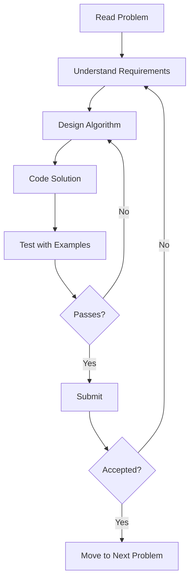

# Competitive Programming Tips

## Introduction

Competitive programming is a mind sport that involves solving well-defined algorithmic problems within time constraints. It's like a mental marathon that tests your ability to think logically, code efficiently, and solve problems under pressure. Whether you aim to participate in contests like Google Code Jam, Codeforces, or simply want to improve your technical interviews performance, mastering competitive programming skills can significantly boost your programming proficiency.

This guide will walk you through essential tips, strategies, and methodologies to approach competitive programming challenges effectively. As beginners, understanding these fundamentals will help you establish a solid foundation for your competitive programming journey.

## Understanding Competitive Programming Contests

Competitive programming contests typically follow a similar format:

1. You're given a set of problems to solve in a limited timeframe
2. Each problem has constraints on input size and execution time
3. Solutions are judged for correctness and efficiency
4. Points may be awarded based on difficulty and time of submission



## Essential Preparation Steps

### 1. Master the Basics

Before diving into complex algorithms, ensure you're comfortable with:

- **Core Programming Language**: Choose one language (C++, Java, or Python are popular choices) and master its syntax and standard libraries.
- **Input/Output Handling**: Learn efficient ways to read inputs and format outputs.

```cpp
// Fast I/O for C++
#include <bits/stdc++.h>
using namespace std;

int main() {
    ios_base::sync_with_stdio(false);
    cin.tie(NULL);
    
    int n;
    cin >> n;
    vector<int> arr(n);
    
    for(int i = 0; i < n; i++) {
        cin >> arr[i];
    }
    
    // Process the array
    
    return 0;
}
```

### 2. Build Your Algorithm Toolkit

Familiarize yourself with common algorithms and data structures:

- Sorting and searching algorithms
- Graph algorithms (BFS, DFS, Dijkstra's, etc.)
- Dynamic programming
- Greedy algorithms
- String manipulation algorithms

Don't just memorize them—understand how and when to apply them.

### 3. Practice Systematically

Start with easier problems and gradually increase difficulty:

- **Beginner**: HackerRank's algorithm section, CSES Problem Set
- **Intermediate**: LeetCode, Codeforces Div 2
- **Advanced**: TopCoder, Codeforces Div 1

## Problem-Solving Methodology

### 1. Understand the Problem Thoroughly

Take time to read and understand the problem statement completely:

- What are the inputs and their constraints?
- What is the expected output?
- Are there any special conditions or edge cases?
- What's the time and memory limit?

### 2. Work Through Examples

Manually solve the provided examples to ensure you understand the problem correctly:

```
Problem: Find the sum of two numbers
Input: 3 4
Expected Output: 7

Your thought process:
- Need to read two numbers (3 and 4)
- Calculate their sum (3 + 4 = 7)
- Output the result (7)
```

### 3. Design Before Coding

Sketch your solution before jumping into code:

- Identify the appropriate algorithm or data structure
- Consider the time and space complexity
- Think about edge cases

### 4. Implementation Tips

#### Start Simple

Begin with a naive solution that works for the given examples, then optimize if needed:

```python
def is_prime_naive(n):
    """Check if a number is prime (naive approach)"""
    if n <= 1:
        return False
    for i in range(2, n):
        if n % i == 0:
            return False
    return True

# More efficient solution
def is_prime_optimized(n):
    """Check if a number is prime (optimized approach)"""
    if n <= 1:
        return False
    if n <= 3:
        return True
    if n % 2 == 0 or n % 3 == 0:
        return False
    i = 5
    while i * i <= n:
        if n % i == 0 or n % (i + 2) == 0:
            return False
        i += 6
    return True
```

#### Use Meaningful Variable Names

Even in contests, clear variable names help you avoid confusion:

```java
// Poor naming
int a = sc.nextInt();
int b = sc.nextInt();
int c = 0;
for (int i = 0; i < a; i++) {
    c += b;
}

// Better naming
int numIterations = sc.nextInt();
int valueToAdd = sc.nextInt();
int sum = 0;
for (int i = 0; i < numIterations; i++) {
    sum += valueToAdd;
}
```

#### Write Modular Code

Break down complex problems into smaller, manageable functions:

```cpp
bool canReach(vector<vector<int>>& grid, int startX, int startY, int targetX, int targetY) {
    // BFS implementation to check if target is reachable from start
}

int shortestPath(vector<vector<int>>& grid, int startX, int startY, int targetX, int targetY) {
    // Find shortest path using BFS or Dijkstra's algorithm
}

int main() {
    // Read input
    vector<vector<int>> grid = readGrid();
    int startX, startY, targetX, targetY;
    cin >> startX >> startY >> targetX >> targetY;
    
    if (!canReach(grid, startX, startY, targetX, targetY)) {
        cout << "Cannot reach the target" << endl;
        return 0;
    }
    
    int result = shortestPath(grid, startX, startY, targetX, targetY);
    cout << "Shortest path length: " << result << endl;
    return 0;
}
```

### 5. Debugging Strategies

#### Test with Simple Cases First

Always test your solution with simple examples before submitting:

- The examples provided in the problem
- Edge cases (empty input, single element, maximum constraints)
- Random test cases

#### Use Print Debugging

When online judges don't provide detailed feedback, use print statements to inspect your solution's behavior:

```python
def solve(arr, n):
    print(f"Debug: Input array: {arr}, length: {n}")
    result = 0
    for i in range(n):
        print(f"Processing element {i}: {arr[i]}")
        result += arr[i]
        print(f"Current result: {result}")
    return result
```

Remember to remove debugging statements before final submission!

## Time and Space Complexity Considerations

### Understanding Constraints

Analyze the constraints to determine the required algorithm complexity:

- n ≤ 10: O(n!), O(2^n) algorithms might work
- n ≤ 100: O(n^3) algorithms might work
- n ≤ 1,000: O(n^2) algorithms might work
- n ≤ 100,000: O(n log n) algorithms might work
- n ≤ 1,000,000: O(n) algorithms might work
- n > 1,000,000: O(log n), O(1) algorithms might be required

### Memory Management

Be conscious of memory usage, especially when working with large arrays or recursion:

```cpp
// Inefficient memory usage
vector<vector<int>> createMatrix(int n) {
    vector<vector<int>> matrix(n, vector<int>(n, 0));
    return matrix;
}

// More efficient for large matrices in some contexts
const int MAXN = 1005;
int matrix[MAXN][MAXN];

void initializeMatrix(int n) {
    for (int i = 0; i < n; i++) {
        for (int j = 0; j < n; j++) {
            matrix[i][j] = 0;
        }
    }
}
```

## Real-World Examples

Let's solve some practical problems step by step:

### Example 1: Two Sum Problem

**Problem**: Given an array of integers and a target value, find the indices of two numbers that add up to the target.

**Input**:
```
Array: [2, 7, 11, 15]
Target: 9
```

**Expected Output**:
```
[0, 1] (because 2 + 7 = 9)
```

**Naive Approach**:

```python
def two_sum_naive(nums, target):
    n = len(nums)
    for i in range(n):
        for j in range(i + 1, n):
            if nums[i] + nums[j] == target:
                return [i, j]
    return []  # No solution found

# Time Complexity: O(n²)
# Space Complexity: O(1)
```

**Optimized Approach**:

```python
def two_sum_optimized(nums, target):
    num_map = {}  # value -> index
    for i, num in enumerate(nums):
        complement = target - num
        if complement in num_map:
            return [num_map[complement], i]
        num_map[num] = i
    return []  # No solution found

# Time Complexity: O(n)
# Space Complexity: O(n)
```

### Example 2: Binary Search Implementation

**Problem**: Implement binary search to find a target element in a sorted array.

**Input**:
```
Array: [1, 3, 5, 7, 9, 11, 13]
Target: 7
```

**Expected Output**:
```
3 (the index of target element 7)
```

**Implementation**:

```cpp
int binarySearch(vector<int>& nums, int target) {
    int left = 0;
    int right = nums.size() - 1;
    
    while (left <= right) {
        int mid = left + (right - left) / 2;  // Avoid integer overflow
        
        if (nums[mid] == target) {
            return mid;  // Found target
        } else if (nums[mid] < target) {
            left = mid + 1;  // Target is in the right half
        } else {
            right = mid - 1;  // Target is in the left half
        }
    }
    
    return -1;  // Target not found
}

// Time Complexity: O(log n)
// Space Complexity: O(1)
```

### Example 3: Finding Connected Components in a Graph

**Problem**: Count the number of connected components in an undirected graph.

**Input**:
```
Nodes: 5 (labeled 0 to 4)
Edges: [(0,1), (1,2), (3,4)]
```

**Expected Output**:
```
2 (Two connected components: [0,1,2] and [3,4])
```

**Implementation**:

```java
public int countComponents(int n, int[][] edges) {
    // Build adjacency list
    List<List<Integer>> adj = new ArrayList<>(n);
    for (int i = 0; i < n; i++) {
        adj.add(new ArrayList<>());
    }
    
    for (int[] edge : edges) {
        adj.get(edge[0]).add(edge[1]);
        adj.get(edge[1]).add(edge[0]);
    }
    
    boolean[] visited = new boolean[n];
    int count = 0;
    
    for (int i = 0; i < n; i++) {
        if (!visited[i]) {
            dfs(adj, visited, i);
            count++;
        }
    }
    
    return count;
}

private void dfs(List<List<Integer>> adj, boolean[] visited, int node) {
    visited[node] = true;
    for (int neighbor : adj.get(node)) {
        if (!visited[neighbor]) {
            dfs(adj, visited, neighbor);
        }
    }
}

// Time Complexity: O(V + E) where V is number of vertices and E is number of edges
// Space Complexity: O(V + E) for the adjacency list and visited array
```

## Contest Strategies

### Time Management

1. **Scan all problems first**: Spend 5-10 minutes reading all problems and assess their difficulty.
2. **Start with easier problems**: Build confidence and score points quickly.
3. **Know when to move on**: If you're stuck for more than 20-30 minutes, consider moving to another problem.
4. **Leave time for review**: Save the last 10-15% of the contest time for reviewing and testing.

### Handling Stress

1. **Practice regularly**: Familiarity reduces anxiety.
2. **Focus on what you know**: Start with problems that use techniques you're confident in.
3. **Don't panic after wrong submissions**: Analyze the error calmly and methodically.
4. **Remember it's a learning process**: Each contest helps you improve, regardless of the outcome.

## Common Pitfalls to Avoid

1. **Misinterpreting the problem**: Always double-check your understanding.
2. **Ignoring edge cases**: Test with minimum/maximum values and special cases.
3. **Overcomplicating solutions**: Start with the simplest approach that works.
4. **Neglecting time complexity**: Consider input constraints before implementation.
5. **Not testing thoroughly**: Write test cases that cover various scenarios.

## Summary

Competitive programming is a journey that requires dedication, practice, and a structured approach. By following these tips:

1. **Understand the problem thoroughly** before attempting to solve it
2. **Build a solid foundation** with essential algorithms and data structures
3. **Practice systematically** with increasing difficulty
4. **Analyze the constraints** to determine appropriate algorithms
5. **Test thoroughly** with various examples and edge cases
6. **Learn from each contest** by reviewing solutions afterward

Remember, becoming proficient in competitive programming is a marathon, not a sprint. Consistent practice and learning from each challenge will steadily improve your skills over time.

## Additional Resources

### Online Platforms
- [Codeforces](https://codeforces.com/)
- [LeetCode](https://leetcode.com/)
- [HackerRank](https://www.hackerrank.com/)
- [AtCoder](https://atcoder.jp/)
- [CSES Problem Set](https://cses.fi/problemset/)

### Books
- "Competitive Programming" by Steven Halim and Felix Halim
- "Introduction to Algorithms" by Cormen, Leiserson, Rivest, and Stein
- "Algorithms" by Robert Sedgewick and Kevin Wayne

### Practice Exercises

1. Solve the "Two Sum" problem in linear time and constant space (if possible).
2. Implement a solution for finding the longest increasing subsequence in an array.
3. Write an algorithm to detect cycles in a directed graph.
4. Implement a solution for the "Maximum Subarray Sum" problem.
5. Solve the "Number of Islands" problem using BFS or DFS.

Keep practicing, stay persistent, and most importantly, enjoy the problem-solving process!