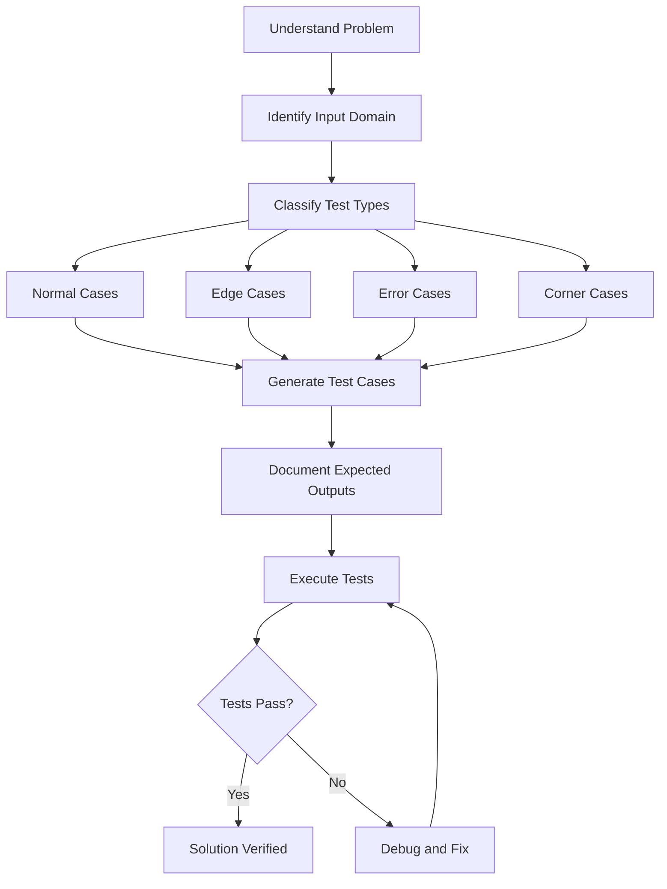

# Test Case Generation

## Introduction

When solving programming problems, writing the code is only part of the challenge. Just as important is ensuring that your solution works correctly for all possible inputs. This is where **test case generation** comes in. Test cases are specific inputs designed to verify that your program behaves as expected under various conditions.

Good test cases help you:

- Find bugs before submitting your code
- Understand the problem requirements better
- Verify your solution's correctness
- Identify edge cases and special scenarios
- Improve the robustness of your solution

In this guide, we'll explore how to create effective test cases to validate your program's behavior.

## Why Test Cases Matter

Imagine you've just written a function to calculate the factorial of a number. You test it with `factorial(5)` and get `120`. Seems correct! But did you check what happens with `factorial(0)`? Or with negative numbers? Or with very large inputs?

Without comprehensive testing, you might miss critical issues in your code that only appear under specific circumstances.

## Types of Test Cases

### 1. Normal Cases

These test the expected, everyday inputs to your program.

**Example**: For a function that finds the maximum value in an array, a normal case might be:

```
Input: [3, 7, 2, 9, 5]
Expected Output: 9
```

### 2. Edge Cases

These test the boundaries of your input domain, such as:

- Minimum/maximum possible values
- Empty inputs
- Single-element inputs
- First/last elements in a collection

**Example**: For the maximum value function:

```
Input: [] // Empty array
Expected Output: Error or null or undefined (depending on your specification)

Input: [42] // Single element array
Expected Output: 42
```

### 3. Corner Cases

These combine multiple edge cases and often reveal subtle bugs.

**Example**: For a function to find the shortest path in a graph:

```
Input: Graph with a single node
Expected Output: 0

Input: Graph where start and end nodes are the same
Expected Output: 0
```

### 4. Error Cases

These verify that your program handles invalid or unexpected inputs gracefully.

**Example**: For a square root function:

```
Input: -1
Expected Output: Error message or appropriate behavior (not a crash)
```

## How to Generate Effective Test Cases

### Step 1: Understand the Problem Requirements

Before creating test cases, ensure you fully understand:

- Input and output specifications
- Valid input ranges
- Expected behavior for edge cases
- Error handling requirements

### Step 2: Apply Systematic Approaches

#### Equivalence Partitioning

Divide the input domain into classes where program behavior should be similar, then test one value from each class.

**Example**: For a function that classifies a person's age group:

```
Input ranges:
- Negative ages (invalid)
- 0-12 (child)
- 13-19 (teenager)
- 20-64 (adult)
- 65+ (senior)

Test cases:
- -5 (invalid)
- 7 (child)
- 16 (teenager)
- 42 (adult)
- 75 (senior)
```

#### Boundary Value Analysis

Test values at the boundaries of input ranges, where errors often occur.

**Example**: For the age classification function:

```
Test cases:
- 0 (boundary: child)
- 12 (boundary: child)
- 13 (boundary: teenager)
- 19 (boundary: teenager)
- 20 (boundary: adult)
- 64 (boundary: adult)
- 65 (boundary: senior)
```

### Step 3: Consider Special Cases

Identify inputs that might cause:

- Integer overflows
- Floating-point precision issues
- Empty data structures
- Null or undefined values
- Duplicate values

### Step 4: Document Your Test Cases

For each test case, document:

- Test ID/name
- Input values
- Expected output
- Purpose of the test

## Practical Example: Building Test Cases

Let's develop test cases for a function that finds the median of an array of integers.

```javascript
function findMedian(arr) {
  if (!arr || arr.length === 0) {
    throw new Error("Input array cannot be empty");
  }
  
  const sorted = [...arr].sort((a, b) => a - b);
  const mid = Math.floor(sorted.length / 2);
  
  return sorted.length % 2 === 0
    ? (sorted[mid - 1] + sorted[mid]) / 2
    : sorted[mid];
}
```

### Test Case Development

#### Normal Cases

```
// Test case 1: Odd number of elements
Input: [3, 1, 4, 2, 5]
Expected Output: 3

// Test case 2: Even number of elements
Input: [1, 3, 5, 7]
Expected Output: 4
```

#### Edge Cases

```
// Test case 3: Single element
Input: [42]
Expected Output: 42

// Test case 4: Two elements
Input: [1, 2]
Expected Output: 1.5

// Test case 5: Empty array
Input: []
Expected Output: Error thrown with message "Input array cannot be empty"
```

#### Special Cases

```
// Test case 6: Duplicate values
Input: [5, 2, 5, 1, 5]
Expected Output: 5

// Test case 7: Negative numbers
Input: [-5, -10, -3]
Expected Output: -5

// Test case 8: Already sorted array
Input: [1, 2, 3, 4, 5]
Expected Output: 3
```

## Automatic Test Case Generation

For complex problems, manual test case generation can be time-consuming. Here are approaches to generate test cases programmatically:

### 1. Random Testing

Generate random inputs within valid ranges to test your solution.

```javascript
function generateRandomArray(length, min, max) {
  return Array.from({ length }, () => 
    Math.floor(Math.random() * (max - min + 1)) + min
  );
}

// Generate 10 test arrays
for (let i = 0; i < 10; i++) {
  const arr = generateRandomArray(Math.floor(Math.random() * 20) + 1, -100, 100);
  console.log(`Test case ${i+1}:`);
  console.log(`Input: [${arr}]`);
  console.log(`Output: ${findMedian(arr)}`);
  console.log('---');
}
```

### 2. Brute Force Verification

For some problems, you can write a slow but guaranteed correct solution to verify your optimized algorithm:

```javascript
// Slow but guaranteed correct median finder
function verifyMedian(arr) {
  const sorted = [...arr].sort((a, b) => a - b);
  const mid = Math.floor(sorted.length / 2);
  
  return sorted.length % 2 === 0
    ? (sorted[mid - 1] + sorted[mid]) / 2
    : sorted[mid];
}

// Compare with your optimized solution
function testMedianImplementation(testCases) {
  for (const test of testCases) {
    const expected = verifyMedian(test);
    const actual = findMedian(test);
    
    if (expected !== actual) {
      console.log(`Failed for input: [${test}]`);
      console.log(`Expected: ${expected}, Got: ${actual}`);
    }
  }
}
```

## Visualizing Test Case Strategy



## Common Mistakes in Test Case Generation

1. **Overlooking edge cases**: Not considering empty inputs, minimum/maximum values.
2. **Testing only the happy path**: Focusing only on scenarios where everything works.
3. **Insufficient error testing**: Failing to verify how your code handles invalid inputs.
4. **Not testing for performance**: Ignoring cases that might cause timeouts or memory issues.
5. **Hard-coded tests**: Creating tests that are too closely tied to your solution's implementation.

## Real-World Application: Testing a Sorting Function

Let's apply our test case generation approach to a bubble sort implementation:

```javascript
function bubbleSort(arr) {
  // Make a copy to avoid modifying the original array
  const result = [...arr];
  const n = result.length;
  
  for (let i = 0; i < n; i++) {
    for (let j = 0; j < n - i - 1; j++) {
      if (result[j] > result[j + 1]) {
        // Swap elements
        [result[j], result[j + 1]] = [result[j + 1], result[j]];
      }
    }
  }
  
  return result;
}
```

Our test case strategy:

```javascript
// Test case 1: Random unsorted array
console.log(bubbleSort([5, 3, 8, 4, 2]));  // [2, 3, 4, 5, 8]

// Test case 2: Already sorted array
console.log(bubbleSort([1, 2, 3, 4, 5]));  // [1, 2, 3, 4, 5]

// Test case 3: Array sorted in reverse order
console.log(bubbleSort([5, 4, 3, 2, 1]));  // [1, 2, 3, 4, 5]

// Test case 4: Empty array
console.log(bubbleSort([]));  // []

// Test case 5: Single element array
console.log(bubbleSort([42]));  // [42]

// Test case 6: Array with duplicate values
console.log(bubbleSort([3, 1, 4, 1, 5, 9, 2, 6, 5]));  // [1, 1, 2, 3, 4, 5, 5, 6, 9]

// Test case 7: Array with negative values
console.log(bubbleSort([5, -1, 3, -7, 8]));  // [-7, -1, 3, 5, 8]
```

## Summary

Effective test case generation is a crucial skill for any programmer. By systematically creating test cases that cover normal operations, edge cases, and error conditions, you can validate your solutions and gain confidence in their correctness.

Remember these key principles:
- Understand the problem thoroughly before creating test cases
- Test boundaries and special conditions, not just typical inputs
- Combine manual and automated approaches for comprehensive testing
- Document your test cases for future reference
- Use systematic techniques like equivalence partitioning and boundary value analysis

The practice of generating good test cases not only helps verify your current solution but also deepens your understanding of the problem domain and makes you a more thorough programmer.

## Exercises

1. Create a comprehensive set of test cases for a function that calculates the nth Fibonacci number.
2. Design test cases for a function that checks if a string is a palindrome.
3. Generate test cases for a binary search implementation.
4. Write test cases for a function that converts Roman numerals to decimal numbers.
5. Develop test cases for a function that validates email addresses.

## Additional Resources

- "The Art of Software Testing" by Glenford J. Myers
- "Test Driven Development: By Example" by Kent Beck
- Online platforms like LeetCode and HackerRank have problem sets with test cases that can help you understand what makes a good test case

By incorporating effective test case generation into your problem-solving methodology, you'll develop more robust, reliable, and correct solutions.