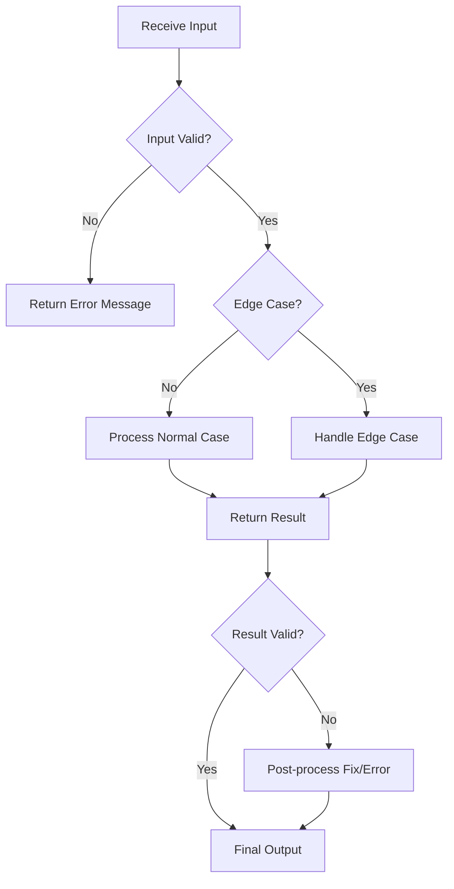

# Edge Case Handling

## Introduction

When solving programming problems, the most obvious solution often works for standard inputs but fails when confronted with unexpected or unusual scenarios. These unusual scenarios are called **edge cases** - inputs or situations that occur at the extreme ends of the possible range or under unusual circumstances. 

Edge case handling is a critical skill that separates novice programmers from experienced ones. It's about anticipating the unusual, the extreme, and the unexpected in your code and designing solutions that remain robust under all conditions.

In this guide, you'll learn:
- What edge cases are and why they matter
- How to identify potential edge cases
- Strategies for handling edge cases
- Best practices for making your code robust

## What Are Edge Cases?

Edge cases are inputs or situations that occur at the extremes of possible parameters or in unusual circumstances. These include:

- Empty inputs (empty strings, arrays, etc.)
- Very large or very small inputs
- Boundary values (e.g., maximum integer value, minimum allowed input)
- Malformed inputs (incorrect data types, unexpected formats)
- Resource constraints (low memory, network failures)
- Concurrency issues (race conditions)

### Why Edge Cases Matter

Consider this seemingly simple function to find the average of a list of numbers:

```javascript
function calculateAverage(numbers) {
  let sum = 0;
  for (let i = 0; i < numbers.length; i++) {
    sum += numbers[i];
  }
  return sum / numbers.length;
}

console.log(calculateAverage([1, 2, 3, 4, 5])); // Output: 3
```

This works fine for normal inputs, but what if we pass an empty array?

```javascript
console.log(calculateAverage([])); // Output: NaN (division by zero)
```

Our function breaks! This illustrates why considering edge cases is crucial - without proper handling, they can lead to:

- Crashes and errors
- Incorrect results
- Security vulnerabilities
- Poor user experience
- Difficult-to-diagnose bugs

## Identifying Potential Edge Cases

Before writing code, it's valuable to anticipate edge cases. Here are some questions to ask yourself:

1. **What if inputs are empty or null?**
   - Empty strings, arrays, or objects
   - Null or undefined values

2. **What about boundary values?**
   - Minimum and maximum allowed values
   - Zero values
   - Values just inside and outside valid ranges

3. **How does the system handle resource constraints?**
   - Very large inputs that could cause memory issues
   - Timeouts or slow responses
   - Limited storage space

4. **What happens with malformed or unexpected inputs?**
   - Incorrect data types
   - Malformed JSON or data structures
   - Special characters or unusual formatting

5. **Are there concurrency considerations?**
   - Multiple users updating the same data
   - Race conditions
   - Deadlocks

## Strategies for Handling Edge Cases

### 1. Input Validation

The first line of defense is to validate inputs before processing them:

```javascript
function calculateAverage(numbers) {
  // Check if input is an array
  if (!Array.isArray(numbers)) {
    throw new Error("Input must be an array");
  }
  
  // Check if array is empty
  if (numbers.length === 0) {
    return 0; // Or another appropriate value/response
  }
  
  let sum = 0;
  for (let i = 0; i < numbers.length; i++) {
    // Check if all elements are numbers
    if (typeof numbers[i] !== 'number') {
      throw new Error("All elements must be numbers");
    }
    sum += numbers[i];
  }
  return sum / numbers.length;
}

console.log(calculateAverage([1, 2, 3, 4, 5])); // Output: 3
console.log(calculateAverage([])); // Output: 0
```

### 2. Defensive Programming

Defensive programming is a practice where you anticipate potential issues and guard against them:

```javascript
function divideNumbers(a, b) {
  // Check for division by zero
  if (b === 0) {
    return Infinity; // Or throw an error, return null, etc.
  }
  
  return a / b;
}

console.log(divideNumbers(10, 2)); // Output: 5
console.log(divideNumbers(10, 0)); // Output: Infinity
```

### 3. Graceful Degradation

Sometimes, the best approach is to fail gracefully when an edge case occurs:

```javascript
function fetchUserData(userId) {
  try {
    // Attempt to fetch user data
    const userData = database.getUser(userId);
    
    if (!userData) {
      // No user found, return default data
      return {
        name: "Guest User",
        permissions: "basic",
        id: null
      };
    }
    
    return userData;
  } catch (error) {
    // Log the error for debugging
    console.error("Error fetching user data:", error);
    
    // Return default data to keep the application running
    return {
      name: "Guest User",
      permissions: "basic",
      id: null
    };
  }
}
```

### 4. Error Handling

Proper error handling is crucial for dealing with unexpected situations:

```javascript
function parseJSONFromAPI(jsonString) {
  try {
    const data = JSON.parse(jsonString);
    return data;
  } catch (error) {
    // Handle parsing errors
    console.error("Failed to parse JSON:", error);
    
    // Return empty object or null depending on requirements
    return null;
  }
}

const validJSON = '{"name": "Alice", "age": 30}';
const invalidJSON = '{name: "Broken JSON}';

console.log(parseJSONFromAPI(validJSON)); // Output: {name: "Alice", age: 30}
console.log(parseJSONFromAPI(invalidJSON)); // Output: null
```

## Real-World Examples

### Example 1: User Input Form

When building a form that collects user information, edge cases abound:

```javascript
function validateUserSubmission(formData) {
  const errors = {};
  
  // Check if name is provided and has reasonable length
  if (!formData.name) {
    errors.name = "Name is required";
  } else if (formData.name.length > 100) {
    errors.name = "Name is too long (maximum 100 characters)";
  } else if (formData.name.length < 2) {
    errors.name = "Name is too short (minimum 2 characters)";
  }
  
  // Validate email with regex
  const emailRegex = /^[^\s@]+@[^\s@]+\.[^\s@]+$/;
  if (!formData.email) {
    errors.email = "Email is required";
  } else if (!emailRegex.test(formData.email)) {
    errors.email = "Invalid email format";
  }
  
  // Validate age is a number and within reasonable range
  const age = parseInt(formData.age, 10);
  if (isNaN(age)) {
    errors.age = "Age must be a number";
  } else if (age < 13) {
    errors.age = "You must be at least 13 years old";
  } else if (age > 120) {
    errors.age = "Please enter a valid age";
  }
  
  return {
    isValid: Object.keys(errors).length === 0,
    errors
  };
}
```

### Example 2: File Processing System

When building a file processing system, consider these edge cases:

```javascript
async function processImageFile(file) {
  // Check if file exists
  if (!file) {
    throw new Error("No file provided");
  }
  
  // Check file type
  const allowedTypes = ['image/jpeg', 'image/png', 'image/gif'];
  if (!allowedTypes.includes(file.type)) {
    throw new Error(`Unsupported file type: ${file.type}. Please upload a JPG, PNG, or GIF.`);
  }
  
  // Check file size (5MB limit)
  const MAX_SIZE = 5 * 1024 * 1024; // 5MB in bytes
  if (file.size > MAX_SIZE) {
    throw new Error(`File is too large (${Math.round(file.size / 1024 / 1024)}MB). Maximum size is 5MB.`);
  }
  
  try {
    // Process the file (resize, compress, etc.)
    const processedImage = await imageProcessor.optimize(file);
    return processedImage;
  } catch (error) {
    // Handle processing errors
    console.error("Image processing failed:", error);
    throw new Error("Failed to process image. Please try again.");
  }
}
```

### Example 3: API Data Handling

When working with external APIs, you should expect and handle various edge cases:

```javascript
async function fetchWeatherData(cityName) {
  // Input validation
  if (!cityName || typeof cityName !== 'string') {
    throw new Error("City name must be a non-empty string");
  }
  
  try {
    // Attempt to fetch data
    const response = await fetch(`https://api.weatherservice.com/data?city=${encodeURIComponent(cityName)}`);
    
    // Check if response is okay
    if (!response.ok) {
      if (response.status === 404) {
        return { error: "City not found. Please check spelling." };
      }
      if (response.status === 429) {
        return { error: "Too many requests. Please try again later." };
      }
      return { error: `Server error: ${response.status}` };
    }
    
    // Parse JSON (could also fail)
    const data = await response.json();
    
    // Check if data has expected structure
    if (!data.temperature || !data.conditions) {
      return { 
        error: "Invalid data format received from weather service.",
        partialData: data
      };
    }
    
    return {
      temperature: data.temperature,
      conditions: data.conditions,
      humidity: data.humidity || "Unknown",
      windSpeed: data.windSpeed || "Unknown"
    };
  } catch (error) {
    // Handle network errors or other exceptions
    console.error("Weather API error:", error);
    return { error: "Failed to fetch weather data. Please check your connection." };
  }
}
```

## Visualizing Edge Case Handling

Here's a flowchart illustrating a robust edge case handling process:



## Best Practices for Edge Case Handling

1. **Think About Edge Cases Early**
   - Identify potential edge cases during the design phase, not after bugs are found

2. **Write Test Cases for Edge Cases**
   - Explicitly test your code with edge cases to ensure robust handling

3. **Document Assumptions and Limitations**
   - Make it clear what your code expects and how it handles unexpected situations

4. **Fail Fast and Explicitly**
   - Detect invalid inputs or states early and provide clear error messages

5. **Use Type Checking and Validation**
   - Verify input types and formats before processing

6. **Implement Proper Error Handling**
   - Use try/catch blocks to handle exceptions gracefully

7. **Default Values and Fallbacks**
   - Provide sensible defaults when expected values are missing

8. **Log Edge Cases**
   - Log unusual situations for debugging and improving your system

## Summary

Edge case handling is a critical skill for writing robust, reliable software. By anticipating potential problems, validating inputs, and gracefully handling unexpected situations, you can create code that works correctly under all circumstances.

Remember:
- Edge cases include empty inputs, boundary values, resource constraints, and unusual scenarios
- Input validation is your first line of defense
- Use defensive programming techniques to anticipate problems
- Write tests specifically targeting edge cases
- Handle errors gracefully to maintain good user experience

The mark of a professional programmer isn't just solving the main problem—it's handling all the edge cases that could arise. As you develop your programming skills, make edge case analysis and handling a regular part of your problem-solving process.

## Exercises

1. Take a simple function (like calculating the average of an array) and identify all possible edge cases.
2. Refactor a piece of your existing code to handle edge cases better.
3. Write a function that validates user input for a registration form, handling all potential edge cases.
4. Create a test suite that specifically tests edge cases for one of your functions.
5. Review an open-source project and identify how it handles (or fails to handle) edge cases.

## Additional Resources

- "Defensive Programming & Debugging" - Code Academy Course
- "Clean Code" by Robert C. Martin (has excellent sections on error handling)
- "The Pragmatic Programmer" by Andrew Hunt and David Thomas
- "JavaScript: The Good Parts" by Douglas Crockford (for JavaScript-specific defensive coding)

Remember, anticipating and handling edge cases isn't just about avoiding bugs—it's about creating a professional, polished product that users can rely on.