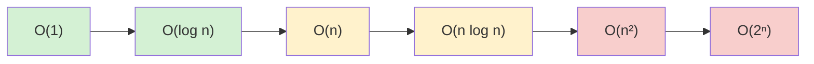

# Algorithm Selection

## Introduction

When facing a programming problem, one of the most critical decisions you'll make is selecting the right algorithm for the job. An algorithm is a step-by-step procedure for solving a problem or accomplishing a task. The choice of algorithm can dramatically impact your solution's efficiency, correctness, and scalability.

In this guide, we'll explore how to select the most appropriate algorithm for different scenarios, considering factors like:

- Time complexity
- Space complexity
- Input size
- Problem constraints
- Real-world requirements

By the end of this guide, you'll have a framework for making informed decisions when choosing algorithms for your programming problems.

## Understanding the Problem

Before selecting an algorithm, you need to thoroughly understand the problem you're trying to solve.

### Key Questions to Ask

1. **What are the inputs and outputs?**
2. **What are the constraints?** (memory limitations, time requirements, etc.)
3. **What is the expected size of the input?**
4. **Are there any special cases to handle?**

### Example: Sorting Names

Let's say you need to sort a list of names:

```javascript
function sortNames(names) {
  // Which sorting algorithm should we choose?
  return sortedNames;
}

// Input
const studentNames = ["Alex", "Mary", "John", "Sarah", "Bob"];

// Expected output
// ["Alex", "Bob", "John", "Mary", "Sarah"]
```

The choice of sorting algorithm will depend on several factors we'll explore next.

## Evaluating Algorithm Complexity

### Time Complexity

Time complexity measures how the runtime of an algorithm grows relative to the input size.

Common time complexities (from fastest to slowest):
- O(1) - Constant time
- O(log n) - Logarithmic time
- O(n) - Linear time
- O(n log n) - Linearithmic time
- O(n²) - Quadratic time
- O(2ⁿ) - Exponential time

### Space Complexity

Space complexity measures the additional memory an algorithm needs as input size grows.

### Visualizing Complexity



## Common Algorithm Categories and When to Use Them

### 1. Sorting Algorithms

| Algorithm | Best Case | Average Case | Worst Case | When to Use |
|---|---|---|---|---|
| Bubble Sort | O(n) | O(n²) | O(n²) | Small datasets, educational purposes |
| Insertion Sort | O(n) | O(n²) | O(n²) | Small datasets, nearly sorted data |
| Merge Sort | O(n log n) | O(n log n) | O(n log n) | Stable sorting needed, large datasets |
| Quick Sort | O(n log n) | O(n log n) | O(n²) | General purpose, average case performance |
| Counting Sort | O(n+k) | O(n+k) | O(n+k) | Small range of integers |

#### Example: Choosing a Sorting Algorithm

```javascript
function sortStudentScores(scores) {
  // For a small array of scores (< 10 elements)
  return insertionSort(scores);
}

function sortDatabaseRecords(records) {
  // For thousands of records
  return mergeSort(records);
}

function sortSingleDigitNumbers(numbers) {
  // When all numbers are 0-9
  return countingSort(numbers);
}
```

### 2. Searching Algorithms

| Algorithm | Average Case | Worst Case | When to Use |
|---|---|---|---|
| Linear Search | O(n) | O(n) | Unsorted data |
| Binary Search | O(log n) | O(log n) | Sorted data |
| Hash-based Search | O(1) | O(n) | When lookups are frequent |

#### Example: Choosing a Search Algorithm

```javascript
function findStudent(students, targetName) {
  // If students array is unsorted
  return linearSearch(students, targetName);
}

function findWord(dictionary, word) {
  // Dictionary is sorted alphabetically
  return binarySearch(dictionary, word);
}

function lookupUserProfile(userProfiles, userId) {
  // Frequent lookups needed
  // First, create a hashmap
  const userMap = new Map();
  for (const profile of userProfiles) {
    userMap.set(profile.id, profile);
  }
  
  // Then lookup is O(1) on average
  return userMap.get(userId);
}
```

### 3. Graph Algorithms

| Algorithm | Time Complexity | When to Use |
|---|---|---|
| BFS (Breadth-First Search) | O(V + E) | Shortest path in unweighted graphs, level-order traversal |
| DFS (Depth-First Search) | O(V + E) | Maze solving, topological sorting, cycle detection |
| Dijkstra's Algorithm | O((V + E) log V) | Finding shortest path in weighted graphs |
| Prim's/Kruskal's Algorithm | O(E log V) | Minimum spanning tree problems |

Where V is the number of vertices and E is the number of edges.

#### Example: Choosing a Graph Algorithm

```javascript
function findShortestPath(graph, start, end) {
  // For unweighted graph (all edges have equal weight)
  return bfs(graph, start, end);
}

function findShortestWeightedPath(graph, start, end) {
  // For weighted graph (edges have different weights)
  return dijkstra(graph, start, end);
}

function exploreMaze(maze) {
  // For maze traversal
  return dfs(maze, entrance, exit);
}
```

### 4. Dynamic Programming vs. Greedy Algorithms

**Dynamic Programming** is useful when:
- The problem has overlapping subproblems
- The problem has an optimal substructure
- Examples: Fibonacci, knapsack problem, longest common subsequence

**Greedy Algorithms** are useful when:
- Making locally optimal choices leads to a global optimum
- Examples: Huffman coding, activity selection, coin change with certain denominations

#### Example: Dynamic Programming vs. Greedy

```javascript
// Dynamic Programming Example - Fibonacci
function fibonacciDP(n) {
  const fib = [0, 1];
  
  for (let i = 2; i <= n; i++) {
    fib[i] = fib[i - 1] + fib[i - 2];
  }
  
  return fib[n];
}

// Input: 6
// Output: 8 (0, 1, 1, 2, 3, 5, 8)

// Greedy Example - Coin Change
function coinChangeGreedy(amount, coins) {
  // Assumes coins are sorted in descending order
  // e.g., [25, 10, 5, 1] (US cents)
  
  let result = [];
  
  for (const coin of coins) {
    while (amount >= coin) {
      result.push(coin);
      amount -= coin;
    }
  }
  
  return result;
}

// Input: amount = 42, coins = [25, 10, 5, 1]
// Output: [25, 10, 5, 1, 1] (minimal number of coins)
```

## Practical Selection Framework

When selecting an algorithm, follow these steps:

### 1. Analyze the Problem Requirements

- What's the expected input size?
- Are there time or space constraints?
- Are there specific accuracy requirements?

### 2. Consider the Data

- Is the data sorted or structured in any way?
- How large is the dataset?
- Will the data change frequently?

### 3. Evaluate Trade-offs

- Time vs. Space complexity
- Simplicity vs. Performance
- Implementation difficulty vs. Optimization benefits

### 4. Prototype and Test

Always test your algorithm with:
- Typical inputs
- Edge cases
- Large inputs (if applicable)

## Real-World Examples

### Example 1: Contact Search in a Mobile App

**Problem**: Search contacts in a mobile app with 1000+ contacts.

**Analysis**:
- Users expect instant results
- Contacts are searched by name, number, or email
- Contacts are relatively static (don't change often)

**Solution**:
```javascript
class ContactManager {
  constructor(contacts) {
    this.contacts = contacts;
    // Create indexes for fast searching
    this.nameIndex = new Map();
    this.phoneIndex = new Map();
    this.emailIndex = new Map();
    
    // Build indexes
    this.buildIndexes();
  }
  
  buildIndexes() {
    for (const contact of this.contacts) {
      this.nameIndex.set(contact.name.toLowerCase(), contact);
      this.phoneIndex.set(contact.phone, contact);
      if (contact.email) {
        this.emailIndex.set(contact.email.toLowerCase(), contact);
      }
    }
  }
  
  search(query) {
    query = query.toLowerCase();
    
    // Check direct matches first (O(1) operation)
    if (this.nameIndex.has(query)) return [this.nameIndex.get(query)];
    if (this.phoneIndex.has(query)) return [this.phoneIndex.get(query)];
    if (this.emailIndex.has(query)) return [this.emailIndex.get(query)];
    
    // If no exact match, do partial matching
    const results = [];
    
    for (const contact of this.contacts) {
      if (
        contact.name.toLowerCase().includes(query) || 
        contact.phone.includes(query) ||
        (contact.email && contact.email.toLowerCase().includes(query))
      ) {
        results.push(contact);
      }
    }
    
    return results;
  }
}

// Usage
const contactManager = new ContactManager(contactList);
const results = contactManager.search("john");
console.log(results);
```

**Algorithm Choice**: Hash-based lookup for exact matches, linear search for partial matches.

### Example 2: E-commerce Product Recommendation

**Problem**: Recommend similar products based on customer viewing history.

**Analysis**:
- Need to process large amounts of user data
- Recommendations must be relevant
- Performance is important but some latency is acceptable

**Solution**:
```javascript
class ProductRecommender {
  // Using a simplified item-based collaborative filtering approach
  recommendSimilarProducts(productId, userHistory) {
    const similarityScores = new Map();
    
    // Find users who viewed this product
    const usersWhoViewedProduct = this.findUsersWhoViewed(productId);
    
    // For each of these users, look at other products they viewed
    for (const user of usersWhoViewedProduct) {
      const viewedProducts = this.getProductsViewedByUser(user);
      
      for (const viewedProduct of viewedProducts) {
        if (viewedProduct !== productId) {
          // Increment similarity score
          const currentScore = similarityScores.get(viewedProduct) || 0;
          similarityScores.set(viewedProduct, currentScore + 1);
        }
      }
    }
    
    // Convert to array and sort by score
    const recommendations = Array.from(similarityScores.entries())
      .sort((a, b) => b[1] - a[1])  // Sort by score descending
      .slice(0, 5)                   // Take top 5
      .map(entry => entry[0]);       // Extract just the product IDs
    
    return recommendations;
  }
}
```

**Algorithm Choice**: Collaborative filtering with similarity scoring.

## Common Pitfalls in Algorithm Selection

1. **Premature optimization**: Don't choose a complex algorithm if a simple one will suffice
2. **Ignoring problem constraints**: Always consider memory and time limitations
3. **One-size-fits-all thinking**: Different scenarios require different algorithms
4. **Overlooking implementation complexity**: Sometimes a theoretically "slower" algorithm is better if it's simpler to implement correctly
5. **Not considering the average case**: Worst-case analysis is important, but average-case performance often matters more in practice

## Summary

Selecting the right algorithm is a critical skill for efficient problem-solving. The process involves:

1. Understanding the problem thoroughly
2. Analyzing the constraints and requirements
3. Considering the characteristics of your data
4. Evaluating the tradeoffs between different algorithms
5. Testing your solution with different inputs

Remember that the "best" algorithm depends on your specific context. An algorithm with O(n log n) complexity might be theoretically "slower" than an O(n) algorithm, but if the O(n) algorithm has a large constant factor, the O(n log n) algorithm might perform better for reasonable input sizes.

## Exercises

1. For a list of 10 million integers where you need to find if a specific number exists, would you use linear search or binary search? What additional information would you need to make this decision?

2. You're building a spell checker. Which data structure and algorithm would you use to efficiently verify if a word is spelled correctly?

3. For an e-commerce website that needs to sort products by price, would you implement quicksort, mergesort, or another sorting algorithm? Justify your answer.

4. Design an algorithm to find the shortest route between two points on a map. What factors would influence your choice of pathfinding algorithm?

5. You need to implement a cache with a "least recently used" eviction policy. What data structures would you use to make both lookups and updates efficient?

## Additional Resources

- **Books**:
  - "Introduction to Algorithms" by Cormen, Leiserson, Rivest, and Stein
  - "Algorithms" by Robert Sedgewick and Kevin Wayne
  - "Grokking Algorithms" by Aditya Bhargava (beginner-friendly)

- **Online Courses**:
  - Algorithms Specialization on Coursera by Stanford University
  - AlgoExpert Platform for Algorithm Practice
  - LeetCode for practical algorithm challenges

- **Tools**:
  - Algorithm Visualizers: Visualgo.net, algorithm-visualizer.org
  - Big-O Cheat Sheet: bigocheatsheet.com

Remember that algorithm selection is both a science and an art. The more problems you solve, the better you'll become at choosing the right algorithm for each situation.