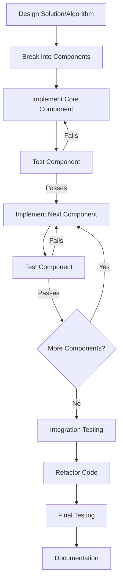

# Implementation Strategy

## Introduction

After designing an algorithm or pseudocode for your problem, the next crucial step is implementation—translating your solution into actual code. Even with a well-designed solution, implementation can present its own challenges. This guide will walk you through effective strategies for implementing your programming solutions, ensuring you can turn your ideas into working code efficiently.

Implementation is where your algorithmic thinking meets the syntax and features of your chosen programming language. It's the bridge between the abstract solution in your mind and the concrete, executable code that solves the original problem.

## Why Implementation Strategy Matters

A good implementation strategy helps you:

- Reduce bugs and errors
- Write clean, maintainable code
- Save time during debugging
- Create solutions that are easier to modify later
- Avoid common pitfalls that slow down development

## Key Components of Implementation Strategy

### 1. Translating Algorithms to Code

The first step in implementation is converting your algorithm or pseudocode into actual programming syntax.

#### Example: Converting Pseudocode to Python

**Pseudocode**:
```
Algorithm FindMaximum(numbers):
    If numbers is empty:
        Return null
    max = first element of numbers
    For each number in numbers:
        If number > max:
            max = number
    Return max
```

**Python Implementation**:
```python
def find_maximum(numbers):
    if not numbers:  # Check if list is empty
        return None
    
    maximum = numbers[0]  # Start with first element
    for number in numbers:
        if number > maximum:
            maximum = number
    
    return maximum

# Example usage
numbers_list = [4, 2, 9, 7, 5, 1]
result = find_maximum(numbers_list)
print(f"The maximum number is: {result}")
```

**Output**:
```
The maximum number is: 9
```

### 2. Incremental Development

Rather than implementing everything at once, build your solution incrementally:

1. Start with core functionality
2. Test and verify it works
3. Add additional features one by one
4. Test after each addition

#### Example: Building a To-Do List Application

**Step 1**: Implement basic task creation and display

```python
def create_task(tasks, description):
    tasks.append({"description": description, "completed": False})
    return tasks

def display_tasks(tasks):
    if not tasks:
        print("No tasks available.")
        return
    
    for i, task in enumerate(tasks):
        status = "✓" if task["completed"] else " "
        print(f"{i+1}. [{status}] {task['description']}")

# Initial test
my_tasks = []
my_tasks = create_task(my_tasks, "Learn Python basics")
my_tasks = create_task(my_tasks, "Practice coding problems")
display_tasks(my_tasks)
```

**Output**:
```
1. [ ] Learn Python basics
2. [ ] Practice coding problems
```

**Step 2**: Add task completion functionality

```python
def complete_task(tasks, task_index):
    if 0 <= task_index < len(tasks):
        tasks[task_index]["completed"] = True
    else:
        print("Invalid task index.")
    return tasks

# Test the addition
my_tasks = complete_task(my_tasks, 0)
display_tasks(my_tasks)
```

**Output**:
```
1. [✓] Learn Python basics
2. [ ] Practice coding problems
```

### 3. Defensive Programming

Always validate inputs and handle potential errors to make your code robust.

```python
def divide_numbers(a, b):
    # Validate inputs
    if not (isinstance(a, (int, float)) and isinstance(b, (int, float))):
        raise TypeError("Both inputs must be numbers")
    
    # Handle potential errors
    if b == 0:
        raise ValueError("Cannot divide by zero")
    
    return a / b

# Example usage with error handling
try:
    result = divide_numbers(10, 2)
    print(f"Result: {result}")
    
    # This will cause an error
    result = divide_numbers(10, 0)
except TypeError as e:
    print(f"Type Error: {e}")
except ValueError as e:
    print(f"Value Error: {e}")
```

**Output**:
```
Result: 5.0
Value Error: Cannot divide by zero
```

### 4. Code Organization

Organize your code logically to improve readability and maintainability:

- Group related functions together
- Use appropriate naming conventions
- Add comments to explain complex logic
- Break large functions into smaller ones

```python
# User management module
def validate_username(username):
    """Validate if username meets requirements."""
    if not username:
        return False
    if len(username) < 3 or len(username) > 20:
        return False
    return True

def create_user(username, email):
    """Create a new user after validation."""
    if not validate_username(username):
        raise ValueError("Invalid username")
    if not validate_email(email):
        raise ValueError("Invalid email")
    
    # In a real application, we would add to database here
    return {"username": username, "email": email}

def validate_email(email):
    """Validate if email has correct format."""
    # Simple validation for demonstration
    return "@" in email and "." in email
```

### 5. Testing During Implementation

Test your code as you write it to catch issues early:

```python
def sum_even_numbers(numbers):
    """Sum all even numbers in a list."""
    total = 0
    for num in numbers:
        if num % 2 == 0:
            total += num
    return total

# Test with different scenarios
test_cases = [
    ([1, 2, 3, 4, 5, 6], 12),  # Even numbers: 2+4+6=12
    ([], 0),                    # Empty list
    ([1, 3, 5], 0),            # No even numbers
    ([2, 4, 6], 12)             # All even numbers
]

for input_list, expected_output in test_cases:
    actual_output = sum_even_numbers(input_list)
    if actual_output == expected_output:
        print(f"✓ Test passed for input {input_list}")
    else:
        print(f"✗ Test failed for input {input_list}. Got {actual_output}, expected {expected_output}")
```

**Output**:
```
✓ Test passed for input [1, 2, 3, 4, 5, 6]
✓ Test passed for input []
✓ Test passed for input [1, 3, 5]
✓ Test passed for input [2, 4, 6]
```

## Implementation Workflow Diagram



## Real-World Application: Building a Simple Weather App

Let's apply implementation strategies to build a simple weather application that fetches data from a weather API.

### Step 1: Define Core Components

```python
# weather_app.py

def get_weather_data(city):
    """
    Simulates fetching weather data from API.
    In a real app, this would use requests to call an actual API.
    """
    # Simulated data for demonstration
    weather_data = {
        "New York": {"temperature": 20, "condition": "Sunny", "humidity": 60},
        "London": {"temperature": 15, "condition": "Rainy", "humidity": 80},
        "Tokyo": {"temperature": 25, "condition": "Clear", "humidity": 50},
        # Add more cities as needed
    }
    
    return weather_data.get(city, {"error": "City not found"})

def display_weather(data):
    """Display weather information in a user-friendly format."""
    if "error" in data:
        print(data["error"])
        return
    
    print(f"Temperature: {data['temperature']}°C")
    print(f"Condition: {data['condition']}")
    print(f"Humidity: {data['humidity']}%")

# Test the core functionality
city = "New York"
weather = get_weather_data(city)
print(f"Weather for {city}:")
display_weather(weather)
```

**Output**:
```
Weather for New York:
Temperature: 20°C
Condition: Sunny
Humidity: 60%
```

### Step 2: Add Error Handling and Input Validation

```python
def get_user_input():
    """Get and validate city name from user."""
    while True:
        city = input("Enter city name (or 'exit' to quit): ")
        if city.lower() == 'exit':
            return None
        
        if not city.strip():
            print("City name cannot be empty. Please try again.")
            continue
        
        return city

def main():
    """Main function to run the weather app."""
    print("Welcome to the Weather App!")
    
    while True:
        city = get_user_input()
        if city is None:
            break
            
        weather = get_weather_data(city)
        print(f"\nWeather for {city}:")
        display_weather(weather)
        print()  # Empty line for better readability
    
    print("Thank you for using Weather App!")

# Run the application
if __name__ == "__main__":
    main()
```

### Step 3: Adding Temperature Unit Conversion

```python
def celsius_to_fahrenheit(celsius):
    """Convert Celsius to Fahrenheit."""
    return (celsius * 9/5) + 32

def display_weather(data, unit='C'):
    """
    Display weather information in a user-friendly format.
    Unit can be 'C' for Celsius or 'F' for Fahrenheit.
    """
    if "error" in data:
        print(data["error"])
        return
    
    temperature = data['temperature']
    if unit.upper() == 'F':
        temperature = celsius_to_fahrenheit(temperature)
        unit_symbol = 'F'
    else:
        unit_symbol = 'C'
    
    print(f"Temperature: {temperature}°{unit_symbol}")
    print(f"Condition: {data['condition']}")
    print(f"Humidity: {data['humidity']}%")

# Example usage with temperature conversion
city = "Tokyo"
weather = get_weather_data(city)
print(f"Weather for {city} (Celsius):")
display_weather(weather)
print(f"\nWeather for {city} (Fahrenheit):")
display_weather(weather, 'F')
```

**Output**:
```
Weather for Tokyo (Celsius):
Temperature: 25°C
Condition: Clear
Humidity: 50%

Weather for Tokyo (Fahrenheit):
Temperature: 77.0°F
Condition: Clear
Humidity: 50%
```

## Common Implementation Pitfalls

### 1. Overcomplicating the Solution

Beginners often try to implement complex solutions when simpler ones would work better.

**Example - Complex Way**:
```python
def is_even(number):
    binary = bin(number)[2:]  # Convert to binary and remove '0b' prefix
    last_digit = binary[-1]
    return last_digit == '0'
```

**Better Approach**:
```python
def is_even(number):
    return number % 2 == 0
```

### 2. Not Testing Edge Cases

**Example - Without Edge Cases**:
```python
def calculate_average(numbers):
    total = sum(numbers)
    return total / len(numbers)  # Will fail if numbers is empty
```

**Better Approach**:
```python
def calculate_average(numbers):
    if not numbers:
        return 0
    return sum(numbers) / len(numbers)
```

### 3. Poor Variable Naming

**Example - Poor Naming**:
```python
def func1(a, b):
    c = a * b
    d = c / 2
    return d
```

**Better Approach**:
```python
def calculate_triangle_area(base, height):
    area = base * height
    triangle_area = area / 2
    return triangle_area
```

## Best Practices for Implementation

1. **Start Simple**: Begin with the most basic implementation that works
2. **Use Version Control**: Tools like Git help track changes and revert if needed
3. **Test Early and Often**: Write tests as you implement, not after
4. **Keep Functions Small**: Each function should do one thing well
5. **Document Your Code**: Add comments explaining "why" not just "what"
6. **Follow Language Conventions**: Adhere to the style guide of your programming language
7. **Refactor Regularly**: Improve your code's structure and readability
8. **Use Meaningful Names**: Variables and functions should describe their purpose

## Summary

Implementation is the process of converting your algorithmic solution into working code. Effective implementation strategies involve incremental development, defensive programming, proper code organization, and continuous testing. By following these strategies, you can write cleaner, more maintainable code and reduce debugging time.

Remember that implementation is iterative—your first attempt doesn't need to be perfect. Start with a working solution, test it thoroughly, and then refine and optimize your code.

## Exercises

1. Choose a simple algorithm (like binary search or bubble sort) and implement it step by step, testing after each component.
2. Take a function you've written before and improve it by adding proper error handling and input validation.
3. Refactor a piece of code to improve its organization and naming conventions.
4. Pick a real-world problem (like a to-do app or calculator) and implement it using the incremental development approach.
5. Find a complex function in your code and break it down into smaller, more manageable functions.

## Additional Resources

- **Clean Code** by Robert C. Martin - A guide to writing maintainable code
- **Code Complete** by Steve McConnell - Comprehensive guide to practical programming
- Online platforms like LeetCode and HackerRank for implementation practice
- Language-specific style guides (PEP 8 for Python, Google Style Guides for various languages)
- Design pattern resources to learn standard implementation approaches

Remember, becoming good at implementation is a skill that improves with practice. The more code you write and problems you solve, the better your implementation strategies will become.