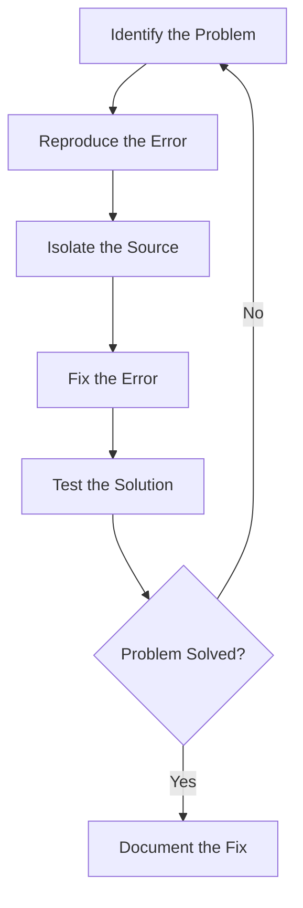

# Debugging Techniques

## Introduction

Debugging is the process of finding and resolving errors, bugs, or unexpected behaviors in your code. It is an essential skill for every programmer, regardless of experience level. Effective debugging can save you hours of frustration and help you build more reliable software.

In this guide, we'll explore various debugging techniques that will help you identify, isolate, and fix problems in your code. Whether you're working on a small script or a complex application, these techniques will be invaluable in your programming journey.

## What is a Bug?

Before diving into debugging techniques, let's understand what bugs are:

- **Syntax errors**: Mistakes in the code structure that prevent the program from running
- **Logic errors**: Code that runs but produces incorrect results
- **Runtime errors**: Errors that occur during program execution
- **Integration errors**: Errors that occur when different parts of a program interact

## Essential Debugging Process

Effective debugging follows a systematic approach:



### 1. Print Debugging

One of the simplest ways to debug your code is to insert print statements at strategic locations to track program flow and variable values.

```python
def calculate_average(numbers):
    print(f"Function called with: {numbers}")
    
    if not numbers:
        print("Empty list detected, returning 0")
        return 0
        
    total = sum(numbers)
    print(f"Sum calculated: {total}")
    
    average = total / len(numbers)
    print(f"Average calculated: {average}")
    
    return average

# Example usage
scores = [85, 90, 78, 92, 88]
result = calculate_average(scores)
print(f"Final result: {result}")
```

**Output:**
```
Function called with: [85, 90, 78, 92, 88]
Sum calculated: 433
Average calculated: 86.6
Final result: 86.6
```

**Pros:**
- Simple and works in any environment
- No special tools required
- Helps understand program flow

**Cons:**
- Can clutter your code
- May need to be removed after debugging
- Inefficient for complex issues

### 2. Using Debuggers

Most IDEs and code editors come with built-in debuggers that allow you to:
- Set breakpoints
- Step through code execution
- Inspect variable values
- Evaluate expressions during runtime

**Example: Using a Debugger in Python (VSCode)**

```python
def find_maximum(numbers):
    if not numbers:
        return None
    
    current_max = numbers[0]  # Set a breakpoint here
    
    for number in numbers:
        if number > current_max:
            current_max = number  # And another breakpoint here
    
    return current_max

# Test the function
test_list = [4, 9, 2, 7, 5]
max_value = find_maximum(test_list)
print(f"The maximum value is: {max_value}")
```

**How to use the debugger:**

1. Set breakpoints by clicking in the left margin next to line numbers
2. Start the debugger (typically F5 or a "Debug" button)
3. When execution pauses at a breakpoint:
   - Examine variable values in the variables panel
   - Step through code using "Step Over" (F10), "Step Into" (F11), or "Continue" (F5)
   - Use the watch panel to monitor specific expressions

### 3. Rubber Duck Debugging

This technique involves explaining your code line-by-line to an inanimate object (traditionally a rubber duck) or another person. Often, the act of articulating the problem helps you identify the solution.

**Steps:**

1. Get a rubber duck (or any object/imagine a listener)
2. Explain your code to the duck in detail
3. Describe what each line does
4. Explain your assumptions and expectations

This technique works because verbalizing the problem forces you to think more systematically and often reveals faulty logic or incorrect assumptions.

### 4. Divide and Conquer (Binary Search Debugging)

For large codebases or complex errors, the divide and conquer approach helps isolate the problem:

1. Verify if the problem exists in the entire program
2. Divide the code into sections
3. Check if the problem exists in each section
4. Focus on the problematic section and repeat the process

**Example:**

```javascript
function processUserData(userData) {
    // Step 1: Validate input
    if (!validateInput(userData)) {
        return { error: "Invalid input" };
    }
    
    // Step 2: Transform data
    const transformedData = transformData(userData);
    
    // Step 3: Calculate metrics
    const metrics = calculateMetrics(transformedData);
    
    // Step 4: Generate report
    const report = generateReport(metrics);
    
    return report;
}

// To debug, test each step independently:
const testData = {/* user data */};

// Test validation
console.log("Validation result:", validateInput(testData));

// Test transformation
const transformedData = transformData(testData);
console.log("Transformed data:", transformedData);

// And so on...
```

### 5. Error Logging and Reading Stack Traces

Understanding error messages and stack traces is crucial for effective debugging:

```javascript
try {
    const data = JSON.parse(invalidJsonString);
    processData(data);
} catch (error) {
    console.error("Error type:", error.name);
    console.error("Error message:", error.message);
    console.error("Stack trace:", error.stack);
    
    // Log to file or service in production
    logErrorToService(error);
}
```

**Stack trace example:**
```
SyntaxError: Unexpected token o in JSON at position 1
    at JSON.parse (<anonymous>)
    at processInput (app.js:24:23)
    at handleUserRequest (app.js:58:12)
    at app.js:142:5
```

**How to read a stack trace:**
1. Start from the top - this shows the actual error
2. Each subsequent line shows the call hierarchy (newest to oldest)
3. Look for lines referencing your code (not library code)
4. The file, line number, and column help pinpoint the exact location

### 6. Assertions and Unit Tests

Assertions can catch bugs early by validating assumptions in your code:

```python
def divide(a, b):
    assert b != 0, "Division by zero is not allowed"
    return a / b

# This will raise an AssertionError with the message
try:
    result = divide(10, 0)
except AssertionError as e:
    print(f"Caught error: {e}")
```

**Output:**
```
Caught error: Division by zero is not allowed
```

Unit tests provide a structured way to verify your code works as expected:

```python
import unittest

def add(a, b):
    return a + b

class TestAddFunction(unittest.TestCase):
    def test_positive_numbers(self):
        self.assertEqual(add(2, 3), 5)
    
    def test_negative_numbers(self):
        self.assertEqual(add(-1, -1), -2)
    
    def test_mixed_numbers(self):
        self.assertEqual(add(-1, 1), 0)

if __name__ == '__main__':
    unittest.main()
```

### 7. Debugging Client-Server Applications

For web applications and APIs, browser developer tools and specialized tools like Postman are invaluable:

**Browser Developer Tools:**
- Network tab: Inspect requests/responses
- Console: View JavaScript errors
- Elements: Inspect and modify DOM
- Sources: Debug JavaScript with breakpoints

**API debugging with console:**
```javascript
// Log network requests
fetch('https://api.example.com/data')
  .then(response => {
    console.log('Status:', response.status);
    console.log('Headers:', response.headers);
    return response.json();
  })
  .then(data => {
    console.log('Data:', data);
  })
  .catch(error => {
    console.error('Error:', error);
  });
```

## Real-World Debugging Examples

### Example 1: Fixing an Infinite Loop

**Buggy code:**
```javascript
function findElement(array, target) {
    let i = 0;
    while (array[i] !== target) {
        i++;
    }
    return i;
}

const result = findElement([1, 2, 3, 4], 10); // 10 is not in the array!
```

**Problem:** If the target is not in the array, the loop will continue past the array bounds and never terminate.

**Debugging steps:**

1. Identify the issue: The function doesn't handle cases when the element is not found
2. Add a condition to check if we've reached the end of the array

**Fixed code:**
```javascript
function findElement(array, target) {
    let i = 0;
    while (i < array.length && array[i] !== target) {
        i++;
    }
    return i < array.length ? i : -1; // Return -1 if not found
}

const result = findElement([1, 2, 3, 4], 10);
console.log(result); // -1 (not found)
```

### Example 2: Debugging a Data Processing Pipeline

Imagine we have a data processing pipeline that's producing incorrect results:

```python
def process_data(raw_data):
    cleaned_data = clean_data(raw_data)
    transformed_data = transform_data(cleaned_data)
    aggregated_data = aggregate_data(transformed_data)
    return format_output(aggregated_data)

# The result is wrong, but which step is causing the issue?
```

**Debugging approach:**

1. Insert checkpoints to verify intermediate results:

```python
def process_data(raw_data):
    # Checkpoint 1
    cleaned_data = clean_data(raw_data)
    print(f"After cleaning: {len(cleaned_data)} records")
    print(f"Sample: {cleaned_data[:2]}")
    
    # Checkpoint 2
    transformed_data = transform_data(cleaned_data)
    print(f"After transformation: {len(transformed_data)} records")
    print(f"Sample: {transformed_data[:2]}")
    
    # Checkpoint 3
    aggregated_data = aggregate_data(transformed_data)
    print(f"After aggregation: {len(aggregated_data)} records")
    print(f"Sample: {aggregated_data[:2]}")
    
    return format_output(aggregated_data)
```

2. Run the function and examine the output at each checkpoint
3. Identify the step where the data becomes incorrect
4. Focus debugging efforts on that specific function

## Advanced Debugging Techniques

### 1. Log Analysis for Production Bugs

When bugs occur in production environments where direct debugging isn't possible:

1. Ensure comprehensive logging is in place
2. Use log aggregation tools (e.g., ELK stack, Splunk)
3. Search for error patterns and correlations
4. Analyze timestamps to understand the sequence of events

**Example logging strategy:**
```python
import logging

logging.basicConfig(
    level=logging.INFO,
    format='%(asctime)s - %(name)s - %(levelname)s - %(message)s',
    handlers=[
        logging.FileHandler("application.log"),
        logging.StreamHandler()
    ]
)

logger = logging.getLogger(__name__)

def process_order(order):
    logger.info(f"Processing order {order.id}")
    try:
        validate_order(order)
        logger.debug(f"Order {order.id} validated successfully")
        
        process_payment(order)
        logger.debug(f"Payment processed for order {order.id}")
        
        # Further processing...
        
    except ValidationError as e:
        logger.error(f"Validation error for order {order.id}: {e}")
        raise
    except PaymentError as e:
        logger.error(f"Payment error for order {order.id}: {e}")
        logger.debug(f"Payment error details: {e.details}", exc_info=True)
        raise
    except Exception as e:
        logger.critical(f"Unexpected error processing order {order.id}", exc_info=True)
        raise
```

### 2. Delta Debugging

For complex bugs that are difficult to isolate, delta debugging systematically reduces the test case to find the minimal example that reproduces the bug:

1. Start with a large test case that demonstrates the bug
2. Divide the test case into parts
3. Test each part to see if it still produces the bug
4. Recursively repeat with the smallest part that still shows the bug

This technique is particularly useful for compiler bugs, complex algorithms, or data-dependent issues.

### 3. Time-Travel Debugging

Some advanced debugging tools offer time-travel capabilities, allowing you to:

- Record program execution
- Move backwards and forwards through the execution history
- See how variables change over time

Tools like rr, Python's `pdb` with `post_mortem`, or JavaScript's `replay` can provide these capabilities.

## Common Debugging Pitfalls and How to Avoid Them

### 1. Assuming Rather Than Verifying

**Pitfall:** Assuming you know what the problem is without proper verification.

**Solution:** Always verify your assumptions with evidence from logs, test cases, or debugger output.

### 2. Fixing Symptoms Instead of Root Causes

**Pitfall:** Applying quick patches that address the symptoms but not the underlying issue.

**Solution:** Take time to understand why the bug occurs, not just how to make it disappear.

### 3. Ignoring Version Control History

**Pitfall:** Not using version control to understand when and how the bug was introduced.

**Solution:** Use `git bisect` or similar tools to identify which change introduced the bug.

### 4. Debugging Without a Plan

**Pitfall:** Random changes hoping to fix the issue.

**Solution:** Follow a systematic approach, formulate hypotheses, and test them methodically.

## Building a Debugging Mindset

Effective debugging is as much about mindset as it is about techniques:

1. **Be curious** - Wonder why things happen the way they do
2. **Be methodical** - Follow a systematic process
3. **Be patient** - Some bugs take time to understand
4. **Be thorough** - Don't stop at the first fix; ensure the solution is robust
5. **Be reflective** - Learn from each debugging experience

## Summary

Debugging is an essential skill that improves with practice. We've covered various techniques from simple print statements to advanced tools like time-travel debugging. Remember that effective debugging is a systematic process:

1. Understand the problem
2. Reproduce the issue
3. Isolate the cause
4. Fix the bug
5. Verify the solution
6. Document what you learned

By mastering these debugging techniques, you'll become more efficient at solving problems and building reliable software.

## Exercises

1. Debug the following function that should return the sum of even numbers in an array but is producing incorrect results:

```python
def sum_even_numbers(numbers):
    total = 0
    for num in numbers:
        if num % 2:  # Bug here!
            total += num
    return total

# Test with [1, 2, 3, 4, 5, 6]
```

2. Write a function with a deliberate bug, then ask a friend to debug it. Observe their process and discuss what techniques were most effective.

3. Set up a logging system for a small application that logs different levels of messages (debug, info, warning, error) to both console and file.

4. Practice using a debugger by stepping through a recursive function (like factorial or Fibonacci) and watching how the variables change at each step.

## Additional Resources

- [Debugging in Python (Official Documentation)](https://docs.python.org/3/library/pdb.html)
- [Chrome DevTools Documentation](https://developers.google.com/web/tools/chrome-devtools)
- [Debugging JavaScript in the Browser](https://javascript.info/debugging-chrome)
- Books:
  - "Debugging: The 9 Indispensable Rules for Finding Even the Most Elusive Software and Hardware Problems" by David J. Agans
  - "Why Programs Fail: A Guide to Systematic Debugging" by Andreas Zeller

Happy debugging!