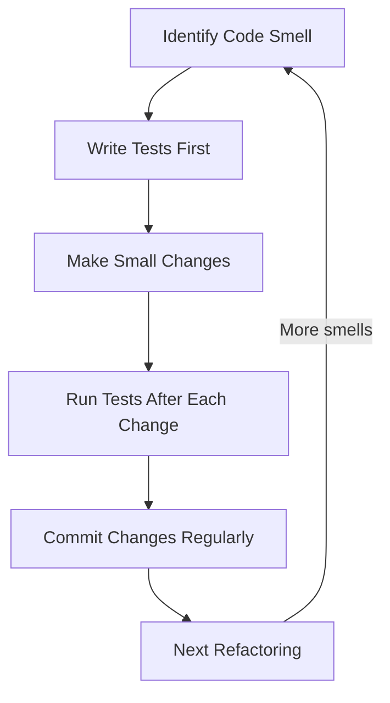

# Code Refactoring

## Introduction

Code refactoring is the process of restructuring existing code without changing its external behavior. Think of it as "cleaning up" your code - much like reorganizing a messy room without throwing anything important away. When you refactor code, you're improving its internal structure while preserving its functionality.

For beginners, understanding refactoring is crucial because:
- It helps you write cleaner, more maintainable code
- It makes your programs more efficient
- It reduces bugs and makes them easier to find
- It prepares your codebase for future enhancements

In this guide, we'll explore the fundamentals of code refactoring, common techniques, and practical examples to help you develop this essential programming skill.

## Why Refactor Code?

Before diving into how to refactor, let's understand why it matters:

1. **Improved Readability**: Makes code easier to understand for yourself and others
2. **Enhanced Maintainability**: Simplifies future changes and updates
3. **Bug Reduction**: Cleaner code means fewer hiding places for bugs
4. **Better Performance**: Often leads to more efficient code execution
5. **Technical Debt Reduction**: Prevents accumulated "shortcuts" from becoming major problems

## When to Refactor

Recognize these signals that indicate your code might need refactoring:

- **Code Smells**: Indicators of deeper problems in your code structure
- **Duplicate Code**: Repeated code segments that could be consolidated
- **Long Methods**: Functions doing too many things at once
- **Large Classes**: Classes with too many responsibilities
- **Confusing Logic**: Code that's difficult to understand at a glance
- **Preparing for New Features**: Before adding functionality to existing code

## Common Refactoring Techniques

### 1. Extract Method

Break long methods into smaller, more focused ones.

**Before Refactoring:**

```javascript
function processUserData(user) {
  // Validate user data
  if (!user.name || user.name.length < 2) {
    console.log('Invalid name');
    return false;
  }
  if (!user.email || !user.email.includes('@')) {
    console.log('Invalid email');
    return false;
  }
  
  // Process user data
  const formattedName = user.name.trim().toLowerCase();
  const domain = user.email.split('@')[1];
  
  // Save user data
  database.save({
    name: formattedName,
    email: user.email,
    domain: domain,
    created: new Date()
  });
  
  return true;
}
```

**After Refactoring:**

```javascript
function processUserData(user) {
  if (!validateUser(user)) {
    return false;
  }
  
  const processedData = prepareUserData(user);
  saveUserData(processedData);
  
  return true;
}

function validateUser(user) {
  if (!user.name || user.name.length < 2) {
    console.log('Invalid name');
    return false;
  }
  if (!user.email || !user.email.includes('@')) {
    console.log('Invalid email');
    return false;
  }
  return true;
}

function prepareUserData(user) {
  const formattedName = user.name.trim().toLowerCase();
  const domain = user.email.split('@')[1];
  
  return {
    name: formattedName,
    email: user.email,
    domain: domain,
    created: new Date()
  };
}

function saveUserData(data) {
  database.save(data);
}
```

### 2. Rename Variables and Methods

Use descriptive names that explain what the code does.

**Before Refactoring:**

```python
def calc(a, b, op):
    if op == 1:
        return a + b
    elif op == 2:
        return a - b
    elif op == 3:
        return a * b
    else:
        return a / b
```

**After Refactoring:**

```python
def calculate(first_number, second_number, operation):
    if operation == 1:
        return add(first_number, second_number)
    elif operation == 2:
        return subtract(first_number, second_number)
    elif operation == 3:
        return multiply(first_number, second_number)
    else:
        return divide(first_number, second_number)

def add(a, b):
    return a + b

def subtract(a, b):
    return a - b

def multiply(a, b):
    return a * b

def divide(a, b):
    return a / b
```

### 3. Remove Duplicate Code

Consolidate repeated code into reusable functions.

**Before Refactoring:**

```java
public void processStudent(Student student) {
    // Calculate grade average
    double sum = 0;
    for (int i = 0; i < student.grades.length; i++) {
        sum += student.grades[i];
    }
    double average = sum / student.grades.length;
    System.out.println("Student average: " + average);
    
    // Other processing...
}

public void processClass(Class schoolClass) {
    // Calculate class average
    double sum = 0;
    for (int i = 0; i < schoolClass.classGrades.length; i++) {
        sum += schoolClass.classGrades[i];
    }
    double average = sum / schoolClass.classGrades.length;
    System.out.println("Class average: " + average);
    
    // Other processing...
}
```

**After Refactoring:**

```java
public void processStudent(Student student) {
    double average = calculateAverage(student.grades);
    System.out.println("Student average: " + average);
    
    // Other processing...
}

public void processClass(Class schoolClass) {
    double average = calculateAverage(schoolClass.classGrades);
    System.out.println("Class average: " + average);
    
    // Other processing...
}

private double calculateAverage(double[] numbers) {
    double sum = 0;
    for (int i = 0; i < numbers.length; i++) {
        sum += numbers[i];
    }
    return sum / numbers.length;
}
```

### 4. Replace Magic Numbers with Constants

Make your code more readable by using named constants.

**Before Refactoring:**

```c
// Calculate area of a circle
double area = 3.14159 * radius * radius;

// Calculate price with tax
double totalPrice = price + (price * 0.08);
```

**After Refactoring:**

```c
const double PI = 3.14159;
const double TAX_RATE = 0.08;

// Calculate area of a circle
double area = PI * radius * radius;

// Calculate price with tax
double totalPrice = price + (price * TAX_RATE);
```

### 5. Simplify Conditional Expressions

Make complex conditionals easier to understand.

**Before Refactoring:**

```javascript
function getInsuranceAmount(employee) {
  if ((employee.age > 65) || 
     ((employee.age > 45) && (employee.yearsOfService > 15)) || 
     ((employee.hasHealthIssues) && (employee.yearsOfService > 10))) {
    return 1000;
  } else {
    return 500;
  }
}
```

**After Refactoring:**

```javascript
function getInsuranceAmount(employee) {
  if (isEligibleForFullCoverage(employee)) {
    return 1000;
  } else {
    return 500;
  }
}

function isEligibleForFullCoverage(employee) {
  return isSenior(employee) || 
         isExperiencedMiddleAged(employee) || 
         hasLongServiceWithHealthIssues(employee);
}

function isSenior(employee) {
  return employee.age > 65;
}

function isExperiencedMiddleAged(employee) {
  return (employee.age > 45) && (employee.yearsOfService > 15);
}

function hasLongServiceWithHealthIssues(employee) {
  return (employee.hasHealthIssues) && (employee.yearsOfService > 10);
}
```

## Real-World Refactoring Example

Let's walk through a comprehensive example of refactoring a student management system:

### Initial Version

```python
class StudentSystem:
    def __init__(self):
        self.students = []
    
    def add_student(self, name, age, grades):
        self.students.append({"name": name, "age": age, "grades": grades})
    
    def print_report(self):
        for s in self.students:
            # Calculate average grade
            sum = 0
            for g in s["grades"]:
                sum += g
            avg = sum / len(s["grades"])
            
            # Determine pass/fail status
            status = "PASS"
            if avg < 60:
                status = "FAIL"
            
            # Print student info
            print(f"Name: {s['name']}, Age: {s['age']}")
            print(f"Average Grade: {avg}, Status: {status}")
            
            # Print grade distribution
            a = 0
            b = 0
            c = 0
            d = 0
            f = 0
            
            for g in s["grades"]:
                if g >= 90:
                    a += 1
                elif g >= 80:
                    b += 1
                elif g >= 70:
                    c += 1
                elif g >= 60:
                    d += 1
                else:
                    f += 1
            
            print(f"Grade Distribution: A={a}, B={b}, C={c}, D={d}, F={f}")
            print("-------------------")
```

### Refactored Version

```python
class Student:
    def __init__(self, name, age, grades):
        self.name = name
        self.age = age
        self.grades = grades
    
    def get_average_grade(self):
        if not self.grades:
            return 0
        return sum(self.grades) / len(self.grades)
    
    def get_status(self):
        return "PASS" if self.get_average_grade() >= 60 else "FAIL"
    
    def get_grade_distribution(self):
        distribution = {"A": 0, "B": 0, "C": 0, "D": 0, "F": 0}
        
        for grade in self.grades:
            if grade >= 90:
                distribution["A"] += 1
            elif grade >= 80:
                distribution["B"] += 1
            elif grade >= 70:
                distribution["C"] += 1
            elif grade >= 60:
                distribution["D"] += 1
            else:
                distribution["F"] += 1
        
        return distribution


class StudentSystem:
    def __init__(self):
        self.students = []
    
    def add_student(self, name, age, grades):
        student = Student(name, age, grades)
        self.students.append(student)
        return student
    
    def print_report(self):
        for student in self.students:
            self._print_student_report(student)
    
    def _print_student_report(self, student):
        print(f"Name: {student.name}, Age: {student.age}")
        print(f"Average Grade: {student.get_average_grade()}, Status: {student.get_status()}")
        
        distribution = student.get_grade_distribution()
        dist_string = ", ".join([f"{key}={value}" for key, value in distribution.items()])
        print(f"Grade Distribution: {dist_string}")
        print("-------------------")
```

### What Improved?

1. **Single Responsibility**: Created separate `Student` class to handle student-specific operations
2. **Encapsulation**: Student properties and behaviors are contained in the Student class
3. **Code Reusability**: Methods like `get_average_grade()` can be reused
4. **Readability**: Methods with descriptive names make code intent clearer
5. **Maintainability**: Easier to update or extend functionality

## The Refactoring Process: A Structured Approach

To effectively refactor code, follow these steps:



1. **Start with Tests**: Ensure you have tests covering the functionality you're refactoring
2. **Make One Change at a Time**: Refactor incrementally rather than overhauling everything at once
3. **Test After Each Change**: Verify functionality remains intact after each modification
4. **Use Version Control**: Commit changes frequently with clear messages
5. **Document Why, Not What**: Comment on the reasoning behind refactoring decisions

## Refactoring Tools

Modern IDEs offer tools that can automatically perform many refactoring operations:

- **VSCode**: Extensions like "JavaScript Booster" or "Refactor CSS"
- **IntelliJ/WebStorm**: Built-in refactoring tools (Extract Method, Rename, etc.)
- **Eclipse**: Robust refactoring support for Java and other languages
- **Visual Studio**: Offers comprehensive refactoring tools for C#, C++, etc.

## Best Practices for Refactoring

1. **Refactor Early and Often**: Don't wait until code becomes unmanageable
2. **Focus on Readability**: Prioritize making code understandable
3. **Keep Methods Small**: Aim for methods that do one thing well
4. **Meaningful Names**: Use descriptive names for variables, methods, and classes
5. **DRY (Don't Repeat Yourself)**: Eliminate code duplication
6. **Testing is Essential**: Always have tests in place before refactoring
7. **Communicate Changes**: Let team members know about significant refactoring

## Summary

Code refactoring is an essential skill for any programmer. By systematically improving your code without changing its behavior, you create more maintainable, readable, and efficient applications. Remember that refactoring is an ongoing process rather than a one-time task—continuously improving your code leads to better software in the long run.

As you gain experience, you'll develop an instinct for when and how to refactor. The techniques covered in this guide provide a solid foundation, but refactoring is also an art that improves with practice.

## Exercises

1. **Identify Code Smells**: Take a piece of code you've written previously and identify three areas that could benefit from refactoring.

2. **Extract Method Practice**: Find a long method (15+ lines) and break it down into smaller, more focused methods.

3. **Rename Challenge**: Review some code and improve at least 5 variable or method names to be more descriptive.

4. **Refactor Duplicate Code**: Find instances of duplicate code in your projects and refactor them into reusable methods.

5. **Advanced Project**: Take a small program (100-200 lines) and perform a comprehensive refactoring, applying multiple techniques from this guide.

## Additional Resources

- Book: "Refactoring: Improving the Design of Existing Code" by Martin Fowler
- Book: "Clean Code" by Robert C. Martin
- Website: [Refactoring.guru](https://refactoring.guru/) - Visual explanations of refactoring principles
- Website: [SourceMaking](https://sourcemaking.com/) - Detailed examples of code smells and refactoring techniques
- Course: "Refactoring to Design Patterns" on Pluralsight or similar platforms

Remember, becoming good at refactoring is a journey. Start small, practice regularly, and you'll gradually build up the skills to tackle even the most challenging code.