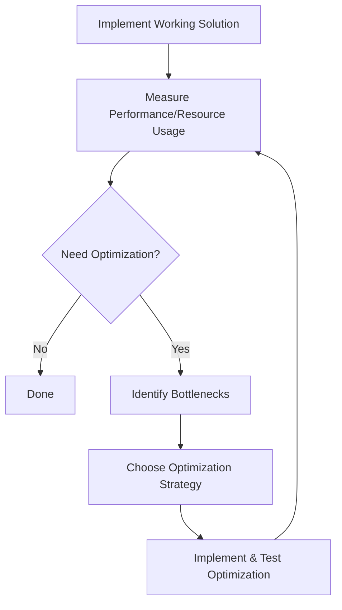

import Tabs from '@theme/Tabs';
import TabItem from '@theme/TabItem';

# Solution Optimization

## Introduction

After solving a programming problem, your initial solution might work correctly but may not be the most efficient, readable, or maintainable. Solution optimization is the process of improving your code after you've implemented a working solution. This crucial step in the problem-solving methodology helps create code that runs faster, uses fewer resources, and is easier for others (and your future self) to understand and modify.

In this guide, we'll explore various techniques to optimize your solutions across different dimensions: performance, memory usage, readability, and maintainability. We'll look at practical examples and provide you with a systematic approach to evaluating and improving your code.

## Why Optimize Your Solutions?

Before diving into how to optimize, let's understand why optimization matters:

1. **Performance**: Faster code provides better user experience and can handle larger inputs.
2. **Resource efficiency**: Optimized code uses less memory and CPU, which is crucial for resource-constrained environments.
3. **Scalability**: Well-optimized solutions can better handle growing demands and datasets.
4. **Readability**: Clear, concise code is easier to understand, debug, and maintain.
5. **Maintainability**: Code that follows best practices is easier to modify and extend.

## The Optimization Process

### 1. Measure First

Before optimizing, establish a baseline measurement of your current solution's performance.

```javascript
// Example: Measuring execution time
const startTime = performance.now();

// Your solution here
const result = yourFunction(input);

const endTime = performance.now();
console.log(`Execution time: ${endTime - startTime} ms`);
console.log(`Result: ${result}`);
```

Remember the engineering principle: **"Premature optimization is the root of all evil."** Optimize only after you have:

1. A working solution
2. Evidence that optimization is needed
3. Identified the specific bottlenecks

### 2. Time Complexity Optimization

One of the most impactful ways to optimize your solution is to reduce its time complexity.

<Tabs>
  <TabItem value="before" label="Before Optimization">

```javascript
// Finding if a number exists in an array
// Time Complexity: O(n)
function findNumber(array, target) {
  for (let i = 0; i < array.length; i++) {
    if (array[i] === target) {
      return true;
    }
  }
  return false;
}

// Usage
const numbers = [1, 5, 8, 12, 15, 21, 30];
console.log(findNumber(numbers, 12)); // Output: true
console.log(findNumber(numbers, 100)); // Output: false
```

  </TabItem>
  <TabItem value="after" label="After Optimization">

```javascript
// Using binary search (requires a sorted array)
// Time Complexity: O(log n)
function findNumber(sortedArray, target) {
  let left = 0;
  let right = sortedArray.length - 1;
  
  while (left <= right) {
    const mid = Math.floor((left + right) / 2);
    
    if (sortedArray[mid] === target) {
      return true;
    }
    
    if (sortedArray[mid] < target) {
      left = mid + 1;
    } else {
      right = mid - 1;
    }
  }
  
  return false;
}

// Usage (array must be sorted)
const numbers = [1, 5, 8, 12, 15, 21, 30];
console.log(findNumber(numbers, 12)); // Output: true
console.log(findNumber(numbers, 100)); // Output: false
```

  </TabItem>
</Tabs>

### 3. Space Complexity Optimization

Reducing memory usage is another important aspect of optimization.

<Tabs>
  <TabItem value="before" label="Before Optimization">

```javascript
// Counting occurrences of each character
// Space Complexity: O(n)
function countCharacters(str) {
  const result = {};
  
  for (let i = 0; i < str.length; i++) {
    const char = str[i];
    result[char] = (result[char] || 0) + 1;
  }
  
  return result;
}

// Usage
console.log(countCharacters("hello"));
// Output: { h: 1, e: 1, l: 2, o: 1 }
```

  </TabItem>
  <TabItem value="after" label="After Optimization">

```javascript
// Using a Map instead of a regular object
// Still O(n) space complexity but more efficient in practice
function countCharacters(str) {
  const result = new Map();
  
  for (let i = 0; i < str.length; i++) {
    const char = str[i];
    result.set(char, (result.get(char) || 0) + 1);
  }
  
  return result;
}

// Usage
const counts = countCharacters("hello");
for (const [char, count] of counts) {
  console.log(`${char}: ${count}`);
}
// Output:
// h: 1
// e: 1
// l: 2
// o: 1
```

  </TabItem>
</Tabs>

### 4. Algorithmic Improvements

Sometimes the best optimization comes from choosing a more appropriate algorithm or data structure.

<Tabs>
  <TabItem value="before" label="Before Optimization">

```javascript
// Finding the nth Fibonacci number using recursion
// Time Complexity: O(2^n) - exponential!
function fibonacci(n) {
  if (n <= 1) return n;
  return fibonacci(n - 1) + fibonacci(n - 2);
}

console.log(fibonacci(10)); // Output: 55
// But try fibonacci(45) and your program will hang!
```

  </TabItem>
  <TabItem value="after" label="After Optimization">

```javascript
// Using dynamic programming
// Time Complexity: O(n)
function fibonacci(n) {
  if (n <= 1) return n;
  
  let a = 0;
  let b = 1;
  
  for (let i = 2; i <= n; i++) {
    const temp = a + b;
    a = b;
    b = temp;
  }
  
  return b;
}

console.log(fibonacci(10)); // Output: 55
console.log(fibonacci(45)); // Output: 1134903170
// Works almost instantly even for large values
```

  </TabItem>
</Tabs>

### 5. Code Readability Optimization

Clean, readable code is easier to maintain and less prone to bugs.

<Tabs>
  <TabItem value="before" label="Before Optimization">

```javascript
// Checking if a year is a leap year
function f(y) {
  if (y % 400 == 0) return true;
  if (y % 100 == 0) return false;
  return y % 4 == 0;
}

console.log(f(2020)); // Output: true
console.log(f(1900)); // Output: false
```

  </TabItem>
  <TabItem value="after" label="After Optimization">

```javascript
// Improved readability with better naming and comments
/**
 * Determines if a given year is a leap year.
 * @param {number} year - The year to check
 * @return {boolean} True if the year is a leap year, false otherwise
 */
function isLeapYear(year) {
  // Leap year rules:
  // 1. If divisible by 400 -> leap year
  // 2. If divisible by 100 but not by 400 -> not a leap year
  // 3. If divisible by 4 but not by 100 -> leap year
  if (year % 400 === 0) return true;
  if (year % 100 === 0) return false;
  return year % 4 === 0;
}

console.log(isLeapYear(2020)); // Output: true
console.log(isLeapYear(1900)); // Output: false
```

  </TabItem>
</Tabs>

### 6. Refactoring for Maintainability

Breaking down complex functions into smaller, reusable ones improves maintainability.

<Tabs>
  <TabItem value="before" label="Before Optimization">

```javascript
// A function that does multiple things
function processUserData(userData) {
  // Validate user data
  if (!userData.name || userData.name.trim() === '') {
    throw new Error('Name is required');
  }
  if (!userData.email || !userData.email.includes('@')) {
    throw new Error('Valid email is required');
  }
  if (userData.age && (isNaN(userData.age) || userData.age < 0)) {
    throw new Error('Age must be a positive number');
  }
  
  // Format user data
  const formattedData = {
    name: userData.name.trim(),
    email: userData.email.toLowerCase(),
    age: userData.age ? parseInt(userData.age) : null,
    createdAt: new Date()
  };
  
  // Save to database (simulated)
  console.log('Saving to database:', formattedData);
  
  return formattedData;
}

// Usage
const user = { name: '  John Doe  ', email: 'JOHN@example.com', age: '30' };
processUserData(user);
```

  </TabItem>
  <TabItem value="after" label="After Optimization">

```javascript
// Separated into smaller, single-responsibility functions
function validateUserData(userData) {
  if (!userData.name || userData.name.trim() === '') {
    throw new Error('Name is required');
  }
  if (!userData.email || !userData.email.includes('@')) {
    throw new Error('Valid email is required');
  }
  if (userData.age && (isNaN(userData.age) || userData.age < 0)) {
    throw new Error('Age must be a positive number');
  }
}

function formatUserData(userData) {
  return {
    name: userData.name.trim(),
    email: userData.email.toLowerCase(),
    age: userData.age ? parseInt(userData.age) : null,
    createdAt: new Date()
  };
}

function saveUserToDatabase(formattedData) {
  // In a real app, this would interact with a database
  console.log('Saving to database:', formattedData);
  return formattedData;
}

function processUserData(userData) {
  validateUserData(userData);
  const formattedData = formatUserData(userData);
  return saveUserToDatabase(formattedData);
}

// Usage
const user = { name: '  John Doe  ', email: 'JOHN@example.com', age: '30' };
processUserData(user);
```

  </TabItem>
</Tabs>

## Common Optimization Techniques

### 1. Caching & Memoization

Storing results of expensive function calls can dramatically improve performance.

```javascript
// Memoization example
function memoizedFibonacci() {
  const cache = {};
  
  return function fib(n) {
    if (n in cache) {
      return cache[n];
    }
    
    if (n <= 1) {
      cache[n] = n;
    } else {
      cache[n] = fib(n - 1) + fib(n - 2);
    }
    
    return cache[n];
  };
}

const fibonacci = memoizedFibonacci();
console.log(fibonacci(50)); // Returns instantly
```

### 2. Early Returns

Exiting a function early when possible can improve readability and performance.

```javascript
// Before
function processItem(item) {
  let result = null;
  if (item) {
    if (item.isValid) {
      if (item.value > 0) {
        result = item.value * 2;
      }
    }
  }
  return result;
}

// After
function processItem(item) {
  if (!item) return null;
  if (!item.isValid) return null;
  if (item.value <= 0) return null;
  
  return item.value * 2;
}
```

### 3. Batch Processing

Processing items in batches can be more efficient than one at a time.

```javascript
// DOM manipulation example
// Before (slow) - causes multiple reflows and repaints
function addItemsSlow(items) {
  const list = document.getElementById('itemList');
  
  for (const item of items) {
    const li = document.createElement('li');
    li.textContent = item;
    list.appendChild(li); // Forces browser to recalculate layout each time
  }
}

// After (fast) - single reflow and repaint
function addItemsFast(items) {
  const list = document.getElementById('itemList');
  const fragment = document.createDocumentFragment();
  
  for (const item of items) {
    const li = document.createElement('li');
    li.textContent = item;
    fragment.appendChild(li);
  }
  
  list.appendChild(fragment); // Only one DOM update
}
```

## Optimization Decision Process

When optimizing your solution, follow this decision process:



## Real-world Example: Contact Search Application

Let's optimize a simple contact search application:

<Tabs>
  <TabItem value="initial" label="Initial Solution">

```javascript
class ContactManager {
  constructor() {
    this.contacts = [];
  }
  
  addContact(name, email, phone) {
    this.contacts.push({ name, email, phone });
  }
  
  searchContacts(query) {
    // Simple linear search
    return this.contacts.filter(contact => {
      return contact.name.includes(query) || 
             contact.email.includes(query) || 
             contact.phone.includes(query);
    });
  }
}

// Usage
const manager = new ContactManager();
manager.addContact("John Smith", "john@example.com", "555-1234");
manager.addContact("Jane Doe", "jane@example.com", "555-5678");
manager.addContact("Bob Johnson", "bob@example.com", "555-9012");

// Search - works but slow for large datasets
console.log(manager.searchContacts("john"));
```

  </TabItem>
  <TabItem value="optimized" label="Optimized Solution">

```javascript
class ContactManager {
  constructor() {
    this.contacts = [];
    this.nameIndex = {}; // Index for faster searching
    this.emailIndex = {};
    this.phoneIndex = {};
  }
  
  addContact(name, email, phone) {
    const contact = { id: this.contacts.length, name, email, phone };
    this.contacts.push(contact);
    
    // Add to indices (lowercase for case-insensitive search)
    this._addToIndex(this.nameIndex, name.toLowerCase(), contact.id);
    this._addToIndex(this.emailIndex, email.toLowerCase(), contact.id);
    this._addToIndex(this.phoneIndex, phone, contact.id);
    
    return contact;
  }
  
  _addToIndex(index, key, contactId) {
    // For each substring, add the contact ID to the index
    for (let i = 0; i < key.length; i++) {
      for (let j = i + 1; j <= key.length; j++) {
        const substring = key.substring(i, j);
        if (!index[substring]) {
          index[substring] = new Set();
        }
        index[substring].add(contactId);
      }
    }
  }
  
  searchContacts(query) {
    query = query.toLowerCase();
    
    // Get IDs from indices
    const nameMatches = this.nameIndex[query] || new Set();
    const emailMatches = this.emailIndex[query] || new Set();
    const phoneMatches = this.phoneIndex[query] || new Set();
    
    // Combine results
    const matchingIds = new Set([...nameMatches, ...emailMatches, ...phoneMatches]);
    
    // Return actual contact objects
    return Array.from(matchingIds).map(id => this.contacts[id]);
  }
}

// Usage
const manager = new ContactManager();
manager.addContact("John Smith", "john@example.com", "555-1234");
manager.addContact("Jane Doe", "jane@example.com", "555-5678");
manager.addContact("Bob Johnson", "bob@example.com", "555-9012");

// Search - much faster due to indexing
console.log(manager.searchContacts("john"));
```

  </TabItem>
</Tabs>

The optimized solution uses an indexing approach that drastically improves search performance for large contact lists, at the cost of additional memory usage and more complex code. This is a common trade-off in optimization.

## When Not to Optimize

Not every piece of code needs optimization. Consider these factors:

1. **Is it running in a critical path?** Focus on optimizing code that runs frequently or affects user experience.
2. **Is the current performance sufficient?** If it's already fast enough, optimization might not be necessary.
3. **Will optimization make the code harder to maintain?** Sometimes clarity is more important than minor performance gains.
4. **Is it premature?** Avoid optimizing code that hasn't been tested with real-world data and usage patterns.

## Summary

Solution optimization is a crucial part of the problem-solving methodology that transforms a working solution into an excellent one. By focusing on performance, memory usage, readability, and maintainability, you can create code that is not only correct but also efficient and sustainable over time.

Key takeaways:
- Always measure before and after optimization to ensure your changes are effective
- Consider both time and space complexity
- Choose appropriate algorithms and data structures
- Improve code readability and maintainability
- Use techniques like caching, memoization, and early returns where appropriate
- Remember that not all code needs optimization - prioritize critical sections

By incorporating optimization into your problem-solving workflow, you'll become a more effective programmer capable of creating solutions that stand the test of time and scale.

## Exercises

1. Take a simple algorithm you've written (like searching, sorting, or data processing) and identify at least two ways to optimize it.
2. Profile a piece of your code to find bottlenecks, then apply appropriate optimizations.
3. Refactor a complex function into smaller, more maintainable functions without changing its behavior.
4. Implement a memoization wrapper that can be applied to any pure function to cache its results.
5. Compare the performance of different data structures (array, object, Map, Set) for a specific use case to determine the most efficient option.

## Additional Resources

- **Books**:
  - "Clean Code" by Robert C. Martin
  - "Refactoring: Improving the Design of Existing Code" by Martin Fowler
  - "The Art of Computer Programming" by Donald Knuth

- **Online Courses**:
  - Data Structures and Algorithms specializations on platforms like Coursera and edX
  - Frontend performance optimization courses

- **Tools**:
  - Performance profilers for your language/environment
  - Code linters and analyzers

Happy coding and optimizing!