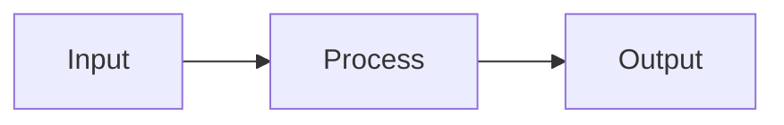
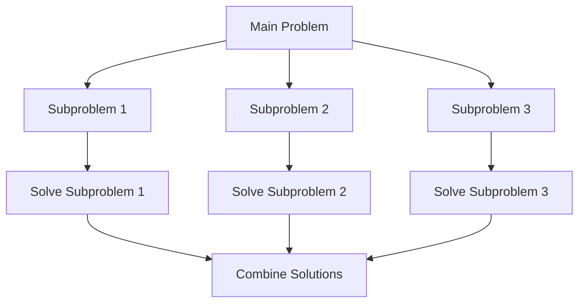
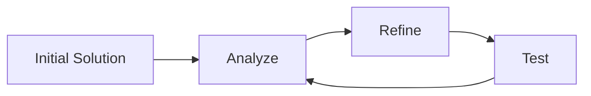
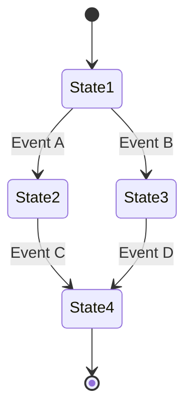

# Problem Solving Templates

## Introduction

When facing programming challenges, beginners often don't know where to start. Problem solving templates provide structured approaches to tackle different types of problems systematically. These templates are reusable frameworks that guide your thinking process, breaking complex problems into manageable steps.

In this guide, we'll explore several problem solving templates that you can apply to common programming challenges. By internalizing these templates, you'll develop a mental toolkit that helps you approach new problems with confidence and clarity.

## Why Use Problem Solving Templates?

Before diving into specific templates, let's understand why they're valuable:

1. **Structured thinking** - Templates provide a clear path to follow when you're stuck
2. **Reduced cognitive load** - You don't have to reinvent the solution approach for similar problems
3. **Increased efficiency** - With practice, you'll solve common problem types faster
4. **Better communication** - Templates give you a vocabulary to discuss approaches with others

## Essential Problem Solving Templates

### 1. The Input-Process-Output (IPO) Template

The IPO template is fundamental for breaking down any programming task.



#### How to apply it:

1. **Input**: What data do you have? What format is it in?
2. **Process**: What transformations need to be applied to the input?
3. **Output**: What should the final result look like?

#### Example: Building a Temperature Converter

```javascript
// Input: Temperature in Celsius
const celsiusTemp = 25;

// Process: Apply conversion formula
const fahrenheitTemp = (celsiusTemp * 9/5) + 32;

// Output: Display the result
console.log(`${celsiusTemp}°C is ${fahrenheitTemp}°F`);
```

**Output:**
```
25°C is 77°F
```

### 2. The Divide and Conquer Template

This template helps tackle complex problems by breaking them into smaller, more manageable subproblems.



#### Steps:

1. Break down the main problem into smaller subproblems
2. Solve each subproblem independently
3. Combine the solutions to solve the original problem

#### Example: Calculating Statistics for a Dataset

```python
def calculate_statistics(numbers):
    # Divide: Break down into subproblems
    # Subproblem 1: Find the sum
    total = sum(numbers)
    
    # Subproblem 2: Find the mean
    mean = total / len(numbers) if numbers else 0
    
    # Subproblem 3: Find the minimum and maximum
    minimum = min(numbers) if numbers else None
    maximum = max(numbers) if numbers else None
    
    # Subproblem 4: Find the range
    value_range = maximum - minimum if numbers else 0
    
    # Conquer: Combine solutions
    return {
        "sum": total,
        "mean": mean,
        "min": minimum,
        "max": maximum,
        "range": value_range
    }

# Test the function
data = [5, 2, 9, 1, 7, 4, 6]
result = calculate_statistics(data)
print(result)
```

**Output:**
```
{'sum': 34, 'mean': 4.857142857142857, 'min': 1, 'max': 9, 'range': 8}
```

### 3. The Iterative Refinement Template

This template starts with a basic solution and gradually improves it.



#### Steps:

1. Create a simple working solution (brute force is fine)
2. Analyze its limitations and bottlenecks
3. Refine and improve the solution
4. Test and validate the improvements
5. Repeat steps 2-4 until you reach a satisfactory solution

#### Example: Optimizing a Search Function

**Initial Solution (Brute Force):**

```javascript
// Initial Solution: Linear search
function findElement(array, target) {
  for (let i = 0; i < array.length; i++) {
    if (array[i] === target) {
      return i;
    }
  }
  return -1;
}

// Test with a large array
const testArray = Array.from({ length: 10000 }, (_, i) => i);
console.time('Linear Search');
const linearResult = findElement(testArray, 9500);
console.timeEnd('Linear Search');
console.log(`Found at index: ${linearResult}`);
```

**Refined Solution (Binary Search for sorted arrays):**

```javascript
// Refined Solution: Binary search
function findElementOptimized(sortedArray, target) {
  let left = 0;
  let right = sortedArray.length - 1;
  
  while (left <= right) {
    const mid = Math.floor((left + right) / 2);
    
    if (sortedArray[mid] === target) {
      return mid;
    } else if (sortedArray[mid] < target) {
      left = mid + 1;
    } else {
      right = mid - 1;
    }
  }
  
  return -1;
}

// Test with the same array (which is already sorted)
console.time('Binary Search');
const binaryResult = findElementOptimized(testArray, 9500);
console.timeEnd('Binary Search');
console.log(`Found at index: ${binaryResult}`);
```

**Typical Output:**
```
Linear Search: 0.123ms
Found at index: 9500
Binary Search: 0.021ms
Found at index: 9500
```

### 4. The Pattern Matching Template

This template involves identifying recurring patterns in problems you've solved before.

#### Steps:

1. Analyze the new problem carefully
2. Look for similarities with problems you've solved previously
3. Identify the core pattern
4. Adapt the known solution to fit the new problem

#### Example: Recognizing a Common Pattern

Let's take two seemingly different problems:

**Problem 1**: Count the frequency of each character in a string.  
**Problem 2**: Find the number of occurrences of each element in an array.

Both problems follow the same counting pattern:

```javascript
// Generic pattern for counting occurrences
function countOccurrences(items) {
  const counts = {};
  
  for (let item of items) {
    if (counts[item]) {
      counts[item]++;
    } else {
      counts[item] = 1;
    }
  }
  
  return counts;
}

// Problem 1: Count character frequencies
const text = "hello world";
const charFrequency = countOccurrences(text);
console.log("Character frequencies:", charFrequency);

// Problem 2: Count array element occurrences 
const numbers = [1, 2, 3, 2, 1, 3, 1, 4, 5];
const numberFrequency = countOccurrences(numbers);
console.log("Number frequencies:", numberFrequency);
```

**Output:**
```
Character frequencies: {h: 1, e: 1, l: 3, o: 2, " ": 1, w: 1, r: 1, d: 1}
Number frequencies: {1: 3, 2: 2, 3: 2, 4: 1, 5: 1}
```

### 5. The State Machine Template

This template views a problem as a series of states and transitions between them.



#### Steps:

1. Identify all possible states in your problem
2. Define the transitions between states
3. Implement the logic for each state and transition

#### Example: Parsing a Simple CSV File

```javascript
function parseCSV(input) {
  const STATES = {
    START_ROW: "START_ROW",
    IN_FIELD: "IN_FIELD",
    IN_QUOTED_FIELD: "IN_QUOTED_FIELD",
    QUOTE_IN_QUOTED_FIELD: "QUOTE_IN_QUOTED_FIELD",
    END_FIELD: "END_FIELD"
  };
  
  let state = STATES.START_ROW;
  let currentField = "";
  const fields = [];
  const rows = [];
  
  for (let i = 0; i < input.length; i++) {
    const char = input[i];
    
    switch (state) {
      case STATES.START_ROW:
        if (char === '"') {
          state = STATES.IN_QUOTED_FIELD;
        } else if (char === ',') {
          fields.push("");
          state = STATES.END_FIELD;
        } else if (char === '\n') {
          fields.push("");
          rows.push([...fields]);
          fields.length = 0;
        } else {
          currentField = char;
          state = STATES.IN_FIELD;
        }
        break;
        
      case STATES.IN_FIELD:
        if (char === ',') {
          fields.push(currentField);
          currentField = "";
          state = STATES.START_ROW;
        } else if (char === '\n') {
          fields.push(currentField);
          rows.push([...fields]);
          fields.length = 0;
          currentField = "";
          state = STATES.START_ROW;
        } else {
          currentField += char;
        }
        break;
        
      case STATES.IN_QUOTED_FIELD:
        if (char === '"') {
          state = STATES.QUOTE_IN_QUOTED_FIELD;
        } else {
          currentField += char;
        }
        break;
        
      case STATES.QUOTE_IN_QUOTED_FIELD:
        if (char === '"') {
          currentField += char;
          state = STATES.IN_QUOTED_FIELD;
        } else if (char === ',') {
          fields.push(currentField);
          currentField = "";
          state = STATES.START_ROW;
        } else if (char === '\n') {
          fields.push(currentField);
          rows.push([...fields]);
          fields.length = 0;
          currentField = "";
          state = STATES.START_ROW;
        }
        break;
    }
  }
  
  // Handle any remaining field
  if (currentField !== "" || state === STATES.END_FIELD) {
    fields.push(currentField);
  }
  
  // Handle any remaining row
  if (fields.length > 0) {
    rows.push([...fields]);
  }
  
  return rows;
}

// Test the CSV parser
const csvData = 'name,age,city\n"John ""The Great""",25,New York\nAlice,30,"San Francisco, CA"';
const parsed = parseCSV(csvData);
console.log(parsed);
```

**Output:**
```
[
  ["name", "age", "city"],
  ["John \"The Great\"", "25", "New York"],
  ["Alice", "30", "San Francisco, CA"]
]
```

## Real-World Applications

### Example 1: Building a Weather App

Let's see how to use the IPO template to build a simple weather app:

1. **Input**: User location (city name or coordinates)
2. **Process**: 
   - Fetch weather data from an API
   - Parse the JSON response
   - Extract relevant information (temperature, conditions, etc.)
3. **Output**: Display formatted weather information to the user

```javascript
// Input: Get user location (simplified example)
const userCity = "New York";

// Process: Fetch and process weather data
async function getWeather(city) {
  try {
    // In a real app, you would use an actual API key
    const response = await fetch(`https://api.example.com/weather?city=${city}&apikey=YOUR_API_KEY`);
    const data = await response.json();
    
    // Process the data
    return {
      temperature: data.main.temp,
      condition: data.weather[0].main,
      humidity: data.main.humidity,
      windSpeed: data.wind.speed
    };
  } catch (error) {
    console.error("Failed to fetch weather data:", error);
    return null;
  }
}

// Output: Display the weather information
async function displayWeather() {
  const weatherData = await getWeather(userCity);
  
  if (weatherData) {
    console.log(`Weather in ${userCity}:`);
    console.log(`Temperature: ${weatherData.temperature}°C`);
    console.log(`Condition: ${weatherData.condition}`);
    console.log(`Humidity: ${weatherData.humidity}%`);
    console.log(`Wind Speed: ${weatherData.windSpeed} m/s`);
  } else {
    console.log("Unable to retrieve weather information.");
  }
}

displayWeather();
```

### Example 2: Implementing a Shopping Cart

Using the State Machine template for a shopping cart:

```javascript
class ShoppingCart {
  constructor() {
    this.state = "EMPTY";
    this.items = [];
    this.total = 0;
  }
  
  addItem(item) {
    this.items.push(item);
    this.total += item.price;
    
    if (this.state === "EMPTY") {
      this.state = "ITEMS_ADDED";
    }
    
    console.log(`Added ${item.name} to cart. Total: $${this.total.toFixed(2)}`);
  }
  
  removeItem(itemId) {
    const index = this.items.findIndex(item => item.id === itemId);
    
    if (index !== -1) {
      const item = this.items[index];
      this.total -= item.price;
      this.items.splice(index, 1);
      
      if (this.items.length === 0) {
        this.state = "EMPTY";
      }
      
      console.log(`Removed ${item.name} from cart. Total: $${this.total.toFixed(2)}`);
    }
  }
  
  checkout() {
    if (this.state === "EMPTY") {
      console.log("Cannot checkout an empty cart");
      return;
    }
    
    this.state = "CHECKING_OUT";
    console.log("Processing payment...");
    
    // Simulate payment processing
    setTimeout(() => {
      console.log(`Payment successful! Purchased ${this.items.length} items for $${this.total.toFixed(2)}`);
      this.items = [];
      this.total = 0;
      this.state = "EMPTY";
    }, 2000);
  }
  
  getStatus() {
    return {
      state: this.state,
      itemCount: this.items.length,
      total: this.total
    };
  }
}

// Usage example
const cart = new ShoppingCart();
cart.addItem({ id: 1, name: "T-shirt", price: 19.99 });
cart.addItem({ id: 2, name: "Jeans", price: 49.99 });
console.log(cart.getStatus());
cart.removeItem(1);
console.log(cart.getStatus());
cart.checkout();
```

**Output:**
```
Added T-shirt to cart. Total: $19.99
Added Jeans to cart. Total: $69.98
{ state: 'ITEMS_ADDED', itemCount: 2, total: 69.98 }
Removed T-shirt from cart. Total: $49.99
{ state: 'ITEMS_ADDED', itemCount: 1, total: 49.99 }
Processing payment...
Payment successful! Purchased 1 items for $49.99
```

## Creating Your Own Templates

As you gain experience, you'll develop your own problem-solving templates. Here's how to create them:

1. **Identify patterns** in problems you've solved
2. **Abstract the approach** into a reusable template
3. **Document the steps** clearly
4. **Test the template** on new problems
5. **Refine it** based on feedback and results

## Summary

Problem-solving templates provide valuable frameworks to approach programming challenges systematically. In this guide, we've covered several essential templates:

- **Input-Process-Output (IPO)**: Break down problems into what you have, what you need to do, and what you need to produce.
- **Divide and Conquer**: Split complex problems into smaller, manageable subproblems.
- **Iterative Refinement**: Start with a simple solution and improve it step by step.
- **Pattern Matching**: Recognize similarities with previously solved problems.
- **State Machine**: Model problems as states and transitions between them.

By practicing these templates and developing your own, you'll become more efficient at solving programming problems and build confidence in your abilities.

## Exercises

1. **Template Identification**: Take three programming problems you've solved recently and identify which template(s) you used, even if unconsciously.

2. **Template Application**: Choose a problem from a coding platform like LeetCode or HackerRank and solve it using each of the templates discussed in this guide.

3. **Template Creation**: Develop your own problem-solving template for a specific type of problem you encounter frequently.

4. **Real-world Application**: Apply the Divide and Conquer template to build a file processing utility that handles large text files by processing them in chunks.

5. **State Machine Implementation**: Use the State Machine template to implement a simple text parser for a domain-specific language of your choice.

## Additional Resources

- "How to Solve It" by George Pólya - A classic book on problem-solving approaches
- "Think Like a Programmer" by V. Anton Spraul - Offers structured problem-solving techniques
- "Design Patterns" by Erich Gamma, et al. - Advanced templates for software design problems

Remember, becoming proficient with these templates takes practice. The more problems you solve using them, the more natural they'll become and the more efficiently you'll tackle new challenges.