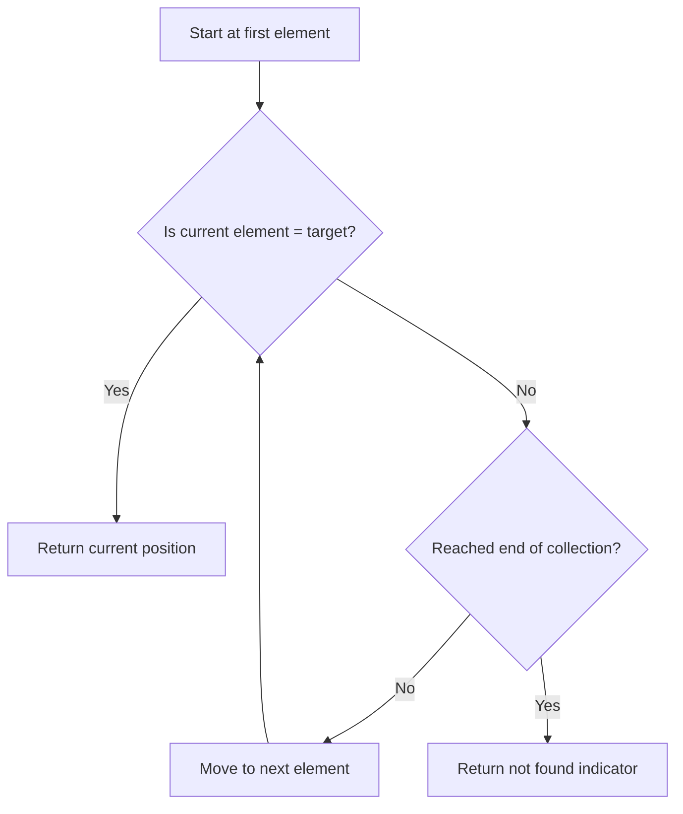

# Linear Search

## Introduction

Linear search is one of the simplest searching algorithms in computer science. Also known as sequential search, it works by checking each element in a collection one by one until the desired element is found or the entire collection has been searched.

While not the most efficient for large datasets, linear search has its place in programming due to its simplicity and effectiveness for small datasets or unsorted collections. This makes it an excellent starting point for beginners learning about searching algorithms.

## How Linear Search Works

The linear search algorithm follows a straightforward approach:

1. Start from the first element of the collection
2. Compare each element with the target value
3. If a match is found, return the position (index)
4. If no match is found after checking all elements, return a value indicating "not found" (typically -1)

Let's visualize this with a simple diagram:



## Linear Search Implementation

### Implementation in JavaScript

Let's implement a basic linear search function in JavaScript:

```javascript
function linearSearch(arr, target) {
  // Loop through each element in the array
  for (let i = 0; i < arr.length; i++) {
    // If the current element matches the target
    if (arr[i] === target) {
      return i; // Return the index where found
    }
  }
  
  // If we reach here, the element was not found
  return -1;
}

// Example usage
const numbers = [5, 2, 9, 1, 7, 4, 8, 3];
const targetValue = 7;
const result = linearSearch(numbers, targetValue);

if (result !== -1) {
  console.log(`Found ${targetValue} at index ${result}`);
} else {
  console.log(`${targetValue} not found in the array`);
}
```

**Output:**
```
Found 7 at index 4
```

### Implementation in Python

Here's the same algorithm implemented in Python:

```python
def linear_search(arr, target):
    # Loop through each element in the array
    for i in range(len(arr)):
        # If the current element matches the target
        if arr[i] == target:
            return i  # Return the index where found
    
    # If we reach here, the element was not found
    return -1

# Example usage
numbers = [5, 2, 9, 1, 7, 4, 8, 3]
target_value = 7
result = linear_search(numbers, target_value)

if result != -1:
    print(f"Found {target_value} at index {result}")
else:
    print(f"{target_value} not found in the array")
```

**Output:**
```
Found 7 at index 4
```

## Time and Space Complexity Analysis

### Time Complexity

- **Best Case**: O(1) - When the target element is the first element in the collection
- **Average Case**: O(n/2) ≈ O(n) - On average, we need to check half the elements
- **Worst Case**: O(n) - When the target element is the last element or not present at all

Where n is the number of elements in the collection.

### Space Complexity

- **Space Complexity**: O(1) - Linear search requires only a constant amount of additional space regardless of input size

## Advantages and Disadvantages

### Advantages

1. **Simple to understand and implement** - Requires minimal coding
2. **No preprocessing required** - Works with unsorted data
3. **Memory efficient** - Only uses a constant amount of extra space
4. **Works with any data type** - As long as equality comparison is defined

### Disadvantages

1. **Inefficient for large datasets** - O(n) time complexity becomes slow for large collections
2. **Not suitable for frequently searched collections** - Other algorithms like binary search perform much better (for sorted data)

## When to Use Linear Search

Linear search is most appropriate in the following scenarios:

1. When working with small datasets
2. When the collection is not sorted
3. When searching is performed infrequently
4. When implementing a simple, quick solution
5. When the overhead of more complex algorithms would outweigh benefits

## Practical Examples

### Example 1: Finding a Student by ID

Imagine you have a small class of students and need to find a specific student by their ID:

```javascript
function findStudentById(students, targetId) {
  for (let i = 0; i < students.length; i++) {
    if (students[i].id === targetId) {
      return students[i];
    }
  }
  return null; // Student not found
}

const classRoster = [
  { id: "S001", name: "Alice", grade: "A" },
  { id: "S002", name: "Bob", grade: "B" },
  { id: "S003", name: "Charlie", grade: "A-" },
  { id: "S004", name: "Diana", grade: "B+" }
];

const searchId = "S003";
const student = findStudentById(classRoster, searchId);

if (student) {
  console.log(`Found student: ${student.name} with grade ${student.grade}`);
} else {
  console.log(`No student found with ID ${searchId}`);
}
```

**Output:**
```
Found student: Charlie with grade A-
```

### Example 2: Checking for a Valid Username

Linear search can be used to verify if a username exists in a system:

```python
def is_username_taken(existing_usernames, new_username):
    for username in existing_usernames:
        if username.lower() == new_username.lower():
            return True  # Username is already taken
    return False  # Username is available

registered_users = ["john_doe", "alice123", "bobsmith", "coder99"]
username_to_check = "alice123"

if is_username_taken(registered_users, username_to_check):
    print(f"Sorry, username '{username_to_check}' is already taken.")
else:
    print(f"Username '{username_to_check}' is available!")
```

**Output:**
```
Sorry, username 'alice123' is already taken.
```

## Optimizing Linear Search

While linear search is inherently O(n), there are a few ways to optimize it in certain scenarios:

### Early Termination

This is already included in our implementations - we stop as soon as we find the target.

### Improved Average-Case Performance for Frequently Searched Items

For elements that are frequently searched, moving them toward the beginning of the collection can improve performance:

```javascript
function linearSearchWithTransposition(arr, target) {
  for (let i = 0; i < arr.length; i++) {
    if (arr[i] === target) {
      // If found, swap with previous element (unless it's the first element)
      // This gradually brings frequently searched items toward the front
      if (i > 0) {
        [arr[i], arr[i-1]] = [arr[i-1], arr[i]];
        return i - 1; // Return the new position
      }
      return i;
    }
  }
  return -1;
}
```

### Sentinel-Based Linear Search

Adding a sentinel at the end can eliminate the need for the boundary check in each iteration:

```javascript
function sentinelLinearSearch(arr, target) {
  const n = arr.length;
  
  // Save the last element and replace it with the target temporarily
  const last = arr[n - 1];
  arr[n - 1] = target;
  
  let i = 0;
  // No need to check for array boundary since we know we'll find the target
  while (arr[i] !== target) {
    i++;
  }
  
  // Restore the original last element
  arr[n - 1] = last;
  
  // If i < n-1, we found the element before reaching the sentinel
  // If i === n-1, we need to check if it was the sentinel or the actual last element
  if (i < n - 1 || arr[n - 1] === target) {
    return i;
  }
  return -1;
}
```

## Summary

Linear search is a fundamental algorithm that every programmer should understand:

- It works by sequentially checking each element until finding a match
- It has O(n) worst-case time complexity and O(1) space complexity
- While not the most efficient for large datasets, it is simple to implement and suitable for small or unsorted collections
- It requires no preprocessing and works with any data type that supports equality comparison

Despite its simplicity, linear search remains relevant in real-world programming, especially for small datasets or when working with unsorted data.

## Practice Exercises

1. **Basic Implementation**: Write a linear search function in your preferred programming language and test it with different arrays and target values.

2. **Count Occurrences**: Modify the linear search algorithm to count how many times a specific element appears in an array.

3. **Find Maximum/Minimum**: Use linear search principles to write functions that find the maximum and minimum values in an unsorted array.

4. **Two-Sum Problem**: Write a function that finds two numbers in an array that add up to a specific target sum.

5. **Linear Search with Range**: Implement a linear search that only searches between specified start and end indices.

## Additional Resources

- [Khan Academy: Linear Search](https://www.khanacademy.org/computing/computer-science/algorithms/linear-search/a/linear-search)
- [GeeksforGeeks: Linear Search Algorithm](https://www.geeksforgeeks.org/linear-search/)
- [Visualgo: Sorting and Searching Visualization](https://visualgo.net/en/sorting)

Happy coding!