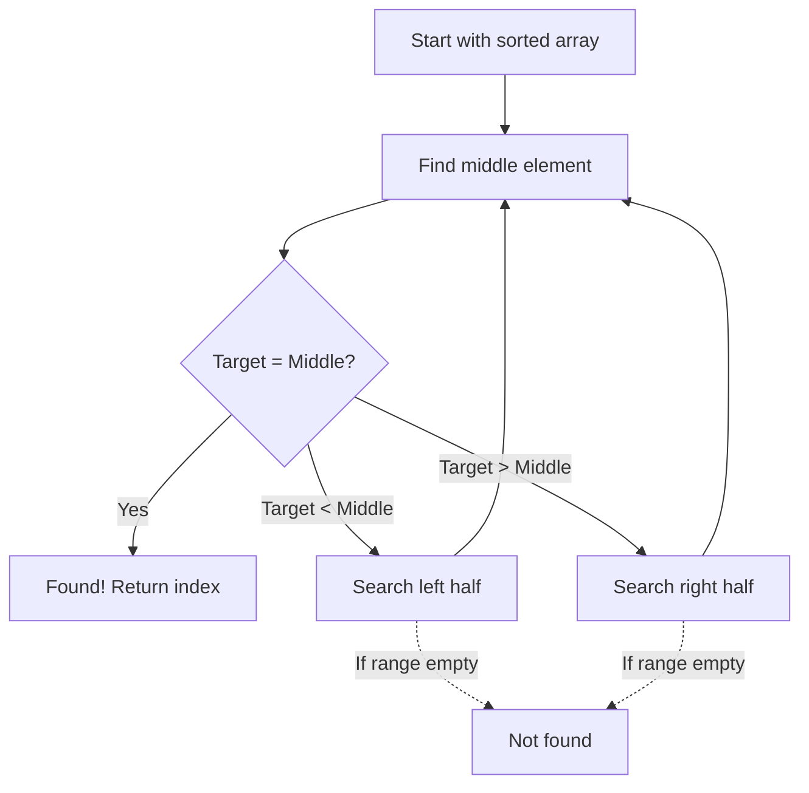

# Binary Search

## Introduction

Binary Search is one of the most efficient searching algorithms that operates on the divide-and-conquer principle. Unlike linear search that checks each element sequentially, binary search eliminates half of the remaining elements from consideration after each step, resulting in much faster search times.

The key requirement for binary search is that **the data must be sorted**. This prerequisite enables the algorithm to make intelligent decisions about where to look next, dramatically reducing the search space with each comparison.

## How Binary Search Works

Binary search follows a simple yet powerful approach:

1. Find the middle element of the current search range
2. Compare the target value with the middle element
3. If the target matches the middle element, we're done!
4. If the target is smaller, search the left half
5. If the target is larger, search the right half
6. Repeat until the element is found or the search space is empty

Let's visualize this process:



## Binary Search Implementation

Let's implement binary search in multiple programming languages.

### Binary Search in JavaScript

```javascript
function binarySearch(arr, target) {
    let left = 0;
    let right = arr.length - 1;
    
    while (left <= right) {
        let mid = Math.floor((left + right) / 2);
        
        // Found the target
        if (arr[mid] === target) {
            return mid;
        }
        
        // Target is in the left half
        if (arr[mid] > target) {
            right = mid - 1;
        }
        // Target is in the right half
        else {
            left = mid + 1;
        }
    }
    
    // Target not found
    return -1;
}

// Example usage
const sortedArray = [2, 5, 8, 12, 16, 23, 38, 56, 72, 91];
console.log(binarySearch(sortedArray, 23)); // Output: 5
console.log(binarySearch(sortedArray, 11)); // Output: -1
```

### Binary Search in Python

```python
def binary_search(arr, target):
    left, right = 0, len(arr) - 1
    
    while left <= right:
        mid = (left + right) // 2
        
        # Found the target
        if arr[mid] == target:
            return mid
        
        # If target is smaller, search left half
        elif arr[mid] > target:
            right = mid - 1
        
        # If target is larger, search right half
        else:
            left = mid + 1
    
    # Target not found
    return -1

# Example usage
sorted_array = [2, 5, 8, 12, 16, 23, 38, 56, 72, 91]
print(binary_search(sorted_array, 23))  # Output: 5
print(binary_search(sorted_array, 11))  # Output: -1
```

### Binary Search in Java

```java
public class BinarySearch {
    public static int binarySearch(int[] arr, int target) {
        int left = 0;
        int right = arr.length - 1;
        
        while (left <= right) {
            int mid = left + (right - left) / 2;  // Avoids potential overflow
            
            // Found the target
            if (arr[mid] == target) {
                return mid;
            }
            
            // If target is smaller, search left half
            if (arr[mid] > target) {
                right = mid - 1;
            }
            // If target is larger, search right half
            else {
                left = mid + 1;
            }
        }
        
        // Target not found
        return -1;
    }
    
    public static void main(String[] args) {
        int[] sortedArray = {2, 5, 8, 12, 16, 23, 38, 56, 72, 91};
        System.out.println(binarySearch(sortedArray, 23));  // Output: 5
        System.out.println(binarySearch(sortedArray, 11));  // Output: -1
    }
}
```

## Binary Search Step by Step Example

Let's walk through a detailed example to understand how binary search works. We'll search for the value `23` in the array `[2, 5, 8, 12, 16, 23, 38, 56, 72, 91]`.

| Step | Left | Right | Mid | Mid Value | Target | Action |
|------|------|-------|-----|-----------|--------|--------|
| 1 | 0 | 9 | 4 | 16 | 23 | 16 < 23, search right half |
| 2 | 5 | 9 | 7 | 56 | 23 | 56 > 23, search left half |
| 3 | 5 | 6 | 5 | 23 | 23 | Found at index 5! |

## Recursive Binary Search

Binary search can also be implemented recursively:

```javascript
function recursiveBinarySearch(arr, target, left = 0, right = arr.length - 1) {
    // Base case - element not found
    if (left > right) {
        return -1;
    }
    
    const mid = Math.floor((left + right) / 2);
    
    // Found the element
    if (arr[mid] === target) {
        return mid;
    }
    
    // Search in left half
    if (arr[mid] > target) {
        return recursiveBinarySearch(arr, target, left, mid - 1);
    }
    
    // Search in right half
    return recursiveBinarySearch(arr, target, mid + 1, right);
}

// Example usage
const sortedArray = [2, 5, 8, 12, 16, 23, 38, 56, 72, 91];
console.log(recursiveBinarySearch(sortedArray, 23)); // Output: 5
```

## Time and Space Complexity

Binary search is significantly more efficient than linear search for large datasets:

- **Time Complexity**: O(log n)
  - Each step eliminates half of the remaining elements
  - This makes it very efficient for large datasets
  
- **Space Complexity**:
  - Iterative approach: O(1) - constant extra space
  - Recursive approach: O(log n) - due to recursive call stack

To understand the power of O(log n) complexity, consider this: in a sorted array of 1 billion elements, binary search would find any element in at most 30 steps!

## Practical Applications

Binary search is used in many real-world applications:

1. **Dictionary Look-up**: Finding words quickly in a dictionary or a phonebook
2. **Database Systems**: Searching through indexed records
3. **Numeric Operations**: Computing square roots using binary search
4. **Machine Learning**: In algorithms like k-d trees for nearest neighbor searches
5. **Computer Graphics**: In computational geometry and ray tracing

### Example: Square Root Calculation

Here's how binary search can be used to find the square root of a number:

```javascript
function squareRoot(n, precision = 0.0001) {
    if (n < 0) return NaN; // No real square root for negative numbers
    if (n === 0 || n === 1) return n;
    
    let left = 0;
    let right = n;
    let mid;
    
    // Binary search for square root
    while (right - left > precision) {
        mid = (left + right) / 2;
        
        if (mid * mid > n) {
            right = mid;
        } else {
            left = mid;
        }
    }
    
    return left;
}

console.log(squareRoot(16));     // Output: ~4
console.log(squareRoot(10));     // Output: ~3.16227...
```

## Common Pitfalls and Tips

1. **Ensuring Sorted Data**: Binary search only works on sorted arrays.
2. **Integer Overflow**: When calculating midpoint, use `left + (right - left) / 2` instead of `(left + right) / 2` to prevent integer overflow in some languages.
3. **Off-by-One Errors**: Pay attention to the array bounds and stopping conditions.
4. **Duplicates**: Standard binary search finds any matching element, not necessarily the first or last occurrence.

## Variations of Binary Search

### Finding the First Occurrence

```javascript
function findFirstOccurrence(arr, target) {
    let left = 0;
    let right = arr.length - 1;
    let result = -1;
    
    while (left <= right) {
        let mid = Math.floor((left + right) / 2);
        
        // If found, save the result but continue searching left
        if (arr[mid] === target) {
            result = mid;
            right = mid - 1;
        }
        // If target is smaller, search left half
        else if (arr[mid] > target) {
            right = mid - 1;
        }
        // If target is larger, search right half
        else {
            left = mid + 1;
        }
    }
    
    return result;
}

// Example with duplicates
const arrayWithDuplicates = [2, 5, 5, 5, 8, 10, 10, 15];
console.log(findFirstOccurrence(arrayWithDuplicates, 5)); // Output: 1
```

### Finding the Last Occurrence

```javascript
function findLastOccurrence(arr, target) {
    let left = 0;
    let right = arr.length - 1;
    let result = -1;
    
    while (left <= right) {
        let mid = Math.floor((left + right) / 2);
        
        // If found, save the result but continue searching right
        if (arr[mid] === target) {
            result = mid;
            left = mid + 1;
        }
        // If target is smaller, search left half
        else if (arr[mid] > target) {
            right = mid - 1;
        }
        // If target is larger, search right half
        else {
            left = mid + 1;
        }
    }
    
    return result;
}

// Example with duplicates
const arrayWithDuplicates = [2, 5, 5, 5, 8, 10, 10, 15];
console.log(findLastOccurrence(arrayWithDuplicates, 5)); // Output: 3
```

## Summary

Binary search is a powerful algorithm that efficiently finds elements in sorted arrays with a time complexity of O(log n). Its divide-and-conquer approach makes it much faster than linear search for large datasets.

Key points to remember:
- The data must be sorted before applying binary search
- It has a time complexity of O(log n)
- Each step eliminates half of the remaining elements
- Binary search can be implemented iteratively or recursively
- It's widely used in various domains from databases to computational geometry

## Practice Exercises

1. Implement binary search for a sorted array of strings.
2. Modify binary search to return the index where a value should be inserted if it's not found.
3. Use binary search to find the floor and ceiling values of a target in a sorted array.
4. Implement a function to count the number of occurrences of an element in a sorted array using binary search.
5. Apply binary search to find the peak element in a mountain array (an array that first increases then decreases).

## Additional Resources

- [Khan Academy: Binary Search](https://www.khanacademy.org/computing/computer-science/algorithms/binary-search/a/binary-search)
- [Interactive Binary Search Visualization](https://visualgo.net/bn/binarysearch)
- [MIT OpenCourseWare: Introduction to Algorithms](https://ocw.mit.edu/courses/electrical-engineering-and-computer-science/6-006-introduction-to-algorithms-fall-2011/)
- [LeetCode Problems on Binary Search](https://leetcode.com/tag/binary-search/)

Happy searching!