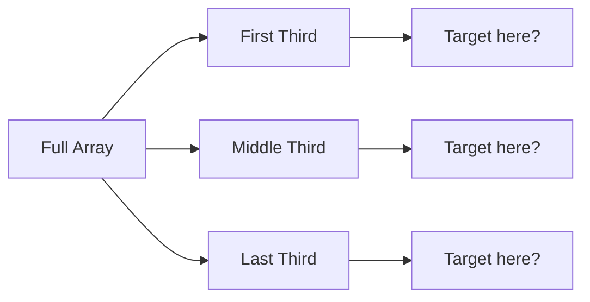

# Ternary Search

## Introduction

Ternary Search is an efficient algorithm used to find the position of a target value within a sorted array. Unlike Binary Search which divides the search space into two parts, Ternary Search divides the search space into three roughly equal parts at each step. This algorithm is particularly useful when searching for the maximum or minimum value in a unimodal function.

In this tutorial, we'll explore Ternary Search, understand how it works, implement it in code, and explore its real-world applications.

## What is Ternary Search?

Ternary Search is a divide-and-conquer algorithm that divides the search space into three parts. It's based on the premise that if we have a sorted array, we can eliminate at least one-third of the elements in a single comparison.

The key idea behind Ternary Search is:
- Divide the search range into three equal parts
- Determine which of the three parts may contain the target value
- Recursively search in the remaining part

## When to Use Ternary Search?

Ternary Search is most efficient for:

1. Finding a specific element in a sorted array (though binary search is typically preferred)
2. Finding the maximum/minimum value in a unimodal function
3. Optimizing functions where we need to find a specific point (peak, valley, etc.)

## How Ternary Search Works

Let's understand the step-by-step process of how Ternary Search works:

1. Calculate two mid points: `mid1 = left + (right - left) / 3` and `mid2 = right - (right - left) / 3`
2. Compare the target value with the elements at `mid1` and `mid2`
3. If the target equals either `mid1` or `mid2`, we've found our element
4. If the target is less than the element at `mid1`, search in the range `[left, mid1-1]`
5. If the target is greater than the element at `mid2`, search in the range `[mid2+1, right]`
6. Otherwise, search in the range `[mid1+1, mid2-1]`
7. Repeat until the element is found or the search space is exhausted

Here's a visual representation of how the array is divided:



## Basic Implementation of Ternary Search

Let's implement a basic version of Ternary Search in JavaScript:

```javascript
function ternarySearch(arr, target, left, right) {
  if (left > right) {
    return -1; // Target not found
  }
  
  // Calculate two mid points
  const mid1 = left + Math.floor((right - left) / 3);
  const mid2 = right - Math.floor((right - left) / 3);
  
  // Check if target is present at any of the mids
  if (arr[mid1] === target) {
    return mid1;
  }
  if (arr[mid2] === target) {
    return mid2;
  }
  
  // Determine which segment to search in
  if (target < arr[mid1]) {
    // Target lies in first segment
    return ternarySearch(arr, target, left, mid1 - 1);
  } else if (target > arr[mid2]) {
    // Target lies in third segment
    return ternarySearch(arr, target, mid2 + 1, right);
  } else {
    // Target lies in middle segment
    return ternarySearch(arr, target, mid1 + 1, mid2 - 1);
  }
}

// Usage example
const sortedArray = [1, 2, 3, 4, 5, 6, 7, 8, 9, 10];
const target = 7;
const result = ternarySearch(sortedArray, target, 0, sortedArray.length - 1);

console.log(`Element ${target} found at index: ${result}`);
```

**Output:**
```
Element 7 found at index: 6
```

## Iterative Ternary Search

While the recursive approach is elegant, it can lead to stack overflow for large arrays. Here's an iterative implementation:

```javascript
function iterativeTernarySearch(arr, target) {
  let left = 0;
  let right = arr.length - 1;
  
  while (left <= right) {
    // Calculate the two mid points
    const mid1 = left + Math.floor((right - left) / 3);
    const mid2 = right - Math.floor((right - left) / 3);
    
    // Check if target is present at any mid
    if (arr[mid1] === target) {
      return mid1;
    }
    if (arr[mid2] === target) {
      return mid2;
    }
    
    // Determine which segment to search in
    if (target < arr[mid1]) {
      // Target lies in first segment
      right = mid1 - 1;
    } else if (target > arr[mid2]) {
      // Target lies in third segment
      left = mid2 + 1;
    } else {
      // Target lies in middle segment
      left = mid1 + 1;
      right = mid2 - 1;
    }
  }
  
  return -1; // Target not found
}

// Usage example
const sortedArray = [1, 2, 3, 4, 5, 6, 7, 8, 9, 10];
const target = 5;
const result = iterativeTernarySearch(sortedArray, target);

console.log(`Element ${target} found at index: ${result}`);
```

**Output:**
```
Element 5 found at index: 4
```

## Ternary Search for Finding Maximum in a Unimodal Function

One of the most common applications of Ternary Search is finding the maximum (or minimum) value in a unimodal function:

```javascript
function ternarySearchMax(func, left, right, epsilon = 1e-9) {
  while (right - left > epsilon) {
    // Calculate two mid points
    const mid1 = left + (right - left) / 3;
    const mid2 = right - (right - left) / 3;
    
    // Compare function values at mid points
    if (func(mid1) < func(mid2)) {
      // Maximum lies to the right of mid1
      left = mid1;
    } else {
      // Maximum lies to the left of mid2
      right = mid2;
    }
  }
  
  // Return the maximum point
  return (left + right) / 2;
}

// Example: Find the maximum of f(x) = -(x-5)² + 25
function quadraticFunction(x) {
  return -(x-5)*(x-5) + 25;  // Function with maximum at x=5
}

const maxPoint = ternarySearchMax(quadraticFunction, 0, 10);
console.log(`Maximum found at x = ${maxPoint.toFixed(6)}`);
console.log(`Maximum value = ${quadraticFunction(maxPoint).toFixed(6)}`);
```

**Output:**
```
Maximum found at x = 5.000000
Maximum value = 25.000000
```

## Time and Space Complexity

### Time Complexity
- **Best case**: O(1) - when the target is found at one of the mid points
- **Average case**: O(log₃ n) - we're dividing the search space by 3 each time
- **Worst case**: O(log₃ n) - we need to search until the space is exhausted

### Space Complexity
- **Recursive implementation**: O(log₃ n) due to the function call stack
- **Iterative implementation**: O(1) as we only use a constant amount of extra space

## Comparison with Binary Search

Let's compare Ternary Search to Binary Search:

| Aspect | Binary Search | Ternary Search |
|--------|---------------|----------------|
| Divisions | 2 parts | 3 parts |
| Time Complexity | O(log₂ n) | O(log₃ n) |
| Comparisons per step | 1 | 2 |
| Efficiency | More efficient in practice | Theoretically faster, but more comparisons |

While O(log₃ n) grows slower than O(log₂ n), Ternary Search requires **two** comparisons at each step, while Binary Search requires only one. Therefore, Binary Search is typically more efficient for most practical applications when searching for a specific key.

However, Ternary Search shines when finding maximums or minimums in unimodal functions.

## Real-World Applications

### 1. Computer Graphics and Game Development

In game development and computer graphics, ternary search can be used for:
- Finding the optimal camera position
- Detecting collisions in a sorted space
- Finding optimal light positions for scene rendering

```javascript
// Example: Finding optimal light position in a 1D scene
function lightEffectiveness(position) {
  // Complex function that measures how well a light illuminates objects
  // Higher value means better lighting
  return -Math.abs(position - 5) + 10;
}

const optimalLightPosition = ternarySearchMax(lightEffectiveness, 0, 10);
console.log(`The optimal light position is at: ${optimalLightPosition.toFixed(2)}`);
```

### 2. Optimization Problems

Many engineering problems involve finding the maximum or minimum value:

```javascript
// Example: Finding the optimal angle for a projectile to achieve maximum distance
function projectileDistance(angle) {
  const v0 = 10; // Initial velocity
  const g = 9.8; // Gravity
  const radians = angle * Math.PI / 180;
  return (v0 * v0 * Math.sin(2 * radians)) / g;
}

const optimalAngle = ternarySearchMax(projectileDistance, 0, 90);
console.log(`The optimal launch angle is: ${optimalAngle.toFixed(2)} degrees`);
console.log(`This gives a distance of: ${projectileDistance(optimalAngle).toFixed(2)} meters`);
```

**Output:**
```
The optimal launch angle is: 45.00 degrees
This gives a distance of: 10.20 meters
```

### 3. Machine Learning Hyperparameter Tuning

Ternary search can be used to optimize hyperparameters in machine learning models:

```javascript
// Example: Find the optimal regularization parameter that minimizes validation error
function validationError(regularizationStrength) {
  // In real scenarios, this would train a model with the given parameter
  // and return the validation error
  // For illustration, we'll use a simple function with minimum at λ=0.1
  return (regularizationStrength - 0.1) * (regularizationStrength - 0.1) + 0.05;
}

// We want to minimize error, so we negate the function 
function negatedError(x) {
  return -validationError(x);
}

const optimalRegularization = ternarySearchMax(negatedError, 0, 1);
console.log(`Optimal regularization parameter: ${optimalRegularization.toFixed(4)}`);
console.log(`Minimum validation error: ${validationError(optimalRegularization).toFixed(4)}`);
```

## Common Pitfalls and Tips

1. **Ensure the array is sorted**: Ternary search requires a sorted array.
2. **Handle edge cases**: Ensure your implementation handles empty arrays, single element arrays, etc.
3. **Choose epsilon carefully**: When searching for maximum/minimum in continuous functions, the epsilon (precision) value affects both accuracy and runtime.
4. **Consider binary search first**: For simple element search in arrays, binary search often performs better in practice.
5. **Avoid floating-point precision issues**: When working with continuous functions, be aware of floating-point precision limitations.

## Summary

Ternary Search is a powerful algorithm that divides the search space into three parts at each step. While it's theoretically faster than binary search in terms of the number of iterations (O(log₃ n) vs O(log₂ n)), it requires more comparisons per iteration.

Its real strength lies in optimization problems where we need to find the maximum or minimum value of a unimodal function. In these scenarios, ternary search provides an efficient approach that converges quickly to the optimal solution.

## Exercises for Practice

1. Implement ternary search in your favorite programming language to find an element in a sorted array.
2. Modify the ternary search algorithm to find the maximum value in an array that first increases and then decreases.
3. Use ternary search to find the minimum of the function f(x) = x² + 4x + 4 in the range [-10, 10].
4. Implement a ternary search to find the point where two monotonic functions intersect.
5. Compare the actual performance (execution time) of binary search vs. ternary search for different array sizes.

## Additional Resources

- **Introduction to Algorithms** by Cormen, Leiserson, Rivest, and Stein
- **Algorithms** by Robert Sedgewick and Kevin Wayne
- [CP-Algorithms: Ternary Search](https://cp-algorithms.com/num_methods/ternary_search.html)
- [GeeksforGeeks: Ternary Search](https://www.geeksforgeeks.org/ternary-search/)

By mastering Ternary Search, you've added another powerful technique to your algorithm toolkit. While it might not be as commonly used as Binary Search for simple element lookup, its applications in optimization problems make it an invaluable algorithm to understand.