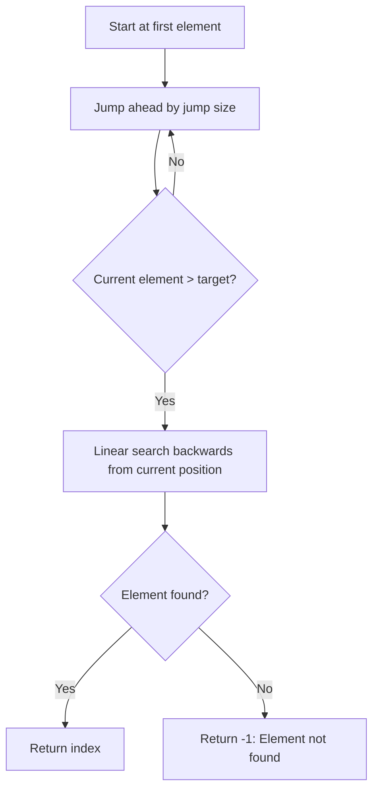

# Jump Search

## Introduction

Jump Search is an efficient searching algorithm designed to find a specific element in a sorted array. It sits between Linear Search and Binary Search in terms of efficiency. The core idea is to "jump" ahead by fixed steps to identify a block where the element might be present, and then perform a linear search within that smaller block.

This algorithm works by taking advantage of the array's sorted nature to skip over portions that definitely won't contain our target element, making it more efficient than a simple linear search.

## How Jump Search Works

The Jump Search algorithm follows these key steps:

1. **Determine the jump size** (typically √n, where n is the array length)
2. **Jump forward** in the array by the jump size until we find a value greater than our target
3. **Linear search** backwards from that point to find the exact position of our target

Let's visualize this process:



## Optimal Jump Size

The efficiency of Jump Search depends on the jump size. The optimal jump size is √n, where n is the length of the array. This gives the algorithm a time complexity of O(√n), which is better than Linear Search (O(n)) but not as good as Binary Search (O(log n)).

Why √n is optimal:
- If we jump k steps at a time, we'll need approximately (n/k) jumps
- The worst-case linear search will require up to k steps
- So total steps = (n/k) + k
- This expression is minimized when k = √n

## Implementation in Different Languages

### JavaScript Implementation

```javascript
function jumpSearch(arr, target) {
    const n = arr.length;
    
    // Finding the block size to be jumped
    const jumpSize = Math.floor(Math.sqrt(n));
    
    // Finding the block where element may be present
    let prev = 0;
    let step = jumpSize;
    
    // Jump to the appropriate block
    while (arr[Math.min(step, n) - 1] < target) {
        prev = step;
        step += jumpSize;
        
        // If we've gone beyond the array, element is not present
        if (prev >= n) {
            return -1;
        }
    }
    
    // Do a linear search for target in the identified block
    while (arr[prev] < target) {
        prev++;
        
        // If we reach the end of the block or array, element is not present
        if (prev == Math.min(step, n)) {
            return -1;
        }
    }
    
    // If element is found
    if (arr[prev] === target) {
        return prev;
    }
    
    // Element not found
    return -1;
}

// Example usage
const sortedArray = [0, 1, 2, 3, 5, 8, 13, 21, 34, 55, 89, 144, 233, 377];
const target = 55;
const result = jumpSearch(sortedArray, target);
console.log(`Element ${target} found at index: ${result}`);
```

### Python Implementation

```python
import math

def jump_search(arr, target):
    n = len(arr)
    
    # Finding the block size to be jumped
    jump_size = int(math.sqrt(n))
    
    # Finding the block where element may be present
    prev = 0
    step = jump_size
    
    # Jump to the appropriate block
    while arr[min(step, n) - 1] < target:
        prev = step
        step += jump_size
        
        # If we've gone beyond the array, element is not present
        if prev >= n:
            return -1
    
    # Do a linear search for target in the identified block
    while arr[prev] < target:
        prev += 1
        
        # If we reach the end of the block or array, element is not present
        if prev == min(step, n):
            return -1
    
    # If element is found
    if arr[prev] == target:
        return prev
    
    # Element not found
    return -1

# Example usage
sorted_array = [0, 1, 2, 3, 5, 8, 13, 21, 34, 55, 89, 144, 233, 377]
target = 55
result = jump_search(sorted_array, target)
print(f"Element {target} found at index: {result}")
```

### Java Implementation

```java
public class JumpSearch {
    public static int jumpSearch(int[] arr, int target) {
        int n = arr.length;
        
        // Finding the block size to be jumped
        int jumpSize = (int) Math.floor(Math.sqrt(n));
        
        // Finding the block where element may be present
        int prev = 0;
        int step = jumpSize;
        
        // Jump to the appropriate block
        while (arr[Math.min(step, n) - 1] < target) {
            prev = step;
            step += jumpSize;
            
            // If we've gone beyond the array, element is not present
            if (prev >= n) {
                return -1;
            }
        }
        
        // Do a linear search for target in the identified block
        while (arr[prev] < target) {
            prev++;
            
            // If we reach the end of the block or array, element is not present
            if (prev == Math.min(step, n)) {
                return -1;
            }
        }
        
        // If element is found
        if (arr[prev] == target) {
            return prev;
        }
        
        // Element not found
        return -1;
    }
    
    public static void main(String[] args) {
        int[] sortedArray = {0, 1, 2, 3, 5, 8, 13, 21, 34, 55, 89, 144, 233, 377};
        int target = 55;
        int result = jumpSearch(sortedArray, target);
        System.out.println("Element " + target + " found at index: " + result);
    }
}
```

## Example: Step-by-Step Execution

Let's trace the execution of Jump Search on this array:

```
[0, 1, 2, 3, 5, 8, 13, 21, 34, 55, 89, 144, 233, 377]
```

Searching for target = 55:

1. Calculate jump size: √14 ≈ 3.74, so we round down to 3
2. Start at index 0, value = 0
3. Jump to index 3 (0 + 3), value = 3
4. Jump to index 6 (3 + 3), value = 13 
5. Jump to index 9 (6 + 3), value = 55
6. Value at index 9 equals our target value of 55
7. Return index 9

If we were searching for 89:

1. Jump to index 3, value = 3
2. Jump to index 6, value = 13
3. Jump to index 9, value = 55
4. Jump to index 12 (9 + 3), value = 233 (which is greater than our target 89)
5. Perform linear search backwards from index 12
6. Check index 11: value = 144 > 89
7. Check index 10: value = 89 = target
8. Return index 10

## Time and Space Complexity

### Time Complexity
- **Best Case**: O(1) - When the first element is the target
- **Average Case**: O(√n) - Jump size is √n
- **Worst Case**: O(√n) - Need to make √n jumps followed by up to √n steps backward

### Space Complexity
- O(1) - Jump Search requires only a constant amount of extra space regardless of the input size

## Practical Applications

Jump Search is particularly useful in these scenarios:

1. **Searching in large, sorted arrays stored on external devices**: When accessing elements has a higher cost (like disk access), Jump Search minimizes the number of accesses.

2. **Arrays with uniform distribution**: Jump Search performs well when elements are uniformly distributed.

3. **Resource-constrained systems**: When memory is limited and implementing a more complex algorithm like Binary Search might be overkill.

### Real-World Example: Dictionary Lookup

Imagine you're implementing a dictionary app for a low-power mobile device. Jump Search can be effectively used to quickly find words:

```javascript
function dictionaryLookup(dictionary, word) {
    const result = jumpSearch(dictionary, word);
    if (result !== -1) {
        return {
            word: dictionary[result],
            found: true,
            message: `Word "${word}" found in dictionary`
        };
    } else {
        return {
            word: word,
            found: false,
            message: `Word "${word}" not found in dictionary`
        };
    }
}

// Example usage
const englishDictionary = ["apple", "banana", "carrot", "dog", "elephant", "flower", "goat"]; // Sorted
console.log(dictionaryLookup(englishDictionary, "dog"));
console.log(dictionaryLookup(englishDictionary, "cat"));
```

## Advantages and Disadvantages

### Advantages
- Faster than Linear Search (O(n))
- Simpler to implement than Binary Search
- Only requires the ability to jump forward (unlike Binary Search which needs random access)

### Disadvantages
- Slower than Binary Search (O(log n))
- Only works on sorted arrays
- Not optimal for small arrays where Linear Search might be faster due to less overhead

## Jump Search vs Other Searching Algorithms

| Algorithm | Time Complexity (Worst) | Space Complexity | Suitable For |
|-----------|-------------------------|------------------|--------------|
| Linear Search | O(n) | O(1) | Small or unsorted arrays |
| Jump Search | O(√n) | O(1) | Medium-sized sorted arrays |
| Binary Search | O(log n) | O(1) | Large sorted arrays |
| Interpolation Search | O(log log n) (average) | O(1) | Sorted, uniformly distributed arrays |

## Summary

Jump Search is a balanced searching algorithm that bridges the gap between simple Linear Search and more complex Binary Search. By using the "jumping" approach, it achieves a time complexity of O(√n), making it efficient for medium-sized sorted arrays.

Key points to remember:
- Works only on sorted arrays
- Optimal jump size is √n
- Time complexity: O(√n)
- Space complexity: O(1)
- Great for scenarios where jumping forward is cheaper than random access

## Further Exercises

1. Modify the Jump Search algorithm to handle descending sorted arrays.
2. Implement a variant that dynamically adjusts jump size based on array length.
3. Combine Jump Search with Interpolation Search to improve performance on uniformly distributed data.
4. Analyze the performance of Jump Search vs Binary Search on arrays of various sizes and determine the crossover point where Binary Search becomes more efficient.
5. Create a hybrid search algorithm that uses Jump Search for initial positioning and another algorithm for the final search.

## Additional Resources

- "Introduction to Algorithms" by Cormen, Leiserson, Rivest, and Stein
- "Algorithms, 4th Edition" by Robert Sedgewick and Kevin Wayne
- [GeeksforGeeks: Jump Search](https://www.geeksforgeeks.org/jump-search/)

By understanding Jump Search, you've added another valuable tool to your algorithmic toolkit that can be applied in various scenarios where a balance between simplicity and performance is needed.