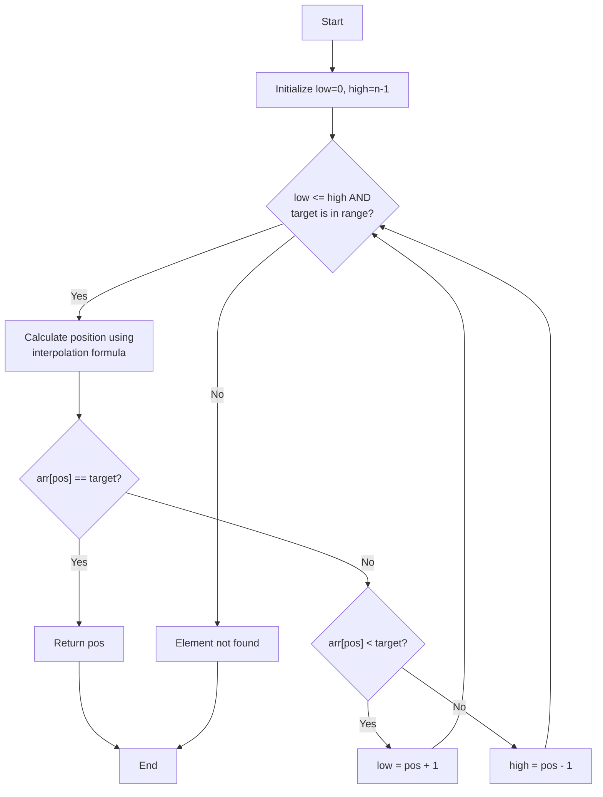

# Interpolation Search

## Introduction

Interpolation Search is an improved variant of binary search, designed specifically for searching through uniformly distributed sorted arrays. While binary search always checks the middle element, interpolation search makes a more intelligent guess about the probable position of the target element based on its value and the values at the ends of the array.

Think of it like looking up a name in a phone book. If you're looking for "Smith," you wouldn't start in the middle - you'd open the book closer to the end because 'S' is closer to the end of the alphabet. That's the intuition behind interpolation search!

:::tip
Interpolation search works best when the elements are **uniformly distributed** in the array. For arrays where values aren't evenly spread out, it may perform worse than binary search.
:::

## How Interpolation Search Works

### The Basic Principle

Interpolation search uses a formula derived from the linear interpolation formula in mathematics to guess where the target element might be located:

```
pos = low + ((target - arr[low]) * (high - low) / (arr[high] - arr[low]))
```

Where:
- `low` and `high` are the current search boundaries
- `arr[low]` and `arr[high]` are the values at those boundaries
- `target` is the value we're searching for

### Step-by-Step Algorithm

1. Find the position to be searched using the interpolation formula
2. If the element at the position equals the target element, return the position
3. If the element is less than the target, search the right sub-array
4. If the element is greater than the target, search the left sub-array
5. Repeat until the element is found or the search space is exhausted

### Visual Representation



## Implementation

Here's how to implement Interpolation Search in various programming languages:

### Python Implementation

```python
def interpolation_search(arr, target):
    low = 0
    high = len(arr) - 1
    
    # While the array has elements and target is within the range
    while low <= high and arr[low] <= target <= arr[high]:
        # Formula for interpolated position
        if arr[high] == arr[low]:  # To avoid division by zero
            pos = low
        else:
            pos = low + int(((target - arr[low]) * (high - low)) / 
                          (arr[high] - arr[low]))
        
        # If target found
        if arr[pos] == target:
            return pos
        
        # If target is larger, search in right subarray
        if arr[pos] < target:
            low = pos + 1
        
        # If target is smaller, search in left subarray
        else:
            high = pos - 1
    
    return -1  # Target not found
```

### Java Implementation

```java
public static int interpolationSearch(int[] arr, int target) {
    int low = 0;
    int high = arr.length - 1;
    
    while (low <= high && target >= arr[low] && target <= arr[high]) {
        if (low == high) {
            if (arr[low] == target) return low;
            return -1;
        }
        
        // Calculate position using interpolation formula
        int pos = low + (((target - arr[low]) * (high - low)) / 
                       (arr[high] - arr[low]));
        
        // If target found
        if (arr[pos] == target)
            return pos;
        
        // If target is larger, search right subarray
        if (arr[pos] < target)
            low = pos + 1;
        
        // If target is smaller, search left subarray
        else
            high = pos - 1;
    }
    
    return -1;  // Target not found
}
```

### JavaScript Implementation

```javascript
function interpolationSearch(arr, target) {
    let low = 0;
    let high = arr.length - 1;
    
    while (low <= high && target >= arr[low] && target <= arr[high]) {
        if (low === high) {
            if (arr[low] === target) return low;
            return -1;
        }
        
        // Calculate position using interpolation formula
        let pos = low + Math.floor(
            ((target - arr[low]) * (high - low)) / 
            (arr[high] - arr[low])
        );
        
        // If target found
        if (arr[pos] === target)
            return pos;
        
        // If target is larger, search right subarray
        if (arr[pos] < target)
            low = pos + 1;
        
        // If target is smaller, search left subarray
        else
            high = pos - 1;
    }
    
    return -1;  // Target not found
}
```

## Example with Explanation

Let's trace through an example to understand how interpolation search works:

Given a sorted array: `[10, 20, 30, 40, 50, 60, 70, 80, 90]`
We want to find the element `60`.

**Iteration 1:**
- `low = 0`, `high = 8`
- `arr[low] = 10`, `arr[high] = 90`
- Using the interpolation formula:
  ```
  pos = 0 + ((60 - 10) * (8 - 0)) / (90 - 10)
  pos = 0 + (50 * 8) / 80
  pos = 0 + 5 = 5
  ```
- `arr[5] = 60`, which is our target
- Return position 5

For comparison, a binary search would have first checked the middle element (position 4, value 50), then moved to the right half, and then found 60 on the second iteration. Interpolation search found it in a single step because the value distribution was uniform.

## Time Complexity

- **Best Case**: O(1) - when the element is found at the estimated position in the first attempt
- **Average Case**: O(log log n) - for uniformly distributed data
- **Worst Case**: O(n) - for very skewed distributions where elements are concentrated at one end

## Space Complexity

- **Space Complexity**: O(1) - Interpolation search requires only a constant amount of extra space

## Practical Applications

### 1. Database Systems

In database systems with indexed columns, interpolation search can be used to locate records faster when the data distribution is known to be relatively uniform.

```python
def find_record_by_id(database, target_id):
    # Assuming database is a sorted list of records based on ID
    return database[interpolation_search([record.id for record in database], target_id)]
```

### 2. Phonebook Applications

When searching through phonebooks or dictionaries where entries are distributed somewhat evenly:

```javascript
function lookupPhonebook(phonebook, lastName) {
    const names = phonebook.map(entry => entry.lastName);
    const position = interpolationSearch(names, lastName);
    
    if (position !== -1) {
        return phonebook[position].phoneNumber;
    }
    return "Not found";
}
```

### 3. Large Sorted Arrays in Memory Systems

When dealing with large arrays in memory-constrained systems where search optimization is critical:

```c
int findValueInLargeArray(int arr[], int size, int target) {
    // Using interpolation search for faster lookup in uniform data
    return interpolationSearch(arr, size, target);
}
```

## Comparison with Other Search Algorithms

| Algorithm            | Best Case | Average Case | Worst Case | Works on               |
|----------------------|-----------|--------------|------------|------------------------|
| Linear Search        | O(1)      | O(n)         | O(n)       | Any array              |
| Binary Search        | O(1)      | O(log n)     | O(log n)   | Sorted array           |
| Interpolation Search | O(1)      | O(log log n) | O(n)       | Sorted & uniform array |
| Jump Search          | O(1)      | O(√n)        | O(√n)      | Sorted array           |

## Common Pitfalls and Solutions

### 1. Division by Zero

**Problem**: If `arr[high] == arr[low]`, the formula will cause division by zero.

**Solution**: Add a check to handle this case:

```python
if arr[high] == arr[low]:
    if arr[low] == target:
        return low
    else:
        return -1
```

### 2. Out of Bounds Access

**Problem**: The interpolation formula might calculate a position outside the array bounds.

**Solution**: Ensure calculated positions are within bounds:

```python
pos = min(high, max(low, calculated_pos))
```

### 3. Non-uniform Distribution

**Problem**: Poor performance with non-uniformly distributed data.

**Solution**: Implement a hybrid approach that switches to binary search after a certain number of iterations:

```python
def hybrid_search(arr, target):
    iterations = 0
    max_interpolation_iterations = 5
    
    # Start with interpolation search
    while iterations < max_interpolation_iterations:
        # Interpolation search logic
        iterations += 1
    
    # Switch to binary search if target not found
    return binary_search(arr, target, low, high)
```

## Summary

Interpolation Search is an efficient searching algorithm that works best on uniformly distributed sorted arrays. Its key features:

- Uses the value of the target element to make an educated guess about its position
- Average time complexity of O(log log n), which is better than binary search's O(log n)
- Can degrade to O(n) in worst-case scenarios with skewed distributions
- Works exceptionally well for large, uniformly distributed datasets

When deciding whether to use interpolation search, consider:
1. Is your data sorted?
2. Is the data distribution relatively uniform?
3. Is search performance a critical concern in your application?

If you answered yes to these questions, interpolation search might be the perfect algorithm for your needs.

## Practice Exercises

1. Implement an interpolation search function that handles non-numeric data types like strings.
2. Modify the interpolation search to return all occurrences of the target value, not just the first one.
3. Implement a hybrid search algorithm that starts with interpolation search and switches to binary search after a certain number of iterations.
4. Compare the performance of interpolation search against binary search using datasets of varying distributions and sizes.
5. Extend interpolation search to work with multi-dimensional arrays.

## Additional Resources

- Cormen, T., Leiserson, C., Rivest, R., & Stein, C. (2009). Introduction to Algorithms (3rd ed.)
- Sedgewick, R., & Wayne, K. (2011). Algorithms (4th ed.)
- Data Structures and Algorithms in Python by Michael T. Goodrich, Roberto Tamassia, and Michael H. Goldwasser

Happy searching!