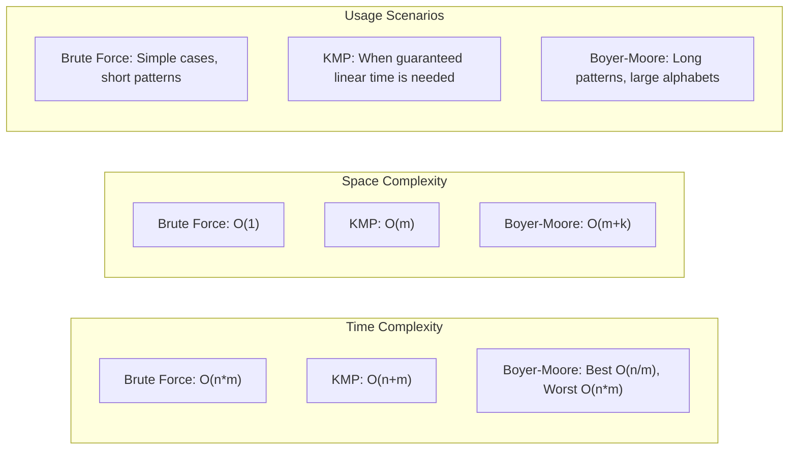

# Substring Search

## Introduction

Substring search is a fundamental operation in computer science that involves finding occurrences of a pattern (a short string) within a longer text. Whether you're building a text editor's "find" function, implementing a search engine, or analyzing DNA sequences, efficient substring search algorithms are essential tools in your programming toolbox.

In this guide, we'll explore various algorithms for substring search, from simple brute force approaches to more sophisticated methods that offer significant performance improvements. Each algorithm has its own strengths, weaknesses, and best-use scenarios.

## Basic Substring Search (Brute Force)

The simplest approach to substring searching is the brute force method, where we check every possible position in the text to see if our pattern matches.

### How It Works

1. Slide the pattern over the text one by one
2. For each position, check if the pattern matches the text at that position
3. If a match is found, record the position
4. Continue until the end of the text

### Code Example

```java
public static List<Integer> bruteForceSubstringSearch(String text, String pattern) {
    List<Integer> positions = new ArrayList<>();
    int n = text.length();
    int m = pattern.length();
    
    // Check for empty strings
    if (m == 0 || n == 0 || m > n) {
        return positions;
    }
    
    // Check each position in text
    for (int i = 0; i <= n - m; i++) {
        int j;
        
        // For each position, check if pattern matches
        for (j = 0; j < m; j++) {
            if (text.charAt(i + j) != pattern.charAt(j)) {
                break;
            }
        }
        
        // If the inner loop completed without breaking, we found a match
        if (j == m) {
            positions.add(i);
        }
    }
    
    return positions;
}
```

### Example Usage

```java
public static void main(String[] args) {
    String text = "ABABDABACDABABCABAB";
    String pattern = "ABABC";
    
    List<Integer> matches = bruteForceSubstringSearch(text, pattern);
    
    System.out.println("Pattern found at positions: " + matches);
    // Output: Pattern found at positions: [10]
}
```

### Time Complexity

- Worst-case time complexity: O(n*m)
  - Where n is the length of the text and m is the length of the pattern
- This happens when we need to compare all characters of the pattern for each position in the text

## Knuth-Morris-Pratt (KMP) Algorithm

The KMP algorithm improves on the brute force approach by avoiding unnecessary character comparisons when a mismatch occurs. It uses information about the pattern itself to determine how many characters to skip.

### Key Insight

When a mismatch occurs after several matching characters, we already know part of the text (the characters we just matched). The KMP algorithm uses this information to avoid re-examining characters unnecessarily.

### How It Works

1. Preprocess the pattern to build a "partial match" table (also called the "failure function")
2. Use this table to determine how many characters to skip when a mismatch occurs
3. Never move backwards in the text, only in the pattern

### Preprocessing: Building the Failure Function

The failure function tells us, for each position in the pattern, the length of the longest proper prefix that is also a suffix up to that point.

```java
private static int[] buildFailureFunction(String pattern) {
    int m = pattern.length();
    int[] fail = new int[m];
    
    fail[0] = 0;  // The failure function for the first character is always 0
    
    int j = 0;
    for (int i = 1; i < m; i++) {
        // If characters don't match, update j using the failure function
        while (j > 0 && pattern.charAt(j) != pattern.charAt(i)) {
            j = fail[j - 1];
        }
        
        // If characters match, increment j
        if (pattern.charAt(j) == pattern.charAt(i)) {
            j++;
        }
        
        // Store the value of j for position i
        fail[i] = j;
    }
    
    return fail;
}
```

### KMP Search Algorithm

```java
public static List<Integer> kmpSearch(String text, String pattern) {
    List<Integer> positions = new ArrayList<>();
    
    int n = text.length();
    int m = pattern.length();
    
    // Handle edge cases
    if (m == 0) {
        return positions;
    }
    
    if (m > n) {
        return positions;
    }
    
    // Build the failure function from the pattern
    int[] fail = buildFailureFunction(pattern);
    
    int j = 0;  // Number of characters matched so far
    
    // Iterate through the text
    for (int i = 0; i < n; i++) {
        // Update j until we find a match or j becomes 0
        while (j > 0 && pattern.charAt(j) != text.charAt(i)) {
            j = fail[j - 1];
        }
        
        // If characters match, move to the next character in pattern
        if (pattern.charAt(j) == text.charAt(i)) {
            j++;
        }
        
        // If we've matched the entire pattern, record the position
        if (j == m) {
            positions.add(i - m + 1);  // Position where the match starts
            j = fail[j - 1];  // Look for the next match
        }
    }
    
    return positions;
}
```

### Example Usage

```java
public static void main(String[] args) {
    String text = "ABABDABACDABABCABAB";
    String pattern = "ABABC";
    
    List<Integer> matches = kmpSearch(text, pattern);
    
    System.out.println("Pattern found at positions: " + matches);
    // Output: Pattern found at positions: [10]
}
```

### Time Complexity

- Preprocessing: O(m) time
- Searching: O(n) time
- Total: O(n + m)

### Visualization of KMP

To understand how KMP works, let's visualize a simple example:


## Boyer-Moore Algorithm

The Boyer-Moore algorithm is often faster than KMP in practice, especially for large alphabets. It works by scanning the pattern from right to left and uses two main heuristics:

1. **Bad Character Heuristic**: When a mismatch occurs, shift the pattern so that the mismatched character in the text aligns with its rightmost occurrence in the pattern
2. **Good Suffix Heuristic**: When a mismatch occurs after matching some characters, shift the pattern to align the matched suffix with its previous occurrence in the pattern

Due to the complexity of the full Boyer-Moore algorithm, we'll implement a simplified version that uses only the bad character heuristic.

### Bad Character Table

```java
private static Map<Character, Integer> buildBadCharTable(String pattern) {
    Map<Character, Integer> badCharTable = new HashMap<>();
    int m = pattern.length();
    
    // Initialize all characters with default value of the pattern length
    for (int i = 0; i < m - 1; i++) {
        // Store the rightmost position of each character
        badCharTable.put(pattern.charAt(i), m - 1 - i);
    }
    
    return badCharTable;
}
```

### Simplified Boyer-Moore Search

```java
public static List<Integer> boyerMooreSearch(String text, String pattern) {
    List<Integer> positions = new ArrayList<>();
    
    int n = text.length();
    int m = pattern.length();
    
    // Handle edge cases
    if (m == 0 || m > n) {
        return positions;
    }
    
    // Build the bad character table
    Map<Character, Integer> badCharTable = buildBadCharTable(pattern);
    
    int i = m - 1;  // Start position in text
    
    while (i < n) {
        int j = m - 1;  // Start position in pattern (from the end)
        
        // Compare characters from right to left
        while (j >= 0 && text.charAt(i - (m - 1 - j)) == pattern.charAt(j)) {
            j--;
        }
        
        // If the whole pattern matched
        if (j < 0) {
            positions.add(i - (m - 1));
            i++;  // Move to the next position
        } else {
            // Get the shift value from the bad character table
            char badChar = text.charAt(i - (m - 1 - j));
            int shift = badCharTable.getOrDefault(badChar, m);
            i += shift;
        }
    }
    
    return positions;
}
```

### Example Usage

```java
public static void main(String[] args) {
    String text = "ABABDABACDABABCABAB";
    String pattern = "ABABC";
    
    List<Integer> matches = boyerMooreSearch(text, pattern);
    
    System.out.println("Pattern found at positions: " + matches);
    // Output: Pattern found at positions: [10]
}
```

### Time Complexity

- Preprocessing: O(m + k) where k is the size of the alphabet
- Best case: O(n/m) (when characters at the end of the pattern consistently mismatch)
- Worst case: O(n*m)
- Average case: O(n) but typically much faster than KMP for English text

## Real-World Applications

Substring search algorithms are used in numerous applications:

### 1. Text Editors and Document Processing

Most text editors use substring search algorithms for their "find" functionality. When you press Ctrl+F in a document, the editor uses one of these algorithms to locate your search term.

```java
public class TextEditor {
    private String documentText;
    
    public List<Integer> findAllOccurrences(String searchTerm) {
        // Using KMP for efficient searching
        return kmpSearch(documentText, searchTerm);
    }
    
    public void highlightOccurrences(String searchTerm) {
        List<Integer> positions = findAllOccurrences(searchTerm);
        // Code to highlight these positions in the UI
    }
}
```

### 2. Plagiarism Detection

Substring search is a core component of plagiarism detection systems, which look for matching passages between documents.

```java
public class PlagiarismChecker {
    public double calculateSimilarity(String documentA, String documentB) {
        // Break documents into chunks and compare
        List<String> chunksA = splitIntoChunks(documentA, 50);
        int matchCount = 0;
        
        for (String chunk : chunksA) {
            if (!kmpSearch(documentB, chunk).isEmpty()) {
                matchCount++;
            }
        }
        
        return (double) matchCount / chunksA.size();
    }
    
    private List<String> splitIntoChunks(String text, int chunkSize) {
        // Code to split text into overlapping chunks
        // ...
    }
}
```

### 3. Bioinformatics

In DNA sequence analysis, scientists need to find specific patterns within genetic sequences. Given the length of DNA sequences (millions or billions of base pairs), efficient substring search algorithms are crucial.

```java
public class DNAAnalyzer {
    public List<Integer> findGeneSequence(String dnaSequence, String targetGene) {
        // Boyer-Moore is often used for DNA due to its efficiency with the 4-character DNA alphabet
        return boyerMooreSearch(dnaSequence, targetGene);
    }
    
    public boolean containsProteinMarker(String dnaSequence, List<String> knownMarkers) {
        for (String marker : knownMarkers) {
            if (!kmpSearch(dnaSequence, marker).isEmpty()) {
                return true;
            }
        }
        return false;
    }
}
```

### 4. Data Compression

Some compression algorithms, like Lempel-Ziv-Welch (LZW), use substring search to find repeated patterns that can be encoded more efficiently.

### 5. Network Security

Intrusion detection systems often use substring search to scan network traffic for signatures of known attacks or malware.

## Performance Comparison

Here's a general comparison of the substring search algorithms we've covered:



## Summary

In this guide, we've explored different approaches to substring searching:

1. **Brute Force**: Simple but inefficient for large texts
2. **Knuth-Morris-Pratt (KMP)**: Guarantees linear time complexity by smartly skipping characters
3. **Boyer-Moore**: Often fastest in practice, particularly for large alphabets

Each algorithm has its own strengths and ideal use cases. The brute force algorithm is simple to implement and works well for small texts or patterns. KMP guarantees linear time performance in all cases, making it reliable. Boyer-Moore can be dramatically faster in practice due to its ability to skip large portions of the text, especially with longer patterns.

When choosing a substring search algorithm for your application, consider:
- The size of your text and patterns
- The expected frequency of matches
- The alphabet size
- Whether worst-case or average-case performance is more important

## Exercises

1. Implement the brute force substring search algorithm and test it with different inputs. Compare its performance with your programming language's built-in string search function.

2. Modify the KMP algorithm to count the total number of character comparisons it performs and compare it with the brute force approach.

3. Implement the full Boyer-Moore algorithm with both the bad character and good suffix heuristics.

4. Create a program that reads a large text file (e.g., a novel) and finds all occurrences of a given word using each of the algorithms. Compare their run times.

5. Challenge: Implement a fuzzy substring search that can find patterns with a limited number of differences (edit distance).

## Additional Resources

- "Algorithms" by Robert Sedgewick and Kevin Wayne covers string searching algorithms in depth
- The original papers:
  - Knuth, D. E., Morris, J. H., & Pratt, V. R. (1977). Fast pattern matching in strings.
  - Boyer, R. S., & Moore, J. S. (1977). A fast string searching algorithm.
- For bioinformatics applications, look into specialized algorithms like Rabin-Karp, which is particularly useful for multiple pattern searching

With these algorithms in your toolkit, you'll be well-equipped to handle text processing tasks efficiently in your future programming projects!