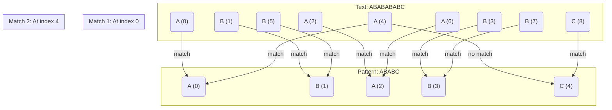

# Knuth-Morris-Pratt (KMP) Algorithm

## Introduction

The Knuth-Morris-Pratt (KMP) algorithm is an efficient string-searching algorithm that was developed by Donald Knuth, James H. Morris, and Vaughan Pratt in 1977. Unlike naive string searching approaches that might repeatedly compare characters, KMP minimizes comparisons by using the information gained from previous character matches.

When searching for a pattern within a text, KMP algorithm pre-processes the pattern to identify the longest proper suffix that is also a prefix. This information allows the algorithm to skip redundant comparisons when a mismatch occurs, making it significantly faster than the naive approach, especially for patterns with repeated substrings.

## Why KMP Algorithm?

Consider the naive approach to string matching: for each position in the text, we try to match the pattern starting from that position. If a mismatch occurs at any point, we move to the next position in the text and start all over again. This can lead to redundant comparisons.

For example, when searching for the pattern "ABABC" in the text "ABABABABC":

- If we find a mismatch at the 5th character (comparing "ABABC" with "ABABA"), the naive approach would restart from the second character of the text.
- However, KMP would recognize that we've already matched "ABAB" and would know that starting from the second character would only match "A" before encountering the same mismatch.

KMP leverages this insight to avoid redundant work, making it more efficient, especially for large texts.

## How KMP Works

The KMP algorithm consists of two main steps:
1. **Preprocessing**: Create a prefix function (often called the "failure function" or "lps array") for the pattern.
2. **Searching**: Use the prefix function to efficiently search for the pattern in the text.

### Preprocessing: Building the Prefix Function

The prefix function or LPS (Longest Prefix Suffix) array is a crucial component of the KMP algorithm. For each position `j` in the pattern, the prefix function tells us the length of the longest proper prefix that is also a suffix of the substring from 0 to j.

For instance, for the pattern "ABABC":

- lps[0] = 0 (no proper prefix that is also a suffix for the single character "A")
- lps[1] = 0 (no proper prefix that is also a suffix for "AB")
- lps[2] = 1 (for "ABA", the proper prefix "A" is also a suffix)
- lps[3] = 2 (for "ABAB", the proper prefix "AB" is also a suffix)
- lps[4] = 0 (no proper prefix that is also a suffix for "ABABC")

Here's how we can compute the LPS array:

```javascript
function computeLPSArray(pattern) {
    const lps = new Array(pattern.length).fill(0);
    let len = 0;
    let i = 1;
    
    while (i < pattern.length) {
        if (pattern[i] === pattern[len]) {
            len++;
            lps[i] = len;
            i++;
        } else {
            if (len !== 0) {
                len = lps[len - 1];
            } else {
                lps[i] = 0;
                i++;
            }
        }
    }
    
    return lps;
}
```

### Searching with KMP

With the LPS array in hand, we can now implement the KMP algorithm to efficiently search for the pattern in the text:

```javascript
function kmpSearch(text, pattern) {
    const n = text.length;
    const m = pattern.length;
    
    // Edge case: empty pattern matches everywhere
    if (m === 0) return 0;
    
    // Compute the LPS array
    const lps = computeLPSArray(pattern);
    
    // Indices for text and pattern
    let i = 0; // for text
    let j = 0; // for pattern
    
    const matches = [];
    
    while (i < n) {
        if (pattern[j] === text[i]) {
            i++;
            j++;
        }
        
        if (j === m) {
            // Found a match at index i-j
            matches.push(i - j);
            j = lps[j - 1];
        } else if (i < n && pattern[j] !== text[i]) {
            if (j !== 0) {
                j = lps[j - 1];
            } else {
                i++;
            }
        }
    }
    
    return matches;
}
```

## Step-by-Step Example

Let's trace the KMP algorithm step by step for searching the pattern "ABABC" in the text "ABABABABC":

1. **Preprocessing**: First, we compute the LPS array for the pattern "ABABC".
   - lps[0] = 0
   - lps[1] = 0
   - lps[2] = 1
   - lps[3] = 2
   - lps[4] = 0

2. **Searching**:
   - Start with i=0 (text index) and j=0 (pattern index).
   - Since text[0] = 'A' matches pattern[0] = 'A', increment both i and j. Now i=1, j=1.
   - Continue comparing and incrementing until i=5, j=5.
   - At i=5, the pattern doesn't match (text[5] = 'B', pattern[5] is out of bounds because the pattern is fully matched). This means we've found a match starting at index i-j = 5-5 = 0.
   - To find the next potential match, set j = lps[j-1] = lps[4] = 0.
   - Continue the search. The next match will be found at index 4.

## Visualization

Let's visualize the KMP algorithm's working for the example above:



## Time and Space Complexity

- **Time Complexity**: O(n + m), where n is the length of the text and m is the length of the pattern. The preprocessing step takes O(m) time, and the searching step takes O(n) time.
- **Space Complexity**: O(m) for storing the LPS array.

This is a significant improvement over the naive approach's O(n*m) time complexity in the worst case.

## Real-world Applications

The KMP algorithm finds applications in various real-world scenarios:

1. **Text Editors**: Efficient search and replace operations in large documents.
2. **Bioinformatics**: Finding DNA sequences within larger genetic sequences.
3. **Network Security**: Intrusion detection systems to identify patterns of malicious activity.
4. **Data Compression**: Identifying repeated patterns for efficient compression.

### Example: Detecting Repeated Log Patterns

Imagine you're analyzing server logs to identify potential security breaches. You suspect an attacker is trying to access specific URLs repeatedly. The KMP algorithm can help you quickly scan through logs to identify these patterns:

```javascript
function analyzeServerLogs(logs, suspiciousPattern) {
    const matches = kmpSearch(logs, suspiciousPattern);
    
    if (matches.length > 0) {
        console.log(`Found ${matches.length} occurrences of the suspicious pattern.`);
        console.log(`First occurrence at position: ${matches[0]}`);
    } else {
        console.log("No suspicious patterns found.");
    }
}

// Usage
const serverLogs = "GET /login.php POST /admin/config GET /login.php?attempt=2 POST /admin/config";
const suspiciousPattern = "GET /login.php";
analyzeServerLogs(serverLogs, suspiciousPattern);
```

**Output**:
```
Found 2 occurrences of the suspicious pattern.
First occurrence at position: 0
```

## Comparison with Other String Matching Algorithms

While KMP is efficient, it's worth understanding its strengths and weaknesses compared to other string-matching algorithms:

1. **Naive (Brute Force)**:
   - Simple to implement but inefficient for large texts and patterns.
   - Time complexity: O(n*m) in the worst case.

2. **Boyer-Moore**:
   - Often faster than KMP in practice, especially for larger alphabets.
   - Skips sections of the text based on bad character and good suffix heuristics.
   - Time complexity: O(n*m) in the worst case, but O(n/m) in the best case.

3. **Rabin-Karp**:
   - Uses hashing to identify potential matches and then verifies them.
   - Efficient for multiple pattern searches.
   - Time complexity: O(n+m) on average, but O(n*m) in the worst case.

4. **KMP (Knuth-Morris-Pratt)**:
   - Guarantees O(n+m) time complexity in all cases.
   - Particularly efficient for patterns with repeated substrings.

## Summary

The Knuth-Morris-Pratt algorithm is a powerful and efficient string-searching method that leverages information from previous comparisons to minimize redundant work. By pre-computing the LPS array, KMP can quickly identify where to continue the search after a mismatch, resulting in a time complexity of O(n+m) regardless of the input.

Key takeaways:
- KMP efficiently handles string matching by avoiding redundant comparisons.
- It pre-computes an LPS (Longest Prefix Suffix) array to determine where to continue searching after a mismatch.
- With a time complexity of O(n+m), it's more efficient than the naive approach, especially for large texts and patterns with repeated substrings.
- It finds applications in text editors, bioinformatics, network security, and more.

## Exercises

1. Implement the KMP algorithm in your favorite programming language and test it with various inputs.
2. Modify the KMP algorithm to count the number of occurrences of a pattern in a text.
3. Compare the performance of the KMP algorithm with the naive approach for different patterns and texts.
4. Implement a function that uses KMP to find the longest repeated substring in a given text.
5. Extend the KMP algorithm to handle case-insensitive searches.

## Additional Resources

- "Introduction to Algorithms" by Cormen, Leiserson, Rivest, and Stein (CLRS)
- "Algorithms" by Robert Sedgewick and Kevin Wayne
- [Stanford CS Education Library: KMP String-Matching Algorithm](http://www-cs-faculty.stanford.edu/~knuth/papers/kmp.pdf)
- [KMP Algorithm for Pattern Searching](https://www.geeksforgeeks.org/kmp-algorithm-for-pattern-searching/)

Happy coding!