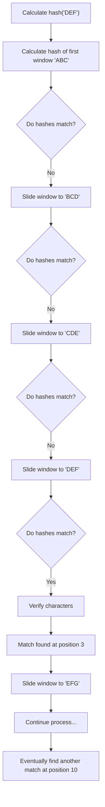

# Rabin-Karp Algorithm

## Introduction

The Rabin-Karp algorithm is an efficient string searching algorithm that uses hashing to find patterns within text. Developed by Michael O. Rabin and Richard M. Karp in 1987, this algorithm is particularly useful for multiple pattern searches and plagiarism detection systems.

Unlike naive string matching approaches that compare each character individually, Rabin-Karp converts the pattern and substrings of the text into hash values, allowing for faster comparisons. When hash values match, it performs a character-by-character verification to confirm the pattern's presence.

## How Rabin-Karp Works

The algorithm follows these key steps:

1. Compute the hash value of the pattern
2. Compute the hash value of the first window (substring of length equal to pattern) in the text
3. Slide the window one character at a time, efficiently computing the new hash value
4. When hash values match, verify character by character
5. Return all valid matches

### The Rolling Hash Function

The genius of Rabin-Karp lies in its "rolling hash" technique, which allows it to compute the next hash value in constant time. This is achieved by:

1. Removing the contribution of the leftmost character
2. Shifting all characters one position to the left
3. Adding the contribution of the new rightmost character

A common hash function used is the polynomial rolling hash:

```
hash(s) = (s[0] * p^(m-1) + s[1] * p^(m-2) + ... + s[m-1] * p^0) mod q
```

Where:
- `s` is the string
- `p` is a prime number (usually 31 or 101)
- `m` is the length of the string
- `q` is another prime number to limit the hash value

## Implementation

Let's implement the Rabin-Karp algorithm in Python:

```python
def rabin_karp_search(text, pattern):
    # Constants for the hash function
    d = 256  # Number of characters in the input alphabet
    q = 101  # A prime number
    
    n = len(text)
    m = len(pattern)
    results = []
    
    # Edge cases
    if m > n or m == 0:
        return results
    
    # Calculate hash values for pattern and first window of text
    pattern_hash = 0
    text_hash = 0
    h = 1
    
    # Calculate h = d^(m-1) % q
    for i in range(m-1):
        h = (h * d) % q
    
    # Calculate initial hash values
    for i in range(m):
        pattern_hash = (d * pattern_hash + ord(pattern[i])) % q
        text_hash = (d * text_hash + ord(text[i])) % q
    
    # Slide the pattern over text one by one
    for i in range(n - m + 1):
        # Check if hash values match
        if pattern_hash == text_hash:
            # Verify character by character
            match = True
            for j in range(m):
                if text[i + j] != pattern[j]:
                    match = False
                    break
            if match:
                results.append(i)
        
        # Calculate hash value for next window
        if i < n - m:
            text_hash = (d * (text_hash - ord(text[i]) * h) + ord(text[i + m])) % q
            
            # We might get negative value, converting it to positive
            if text_hash < 0:
                text_hash += q
    
    return results
```

### Example Usage

```python
# Example usage
text = "ABABCABABCABCABC"
pattern = "ABCABC"
matches = rabin_karp_search(text, pattern)

print(f"Pattern found at positions: {matches}")
# Output: Pattern found at positions: [10]

# Multiple occurrences
text = "AABAACAADAABAABA"
pattern = "AABA"
matches = rabin_karp_search(text, pattern)

print(f"Pattern found at positions: {matches}")
# Output: Pattern found at positions: [0, 9, 12]
```

## Algorithm Visualization

Let's visualize how the algorithm works with an example. Consider:
- Text: "ABCDEFGHABCDEF"
- Pattern: "DEF"



## Time and Space Complexity

The time complexity of the Rabin-Karp algorithm varies:

- **Best case**: O(n + m) - where n is the length of the text and m is the length of the pattern
- **Average case**: O(n + m)
- **Worst case**: O(n*m) - occurs when all hash values match but the strings don't match, requiring character-by-character comparison

The space complexity is O(1) as we only store a constant amount of variables regardless of input size.

## Practical Applications

### Multiple Pattern Matching

Rabin-Karp can be extended to search for multiple patterns simultaneously by using a hash table to store pattern hashes:

```python
def rabin_karp_multi_pattern(text, patterns):
    results = {pattern: [] for pattern in patterns}
    
    # Store hash values for all patterns
    pattern_hashes = {}
    for pattern in patterns:
        # Calculate hash for each pattern
        pattern_hash = calculate_hash(pattern)
        pattern_hashes[pattern_hash] = pattern
    
    # For each possible starting position in text
    for i in range(len(text) - min(len(p) for p in patterns) + 1):
        for pattern in patterns:
            m = len(pattern)
            if i <= len(text) - m:
                # Calculate hash for current text window
                window_hash = calculate_hash(text[i:i+m])
                
                # If hash matches, verify characters
                if window_hash in pattern_hashes:
                    if text[i:i+m] == pattern:
                        results[pattern].append(i)
    
    return results
```

### Plagiarism Detection

Rabin-Karp is commonly used in plagiarism detection systems to find matching text segments:

```python
def find_document_similarities(doc1, doc2, k=5):
    """Find k-gram matches between two documents."""
    matches = []
    
    # Generate k-grams and their hashes for doc1
    doc1_hashes = {}
    for i in range(len(doc1) - k + 1):
        gram = doc1[i:i+k]
        hash_val = calculate_hash(gram)
        doc1_hashes[hash_val] = i
    
    # Check for matches in doc2
    for i in range(len(doc2) - k + 1):
        gram = doc2[i:i+k]
        hash_val = calculate_hash(gram)
        
        if hash_val in doc1_hashes:
            # Verify the match
            if doc2[i:i+k] == doc1[doc1_hashes[hash_val]:doc1_hashes[hash_val]+k]:
                matches.append((doc1_hashes[hash_val], i))
    
    return matches
```

### DNA Sequence Matching

The algorithm is widely used in bioinformatics for DNA sequence matching:

```python
def find_dna_pattern(genome, pattern):
    """Find all occurrences of a DNA pattern in a genome."""
    matches = rabin_karp_search(genome, pattern)
    
    return matches
```

## Advantages and Disadvantages

### Advantages
- Efficient for multiple pattern searches
- Good average-case performance
- Especially effective when the alphabet is large

### Disadvantages
- Worst-case performance can degrade to O(n*m)
- Hash collisions can lead to unnecessary character comparisons
- Not as simple to implement as some other algorithms

## Summary

The Rabin-Karp algorithm provides an efficient approach to string matching by using hash functions to quickly identify potential matches before verifying them character by character. Its key innovation is the rolling hash technique that allows constant-time updating of hash values as the algorithm slides through the text.

While it may not be the fastest algorithm for single pattern matching, its ability to handle multiple patterns simultaneously makes it invaluable for applications like plagiarism detection, DNA sequence matching, and data fingerprinting.

## Practice Exercises

1. Implement the Rabin-Karp algorithm in your preferred programming language
2. Modify the algorithm to count the number of pattern occurrences without storing their positions
3. Create a function that uses Rabin-Karp to find the longest repeated substring in a text
4. Implement a plagiarism detector that compares two documents using Rabin-Karp
5. Optimize the algorithm to handle very large texts by processing them in chunks

## Additional Resources

- Thomas H. Cormen, Charles E. Leiserson, Ronald L. Rivest, and Clifford Stein. "Introduction to Algorithms"
- Dan Gusfield. "Algorithms on Strings, Trees, and Sequences: Computer Science and Computational Biology"
- Online courses on algorithms and data structures from platforms like Coursera, edX, and MIT OpenCourseWare

By mastering the Rabin-Karp algorithm, you'll have added a powerful tool to your algorithmic toolkit that can help solve a variety of string matching problems efficiently.