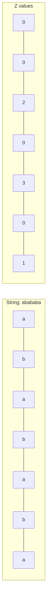

# Z Algorithm

## Introduction

The Z Algorithm is a linear time string matching algorithm that can find all occurrences of a pattern in a text. Developed by Ramesh Hariharan and S. Muthu Muthukrishnan, it's named after the "Z array" that it constructs as a central part of its operation.

Unlike some other string matching algorithms that might need preprocessing of the pattern alone, the Z Algorithm preprocesses the concatenation of the pattern and text. This makes it particularly powerful for certain types of string searching problems.

In this tutorial, we'll explore how the Z Algorithm works, implement it in code, and see how it can be applied to real-world problems.

## What is the Z Algorithm?

The Z Algorithm creates an array Z where each element Z[i] represents the length of the longest substring starting from position i that is also a prefix of the string. In other words, Z[i] is the length of the longest common prefix between the string itself and its suffix starting at position i.

### Key Concept: Z-Values

For a string S of length n, the Z-values are defined as:

- Z[0] is typically set to 0 by definition (since a string can't be a prefix of itself)
- For i > 0, Z[i] is the length of the longest substring starting at position i that is also a prefix of S

Let's look at a simple example:

For the string "aabcaabxaaaz":

```
Index: 0 1 2 3 4 5 6 7 8 9 10 11
Chars: a a b c a a b x a a  a  z
Z[i]:  0 1 0 0 3 1 0 0 2 1  0  0
```

Here, Z[4] = 3 because the substring starting at index 4 ("aab") matches with the prefix "aab".

## Understanding the Algorithm

The Z Algorithm works by maintaining what's called a "Z-box" or "Z-window" [L, R], which is the interval with the maximum value of R such that [L, R] is a prefix substring that matches with a substring starting at some position.

Here's how the algorithm works:

1. Initialize Z array and set Z[0] = 0 (by definition)
2. Initialize L = R = 0 (representing an empty Z-box)
3. Iterate through the string from index 1 to n-1:
   - If i > R: Calculate Z[i] explicitly by comparing characters
   - If i ≤ R: Use previously computed Z values to get an initial value for Z[i]
   - Extend Z[i] if possible by explicit character comparisons
   - Update Z-box [L, R] if needed

Let's implement this algorithm in code:

```javascript
function calculateZArray(str) {
    const n = str.length;
    const Z = new Array(n).fill(0);
    
    let L = 0, R = 0;
    
    for (let i = 1; i < n; i++) {
        // If i is outside the Z-box, compute Z[i] explicitly
        if (i > R) {
            L = R = i;
            
            // Extend the Z-box by comparing characters
            while (R < n && str[R - L] === str[R]) {
                R++;
            }
            
            Z[i] = R - L;
            R--;  // Adjust R to point to the last character in the Z-box
        } else {
            // i is inside the Z-box
            const k = i - L;
            
            // If Z[k] is less than the remaining Z-box size
            if (Z[k] < R - i + 1) {
                Z[i] = Z[k];
            } else {
                // Otherwise, we need to expand the Z-box
                L = i;
                
                // Extend the Z-box by comparing characters
                while (R < n && str[R - L] === str[R]) {
                    R++;
                }
                
                Z[i] = R - L;
                R--;  // Adjust R to point to the last character in the Z-box
            }
        }
    }
    
    return Z;
}
```

## Using the Z Algorithm for Pattern Matching

To use the Z Algorithm for pattern matching, we simply:

1. Concatenate the pattern P, a special character (that doesn't appear in either string), and the text T
2. Calculate the Z array for this concatenated string
3. Look for Z values that equal the length of the pattern P - these indicate where the pattern appears in the text

Here's how to implement pattern matching using the Z Algorithm:

```javascript
function zAlgorithmSearch(text, pattern) {
    // Concatenate pattern, special character and text
    const concatenated = pattern + '$' + text;
    const n = concatenated.length;
    
    // Calculate Z array
    const Z = calculateZArray(concatenated);
    
    // Find matches
    const matches = [];
    for (let i = 0; i < n; i++) {
        // If Z value equals pattern length, we found a match
        if (Z[i] === pattern.length) {
            // Calculate position in the original text
            matches.push(i - pattern.length - 1);
        }
    }
    
    return matches;
}
```

Let's see this in action with an example:

```javascript
// Example usage
const text = "ababcabcabababd";
const pattern = "ababd";

const matches = zAlgorithmSearch(text, pattern);
console.log("Pattern found at positions:", matches);
// Output: Pattern found at positions: [10]
```

## Time and Space Complexity

The Z Algorithm has the following complexities:

- Time Complexity: O(n + m) where n is the length of the text and m is the length of the pattern
- Space Complexity: O(n + m) for storing the concatenated string and the Z array

This makes it a very efficient algorithm for string matching, especially when compared to naive approaches which can take O(n × m) time.

## Practical Applications

The Z Algorithm is particularly useful in:

1. **Text Editors and Word Processors**: For implementing search functionality

2. **Plagiarism Detection**: To find similar text segments

3. **DNA Sequence Matching**: For finding specific genetic patterns in DNA sequences

4. **Data Compression**: Algorithms like LZ77 use concepts similar to the Z-function

5. **Substring Problems**: Many competitive programming problems involving substring matching can be solved efficiently using the Z Algorithm

### Example: Finding All Palindromic Substrings

Let's see how the Z Algorithm can be used to find all palindromic substrings in a string:

```javascript
function findPalindromicSubstrings(s) {
    const palindromes = [];
    const n = s.length;
    
    for (let i = 0; i < n; i++) {
        // Find odd length palindromes centered at i
        let left = i, right = i;
        while (left >= 0 && right < n && s[left] === s[right]) {
            palindromes.push(s.substring(left, right + 1));
            left--;
            right++;
        }
        
        // Find even length palindromes centered at i, i+1
        left = i;
        right = i + 1;
        while (left >= 0 && right < n && s[left] === s[right]) {
            palindromes.push(s.substring(left, right + 1));
            left--;
            right++;
        }
    }
    
    return palindromes;
}

// Example usage
const str = "abaab";
const palindromes = findPalindromicSubstrings(str);
console.log("All palindromic substrings:", palindromes);
// Output: All palindromic substrings: ["a", "b", "a", "aba", "a", "b", "aa", "baab"]
```

While this example doesn't directly use the Z Algorithm, it illustrates a problem where the Z Algorithm's principles can be applied. We could use the Z Algorithm to match a string with its reverse, which would help identify palindromes.

## Visualizing the Z Algorithm

To better understand how the Z Algorithm works, let's visualize the Z-box evolution:



The Z-box shows how the algorithm maintains and extends matching regions efficiently.

## Common Pitfalls and Tips

1. **Special Character**: When concatenating the pattern and text, make sure the special character doesn't appear in either string.

2. **Zero-Based Indexing**: Remember that the reported match positions are relative to the original text, not the concatenated string.

3. **Empty Strings**: Handle edge cases like empty patterns or texts properly.

4. **Performance**: The Z Algorithm performs best when you need to find all occurrences of a pattern, as it processes the entire text in one go.

## Summary

The Z Algorithm is a powerful and efficient string matching algorithm that:

- Runs in linear time O(n + m)
- Can find all occurrences of a pattern in a text
- Uses a clever approach to avoid redundant character comparisons
- Is particularly useful for string processing tasks

It works by computing a Z array that tells us the length of the longest substring starting at each position that matches with the prefix of the string. This information is then used to efficiently find pattern matches.

## Exercises

1. Implement the Z Algorithm to count the number of distinct substrings in a string.

2. Modify the algorithm to find the longest substring that appears at least k times.

3. Use the Z Algorithm to implement a simple text compression algorithm.

4. Apply the Z Algorithm to find the longest repeating substring in a text.

5. Implement a function that uses the Z Algorithm to determine if one string is a rotation of another.

## Additional Resources

- "Algorithms on Strings, Trees, and Sequences" by Dan Gusfield
- "Introduction to Algorithms" by Cormen, Leiserson, Rivest, and Stein
- [Competitive Programming resources](https://cp-algorithms.com/)
- [Stanford CS Library](http://infolab.stanford.edu/~ullman/focs.html)

The Z Algorithm is just one of many string matching algorithms, but its linear time complexity and elegant approach make it a valuable tool in any programmer's toolkit.