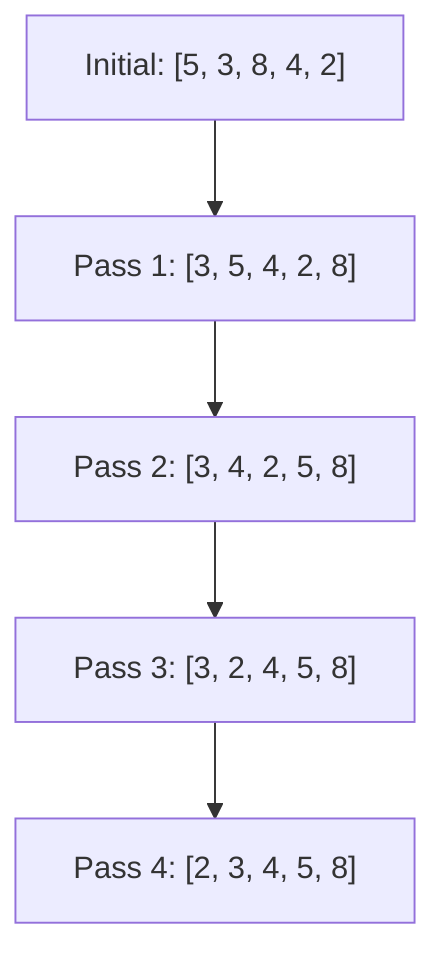

# Bubble Sort

## Introduction

Bubble Sort is one of the simplest sorting algorithms in computer science. It works by repeatedly stepping through the list, comparing adjacent elements, and swapping them if they're in the wrong order. The process is repeated until the entire list is sorted.

Despite its simplicity, Bubble Sort is rarely used in real-world applications due to its inefficiency with large datasets. However, it serves as an excellent introduction to sorting algorithms for beginners due to its intuitive nature and easy implementation.

## How Bubble Sort Works

The algorithm gets its name because smaller elements "bubble" to the top of the list (or larger elements sink to the bottom) with each iteration, similar to air bubbles rising in water.

Let's break down the steps:

1. Compare adjacent elements. If the first element is greater than the second, swap them.
2. Move to the next pair of adjacent elements and repeat step 1.
3. After completing one full pass through the list, the largest element will have "bubbled up" to the end.
4. Repeat steps 1-3 for the remaining unsorted portion of the list.
5. Continue until the entire list is sorted.

## Visual Representation

Here's a visual representation of how Bubble Sort works with the array `[5, 3, 8, 4, 2]`:



## Implementation

Let's implement Bubble Sort in a few popular programming languages:

### JavaScript Implementation

```javascript
function bubbleSort(arr) {
    const n = arr.length;
    
    // Outer loop for passes
    for (let i = 0; i < n - 1; i++) {
        // Flag to optimize if no swaps occur
        let swapped = false;
        
        // Inner loop for comparisons in each pass
        for (let j = 0; j < n - i - 1; j++) {
            // Compare adjacent elements
            if (arr[j] > arr[j + 1]) {
                // Swap elements
                [arr[j], arr[j + 1]] = [arr[j + 1], arr[j]];
                swapped = true;
            }
        }
        
        // If no swapping occurred in this pass, array is sorted
        if (!swapped) break;
    }
    
    return arr;
}

// Example usage
const array = [5, 3, 8, 4, 2];
console.log("Before sorting:", array);
bubbleSort(array);
console.log("After sorting:", array); // Output: [2, 3, 4, 5, 8]
```

### Python Implementation

```python
def bubble_sort(arr):
    n = len(arr)
    
    # Traverse through all array elements
    for i in range(n - 1):
        swapped = False
        
        # Last i elements are already in place
        for j in range(0, n - i - 1):
            # Traverse the array from 0 to n-i-1
            # Swap if the element found is greater than the next element
            if arr[j] > arr[j + 1]:
                arr[j], arr[j + 1] = arr[j + 1], arr[j]
                swapped = True
        
        # If no swapping occurred in this pass, array is sorted
        if not swapped:
            break
    
    return arr

# Example usage
array = [5, 3, 8, 4, 2]
print("Before sorting:", array)
bubble_sort(array)
print("After sorting:", array)  # Output: [2, 3, 4, 5, 8]
```

### Java Implementation

```java
import java.util.Arrays;

public class BubbleSort {
    static void bubbleSort(int[] arr) {
        int n = arr.length;
        
        for (int i = 0; i < n - 1; i++) {
            boolean swapped = false;
            
            for (int j = 0; j < n - i - 1; j++) {
                if (arr[j] > arr[j + 1]) {
                    // Swap arr[j] and arr[j+1]
                    int temp = arr[j];
                    arr[j] = arr[j + 1];
                    arr[j + 1] = temp;
                    swapped = true;
                }
            }
            
            // If no swapping occurred in this pass, array is sorted
            if (!swapped) break;
        }
    }
    
    public static void main(String[] args) {
        int[] array = {5, 3, 8, 4, 2};
        System.out.println("Before sorting: " + Arrays.toString(array));
        bubbleSort(array);
        System.out.println("After sorting: " + Arrays.toString(array)); // Output: [2, 3, 4, 5, 8]
    }
}
```

## Step-by-Step Walkthrough

Let's trace through sorting `[5, 3, 8, 4, 2]` step by step:

### Pass 1:
- Compare 5 and 3: 5 > 3, so swap → `[3, 5, 8, 4, 2]`
- Compare 5 and 8: 5 < 8, no swap → `[3, 5, 8, 4, 2]`
- Compare 8 and 4: 8 > 4, so swap → `[3, 5, 4, 8, 2]`
- Compare 8 and 2: 8 > 2, so swap → `[3, 5, 4, 2, 8]`
- After Pass 1: The largest element (8) is at the end.

### Pass 2:
- Compare 3 and 5: 3 < 5, no swap → `[3, 5, 4, 2, 8]`
- Compare 5 and 4: 5 > 4, so swap → `[3, 4, 5, 2, 8]`
- Compare 5 and 2: 5 > 2, so swap → `[3, 4, 2, 5, 8]`
- After Pass 2: The second largest element (5) is at the second-to-last position.

### Pass 3:
- Compare 3 and 4: 3 < 4, no swap → `[3, 4, 2, 5, 8]`
- Compare 4 and 2: 4 > 2, so swap → `[3, 2, 4, 5, 8]`
- After Pass 3: The third largest element (4) is at position 3.

### Pass 4:
- Compare 3 and 2: 3 > 2, so swap → `[2, 3, 4, 5, 8]`
- After Pass 4: The array is sorted.

## Time and Space Complexity

### Time Complexity:
- **Worst Case**: O(n²) - When the array is in reverse order
- **Best Case**: O(n) - When the array is already sorted (with optimization)
- **Average Case**: O(n²)

### Space Complexity:
- O(1) - Bubble Sort is an in-place sorting algorithm, requiring only a constant amount of extra space.

## Optimization

Our implementations include an important optimization: the `swapped` flag. If no swaps occur in a pass, it means the array is already sorted, and we can break out of the algorithm early. This improves the best-case time complexity to O(n).

## Advantages and Disadvantages

### Advantages:
- Simple to understand and implement
- Requires minimal extra space (in-place)
- Works well for small data sets
- Stable sort (maintains relative order of equal elements)

### Disadvantages:
- Inefficient for large data sets with O(n²) time complexity
- Performs poorly compared to other sorting algorithms like Quick Sort, Merge Sort, etc.

## Practical Applications

While Bubble Sort isn't typically used in production code due to its inefficiency, it has some niche applications:

1. **Educational purposes**: Teaching beginners about sorting algorithms.
2. **Small datasets**: When simplicity is more important than efficiency.
3. **Nearly sorted arrays**: When elements are mostly in order, the optimized Bubble Sort can perform reasonably well.
4. **Memory constraints**: When memory usage needs to be minimized since it's an in-place algorithm.

### Real-world Example

Imagine you're organizing a small classroom library with just 20 books. You might manually sort them using a bubble sort approach:

1. Start from the first book
2. Compare it with the next book
3. If they're out of order, swap them
4. Move to the next pair
5. Repeat until all books are in order

This works well for small collections but would be impractical for a large library.

## Summary

Bubble Sort is a simple comparison-based sorting algorithm that repeatedly steps through the list, compares adjacent elements, and swaps them if they're in the wrong order. While it's inefficient for large datasets with its O(n²) time complexity, it's valuable for educational purposes and serves as a building block for understanding more complex sorting algorithms.

## Exercises

1. Implement Bubble Sort in your preferred programming language.
2. Modify your implementation to sort in descending order instead of ascending.
3. Count and display the number of comparisons and swaps performed by your Bubble Sort implementation.
4. Compare the performance of Bubble Sort against other sorting algorithms (like Insertion Sort or Selection Sort) with different input sizes.
5. Implement a bidirectional Bubble Sort (also known as Cocktail Sort) and compare its performance with traditional Bubble Sort.

## Additional Resources

- [Visualization of Bubble Sort](https://visualgo.net/en/sorting) - Interactive visualization of various sorting algorithms
- [Comparison of Sorting Algorithms](https://en.wikipedia.org/wiki/Sorting_algorithm#Comparison_of_algorithms) - Wikipedia article comparing different sorting algorithms
- [Big-O Cheat Sheet](https://www.bigocheatsheet.com/) - Understand time and space complexity better

Happy coding!