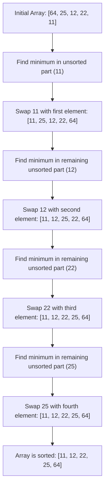

# Selection Sort

## Introduction

Selection Sort is one of the most intuitive and straightforward sorting algorithms in computer science. Despite its simplicity, it provides an excellent foundation for understanding how sorting algorithms work. The algorithm divides the input list into two parts: a sorted sublist and an unsorted sublist. It repeatedly finds the minimum (or maximum) element from the unsorted sublist and moves it to the end of the sorted sublist.

Selection Sort is named for its approach of repeatedly "selecting" the next smallest element and placing it in its proper position. While not the most efficient algorithm for large datasets, its simplicity makes it an excellent starting point for beginners learning about sorting techniques.

## How Selection Sort Works

The core idea behind Selection Sort follows this process:

1. Start with the entire array as unsorted
2. Find the minimum element in the unsorted portion
3. Swap it with the element at the beginning of the unsorted portion
4. Expand the sorted portion by one element
5. Repeat until the entire array is sorted

Let's visualize this process:



## Implementation

Here's a simple implementation of Selection Sort in various programming languages:

### JavaScript

```javascript
function selectionSort(arr) {
    const n = arr.length;
    
    // One by one move boundary of unsorted subarray
    for (let i = 0; i < n - 1; i++) {
        // Find the minimum element in unsorted array
        let minIndex = i;
        for (let j = i + 1; j < n; j++) {
            if (arr[j] < arr[minIndex]) {
                minIndex = j;
            }
        }
        
        // Swap the found minimum element with the first element
        if (minIndex !== i) {
            [arr[i], arr[minIndex]] = [arr[minIndex], arr[i]];
        }
    }
    
    return arr;
}

// Example usage
const unsortedArray = [64, 25, 12, 22, 11];
console.log("Unsorted array:", unsortedArray);
const sortedArray = selectionSort([...unsortedArray]);
console.log("Sorted array:", sortedArray);
```

### Python

```python
def selection_sort(arr):
    n = len(arr)
    
    # Traverse through all array elements
    for i in range(n):
        # Find the minimum element in remaining unsorted array
        min_idx = i
        for j in range(i+1, n):
            if arr[j] < arr[min_idx]:
                min_idx = j
        
        # Swap the found minimum element with the first element
        arr[i], arr[min_idx] = arr[min_idx], arr[i]
    
    return arr

# Example usage
unsorted_array = [64, 25, 12, 22, 11]
print("Unsorted array:", unsorted_array)
sorted_array = selection_sort(unsorted_array.copy())
print("Sorted array:", sorted_array)
```

### Java

```java
public class SelectionSort {
    public static void selectionSort(int[] arr) {
        int n = arr.length;
        
        // One by one move boundary of unsorted subarray
        for (int i = 0; i < n - 1; i++) {
            // Find the minimum element in unsorted array
            int minIdx = i;
            for (int j = i + 1; j < n; j++) {
                if (arr[j] < arr[minIdx]) {
                    minIdx = j;
                }
            }
            
            // Swap the found minimum element with the first element
            int temp = arr[minIdx];
            arr[minIdx] = arr[i];
            arr[i] = temp;
        }
    }
    
    public static void main(String[] args) {
        int[] arr = {64, 25, 12, 22, 11};
        System.out.print("Unsorted array: ");
        printArray(arr);
        
        selectionSort(arr);
        
        System.out.print("Sorted array: ");
        printArray(arr);
    }
    
    static void printArray(int[] arr) {
        for (int i : arr) {
            System.out.print(i + " ");
        }
        System.out.println();
    }
}
```

## Step-by-Step Example

Let's trace through the algorithm step by step using the array `[64, 25, 12, 22, 11]`:

**Initial array**: `[64, 25, 12, 22, 11]`

1. **First pass**:
   - Find minimum in unsorted portion `[64, 25, 12, 22, 11]`: The minimum is `11` at index 4
   - Swap `64` with `11`: `[11, 25, 12, 22, 64]`
   - Sorted portion: `[11]`, Unsorted portion: `[25, 12, 22, 64]`

2. **Second pass**:
   - Find minimum in unsorted portion `[25, 12, 22, 64]`: The minimum is `12` at index 2
   - Swap `25` with `12`: `[11, 12, 25, 22, 64]`
   - Sorted portion: `[11, 12]`, Unsorted portion: `[25, 22, 64]`

3. **Third pass**:
   - Find minimum in unsorted portion `[25, 22, 64]`: The minimum is `22` at index 3
   - Swap `25` with `22`: `[11, 12, 22, 25, 64]`
   - Sorted portion: `[11, 12, 22]`, Unsorted portion: `[25, 64]`

4. **Fourth pass**:
   - Find minimum in unsorted portion `[25, 64]`: The minimum is `25` at index 3
   - Swap `25` with itself (no change): `[11, 12, 22, 25, 64]`
   - Sorted portion: `[11, 12, 22, 25]`, Unsorted portion: `[64]`

5. **Fifth pass**:
   - Only one element left in the unsorted portion, which is automatically in its correct position
   - Final sorted array: `[11, 12, 22, 25, 64]`

## Time and Space Complexity

### Time Complexity
- **Best Case**: O(n²) - Even if the array is already sorted, the algorithm still needs to check every element to confirm it's in the right place.
- **Average Case**: O(n²) - The nested loops always run the same number of times regardless of input.
- **Worst Case**: O(n²) - Same as average case, with no optimization for already-sorted portions.

### Space Complexity
- **O(1)** - The algorithm sorts in-place, requiring only a constant amount of extra space regardless of input size.

## Advantages and Disadvantages

### Advantages
1. **Simplicity**: Easy to understand and implement
2. **In-place sorting**: Requires minimal extra space
3. **Stable Performance**: Consistent performance regardless of initial array arrangements
4. **Minimal writes**: Makes only O(n) swaps, which can be advantageous when write operations are expensive

### Disadvantages
1. **Inefficiency**: O(n²) time complexity makes it unsuitable for large datasets
2. **No early termination**: Unlike some algorithms like Bubble Sort, it doesn't detect when the array is already sorted
3. **Always performs the same number of comparisons**: Can't take advantage of partially sorted input

## Real-World Applications

Despite its inefficiency for large datasets, Selection Sort has several practical use cases:

### 1. Educational Purposes
Selection Sort is commonly taught in computer science courses as an introduction to sorting algorithms due to its simplicity.

### 2. Small Datasets
For very small arrays (fewer than 10-20 elements), the overhead of more complex algorithms might outweigh the benefits, making Selection Sort a reasonable choice.

### 3. Memory-Constrained Systems
In systems with very limited memory, Selection Sort's minimal space requirement can be advantageous.

### 4. When Write Operations are Expensive
Since Selection Sort performs only O(n) swaps (compared to O(n²) comparisons), it can be useful when writing to memory or disk is significantly more expensive than reading.

### Example: Sorting Playing Cards
Imagine you have a hand of playing cards. The way people typically sort cards by hand is similar to Selection Sort:

1. Look through all cards to find the lowest card
2. Move that card to the leftmost position
3. Look through the remaining cards to find the next lowest
4. Place it next to the first card
5. Repeat until all cards are sorted

## Selection Sort Variants

### Bidirectional Selection Sort
This variant selects both the minimum and maximum values in each pass, reducing the number of passes by half.

```javascript
function bidirectionalSelectionSort(arr) {
    let left = 0;
    let right = arr.length - 1;
    
    while (left < right) {
        let min = left;
        let max = right;
        
        // Find minimum and maximum
        for (let i = left; i <= right; i++) {
            if (arr[i] < arr[min]) min = i;
            if (arr[i] > arr[max]) max = i;
        }
        
        // Swap minimum to left position
        [arr[left], arr[min]] = [arr[min], arr[left]];
        
        // If max was at left (and we just moved it), update max position
        if (max === left) max = min;
        
        // Swap maximum to right position
        [arr[right], arr[max]] = [arr[max], arr[right]];
        
        left++;
        right--;
    }
    
    return arr;
}
```

## Summary

Selection Sort is a simple comparison-based sorting algorithm that works by repeatedly selecting the minimum element from the unsorted portion of the list and moving it to the sorted portion. While not efficient for large datasets due to its O(n²) time complexity, it offers several advantages including simplicity, minimal space requirements, and a minimal number of swaps.

Key takeaways:
- Selection Sort has O(n²) time complexity in all cases
- It performs exactly (n-1) swaps, which can be advantageous
- It is an in-place algorithm with O(1) space complexity
- It is not adaptive (doesn't take advantage of partially sorted arrays)
- It is not stable (equal elements may change their relative order)

Despite its inefficiencies, understanding Selection Sort provides a solid foundation for learning more complex sorting algorithms and helps develop intuition about algorithmic complexity and trade-offs.

## Practice Exercises

1. **Implementation Challenge**: Implement Selection Sort in your preferred programming language and test it with different inputs.
  
2. **Optimization**: Modify the basic Selection Sort algorithm to make it stable (preserving the relative order of equal elements).

3. **Variant Implementation**: Implement the bidirectional Selection Sort and compare its performance with the standard version.

4. **Analysis**: For what size of input does Selection Sort become noticeably slower than more efficient algorithms like Quick Sort or Merge Sort? Create a benchmarking program to find out.

5. **Real-World Application**: Think of a real-world scenario where Selection Sort might be preferred over more efficient sorting algorithms. Explain your reasoning.

## Further Reading

- "Introduction to Algorithms" by Cormen, Leiserson, Rivest, and Stein
- "Algorithms" by Robert Sedgewick and Kevin Wayne
- "The Art of Computer Programming, Volume 3: Sorting and Searching" by Donald Knuth

Happy coding!