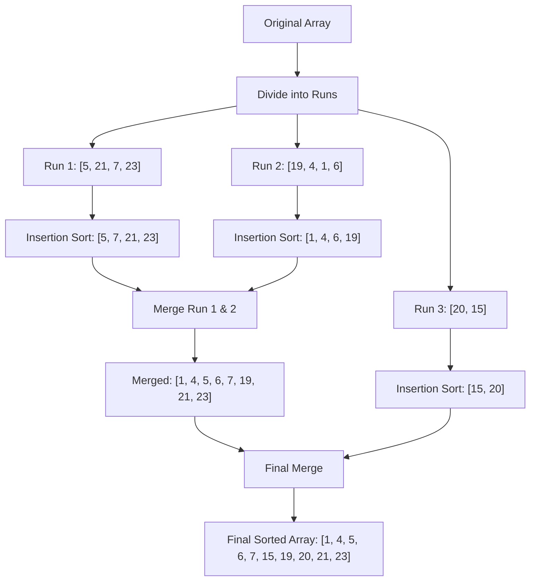

# Tim Sort

## Introduction

Tim Sort is a hybrid, stable sorting algorithm derived from merge sort and insertion sort. It was created by Tim Peters in 2002 for use in the Python programming language and has since been adopted by several other programming languages, including Java, Android platform, and Swift.

What makes Tim Sort special is that it's designed to work efficiently on real-world data, which often contains pre-sorted subsequences ("runs") that can be leveraged to improve performance. Its hybrid nature allows it to perform better than pure merge sort or insertion sort across a wide variety of data patterns.

## Understanding Tim Sort

Tim Sort works by:
1. Dividing the array into small segments called "runs"
2. Sorting these runs using insertion sort
3. Merging the runs using a merge sort technique

The algorithm is both efficient and stable, maintaining the relative order of equal elements while achieving O(n log n) worst-case time complexity.

## Key Components of Tim Sort

### 1. Run Formation

Tim Sort starts by dividing the input array into small chunks called "runs." A run is either:
- A sequence of ascending elements
- A sequence of descending elements (which is reversed to make it ascending)

The minimum run length is determined based on the size of the input array, typically aiming for a power of 2 between 32 and 64 elements.

### 2. Insertion Sort for Small Runs

For each run, Tim Sort uses insertion sort to sort the elements. Insertion sort works well for small arrays and is efficient when the elements are already partially sorted.

### 3. Merge Process

After forming and sorting the runs, Tim Sort merges them using a modified merge sort technique. It employs several optimizations during the merge process:

- **Galloping mode**: When one run is consistently "winning" during merging, Tim Sort switches to galloping mode to find the insertion points faster.
- **Balance checking**: Tim Sort ensures that runs are of similar size to maintain O(n log n) performance.

## Implementation in Pseudocode

Here's a high-level pseudocode of the Tim Sort algorithm:

```
function timSort(array):
    if array.length < 64:
        // For very small arrays, just use insertion sort
        insertionSort(array)
        return
        
    // Step 1: Determine minRun (optimal run length)
    minRun = calculateMinRun(array.length)
    
    // Step 2: Form and sort runs using insertion sort
    for start = 0; start < array.length; start += minRun:
        end = min(start + minRun - 1, array.length - 1)
        insertionSort(array, start, end)
    
    // Step 3: Merge sorted runs
    // Start with size = minRun
    size = minRun
    while size < array.length:
        // Merge adjacent runs of size 'size'
        for start = 0; start < array.length; start += 2*size:
            mid = min(array.length, start + size)
            end = min(array.length, start + 2*size)
            if mid < end:
                merge(array, start, mid, end)
        
        size = 2 * size
    
    return array
```

## Implementation in Java

Here's a simplified implementation of Tim Sort in Java:

```java
public class TimSort {
    private static final int MIN_MERGE = 32;
    
    public static void sort(int[] arr) {
        int n = arr.length;
        if (n < 2) return;
        
        // Find runs and sort them with insertion sort
        int minRun = minRunLength(n);
        
        for (int i = 0; i < n; i += minRun) {
            int end = Math.min(i + minRun - 1, n - 1);
            insertionSort(arr, i, end);
        }
        
        // Start merging from size minRun
        for (int size = minRun; size < n; size = 2 * size) {
            for (int left = 0; left < n; left += 2 * size) {
                int mid = left + size - 1;
                int right = Math.min(left + 2 * size - 1, n - 1);
                
                if (mid < right)
                    merge(arr, left, mid, right);
            }
        }
    }
    
    // Returns the minimum run length for efficient merging
    private static int minRunLength(int n) {
        int r = 0;
        while (n >= MIN_MERGE) {
            r |= (n & 1);
            n >>= 1;
        }
        return n + r;
    }
    
    // Insertion sort for small runs
    private static void insertionSort(int[] arr, int start, int end) {
        for (int i = start + 1; i <= end; i++) {
            int temp = arr[i];
            int j = i - 1;
            while (j >= start && arr[j] > temp) {
                arr[j + 1] = arr[j];
                j--;
            }
            arr[j + 1] = temp;
        }
    }
    
    // Merges two adjacent runs
    private static void merge(int[] arr, int start, int mid, int end) {
        // Create temporary arrays
        int len1 = mid - start + 1;
        int len2 = end - mid;
        int[] left = new int[len1];
        int[] right = new int[len2];
        
        // Copy data to temp arrays
        for (int i = 0; i < len1; i++)
            left[i] = arr[start + i];
        for (int i = 0; i < len2; i++)
            right[i] = arr[mid + 1 + i];
            
        // Merge temp arrays back into arr
        int i = 0, j = 0, k = start;
        while (i < len1 && j < len2) {
            if (left[i] <= right[j]) {
                arr[k] = left[i];
                i++;
            } else {
                arr[k] = right[j];
                j++;
            }
            k++;
        }
        
        // Copy remaining elements
        while (i < len1) {
            arr[k] = left[i];
            i++;
            k++;
        }
        while (j < len2) {
            arr[k] = right[j];
            j++;
            k++;
        }
    }
}
```

## Implementation in Python

Python's built-in `sorted()` function and `list.sort()` method already use Tim Sort. However, here's a simplified implementation for educational purposes:

```python
def insertion_sort(arr, start, end):
    for i in range(start + 1, end + 1):
        temp = arr[i]
        j = i - 1
        while j >= start and arr[j] > temp:
            arr[j + 1] = arr[j]
            j -= 1
        arr[j + 1] = temp

def merge(arr, start, mid, end):
    # Create temp arrays
    left = arr[start:mid + 1]
    right = arr[mid + 1:end + 1]
    
    i, j, k = 0, 0, start
    
    # Merge the temp arrays back into arr
    while i < len(left) and j < len(right):
        if left[i] <= right[j]:
            arr[k] = left[i]
            i += 1
        else:
            arr[k] = right[j]
            j += 1
        k += 1
    
    # Copy the remaining elements
    while i < len(left):
        arr[k] = left[i]
        i += 1
        k += 1
        
    while j < len(right):
        arr[k] = right[j]
        j += 1
        k += 1

def tim_sort(arr):
    n = len(arr)
    min_run = 32
    
    # Sort individual subarrays of size min_run
    for start in range(0, n, min_run):
        end = min(start + min_run - 1, n - 1)
        insertion_sort(arr, start, end)
    
    # Start merging from size min_run
    size = min_run
    while size < n:
        for left in range(0, n, 2 * size):
            mid = min(n - 1, left + size - 1)
            right = min(n - 1, left + 2 * size - 1)
            if mid < right:
                merge(arr, left, mid, right)
        size = 2 * size
    
    return arr
```

## Example with Step-by-Step Explanation

Let's understand Tim Sort with a simple example:

Consider the array: `[5, 21, 7, 23, 19, 4, 1, 6, 20, 15]`

### Step 1: Determine the minimum run length
For an array of this size, let's assume the minimum run length is 4.

### Step 2: Divide the array into runs and sort them using insertion sort

Run 1: `[5, 21, 7, 23]` → Sorted: `[5, 7, 21, 23]`  
Run 2: `[19, 4, 1, 6]` → Sorted: `[1, 4, 6, 19]`  
Run 3: `[20, 15]` → Sorted: `[15, 20]`

After this step, our array becomes:  
`[5, 7, 21, 23, 1, 4, 6, 19, 15, 20]`

### Step 3: Merge the sorted runs

Merge run 1 and run 2:  
`[5, 7, 21, 23]` and `[1, 4, 6, 19]` → `[1, 4, 5, 6, 7, 19, 21, 23]`

Merge the result with run 3:  
`[1, 4, 5, 6, 7, 19, 21, 23]` and `[15, 20]` → `[1, 4, 5, 6, 7, 15, 19, 20, 21, 23]`

Final sorted array: `[1, 4, 5, 6, 7, 15, 19, 20, 21, 23]`

## Visualization of the Process



## Time and Space Complexity

Tim Sort has the following complexity characteristics:

- **Time Complexity**:
  - Best Case: O(n) when the array is already sorted
  - Average Case: O(n log n)
  - Worst Case: O(n log n)

- **Space Complexity**: O(n) as it requires temporary storage for merging operations

Tim Sort is designed to perform well across a variety of real-world data patterns, including:
- Nearly sorted data
- Reverse sorted data
- Data with many duplicates
- Arrays with distinct sections that are already sorted

## Practical Applications

Tim Sort's efficiency in real-world scenarios has led to its adoption in several major programming languages:

1. **Python**: The default sorting algorithm for `sorted()` and `list.sort()`
2. **Java**: Used in `java.util.Arrays.sort()` and `java.util.Collections.sort()` since Java 7
3. **Android**: Used in the Android platform's sorting methods
4. **V8 JavaScript Engine**: Used as the sorting algorithm for JavaScript arrays in some implementations

### Real-world Example: Sorting Spreadsheet Data

Consider a spreadsheet application where users can sort columns of data. Tim Sort is ideal for this scenario because:

1. Many columns are often already partially sorted
2. Tim Sort's stability preserves the relative order when sorting by multiple columns
3. The algorithm works efficiently even with large datasets, which is common in spreadsheets

## Summary

Tim Sort is a hybrid sorting algorithm that combines the strengths of merge sort and insertion sort. It works by:

1. Dividing the input array into small runs
2. Sorting these runs using insertion sort, which performs well on small, partially sorted arrays
3. Merging the sorted runs using a sophisticated merging technique

Tim Sort excels at handling real-world data that often contains patterns like partially sorted sequences, which is why it has been adopted as the default sorting algorithm in many major programming languages.

The algorithm demonstrates how combining different algorithmic approaches can lead to better performance across a wider variety of inputs compared to using a single sorting strategy.

## Practice Exercises

1. Implement Tim Sort from scratch in your preferred programming language.
2. Compare the performance of Tim Sort with other sorting algorithms (quicksort, mergesort) on different types of data:
   - Randomly shuffled data
   - Nearly sorted data
   - Reverse sorted data
   - Data with many duplicates
3. Modify the Tim Sort implementation to use binary search during insertion sort to potentially improve performance.
4. Experiment with different minimum run sizes to see how they affect performance on different data sets.

## Further Reading

- Tim Peters' original description of Tim Sort
- The implementation of Tim Sort in the CPython source code
- "Timsort — the fastest sorting algorithm you've never heard of" by Nikos Vaggalis
- Adaptive sorting algorithms and their applications in real-world scenarios

Tim Sort stands as an excellent example of algorithm engineering, showing how theoretical algorithms can be refined and improved to handle practical, real-world data more efficiently.