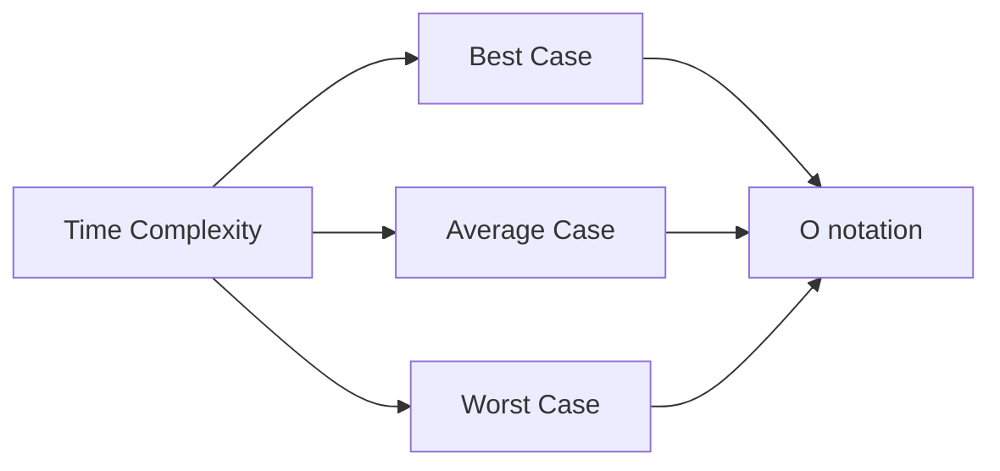
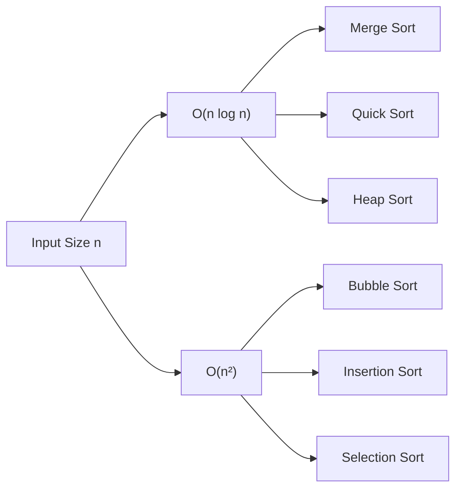

# Comparison Analysis of Sorting Algorithms

## Introduction

When developers encounter the need to arrange data in a specific order, sorting algorithms come to the rescue. However, not all sorting algorithms are created equal. Some excel at sorting small data sets, while others shine when handling millions of elements. Understanding the strengths, weaknesses, and performance characteristics of different sorting algorithms is crucial for making informed decisions in software development.

In this guide, we'll analyze and compare common sorting algorithms across various dimensions including:

- Time complexity (best, average, worst cases)
- Space complexity
- Stability
- Adaptability
- Real-world performance considerations

## Key Metrics for Comparing Sorting Algorithms

### Time Complexity

Time complexity measures how an algorithm's execution time grows relative to the input size. We use Big O notation to express this relationship.



### Space Complexity

Space complexity describes the amount of additional memory an algorithm requires beyond the input data.

### Stability

A sorting algorithm is stable if it preserves the relative order of equal elements in the sorted output.

### Adaptability

An adaptive algorithm performs more efficiently when the input data is already partially sorted.

## Comparison Table of Common Sorting Algorithms

Let's start by presenting a comprehensive comparison of the most frequently used sorting algorithms:

| Algorithm | Best Time | Average Time | Worst Time | Space | Stable | Adaptive |
|-----------|-----------|--------------|------------|-------|--------|----------|
| Bubble Sort | O(n) | O(n²) | O(n²) | O(1) | Yes | Yes |
| Selection Sort | O(n²) | O(n²) | O(n²) | O(1) | No | No |
| Insertion Sort | O(n) | O(n²) | O(n²) | O(1) | Yes | Yes |
| Merge Sort | O(n log n) | O(n log n) | O(n log n) | O(n) | Yes | No |
| Quick Sort | O(n log n) | O(n log n) | O(n²) | O(log n) | No | No |
| Heap Sort | O(n log n) | O(n log n) | O(n log n) | O(1) | No | No |
| Counting Sort | O(n+k) | O(n+k) | O(n+k) | O(n+k) | Yes | No |
| Radix Sort | O(nk) | O(nk) | O(nk) | O(n+k) | Yes | No |

*where n is the number of elements and k is the range of the input*

## Detailed Analysis of Each Algorithm

### Bubble Sort

**Time Complexity:** 
- Best: O(n) - when the array is already sorted
- Average: O(n²)
- Worst: O(n²) - when the array is reverse sorted

**Space Complexity:** O(1) - requires only a single additional memory space for swapping

**Key Characteristics:**
- Simple to implement
- Performs poorly on large datasets
- Adaptive: performs better on partially sorted arrays
- Stable sort

**Code Example:**

```javascript
function bubbleSort(arr) {
    let swapped;
    
    do {
        swapped = false;
        for(let i = 0; i < arr.length - 1; i++) {
            if(arr[i] > arr[i + 1]) {
                // Swap elements
                [arr[i], arr[i + 1]] = [arr[i + 1], arr[i]];
                swapped = true;
            }
        }
    } while(swapped);
    
    return arr;
}

// Example usage
const array = [64, 34, 25, 12, 22, 11, 90];
console.log("Original array:", array);
console.log("Sorted array:", bubbleSort([...array]));
```

**Output:**
```
Original array: [64, 34, 25, 12, 22, 11, 90]
Sorted array: [11, 12, 22, 25, 34, 64, 90]
```

### Merge Sort

**Time Complexity:** 
- Best: O(n log n)
- Average: O(n log n)
- Worst: O(n log n)

**Space Complexity:** O(n) - requires additional space for the temporary arrays

**Key Characteristics:**
- Consistent performance across all cases
- Works well for large datasets
- Stable sort
- Not in-place; requires additional memory

**Code Example:**

```javascript
function mergeSort(arr) {
    if (arr.length <= 1) {
        return arr;
    }
    
    const mid = Math.floor(arr.length / 2);
    const leftArr = arr.slice(0, mid);
    const rightArr = arr.slice(mid);
    
    return merge(mergeSort(leftArr), mergeSort(rightArr));
}

function merge(leftArr, rightArr) {
    const result = [];
    let leftIndex = 0;
    let rightIndex = 0;
    
    while (leftIndex < leftArr.length && rightIndex < rightArr.length) {
        if (leftArr[leftIndex] < rightArr[rightIndex]) {
            result.push(leftArr[leftIndex]);
            leftIndex++;
        } else {
            result.push(rightArr[rightIndex]);
            rightIndex++;
        }
    }
    
    return result.concat(leftArr.slice(leftIndex)).concat(rightArr.slice(rightIndex));
}

// Example usage
const array = [38, 27, 43, 3, 9, 82, 10];
console.log("Original array:", array);
console.log("Sorted array:", mergeSort([...array]));
```

**Output:**
```
Original array: [38, 27, 43, 3, 9, 82, 10]
Sorted array: [3, 9, 10, 27, 38, 43, 82]
```

### Quick Sort

**Time Complexity:** 
- Best: O(n log n)
- Average: O(n log n)
- Worst: O(n²) - when the pivot selection consistently results in unbalanced partitions

**Space Complexity:** O(log n) - due to the recursive call stack

**Key Characteristics:**
- Generally faster than merge sort in practice
- In-place sorting algorithm (requires less memory)
- Not stable
- Performance depends heavily on pivot selection

**Code Example:**

```javascript
function quickSort(arr, left = 0, right = arr.length - 1) {
    if (left < right) {
        const pivotIndex = partition(arr, left, right);
        quickSort(arr, left, pivotIndex - 1);
        quickSort(arr, pivotIndex + 1, right);
    }
    return arr;
}

function partition(arr, left, right) {
    const pivot = arr[right];
    let i = left - 1;
    
    for (let j = left; j < right; j++) {
        if (arr[j] <= pivot) {
            i++;
            [arr[i], arr[j]] = [arr[j], arr[i]];
        }
    }
    
    [arr[i + 1], arr[right]] = [arr[right], arr[i + 1]];
    return i + 1;
}

// Example usage
const array = [10, 7, 8, 9, 1, 5];
console.log("Original array:", array);
console.log("Sorted array:", quickSort([...array]));
```

**Output:**
```
Original array: [10, 7, 8, 9, 1, 5]
Sorted array: [1, 5, 7, 8, 9, 10]
```

## Performance Visualization

Below is a visual representation of how different sorting algorithms scale with increasing input sizes:



## Selecting the Right Algorithm

Choosing the optimal sorting algorithm depends on your specific requirements:

### Choose Bubble or Insertion Sort when:
- The data set is tiny (less than ~50 elements)
- The array is nearly sorted
- Code simplicity is more important than efficiency
- Memory usage is a critical constraint

### Choose Merge Sort when:
- You need a stable sort
- Consistent performance is important
- You have enough additional memory to spare
- Working with linked lists (merge sort is particularly efficient)

### Choose Quick Sort when:
- Average-case performance is critical
- You're working with arrays in memory
- Memory usage needs to be minimal

### Choose Specialized Algorithms when:
- Counting Sort: When sorting integers with a small range
- Radix Sort: For integers or strings with fixed-length keys
- Bucket Sort: When input is uniformly distributed

## Practical Examples

### Example 1: Sorting a Large Dataset

When working with large datasets, O(n²) algorithms become impractical. Let's see the difference:

```javascript
function timeSortingAlgorithm(sortingFunction, array) {
    const start = performance.now();
    sortingFunction([...array]);
    const end = performance.now();
    return end - start;
}

// Generate large array with 10,000 random integers
const largeArray = Array.from({length: 10000}, () => Math.floor(Math.random() * 10000));

console.log(`Bubble Sort: ${timeSortingAlgorithm(bubbleSort, largeArray).toFixed(2)} ms`);
console.log(`Quick Sort: ${timeSortingAlgorithm(quickSort, largeArray).toFixed(2)} ms`);
console.log(`Merge Sort: ${timeSortingAlgorithm(mergeSort, largeArray).toFixed(2)} ms`);
```

Typical Output:
```
Bubble Sort: 1254.67 ms
Quick Sort: 18.35 ms
Merge Sort: 23.89 ms
```

This demonstrates why O(n²) algorithms like Bubble Sort are impractical for large datasets.

### Example 2: Sorting Nearly-Sorted Data

For nearly sorted data, adaptive algorithms like Insertion Sort can outperform even theoretically faster algorithms:

```javascript
function insertionSort(arr) {
    for (let i = 1; i < arr.length; i++) {
        let current = arr[i];
        let j = i - 1;
        
        while (j >= 0 && arr[j] > current) {
            arr[j + 1] = arr[j];
            j--;
        }
        
        arr[j + 1] = current;
    }
    
    return arr;
}

// Create nearly sorted array
const nearlySortedArray = Array.from({length: 10000}, (_, i) => i);
// Add some disorder
for (let i = 0; i < 100; i++) {
    const idx1 = Math.floor(Math.random() * 10000);
    const idx2 = Math.floor(Math.random() * 10000);
    [nearlySortedArray[idx1], nearlySortedArray[idx2]] = 
        [nearlySortedArray[idx2], nearlySortedArray[idx1]];
}

console.log(`Insertion Sort: ${timeSortingAlgorithm(insertionSort, nearlySortedArray).toFixed(2)} ms`);
console.log(`Quick Sort: ${timeSortingAlgorithm(quickSort, nearlySortedArray).toFixed(2)} ms`);
```

Typical Output:
```
Insertion Sort: 12.43 ms
Quick Sort: 17.89 ms
```

For nearly sorted data, Insertion Sort can outperform Quick Sort!

### Example 3: Memory-Constrained Environments

In memory-constrained environments, in-place sorting algorithms are preferred:

```javascript
// Compare memory usage of different sorting algorithms
function heapSort(arr) {
    // Build max heap
    for (let i = Math.floor(arr.length / 2) - 1; i >= 0; i--) {
        heapify(arr, arr.length, i);
    }
    
    // Extract elements one by one
    for (let i = arr.length - 1; i > 0; i--) {
        [arr[0], arr[i]] = [arr[i], arr[0]]; // Swap
        heapify(arr, i, 0);
    }
    
    return arr;
}

function heapify(arr, n, i) {
    let largest = i;
    const left = 2 * i + 1;
    const right = 2 * i + 2;
    
    if (left < n && arr[left] > arr[largest]) {
        largest = left;
    }
    
    if (right < n && arr[right] > arr[largest]) {
        largest = right;
    }
    
    if (largest !== i) {
        [arr[i], arr[largest]] = [arr[largest], arr[i]];
        heapify(arr, n, largest);
    }
}

// Memory usage comparison (simplified representation)
console.log("Memory usage characteristics:");
console.log("Merge Sort: Requires O(n) extra space");
console.log("Quick Sort: Requires O(log n) stack space");
console.log("Heap Sort: In-place with O(1) extra space");
console.log("Insertion Sort: In-place with O(1) extra space");
```

## Real-World Applications

Understanding algorithm performance is crucial in many real-world scenarios:

1. **Database Systems**: When a database executes a query with an ORDER BY clause, it needs to choose an efficient algorithm based on the data characteristics.

2. **Big Data Processing**: Processing terabytes of data requires highly efficient sorting algorithms to minimize computational costs.

3. **Operating Systems**: File systems often need to display files in sorted order, and the algorithm choice impacts user experience.

4. **Search Engines**: Index building and sorting search results require efficient sorting algorithms.

5. **E-commerce Platforms**: Sorting products by price, rating, or relevance needs to be quick to provide a smooth shopping experience.

## Summary

The key takeaways from our comparison analysis of sorting algorithms:

1. **No Universal Best Algorithm**: The optimal choice depends on your specific use case and data characteristics.

2. **Consider Multiple Factors**: When selecting a sorting algorithm, consider time complexity, space complexity, stability, and adaptability.

3. **Practical Constraints Matter**: Real-world factors such as memory limitations, cache behavior, and hardware characteristics can influence performance.

4. **Time-Space Tradeoff**: Often, algorithms that use more memory (like Merge Sort) offer better time complexity guarantees.

5. **Know Your Data**: Information about your data's size, distribution, and existing order can guide your algorithm choice.

## Exercises

1. **Benchmark Comparison**: Implement three different sorting algorithms of your choice and benchmark them on:
   - A randomly-generated array of 10,000 integers
   - A nearly-sorted array of 10,000 integers
   - A reverse-sorted array of 10,000 integers

2. **Custom Hybrid Sort**: Create a hybrid sorting algorithm that uses Insertion Sort for small subarrays within a Merge Sort or Quick Sort implementation. Compare its performance to the standard versions.

3. **Stability Analysis**: Create an array of objects with duplicate keys and test different sorting algorithms to verify their stability properties.

4. **Implementation Challenge**: Implement a sorting algorithm not covered in this guide (like Tim Sort, Shell Sort, or Smoothsort) and analyze its performance.

5. **Real Data Test**: Find a real-world dataset (e.g., stock prices, population data) and compare the performance of different sorting algorithms on it.

## Additional Resources

- "Introduction to Algorithms" by Cormen, Leiserson, Rivest, and Stein - The classic text on algorithms with in-depth analysis of sorting methods
- "Algorithms, 4th Edition" by Robert Sedgewick and Kevin Wayne - Excellent explanations and visualizations of sorting algorithms
- [Sorting Algorithm Visualizations](https://visualgo.net/en/sorting) - Interactive visualizations of various sorting algorithms
- [Big-O Cheat Sheet](https://www.bigocheatsheet.com/) - Quick reference for time and space complexity of common algorithms

By understanding the strengths and weaknesses of different sorting algorithms, you can make informed decisions that will lead to more efficient and effective software solutions. Remember that theoretical analysis is a useful guide, but real-world testing on your specific use case is often the most reliable way to determine the best algorithm for your needs.