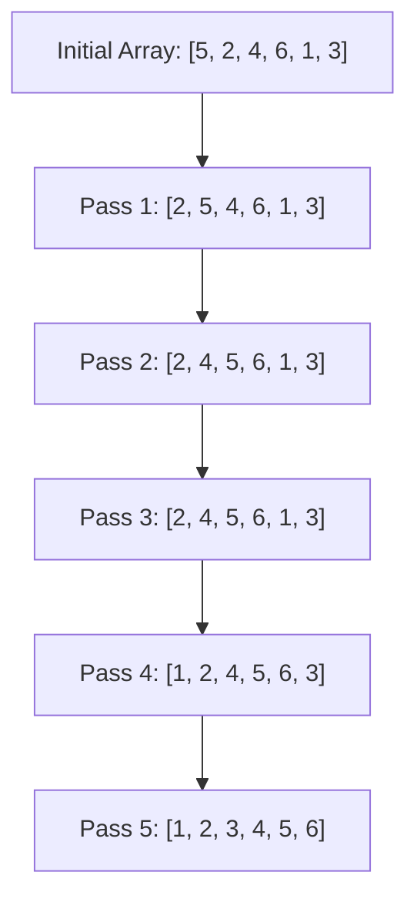

# Insertion Sort

## Introduction

Insertion Sort is one of the simplest sorting algorithms that works by building a sorted array one element at a time. It's an efficient algorithm for small data sets and is often used as part of more sophisticated algorithms. Think of it as sorting a hand of playing cards - you pick up cards one by one and insert each one into its proper place among the cards you've already picked up.

In this tutorial, we'll explore how Insertion Sort works, implement it in code, analyze its performance, and look at practical applications where it shines.

## How Insertion Sort Works

Insertion Sort divides the array into two parts:
- A sorted portion (initially just the first element)
- An unsorted portion (initially everything except the first element)

The algorithm then takes elements from the unsorted portion one by one and inserts them into their correct position in the sorted portion.

Let's understand this with a step-by-step breakdown:

1. Start with the second element (index 1), assuming the first element is already "sorted"
2. Compare the current element with the previous elements
3. If the previous element is greater than the current element, move it one position ahead
4. Repeat step 3 until we find the correct position for the current element
5. Insert the current element into that position
6. Move to the next element and repeat steps 2-5 until the entire array is sorted

### Visual Representation

Let's visualize how Insertion Sort works on the array `[5, 2, 4, 6, 1, 3]`:



## Implementing Insertion Sort

Let's implement Insertion Sort in JavaScript:

```javascript
function insertionSort(arr) {
  const n = arr.length;
  
  // Start from the second element
  for (let i = 1; i < n; i++) {
    // Store the current element to be inserted in the right position
    let currentElement = arr[i];
    
    // Find the position where currentElement should be inserted
    let j = i - 1;
    while (j >= 0 && arr[j] > currentElement) {
      // Shift elements to the right
      arr[j + 1] = arr[j];
      j--;
    }
    
    // Insert currentElement in the correct position
    arr[j + 1] = currentElement;
  }
  
  return arr;
}

// Example usage
const array = [5, 2, 4, 6, 1, 3];
console.log("Original array:", array);
console.log("Sorted array:", insertionSort(array));
```

### Output:

```
Original array: [5, 2, 4, 6, 1, 3]
Sorted array: [1, 2, 3, 4, 5, 6]
```

Let's also see how this would be implemented in Python:

```python
def insertion_sort(arr):
    # Start from the second element
    for i in range(1, len(arr)):
        # Store the current element to be inserted in the right position
        current_element = arr[i]
        
        # Find the position where current_element should be inserted
        j = i - 1
        while j >= 0 and arr[j] > current_element:
            # Shift elements to the right
            arr[j + 1] = arr[j]
            j -= 1
        
        # Insert current_element in the correct position
        arr[j + 1] = current_element
    
    return arr

# Example usage
array = [5, 2, 4, 6, 1, 3]
print("Original array:", array)
print("Sorted array:", insertion_sort(array))
```

## Time and Space Complexity Analysis

### Time Complexity:
- **Best Case**: O(n) - This occurs when the array is already sorted. We still need to iterate through the array once to check if each element is in the right place.
- **Average Case**: O(n²) - On average, each element needs to be compared with about half of the already sorted elements.
- **Worst Case**: O(n²) - This occurs when the array is sorted in reverse order. Each element must be compared with all previously sorted elements.

### Space Complexity:
- O(1) - Insertion Sort is an in-place sorting algorithm, meaning it doesn't require extra space proportional to the input size.

## When to Use Insertion Sort

Despite its O(n²) complexity, Insertion Sort has several advantages:

1. **Simplicity**: It's easy to implement and understand.
2. **Efficient for small data sets**: For arrays with fewer than 10-20 elements, the overhead of more complex sorting algorithms might outweigh their theoretical advantages.
3. **Efficient for nearly-sorted data**: If the array is already mostly sorted, Insertion Sort can be very fast (approaching O(n)).
4. **Stable sort**: Equal elements maintain their relative order.
5. **Online algorithm**: It can sort a list as it receives it.

## Real-World Applications

Here are some practical situations where Insertion Sort is particularly useful:

### 1. Continuous Sorted Data Stream

When receiving a continuous stream of data that needs to be kept sorted:

```javascript
class SortedStream {
  constructor() {
    this.data = [];
  }
  
  insert(value) {
    // Find correct position for new value
    let i = 0;
    while (i < this.data.length && this.data[i] < value) {
      i++;
    }
    
    // Insert at correct position
    this.data.splice(i, 0, value);
    
    return this.data;
  }
}

// Example usage
const stream = new SortedStream();
console.log(stream.insert(5));  // [5]
console.log(stream.insert(3));  // [3, 5]
console.log(stream.insert(8));  // [3, 5, 8]
console.log(stream.insert(4));  // [3, 4, 5, 8]
```

### 2. Hybrid Sorting Algorithms

Many advanced sorting algorithms like TimSort (used in Python and Java) use Insertion Sort as a subroutine for small subarrays:

```javascript
function hybridSort(arr, threshold = 10) {
  // For small arrays, use insertion sort
  if (arr.length <= threshold) {
    return insertionSort(arr);
  }
  
  // For larger arrays, use a more efficient algorithm like merge sort
  // (Implementation of merge sort would go here)
  // ...
}
```

### 3. Online Card Game Sorting

When playing cards and receiving new cards one at a time:

```javascript
class HandOfCards {
  constructor() {
    this.cards = [];
  }
  
  receiveCard(card) {
    // Find where to insert the new card
    let i = 0;
    while (i < this.cards.length && this.cards[i].value < card.value) {
      i++;
    }
    
    // Insert the card in the correct position
    this.cards.splice(i, 0, card);
    return this.cards;
  }
}
```

## Common Variations

### 1. Binary Insertion Sort

This variation uses binary search to find the correct position for insertion, which can reduce the number of comparisons:

```javascript
function binaryInsertionSort(arr) {
  for (let i = 1; i < arr.length; i++) {
    const key = arr[i];
    
    // Use binary search to find the correct position
    let left = 0;
    let right = i - 1;
    
    while (left <= right) {
      const mid = Math.floor((left + right) / 2);
      
      if (arr[mid] > key) {
        right = mid - 1;
      } else {
        left = mid + 1;
      }
    }
    
    // Shift elements to make room for key
    for (let j = i - 1; j >= left; j--) {
      arr[j + 1] = arr[j];
    }
    
    arr[left] = key;
  }
  
  return arr;
}
```

### 2. Insertion Sort with Linked Lists

Insertion Sort can be more efficient with linked lists because inserting elements doesn't require shifting other elements:

```javascript
class Node {
  constructor(value, next = null) {
    this.value = value;
    this.next = next;
  }
}

function insertionSortLinkedList(head) {
  if (!head || !head.next) return head;
  
  let sorted = null;
  let current = head;
  
  while (current) {
    // Store next node
    let next = current.next;
    
    if (!sorted || sorted.value > current.value) {
      // Insert at beginning of sorted list
      current.next = sorted;
      sorted = current;
    } else {
      // Find appropriate position in sorted list
      let search = sorted;
      while (search.next && search.next.value < current.value) {
        search = search.next;
      }
      
      // Insert after 'search'
      current.next = search.next;
      search.next = current;
    }
    
    // Move to next unsorted node
    current = next;
  }
  
  return sorted;
}
```

## Summary

Insertion Sort is a simple and intuitive sorting algorithm that builds a sorted array one element at a time. While its O(n²) time complexity makes it inefficient for large data sets, it remains valuable for:

- Small data sets
- Nearly-sorted arrays
- Applications requiring an online sorting algorithm
- As a component in more complex algorithms

The algorithm's simplicity, stability, and in-place operation make it a fundamental sorting technique that every programmer should understand.

## Exercises

1. **Implementation Challenge**: Implement Insertion Sort in your preferred programming language, then test it with various arrays.

2. **Modification Challenge**: Modify the Insertion Sort algorithm to sort an array in descending order instead of ascending order.

3. **Performance Test**: Compare the running time of Insertion Sort with built-in sorting functions on arrays of different sizes.

4. **Algorithm Fusion**: Create a "hybrid sort" that uses Insertion Sort for small subarrays and another algorithm (e.g., Quick Sort) for larger arrays.

5. **Real-World Application**: Use Insertion Sort to maintain a continually updated list of top scores in a simple game.

## Additional Resources

- [Visualizing Insertion Sort](https://visualgo.net/en/sorting) - Interactive visualization of sorting algorithms
- [Insertion Sort on GeeksforGeeks](https://www.geeksforgeeks.org/insertion-sort/) - In-depth explanation with examples
- "Introduction to Algorithms" by Cormen, Leiserson, Rivest, and Stein - Comprehensive academic treatment of algorithms including Insertion Sort
- "Algorithms, 4th Edition" by Robert Sedgewick and Kevin Wayne - Practical approach to algorithms

Happy sorting!