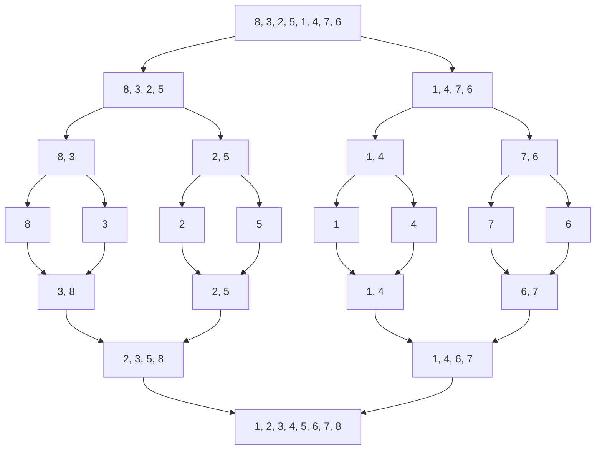

# Merge Sort

## Introduction

Merge Sort is an efficient, comparison-based sorting algorithm that follows the divide-and-conquer paradigm. Unlike simpler algorithms like Bubble Sort or Insertion Sort, Merge Sort consistently achieves O(n log n) time complexity regardless of the input data, making it significantly more efficient for large datasets.

The core principle behind Merge Sort is elegantly simple: divide the collection into smaller parts, sort them independently, and then merge these sorted parts back together. This recursive approach leads to a sorting algorithm that is both stable (preserving the relative order of equal elements) and predictable in its performance.

## How Merge Sort Works

Merge Sort operates in three key steps:

1. **Divide**: Split the unsorted array into two halves.
2. **Conquer**: Recursively sort both halves.
3. **Combine**: Merge the sorted halves to produce a single sorted array.

Let's visualize the Merge Sort process:



The diagram shows how an array is recursively divided until individual elements are reached, then merged back in sorted order.

## Implementation in Different Languages

### JavaScript Implementation

```javascript
function mergeSort(array) {
  // Base case: arrays with 0 or 1 element are already sorted
  if (array.length <= 1) {
    return array;
  }
  
  // Divide the array into two halves
  const middle = Math.floor(array.length / 2);
  const leftHalf = array.slice(0, middle);
  const rightHalf = array.slice(middle);
  
  // Recursively sort both halves
  const sortedLeft = mergeSort(leftHalf);
  const sortedRight = mergeSort(rightHalf);
  
  // Merge the sorted halves
  return merge(sortedLeft, sortedRight);
}

function merge(left, right) {
  let result = [];
  let leftIndex = 0;
  let rightIndex = 0;
  
  // Compare elements from both arrays and add the smaller one to the result
  while (leftIndex < left.length && rightIndex < right.length) {
    if (left[leftIndex] < right[rightIndex]) {
      result.push(left[leftIndex]);
      leftIndex++;
    } else {
      result.push(right[rightIndex]);
      rightIndex++;
    }
  }
  
  // Add any remaining elements
  return result.concat(
    leftIndex < left.length ? left.slice(leftIndex) : right.slice(rightIndex)
  );
}

// Example usage
const unsortedArray = [8, 3, 2, 5, 1, 4, 7, 6];
const sortedArray = mergeSort(unsortedArray);
console.log("Original array:", unsortedArray);
console.log("Sorted array:", sortedArray);
```

### Python Implementation

```python
def merge_sort(array):
    # Base case: arrays with 0 or 1 element are already sorted
    if len(array) <= 1:
        return array
    
    # Divide the array into two halves
    middle = len(array) // 2
    left_half = array[:middle]
    right_half = array[middle:]
    
    # Recursively sort both halves
    left_half = merge_sort(left_half)
    right_half = merge_sort(right_half)
    
    # Merge the sorted halves
    return merge(left_half, right_half)

def merge(left, right):
    result = []
    left_index = right_index = 0
    
    # Compare elements from both arrays and add the smaller one to the result
    while left_index < len(left) and right_index < len(right):
        if left[left_index] < right[right_index]:
            result.append(left[left_index])
            left_index += 1
        else:
            result.append(right[right_index])
            right_index += 1
    
    # Add any remaining elements
    result.extend(left[left_index:])
    result.extend(right[right_index:])
    return result

# Example usage
unsorted_array = [8, 3, 2, 5, 1, 4, 7, 6]
sorted_array = merge_sort(unsorted_array)
print("Original array:", unsorted_array)
print("Sorted array:", sorted_array)
```

### Java Implementation

```java
import java.util.Arrays;

public class MergeSort {
    public static void main(String[] args) {
        int[] unsortedArray = {8, 3, 2, 5, 1, 4, 7, 6};
        System.out.println("Original array: " + Arrays.toString(unsortedArray));
        
        int[] sortedArray = mergeSort(unsortedArray);
        System.out.println("Sorted array: " + Arrays.toString(sortedArray));
    }
    
    public static int[] mergeSort(int[] array) {
        // Base case: arrays with 0 or 1 element are already sorted
        if (array.length <= 1) {
            return array;
        }
        
        // Divide the array into two halves
        int middle = array.length / 2;
        int[] leftHalf = Arrays.copyOfRange(array, 0, middle);
        int[] rightHalf = Arrays.copyOfRange(array, middle, array.length);
        
        // Recursively sort both halves
        leftHalf = mergeSort(leftHalf);
        rightHalf = mergeSort(rightHalf);
        
        // Merge the sorted halves
        return merge(leftHalf, rightHalf);
    }
    
    public static int[] merge(int[] left, int[] right) {
        int[] result = new int[left.length + right.length];
        int leftIndex = 0, rightIndex = 0, resultIndex = 0;
        
        // Compare elements from both arrays and add the smaller one to the result
        while (leftIndex < left.length && rightIndex < right.length) {
            if (left[leftIndex] < right[rightIndex]) {
                result[resultIndex++] = left[leftIndex++];
            } else {
                result[resultIndex++] = right[rightIndex++];
            }
        }
        
        // Add any remaining elements
        while (leftIndex < left.length) {
            result[resultIndex++] = left[leftIndex++];
        }
        
        while (rightIndex < right.length) {
            result[resultIndex++] = right[rightIndex++];
        }
        
        return result;
    }
}
```

## Step-by-Step Walkthrough

Let's break down how Merge Sort works using a simple example with the array `[8, 3, 2, 5]`:

**Step 1: Divide**
- Split `[8, 3, 2, 5]` into `[8, 3]` and `[2, 5]`
- Split `[8, 3]` into `[8]` and `[3]`
- Split `[2, 5]` into `[2]` and `[5]`

**Step 2: Conquer**
- Single elements `[8]`, `[3]`, `[2]`, and `[5]` are already sorted

**Step 3: Combine**
- Merge `[8]` and `[3]` to get `[3, 8]`
- Merge `[2]` and `[5]` to get `[2, 5]`
- Finally, merge `[3, 8]` and `[2, 5]` to get `[2, 3, 5, 8]`

### Detailed Merging Example

Let's focus on the final merge step, combining `[3, 8]` and `[2, 5]`:

1. Compare the first elements: `3 > 2`, so take `2` → Result: `[2]`
2. Compare the next elements: `3 < 5`, so take `3` → Result: `[2, 3]`
3. Compare the next elements: `8 > 5`, so take `5` → Result: `[2, 3, 5]`
4. Only `8` remains, so add it → Final Result: `[2, 3, 5, 8]`

This process ensures that elements are properly ordered in the final array.

## Time and Space Complexity Analysis

### Time Complexity

- **Best Case**: O(n log n)
- **Average Case**: O(n log n)
- **Worst Case**: O(n log n)

Merge Sort maintains consistent O(n log n) performance regardless of the input data's initial order. This is because:
- The array is divided into halves at each step: O(log n) levels of recursion
- At each level, all n elements must be processed during merging: O(n) work per level
- Total: O(n) × O(log n) = O(n log n)

### Space Complexity

- **Space Complexity**: O(n)

Merge Sort requires additional space proportional to the input size for the temporary arrays used during merging. This makes it less space-efficient than in-place sorting algorithms like Quick Sort or Heap Sort.

## Advantages and Disadvantages

### Advantages

1. **Predictable Performance**: O(n log n) performance regardless of input data
2. **Stability**: Preserves the relative order of equal elements
3. **External Sorting**: Well-suited for sorting large datasets that don't fit in memory
4. **Parallelization**: Can be easily parallelized for improved performance

### Disadvantages

1. **Extra Space**: Requires O(n) auxiliary space
2. **Overhead**: For small arrays, simpler algorithms may be faster due to less overhead
3. **Not In-Place**: Requires additional memory allocation

## Real-world Applications

### 1. Database Management Systems

Merge Sort is frequently used in database systems for efficiently sorting large datasets that don't fit entirely in memory. The external sorting capabilities make it ideal for managing large files.

```javascript
// Simplified example of external sorting using Merge Sort
function externalMergeSort(largeFileHandler) {
  // Step 1: Divide the large file into smaller chunks that fit in memory
  const chunkFiles = divideIntoChunks(largeFileHandler, CHUNK_SIZE);
  
  // Step 2: Sort each chunk in memory and write to temporary files
  const sortedChunks = chunkFiles.map(chunk => {
    const data = readChunk(chunk);
    const sortedData = mergeSort(data);
    return writeToTempFile(sortedData);
  });
  
  // Step 3: Merge the sorted chunks
  return mergeSortedChunks(sortedChunks);
}
```

### 2. Parallel Computing

Merge Sort's divide-and-conquer approach makes it naturally suitable for parallel processing:

```python
from concurrent.futures import ProcessPoolExecutor

def parallel_merge_sort(array, thread_count=4):
    if len(array) <= 1:
        return array
    
    if thread_count <= 1 or len(array) < 1000:  # Threshold for parallelization
        return merge_sort(array)
    
    middle = len(array) // 2
    
    # Process each half in separate threads
    with ProcessPoolExecutor(max_workers=thread_count) as executor:
        left_future = executor.submit(
            parallel_merge_sort, array[:middle], thread_count // 2)
        right_future = executor.submit(
            parallel_merge_sort, array[middle:], thread_count // 2)
        
        left = left_future.result()
        right = right_future.result()
    
    return merge(left, right)
```

### 3. Inversion Count Problem

Merge Sort can be adapted to solve the "inversion count" problem, which asks for the number of pairs in an array where the first element is greater than the second:

```javascript
function countInversions(array) {
  // Base case
  if (array.length <= 1) {
    return { array, inversions: 0 };
  }
  
  const middle = Math.floor(array.length / 2);
  const left = array.slice(0, middle);
  const right = array.slice(middle);
  
  // Recursively count inversions in left and right subarrays
  const leftResult = countInversions(left);
  const rightResult = countInversions(right);
  
  // Count split inversions and merge
  const mergeResult = mergeAndCount(
    leftResult.array, 
    rightResult.array
  );
  
  // Total inversions = left inversions + right inversions + split inversions
  return { 
    array: mergeResult.array, 
    inversions: leftResult.inversions + rightResult.inversions + mergeResult.inversions 
  };
}

function mergeAndCount(left, right) {
  let result = [];
  let inversions = 0;
  let i = 0, j = 0;
  
  while (i < left.length && j < right.length) {
    if (left[i] <= right[j]) {
      result.push(left[i]);
      i++;
    } else {
      // If left[i] > right[j], it forms inversions with all remaining elements in left
      result.push(right[j]);
      inversions += left.length - i;
      j++;
    }
  }
  
  // Add remaining elements
  result = result.concat(left.slice(i)).concat(right.slice(j));
  
  return { array: result, inversions };
}
```

## Optimizations

### 1. Insertion Sort for Small Subarrays

For small subarrays (typically less than 10-20 elements), Insertion Sort can be faster due to lower overhead:

```javascript
function optimizedMergeSort(array) {
  // Use Insertion Sort for small arrays
  if (array.length <= 10) {
    return insertionSort(array);
  }
  
  const middle = Math.floor(array.length / 2);
  const left = optimizedMergeSort(array.slice(0, middle));
  const right = optimizedMergeSort(array.slice(middle));
  
  return merge(left, right);
}

function insertionSort(array) {
  for (let i = 1; i < array.length; i++) {
    const current = array[i];
    let j = i - 1;
    while (j >= 0 && array[j] > current) {
      array[j + 1] = array[j];
      j--;
    }
    array[j + 1] = current;
  }
  return array;
}
```

### 2. In-place Merge

To reduce space complexity, an in-place merge can be implemented, though it's more complex:

```javascript
function inPlaceMergeSort(array, start = 0, end = array.length - 1) {
  if (start < end) {
    const middle = Math.floor((start + end) / 2);
    
    // Sort first and second halves
    inPlaceMergeSort(array, start, middle);
    inPlaceMergeSort(array, middle + 1, end);
    
    // Merge the sorted halves
    inPlaceMerge(array, start, middle, end);
  }
  return array;
}

function inPlaceMerge(array, start, middle, end) {
  // This is a simplified implementation
  // A fully efficient in-place merge is more complex
  const leftArray = array.slice(start, middle + 1);
  const rightArray = array.slice(middle + 1, end + 1);
  
  let leftIndex = 0;
  let rightIndex = 0;
  let arrayIndex = start;
  
  while (leftIndex < leftArray.length && rightIndex < rightArray.length) {
    if (leftArray[leftIndex] <= rightArray[rightIndex]) {
      array[arrayIndex] = leftArray[leftIndex];
      leftIndex++;
    } else {
      array[arrayIndex] = rightArray[rightIndex];
      rightIndex++;
    }
    arrayIndex++;
  }
  
  while (leftIndex < leftArray.length) {
    array[arrayIndex] = leftArray[leftIndex];
    leftIndex++;
    arrayIndex++;
  }
  
  while (rightIndex < rightArray.length) {
    array[arrayIndex] = rightArray[rightIndex];
    rightIndex++;
    arrayIndex++;
  }
}
```

## Summary

Merge Sort is a powerful, efficient, and stable sorting algorithm based on the divide-and-conquer paradigm. With its consistent O(n log n) performance, it's an excellent choice for large datasets, external sorting, and applications where stability is important.

Key points to remember:
- Merge Sort divides the array into smaller parts, sorts them, and merges them back
- It guarantees O(n log n) time complexity in all cases
- It requires O(n) additional space
- It's stable, preserving the relative order of equal elements
- It's well-suited for external sorting and parallel processing

While Merge Sort may not be the fastest for very small arrays due to overhead, its predictable performance and stability make it a cornerstone algorithm in computer science and a valuable tool in any programmer's toolkit.

## Exercises

1. **Basic Implementation**: Implement Merge Sort in your preferred programming language and test it with various inputs.

2. **Counting Inversions**: Modify the Merge Sort algorithm to count the number of inversions in an array.

3. **External Sorting**: Implement an external sort for files that are too large to fit in memory using Merge Sort.

4. **Optimization Challenge**: Implement Merge Sort with the optimization of using Insertion Sort for small subarrays. Compare its performance with the standard implementation.

5. **Linked List Merge Sort**: Adapt the Merge Sort algorithm to sort a linked list instead of an array.

## Additional Resources

- "Introduction to Algorithms" by Cormen, Leiserson, Rivest, and Stein - Chapter on Merge Sort
- "Algorithms, 4th Edition" by Robert Sedgewick and Kevin Wayne
- [Stanford's CS Education Library on Sorting](https://www-cs-faculty.stanford.edu/~knuth/taocp.html)
- [Visualgo - Sorting Visualization](https://visualgo.net/en/sorting)