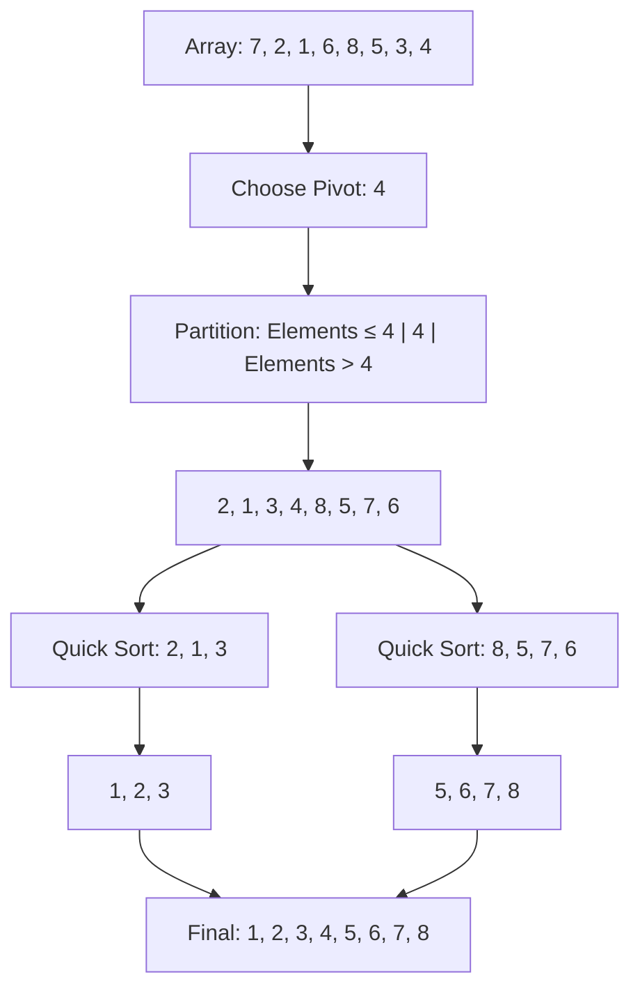

# Quick Sort

## Introduction

Quick Sort is one of the most efficient and widely used sorting algorithms in practice. Developed by British computer scientist Tony Hoare in 1959, it follows a divide-and-conquer strategy to sort elements. Quick Sort is known for its average-case time complexity of O(n log n), making it significantly faster than many other sorting algorithms for large datasets.

The algorithm works by selecting a 'pivot' element from the array and partitioning the other elements into two sub-arrays according to whether they are less than or greater than the pivot. The sub-arrays are then recursively sorted. This approach makes Quick Sort particularly efficient for large datasets and is the reason it's often used as the default sorting algorithm in many programming languages' standard libraries.

## How Quick Sort Works

The Quick Sort algorithm follows these key steps:

1. **Choose a pivot**: Select an element from the array to act as the pivot point.
2. **Partitioning**: Rearrange the array so that elements less than the pivot are on the left side, and elements greater than the pivot are on the right side.
3. **Recursive sorting**: Apply Quick Sort recursively to the sub-array of elements less than the pivot and the sub-array of elements greater than the pivot.
4. **Combine**: Since the elements are sorted in place, no explicit combination step is needed.

Let's visualize this process:



## Quick Sort Implementation

Here's an implementation of Quick Sort in JavaScript:

```javascript
function quickSort(arr, low = 0, high = arr.length - 1) {
  if (low < high) {
    // Find the partition index
    const partitionIndex = partition(arr, low, high);
    
    // Sort elements before and after partition
    quickSort(arr, low, partitionIndex - 1);
    quickSort(arr, partitionIndex + 1, high);
  }
  
  return arr;
}

function partition(arr, low, high) {
  // Choose the rightmost element as pivot
  const pivot = arr[high];
  let i = low - 1;
  
  // Traverse through all elements
  // compare each element with the pivot
  for (let j = low; j < high; j++) {
    if (arr[j] <= pivot) {
      i++;
      // Swap elements
      [arr[i], arr[j]] = [arr[j], arr[i]];
    }
  }
  
  // Swap the pivot element with the element at (i+1)
  [arr[i + 1], arr[high]] = [arr[high], arr[i + 1]];
  
  // Return the position where partition is done
  return i + 1;
}
```

Let's see the algorithm in action:

```javascript
const unsortedArray = [10, 7, 8, 9, 1, 5];
console.log("Before sorting:", unsortedArray);
const sortedArray = quickSort([...unsortedArray]); // Create a copy to preserve the original
console.log("After sorting:", sortedArray);

// Output:
// Before sorting: [10, 7, 8, 9, 1, 5]
// After sorting: [1, 5, 7, 8, 9, 10]
```

## Python Implementation

Here's how Quick Sort can be implemented in Python:

```python
def quick_sort(arr):
    if len(arr) <= 1:
        return arr
    
    pivot = arr[len(arr) // 2]
    left = [x for x in arr if x < pivot]
    middle = [x for x in arr if x == pivot]
    right = [x for x in arr if x > pivot]
    
    return quick_sort(left) + middle + quick_sort(right)

# Example usage
unsorted_array = [10, 7, 8, 9, 1, 5]
print("Before sorting:", unsorted_array)
sorted_array = quick_sort(unsorted_array)
print("After sorting:", sorted_array)

# Output:
# Before sorting: [10, 7, 8, 9, 1, 5]
# After sorting: [1, 5, 7, 8, 9, 10]
```

## Step-by-Step Example

Let's trace through the execution of Quick Sort on the array `[7, 2, 1, 6, 8, 5, 3, 4]`:

1. Choose the last element, `4`, as the pivot.
2. Partition the array:
   - Elements less than 4: `[2, 1, 3]`
   - Pivot: `[4]`
   - Elements greater than 4: `[7, 6, 8, 5]`
3. Apply Quick Sort recursively:
   - Sort `[2, 1, 3]`:
     - Choose pivot `3`
     - Partition: `[2, 1], [3]`
     - Sort `[2, 1]`:
       - Choose pivot `1`
       - Partition: `[], [1], [2]`
       - Result: `[1, 2]`
     - Result: `[1, 2, 3]`
   - Sort `[7, 6, 8, 5]`:
     - Choose pivot `5`
     - Partition: `[], [5], [7, 6, 8]`
     - Sort `[7, 6, 8]`:
       - Choose pivot `8`
       - Partition: `[7, 6], [8]`
       - Sort `[7, 6]`:
         - Choose pivot `6`
         - Partition: `[], [6], [7]`
         - Result: `[6, 7]`
       - Result: `[6, 7, 8]`
     - Result: `[5, 6, 7, 8]`
4. Final result: `[1, 2, 3, 4, 5, 6, 7, 8]`

## Time and Space Complexity

Quick Sort's performance characteristics are:

- **Time Complexity**:
  - Best case: O(n log n)
  - Average case: O(n log n)
  - Worst case: O(n²) - occurs with already sorted arrays or arrays with many duplicates when the pivot selection is poor

- **Space Complexity**:
  - O(log n) for the recursive call stack

## Choosing the Pivot

The choice of the pivot significantly impacts Quick Sort's performance. Common strategies include:

1. **Choose the first element** - Simple but leads to worst-case performance for sorted arrays.
2. **Choose the last element** - Our example implementation uses this approach.
3. **Choose a random element** - Helps avoid worst-case scenarios.
4. **Choose the median of three** - Select the median of the first, middle, and last elements for better performance.

Here's an implementation of the "median of three" pivot selection strategy:

```javascript
function medianOfThree(arr, low, high) {
    const mid = Math.floor((low + high) / 2);
    
    // Sort low, mid, high values
    if (arr[mid] < arr[low])
        [arr[low], arr[mid]] = [arr[mid], arr[low]];
    
    if (arr[high] < arr[low])
        [arr[low], arr[high]] = [arr[high], arr[low]];
    
    if (arr[high] < arr[mid])
        [arr[mid], arr[high]] = [arr[high], arr[mid]];
    
    // Return the mid value as pivot (now arr[mid])
    return mid;
}
```

## Practical Applications

Quick Sort is widely used in various practical scenarios:

1. **System Libraries**: It's the default sorting algorithm in many programming languages' standard libraries, including JavaScript's `Array.prototype.sort()`.

2. **Database Systems**: For sorting large datasets in database management systems.

3. **Search Algorithms**: As a preprocessing step in binary search or other algorithms that require sorted input.

4. **File Systems**: For organizing files and directories in alphabetical or numerical order.

5. **Network Traffic Analysis**: For sorting packets based on timestamps, IP addresses, or other criteria.

## Real-world Example: Log File Analysis

Imagine you're analyzing server logs and need to sort entries by timestamp for analysis:

```javascript
// Sample log entry class
class LogEntry {
    constructor(timestamp, message, severity) {
        this.timestamp = timestamp;
        this.message = message;
        this.severity = severity;
    }
}

// Sample log data
const logs = [
    new LogEntry(1615482000, "Server started", "INFO"),
    new LogEntry(1615481940, "Config loaded", "INFO"),
    new LogEntry(1615482060, "Connection failed", "ERROR"),
    new LogEntry(1615481980, "Database connected", "INFO"),
    new LogEntry(1615482030, "Authentication successful", "INFO")
];

// Sort logs by timestamp
function sortLogsByTimestamp(logs) {
    if (logs.length <= 1) return logs;
    
    const pivot = logs[Math.floor(logs.length / 2)].timestamp;
    const left = logs.filter(log => log.timestamp < pivot);
    const middle = logs.filter(log => log.timestamp === pivot);
    const right = logs.filter(log => log.timestamp > pivot);
    
    return [...sortLogsByTimestamp(left), ...middle, ...sortLogsByTimestamp(right)];
}

// Sort and display logs
const sortedLogs = sortLogsByTimestamp(logs);
console.log("Sorted logs by timestamp:");
sortedLogs.forEach(log => {
    const date = new Date(log.timestamp * 1000).toISOString();
    console.log(`${date} [${log.severity}]: ${log.message}`);
});

// Output will be logs sorted chronologically
```

## Quick Sort vs. Other Sorting Algorithms

| Algorithm | Time Complexity (Average) | Time Complexity (Worst) | Space Complexity | Stability |
|-----------|---------------------------|-------------------------|------------------|-----------|
| Quick Sort | O(n log n) | O(n²) | O(log n) | Not stable |
| Merge Sort | O(n log n) | O(n log n) | O(n) | Stable |
| Heap Sort | O(n log n) | O(n log n) | O(1) | Not stable |
| Bubble Sort | O(n²) | O(n²) | O(1) | Stable |
| Insertion Sort | O(n²) | O(n²) | O(1) | Stable |

Quick Sort is typically faster than other O(n log n) algorithms in practice due to its low constant factors and good cache behavior. However, it's not stable (doesn't preserve the relative order of equal elements) and can degrade to O(n²) in the worst case.

## Optimization Techniques

Here are some ways to optimize Quick Sort:

1. **Use Insertion Sort for small subarrays**: When the subarray size is small (typically less than 10-20 elements), Insertion Sort is more efficient.

```javascript
function optimizedQuickSort(arr, low = 0, high = arr.length - 1) {
    if (high - low < 10) {
        // Use insertion sort for small arrays
        for (let i = low + 1; i <= high; i++) {
            let current = arr[i];
            let j = i - 1;
            
            while (j >= low && arr[j] > current) {
                arr[j + 1] = arr[j];
                j--;
            }
            
            arr[j + 1] = current;
        }
        return arr;
    }
    
    if (low < high) {
        const partitionIndex = partition(arr, low, high);
        optimizedQuickSort(arr, low, partitionIndex - 1);
        optimizedQuickSort(arr, partitionIndex + 1, high);
    }
    
    return arr;
}
```

2. **Iterative implementation**: Avoid recursion overhead by using an explicit stack.

3. **Three-way partitioning**: Handle duplicate elements more efficiently by creating three partitions: less than, equal to, and greater than the pivot.

## Summary

Quick Sort is a highly efficient, comparison-based sorting algorithm that uses the divide-and-conquer strategy. It works by selecting a pivot element and partitioning the array around it. The algorithm's average time complexity is O(n log n), making it suitable for large datasets.

Key points to remember about Quick Sort:

- It's an in-place sorting algorithm with O(log n) space complexity
- Average time complexity is O(n log n), worst case is O(n²)
- The choice of pivot is crucial for performance
- It's not a stable sorting algorithm
- It performs well in practice due to good cache locality

Quick Sort remains one of the most important and widely used sorting algorithms due to its efficiency and versatility in real-world applications.

## Exercises

1. Implement Quick Sort with a randomized pivot selection strategy.
2. Modify the Quick Sort algorithm to handle duplicate values more efficiently.
3. Compare the performance of Quick Sort with different pivot selection strategies on various types of input (random, sorted, reverse-sorted).
4. Implement an iterative version of Quick Sort that eliminates the recursion.
5. Create a hybrid sorting algorithm that uses Quick Sort for large arrays and Insertion Sort for small subarrays.

## Additional Resources

- [Visualize Quick Sort on Algorithm Visualizer](https://algorithm-visualizer.org/)
- "Introduction to Algorithms" by Thomas H. Cormen, Charles E. Leiserson, Ronald L. Rivest, and Clifford Stein
- "Algorithms, 4th Edition" by Robert Sedgewick and Kevin Wayne
- [Stanford University's lecture on Quick Sort](https://www.youtube.com/watch?v=SLauY6PpjW4)

Happy coding!