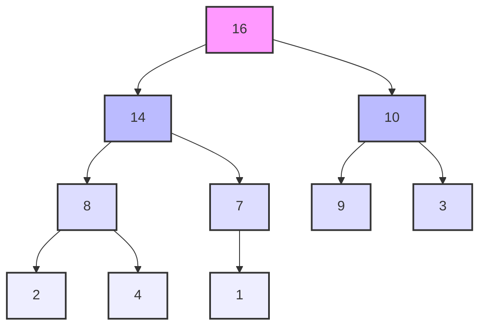

# Heap Sort

## Introduction

Heap Sort is an efficient comparison-based sorting algorithm that belongs to the selection sort family. It uses a specialized tree-based data structure called a binary heap to sort elements. The algorithm divides its input into a sorted and an unsorted region, and iteratively shrinks the unsorted region by extracting the largest element from it and inserting it into the sorted region.

Heap Sort stands out for several reasons:

- It has a guaranteed O(n log n) time complexity, making it more efficient than simpler algorithms like Bubble Sort or Insertion Sort
- It sorts in-place, requiring only a constant amount of additional memory
- It's not a stable sort (it may change the relative order of equal elements)
- It builds on the foundation of the heap data structure, which is useful for many other applications

## Understanding Heaps

Before diving into the Heap Sort algorithm, let's understand what a heap is.

### Binary Heap

A binary heap is a complete binary tree where each node satisfies the heap property:

- In a **max heap**, for any given node C, the key of C is less than or equal to the key of its parent (with the maximum at the root)
- In a **min heap**, for any given node C, the key of C is greater than or equal to the key of its parent (with the minimum at the root)

For Heap Sort, we typically use a max heap, as it allows us to extract elements in descending order.

### Array Representation of a Binary Heap

Although a heap is conceptually a tree, we can efficiently represent it using an array:

- The root element is at index 0
- For a node at index i, its:
  - Left child is at index 2i + 1
  - Right child is at index 2i + 2
  - Parent is at index floor((i-1)/2)



Array representation of this max heap: `[16, 14, 10, 8, 7, 9, 3, 2, 4, 1]`

## Heap Sort Algorithm

Heap Sort works in two phases:

1. **Build a max heap** from the unordered array
2. **Repeatedly extract the maximum element** from the heap and place it at the end of the array

### Step-by-Step Explanation

1. **Build Max Heap**:
   - Start with the array of elements
   - Transform the array into a max heap, where the largest element is at the root

2. **Heapify**:
   - The process of converting a binary tree into a heap
   - Start from the last non-leaf node and move upward, applying the heapify procedure

3. **Extract Elements**:
   - Swap the root (maximum element) with the last element of the heap
   - Reduce the heap size by 1
   - Heapify the root to maintain the max heap property
   - Repeat until the heap is empty

## Implementation in Various Languages

### JavaScript Implementation

```javascript
function heapSort(arr) {
    const n = arr.length;
    
    // Build max heap
    for (let i = Math.floor(n / 2) - 1; i >= 0; i--) {
        heapify(arr, n, i);
    }
    
    // Extract elements one by one
    for (let i = n - 1; i > 0; i--) {
        // Move current root to end
        [arr[0], arr[i]] = [arr[i], arr[0]];
        
        // Call max heapify on the reduced heap
        heapify(arr, i, 0);
    }
    
    return arr;
}

function heapify(arr, n, i) {
    let largest = i;       // Initialize largest as root
    const left = 2 * i + 1;  // Left child
    const right = 2 * i + 2; // Right child
    
    // If left child is larger than root
    if (left < n && arr[left] > arr[largest]) {
        largest = left;
    }
    
    // If right child is larger than largest so far
    if (right < n && arr[right] > arr[largest]) {
        largest = right;
    }
    
    // If largest is not root
    if (largest !== i) {
        [arr[i], arr[largest]] = [arr[largest], arr[i]];
        
        // Recursively heapify the affected sub-tree
        heapify(arr, n, largest);
    }
}

// Example usage
const array = [12, 11, 13, 5, 6, 7];
console.log("Original array:", array);
console.log("Sorted array:", heapSort([...array]));
```

**Output**:
```
Original array: [12, 11, 13, 5, 6, 7]
Sorted array: [5, 6, 7, 11, 12, 13]
```

### Python Implementation

```python
def heapify(arr, n, i):
    largest = i      # Initialize largest as root
    left = 2 * i + 1
    right = 2 * i + 2
    
    # See if left child of root exists and is greater than root
    if left < n and arr[left] > arr[largest]:
        largest = left
    
    # See if right child of root exists and is greater than root
    if right < n and arr[right] > arr[largest]:
        largest = right
    
    # Change root if needed
    if largest != i:
        arr[i], arr[largest] = arr[largest], arr[i]  # Swap
        
        # Heapify the root
        heapify(arr, n, largest)

def heap_sort(arr):
    n = len(arr)
    
    # Build a maxheap
    for i in range(n // 2 - 1, -1, -1):
        heapify(arr, n, i)
    
    # Extract elements one by one
    for i in range(n - 1, 0, -1):
        arr[i], arr[0] = arr[0], arr[i]  # Swap
        heapify(arr, i, 0)
    
    return arr

# Example usage
array = [12, 11, 13, 5, 6, 7]
print(f"Original array: {array}")
print(f"Sorted array: {heap_sort(array.copy())}")
```

**Output**:
```
Original array: [12, 11, 13, 5, 6, 7]
Sorted array: [5, 6, 7, 11, 12, 13]
```

### Java Implementation

```java
public class HeapSort {
    public void sort(int[] arr) {
        int n = arr.length;
        
        // Build heap (rearrange array)
        for (int i = n / 2 - 1; i >= 0; i--)
            heapify(arr, n, i);
        
        // One by one extract an element from heap
        for (int i = n - 1; i > 0; i--) {
            // Move current root to end
            int temp = arr[0];
            arr[0] = arr[i];
            arr[i] = temp;
            
            // Call max heapify on the reduced heap
            heapify(arr, i, 0);
        }
    }
    
    // To heapify a subtree rooted with node i which is an index in arr[]
    void heapify(int[] arr, int n, int i) {
        int largest = i;  // Initialize largest as root
        int left = 2 * i + 1;  // left = 2*i + 1
        int right = 2 * i + 2;  // right = 2*i + 2
        
        // If left child is larger than root
        if (left < n && arr[left] > arr[largest])
            largest = left;
        
        // If right child is larger than largest so far
        if (right < n && arr[right] > arr[largest])
            largest = right;
        
        // If largest is not root
        if (largest != i) {
            int swap = arr[i];
            arr[i] = arr[largest];
            arr[largest] = swap;
            
            // Recursively heapify the affected sub-tree
            heapify(arr, n, largest);
        }
    }
    
    // Example usage
    public static void main(String[] args) {
        int[] arr = {12, 11, 13, 5, 6, 7};
        HeapSort heapSort = new HeapSort();
        
        System.out.print("Original array: ");
        printArray(arr);
        
        heapSort.sort(arr);
        
        System.out.print("Sorted array: ");
        printArray(arr);
    }
    
    static void printArray(int[] arr) {
        for (int i : arr)
            System.out.print(i + " ");
        System.out.println();
    }
}
```

**Output**:
```
Original array: 12 11 13 5 6 7 
Sorted array: 5 6 7 11 12 13 
```

## Working Example: Step-by-Step Visualization

Let's trace the Heap Sort algorithm with an example array: `[4, 10, 3, 5, 1]`

### Phase 1: Building the Max Heap

First, we need to convert the array into a max heap:

1. Start with the array `[4, 10, 3, 5, 1]`
2. The last non-leaf node is at index `(n/2)-1 = 1`
3. Apply heapify at index 1 (value 10)
   - 10 > 5 and 10 > 1, so no changes needed
4. Apply heapify at index 0 (value 4)
   - 4 < 10, so swap 4 and 10: `[10, 4, 3, 5, 1]`
   - After heapification: `[10, 5, 3, 4, 1]`

Now we have a max heap with 10 at the root.

### Phase 2: Extracting Elements

1. Swap the root (10) with the last element (1): `[1, 5, 3, 4, 10]`
2. Reduce heap size to 4 and heapify the root: `[5, 4, 3, 1, 10]`
3. Swap the new root (5) with the last element in the reduced heap (1): `[1, 4, 3, 5, 10]`
4. Reduce heap size to 3 and heapify the root: `[4, 1, 3, 5, 10]`
5. Swap the root (4) with the last element (3): `[3, 1, 4, 5, 10]`
6. Reduce heap size to 2 and heapify the root: `[3, 1, 4, 5, 10]`
7. Swap the root (3) with the last element (1): `[1, 3, 4, 5, 10]`
8. We're left with a single element, so we're done.

Final sorted array: `[1, 3, 4, 5, 10]`

## Time and Space Complexity Analysis

### Time Complexity

- **Building the heap**: O(n)
  - Although there are n/2 heapify operations, each taking O(log n) time, the total time complexity for building the heap is O(n), not O(n log n)
- **Extracting elements**: O(n log n)
  - We perform n-1 extractions, each taking O(log n) time to maintain the heap property

Overall time complexity: O(n log n) in all cases (best, average, and worst).

### Space Complexity

Heap Sort has a space complexity of O(1) as it sorts the array in-place, requiring only a constant amount of additional memory regardless of the input size.

## Practical Applications of Heap Sort

### 1. Priority Queues

Heap Sort's underlying data structure (the binary heap) is commonly used to implement priority queues, where elements have different priorities, and we need to process them in order of their priority.

```javascript
class PriorityQueue {
    constructor() {
        this.heap = [];
    }
    
    enqueue(value, priority) {
        const newNode = { value, priority };
        this.heap.push(newNode);
        this.bubbleUp();
        return this;
    }
    
    dequeue() {
        if (this.heap.length === 0) return null;
        
        const max = this.heap[0];
        const end = this.heap.pop();
        
        if (this.heap.length > 0) {
            this.heap[0] = end;
            this.sinkDown();
        }
        
        return max.value;
    }
    
    bubbleUp() {
        let idx = this.heap.length - 1;
        const element = this.heap[idx];
        
        while (idx > 0) {
            let parentIdx = Math.floor((idx - 1) / 2);
            let parent = this.heap[parentIdx];
            
            if (element.priority <= parent.priority) break;
            
            // Swap
            this.heap[parentIdx] = element;
            this.heap[idx] = parent;
            idx = parentIdx;
        }
    }
    
    sinkDown() {
        let idx = 0;
        const length = this.heap.length;
        const element = this.heap[0];
        
        while (true) {
            const leftChildIdx = 2 * idx + 1;
            const rightChildIdx = 2 * idx + 2;
            let leftChild, rightChild;
            let swap = null;
            
            if (leftChildIdx < length) {
                leftChild = this.heap[leftChildIdx];
                if (leftChild.priority > element.priority) {
                    swap = leftChildIdx;
                }
            }
            
            if (rightChildIdx < length) {
                rightChild = this.heap[rightChildIdx];
                if (
                    (swap === null && rightChild.priority > element.priority) || 
                    (swap !== null && rightChild.priority > leftChild.priority)
                ) {
                    swap = rightChildIdx;
                }
            }
            
            if (swap === null) break;
            
            // Swap
            this.heap[idx] = this.heap[swap];
            this.heap[swap] = element;
            idx = swap;
        }
    }
}

// Example usage
const emergencyRoom = new PriorityQueue();
emergencyRoom.enqueue("Common Cold", 1);
emergencyRoom.enqueue("Heart Attack", 10);
emergencyRoom.enqueue("Broken Arm", 5);
emergencyRoom.enqueue("Severe Burn", 8);

console.log(emergencyRoom.dequeue()); // "Heart Attack"
console.log(emergencyRoom.dequeue()); // "Severe Burn"
console.log(emergencyRoom.dequeue()); // "Broken Arm"
console.log(emergencyRoom.dequeue()); // "Common Cold"
```

### 2. Operating System Process Scheduling

Operating systems often use heap-based priority queues to determine which process to execute next. Processes with higher priority (or urgent deadlines) can be efficiently selected.

### 3. External Sorting

When dealing with large files that don't fit into memory, Heap Sort can be used as part of external sorting algorithms. It's particularly useful for maintaining a fixed-size buffer of the smallest/largest elements seen so far.

### 4. K Largest/Smallest Elements

Finding the k largest or smallest elements in an array is efficiently solved using a heap:

```python
import heapq

def k_largest(arr, k):
    # Create a min heap of the first k elements
    min_heap = arr[:k]
    heapq.heapify(min_heap)
    
    # For each remaining element, if it's larger than the smallest element in the heap,
    # remove the smallest and add this element
    for num in arr[k:]:
        if num > min_heap[0]:
            heapq.heappop(min_heap)
            heapq.heappush(min_heap, num)
    
    return min_heap

# Example usage
arr = [3, 1, 5, 12, 2, 11, 8, 7]
k = 3
print(f"The {k} largest elements in {arr} are: {k_largest(arr, k)}")
# Output: The 3 largest elements in [3, 1, 5, 12, 2, 11, 8, 7] are: [7, 11, 12]
```

## Heap Sort: Advantages and Disadvantages

### Advantages

1. **Efficiency**: O(n log n) worst-case time complexity
2. **In-place sorting**: Requires no additional storage
3. **Good for sorting large datasets**: Performs well with large amounts of data

### Disadvantages

1. **Not stable**: May change the relative order of equal elements
2. **Poor locality of reference**: Not cache-friendly because it accesses elements that are distant in memory
3. **Slower in practice**: Despite having the same asymptotic complexity as Quick Sort and Merge Sort, it's often slower due to factors like branch prediction and cache locality

## Summary

Heap Sort is an efficient, comparison-based sorting algorithm that leverages the properties of a binary heap data structure. It has a consistent O(n log n) time complexity and sorts in-place with O(1) space complexity.

The algorithm works by first building a max heap from the input array, then repeatedly extracting the maximum element and placing it at the end of the array while maintaining the heap property for the remaining elements.

While not the fastest sorting algorithm in practice, Heap Sort remains valuable due to its guaranteed performance bounds and the utility of its underlying heap data structure for applications like priority queues, process scheduling, and finding k largest/smallest elements.

## Exercise Ideas

1. **Implement a Min Heap**:
   - Modify the heap implementation to create a min heap instead of a max heap
   - Use it to sort an array in descending order

2. **Heap Sort Visualization**:
   - Create a visualization tool that shows each step of the Heap Sort algorithm

3. **Priority Queue**:
   - Implement a more robust priority queue with additional operations like peek() and isEmpty()
   - Use it to solve a real-world scheduling problem

4. **External Sorting**:
   - Implement an external sort for files too large to fit in memory
   - Use a heap to efficiently merge sorted chunks

5. **K-way Merge**:
   - Implement an algorithm to merge k sorted arrays efficiently using a heap

## Additional Resources

- [Heap Sort - Visualization](https://www.cs.usfca.edu/~galles/visualization/HeapSort.html)
- [Wikipedia: Heap Sort](https://en.wikipedia.org/wiki/Heapsort)
- [Introduction to Algorithms by Cormen et al.](https://mitpress.mit.edu/books/introduction-algorithms-third-edition) - Contains an excellent chapter on heap sort and priority queues
- [MIT OpenCourseWare: Heaps and Heap Sort](https://ocw.mit.edu/courses/electrical-engineering-and-computer-science/6-006-introduction-to-algorithms-fall-2011/lecture-videos/lecture-4-heaps-and-heap-sort/)

Remember that understanding heaps and heap operations is valuable beyond just sorting, as these concepts appear in many other algorithms and data structures!