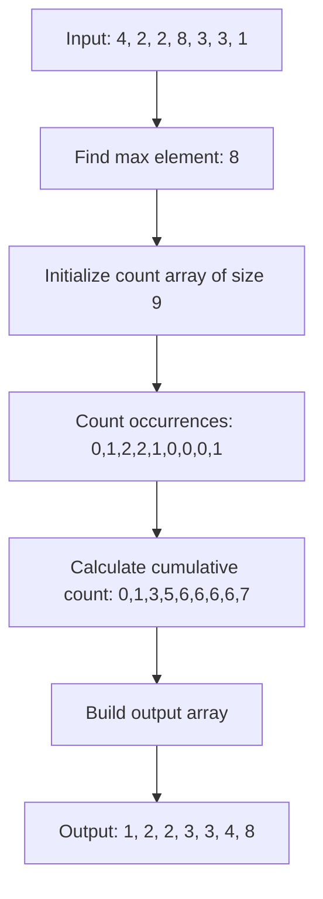

# Counting Sort

## Introduction

Counting Sort is a unique sorting algorithm that doesn't rely on comparisons between elements. Instead, it counts the occurrences of each distinct element in the array and uses this information to place elements in their correct positions. This approach makes Counting Sort exceptionally efficient for sorting integers or objects that can be mapped to integers within a small range.

Unlike popular comparison-based algorithms like Quick Sort or Merge Sort (which have a time complexity of O(n log n)), Counting Sort achieves **O(n + k)** time complexity, where n is the number of elements and k is the range of possible input values. This makes it blazingly fast when the range of input values isn't much larger than the number of elements to sort.

## How Counting Sort Works

Counting Sort operates on a simple principle: count the frequency of each unique element in the original array and use that information to determine the correct position of each element in the sorted output.

Let's break down the algorithm into simple steps:

1. Find the range of input values (minimum to maximum)
2. Count the occurrences of each value in the input array
3. Calculate the cumulative count (running sum) to determine positions
4. Build the sorted output array using the position information
5. Transfer the sorted elements back to the original array (if needed)

## Algorithm Implementation

Let's see how Counting Sort works in practice with a step-by-step implementation in JavaScript:

```javascript
function countingSort(arr) {
  // Step 1: Find the maximum element in the array
  const max = Math.max(...arr);
  
  // Step 2: Initialize a count array with zeros (length max+1)
  const count = new Array(max + 1).fill(0);
  
  // Step 3: Count the occurrences of each element
  for (let i = 0; i < arr.length; i++) {
    count[arr[i]]++;
  }
  
  // Step 4: Calculate the cumulative count (running sum)
  for (let i = 1; i <= max; i++) {
    count[i] += count[i - 1];
  }
  
  // Step 5: Build the output array
  const output = new Array(arr.length);
  for (let i = arr.length - 1; i >= 0; i--) {
    output[count[arr[i]] - 1] = arr[i];
    count[arr[i]]--;
  }
  
  // Step 6: Copy the output array to the original array
  for (let i = 0; i < arr.length; i++) {
    arr[i] = output[i];
  }
  
  return arr;
}
```

## Step-by-Step Walkthrough with Example

Let's trace through the algorithm using a simple example: `[4, 2, 2, 8, 3, 3, 1]`

### Step 1: Find the maximum element
The maximum element is 8.

### Step 2: Initialize the count array
We create a count array of size 9 (max + 1): `[0, 0, 0, 0, 0, 0, 0, 0, 0]`

### Step 3: Count occurrences of each element
After counting:
```
Index:  0  1  2  3  4  5  6  7  8
Count: [0, 1, 2, 2, 1, 0, 0, 0, 1]
```

### Step 4: Calculate the cumulative count
After calculating cumulative sums:
```
Index:  0  1  2  3  4  5  6  7  8
Count: [0, 1, 3, 5, 6, 6, 6, 6, 7]
```

### Step 5: Build the output array
We iterate through the original array in reverse:
- Process 1: Place at position count[1]-1 = 0, decrement count[1]
- Process 3: Place at position count[3]-1 = 4, decrement count[3]
- Process 3: Place at position count[3]-1 = 3, decrement count[3]
- Process 8: Place at position count[8]-1 = 6, decrement count[8]
- Process 2: Place at position count[2]-1 = 2, decrement count[2]
- Process 2: Place at position count[2]-1 = 1, decrement count[2]
- Process 4: Place at position count[4]-1 = 5, decrement count[4]

Final output array: `[1, 2, 2, 3, 3, 4, 8]`

### Step 6: Copy back to original array
The original array gets updated to: `[1, 2, 2, 3, 3, 4, 8]`

## Visual Representation

Let's visualize how Counting Sort works using a diagram:



## Time and Space Complexity

- **Time Complexity**: O(n + k), where n is the number of elements and k is the range of input values.
- **Space Complexity**: O(n + k) for the count array and output array.

The linear time complexity makes Counting Sort extremely efficient when k is small relative to n. However, if k is significantly larger than n, the algorithm becomes less efficient.

## When to Use Counting Sort

Counting Sort is ideal when:

1. You're sorting integers or objects that can be mapped to integers
2. The range of values is small compared to the number of elements
3. You need a stable sorting algorithm (preserving the relative order of equal elements)

It's not suitable when:

1. The range of input values is very large
2. You're sorting floating-point numbers directly
3. Memory usage is a significant concern and the range is large

## Real-World Applications

### 1. Student Score Ranking

Imagine a classroom with 30 students taking a test scored from 0-100. Using Counting Sort would be much more efficient than comparison-based sorts:

```javascript
function rankStudentScores(scores) {
  // Create a count array for scores 0-100
  const count = new Array(101).fill(0);
  
  // Count frequency of each score
  for (const score of scores) {
    count[score]++;
  }
  
  // Generate ranked list of scores (descending order)
  const rankedScores = [];
  for (let score = 100; score >= 0; score--) {
    for (let i = 0; i < count[score]; i++) {
      rankedScores.push(score);
    }
  }
  
  return rankedScores;
}

// Example usage
const scores = [87, 95, 63, 95, 83, 70, 78, 52, 95, 81];
console.log(rankStudentScores(scores));
// Output: [95, 95, 95, 87, 83, 81, 78, 70, 63, 52]
```

### 2. Age Distribution Analysis

Analyzing age distributions in demographics can benefit from Counting Sort:

```javascript
function analyzeAgeDistribution(ages) {
  // Assume ages range from 0 to 120
  const count = new Array(121).fill(0);
  
  // Count frequency of each age
  for (const age of ages) {
    count[age]++;
  }
  
  // Find most common age group
  let maxCount = 0;
  let mostCommonAge = 0;
  
  for (let age = 0; age < count.length; age++) {
    if (count[age] > maxCount) {
      maxCount = count[age];
      mostCommonAge = age;
    }
  }
  
  return {
    sortedAges: countingSort(ages),
    mostCommonAge: mostCommonAge,
    ageFrequency: count
  };
}
```

### 3. Sorting Characters in a String

Counting Sort can efficiently sort characters in a string:

```javascript
function sortString(str) {
  // Convert to array of character codes
  const charCodes = Array.from(str).map(c => c.charCodeAt(0));
  
  // Find the maximum character code
  const max = Math.max(...charCodes);
  
  // Create and fill count array
  const count = new Array(max + 1).fill(0);
  for (const code of charCodes) {
    count[code]++;
  }
  
  // Build sorted string
  let sortedStr = '';
  for (let i = 0; i <= max; i++) {
    for (let j = 0; j < count[i]; j++) {
      sortedStr += String.fromCharCode(i);
    }
  }
  
  return sortedStr;
}

// Example
console.log(sortString("algorithm"));
// Output: "aghilmort"
```

## Variations of Counting Sort

### 1. Handling Negative Numbers

The basic implementation doesn't handle negative numbers. Here's how you can modify it:

```javascript
function countingSortWithNegatives(arr) {
  const min = Math.min(...arr);
  const max = Math.max(...arr);
  const range = max - min + 1;
  
  // Create count array and output array
  const count = new Array(range).fill(0);
  const output = new Array(arr.length);
  
  // Count occurrences of each element (shifted by min)
  for (const num of arr) {
    count[num - min]++;
  }
  
  // Calculate cumulative count
  for (let i = 1; i < range; i++) {
    count[i] += count[i - 1];
  }
  
  // Build the output array
  for (let i = arr.length - 1; i >= 0; i--) {
    output[count[arr[i] - min] - 1] = arr[i];
    count[arr[i] - min]--;
  }
  
  return output;
}

// Example with negative numbers
const array = [4, -2, 2, 8, -3, 3, 1];
console.log(countingSortWithNegatives(array));
// Output: [-3, -2, 1, 2, 3, 4, 8]
```

### 2. Radix Sort

Counting Sort forms the basis for Radix Sort, which can sort larger integers by processing them digit by digit.

## Summary

Counting Sort is a powerful, non-comparison-based sorting algorithm that achieves linear time complexity when sorting integers within a limited range. It utilizes the frequency counts of values to determine element positions.

**Key Takeaways:**

- Time Complexity: O(n + k), where n is the number of elements and k is the range
- Space Complexity: O(n + k)
- Not based on comparisons between elements
- Extremely fast for small ranges of input values
- Stable sorting algorithm (preserves order of equal elements)
- Limited to integers or values that can be mapped to integers

Although Counting Sort has limitations, understanding when and how to apply it can result in significant performance improvements for appropriate use cases.

## Practice Exercises

1. Implement Counting Sort to sort a large array of student IDs (ranging from 10000-99999).
2. Modify Counting Sort to work with an array of objects based on a numeric property.
3. Compare the performance of Counting Sort with other sorting algorithms for different input sizes and ranges.
4. Implement a function that uses Counting Sort to find the top K most frequent elements in an array.
5. Create a hybrid sorting algorithm that uses Counting Sort when the range is small and another algorithm when the range is large.

## Additional Resources

- Explore other distribution-based sorting algorithms like Bucket Sort and Radix Sort.
- Learn how to optimize Counting Sort for parallel processing.
- Study how to combine Counting Sort with other algorithms for improved performance in specific scenarios.

Happy sorting!