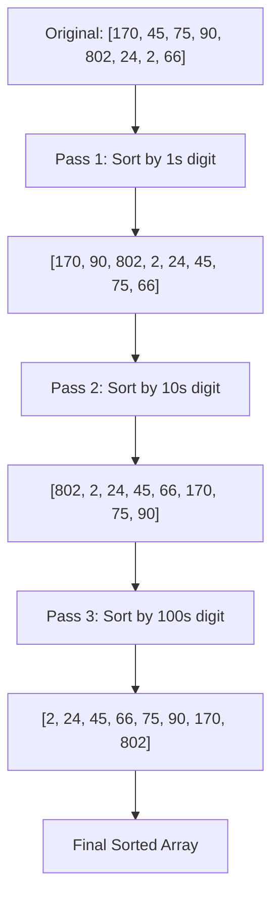

# Radix Sort

## Introduction

Radix Sort is a non-comparative sorting algorithm that works by processing individual digits of the numbers being sorted. Unlike comparison-based algorithms like Quicksort or Merge Sort that compare elements directly, Radix Sort processes numbers digit by digit, from the least significant digit (LSD) to the most significant digit (MSD), or vice versa.

The algorithm gets its name from the way it processes the digits in "radix" form, where radix refers to the base of the number system (e.g., decimal system has radix 10, binary system has radix 2).

Radix Sort is particularly efficient for sorting integers or strings with fixed-length keys, and it performs in linear time when certain conditions are met.

## How Radix Sort Works

Radix Sort operates on the principle of sorting elements based on individual digits or characters. Here's how it works:

1. Start with the least significant digit (rightmost)
2. Sort all elements based on this digit using a stable sorting algorithm
3. Move to the next significant digit (moving leftwards)
4. Repeat the stable sort on this digit
5. Continue until all digits are processed

The key insight is that a stable sorting algorithm maintains the relative order of elements with the same key. This property ensures that previous sorting work isn't undone when moving to the next digit.

### Types of Radix Sort

There are primarily two approaches to Radix Sort:

1. **Least Significant Digit (LSD) Radix Sort**: Starts sorting from the least significant digit (rightmost) and moves towards the most significant digit (leftmost). This approach is more common.

2. **Most Significant Digit (MSD) Radix Sort**: Starts from the most significant digit (leftmost) and moves towards the least significant digit (rightmost). This approach allows for early termination in some cases.

## Step-by-Step Implementation

Let's implement LSD Radix Sort for positive integers:

```javascript
function radixSort(arr) {
  // Find the maximum number to know number of digits
  const max = Math.max(...arr);
  
  // Do counting sort for every digit
  // exp is 10^i where i is the current digit number
  for (let exp = 1; Math.floor(max / exp) > 0; exp *= 10) {
    countingSortByDigit(arr, exp);
  }
  
  return arr;
}

function countingSortByDigit(arr, exp) {
  const n = arr.length;
  const output = new Array(n).fill(0);
  const count = new Array(10).fill(0);
  
  // Store count of occurrences in count[]
  for (let i = 0; i < n; i++) {
    const digit = Math.floor(arr[i] / exp) % 10;
    count[digit]++;
  }
  
  // Change count[i] so that count[i] now contains
  // actual position of this digit in output[]
  for (let i = 1; i < 10; i++) {
    count[i] += count[i - 1];
  }
  
  // Build the output array
  for (let i = n - 1; i >= 0; i--) {
    const digit = Math.floor(arr[i] / exp) % 10;
    output[count[digit] - 1] = arr[i];
    count[digit]--;
  }
  
  // Copy the output array to arr[]
  for (let i = 0; i < n; i++) {
    arr[i] = output[i];
  }
}
```

### Example Usage:

```javascript
const array = [170, 45, 75, 90, 802, 24, 2, 66];
console.log("Original array:", array);
radixSort(array);
console.log("Sorted array:", array);

// Output:
// Original array: [170, 45, 75, 90, 802, 24, 2, 66]
// Sorted array: [2, 24, 45, 66, 75, 90, 170, 802]
```

## Visual Walkthrough

Let's walk through a simple example to better understand how Radix Sort works. Consider the array: `[170, 45, 75, 90, 802, 24, 2, 66]`



### Pass 1: Sort by ones place (least significant digit)

1. Group numbers by their ones digit:
   - Digit 0: 170, 90, 802
   - Digit 2: 2
   - Digit 4: 24
   - Digit 5: 45, 75
   - Digit 6: 66

2. Combine these groups: [170, 90, 802, 2, 24, 45, 75, 66]

### Pass 2: Sort by tens place

1. Group numbers by their tens digit:
   - Digit 0: 802, 2
   - Digit 2: 24
   - Digit 4: 45
   - Digit 6: 66
   - Digit 7: 170, 75
   - Digit 9: 90

2. Combine these groups: [802, 2, 24, 45, 66, 170, 75, 90]

### Pass 3: Sort by hundreds place

1. Group numbers by their hundreds digit:
   - Digit 0: 2, 24, 45, 66, 75, 90
   - Digit 1: 170
   - Digit 8: 802

2. Combine these groups: [2, 24, 45, 66, 75, 90, 170, 802]

After the third pass, our array is completely sorted.

## Time and Space Complexity

### Time Complexity

The time complexity of Radix Sort is `O(d * (n + b))`, where:
- `d` is the number of digits in the maximum number
- `n` is the number of elements in the array
- `b` is the base of the number system (typically 10 for decimal)

If we can assume that the numbers have a constant number of digits (which is typically the case for integers within a certain range), the time complexity simplifies to `O(n)`.

### Space Complexity

Radix Sort requires additional space for:
- The output array: `O(n)`
- The count array: `O(b)`, where `b` is the base of the number system (typically 10)

Thus, the overall space complexity is `O(n + b)`, which simplifies to `O(n)` since `b` is usually a small constant.

## Advantages and Disadvantages

### Advantages

1. **Linear Time Complexity**: Radix Sort can achieve `O(n)` time complexity under certain conditions.
2. **No Comparisons**: As a non-comparative algorithm, it can surpass the lower bound of `O(n log n)` for comparison-based sorting algorithms.
3. **Stable**: Radix Sort is stable, preserving the relative order of equal elements.

### Disadvantages

1. **Additional Space**: Requires additional memory proportional to the input size.
2. **Limited Applicability**: Works most efficiently with fixed-length integer keys or strings.
3. **Not In-Place**: Typically requires auxiliary storage.
4. **Not Always Efficient**: For small arrays or arrays with very large numbers, other algorithms might be more efficient.

## Real-World Applications

1. **Integer Sorting**: Radix Sort excels at sorting large collections of integers, especially when they have a bounded range.

2. **String Processing**: Can be used for sorting strings lexicographically, such as in dictionary applications or file systems.

3. **Network Routing**: Used in some network routing algorithms to sort addresses efficiently.

4. **Database Systems**: Sometimes employed in database systems for sorting records based on integer keys.

5. **Parallel Computing**: Since Radix Sort doesn't require comparisons between elements, it can be effectively parallelized.

### Example: Sorting Network IP Addresses

IP addresses can be represented as integers and sorted efficiently using Radix Sort:

```javascript
function sortIPAddresses(addresses) {
  // Convert IP addresses to integers
  const ipIntegers = addresses.map(ip => {
    const parts = ip.split('.');
    return (
      (parseInt(parts[0]) << 24) |
      (parseInt(parts[1]) << 16) |
      (parseInt(parts[2]) << 8) |
      parseInt(parts[3])
    );
  });
  
  // Sort the integers
  radixSort(ipIntegers);
  
  // Convert back to IP address format
  return ipIntegers.map(integer => {
    return [
      (integer >> 24) & 255,
      (integer >> 16) & 255,
      (integer >> 8) & 255,
      integer & 255
    ].join('.');
  });
}

// Example usage
const ips = ["192.168.1.1", "10.0.0.1", "172.16.0.1", "192.168.0.1"];
const sortedIPs = sortIPAddresses(ips);
console.log(sortedIPs);
// Output: ["10.0.0.1", "172.16.0.1", "192.168.0.1", "192.168.1.1"]
```

## Variations of Radix Sort

### MSD Radix Sort

Most Significant Digit Radix Sort starts from the leftmost digit and moves to the right. It is useful when keys are of different lengths or for early termination when sorting strings with common prefixes.

### Bucket Radix Sort

Combines elements of Radix Sort with Bucket Sort, dividing the elements into buckets based on specific portions of their key values.

### American Flag Sort

An optimized variation of MSD Radix Sort that performs better in practice by reducing the number of memory accesses.

## Summary

Radix Sort is a powerful non-comparative sorting algorithm that works by processing individual digits of integers or characters of strings. Its ability to achieve linear time complexity makes it particularly valuable for specific use cases, especially when sorting large collections of integers or fixed-length strings.

Key points to remember:
- Processes digits one by one, either from least to most significant (LSD) or vice versa (MSD)
- Achieves `O(n)` time complexity when the number of digits is constant
- Uses a stable sort (like Counting Sort) as a subroutine for each digit
- Requires additional space proportional to the input size
- Excels with fixed-length integer keys or strings

While not suitable for every sorting scenario, Radix Sort's unique approach offers an important alternative to comparison-based sorting algorithms, especially when performance is critical and the data fits its requirements.

## Additional Resources and Exercises

### Resources for Further Learning
- "Introduction to Algorithms" by Cormen, Leiserson, Rivest, and Stein
- [VisuAlgo - Sorting Visualization](https://visualgo.net/en/sorting)

### Exercises

1. **Basic Implementation**: Implement Radix Sort for an array of positive integers.

2. **String Sorting**: Modify the Radix Sort algorithm to sort strings of different lengths.

3. **Optimization Challenge**: Implement Radix Sort to work efficiently with both positive and negative integers.

4. **Analysis**: Compare the performance of Radix Sort with other sorting algorithms like Quicksort and Merge Sort for different input sizes and distributions.

5. **Application**: Use Radix Sort to solve a real-world problem, such as sorting a large collection of dates or product IDs.

6. **Parallel Radix Sort**: Research and implement a parallel version of Radix Sort to take advantage of multiple processors.