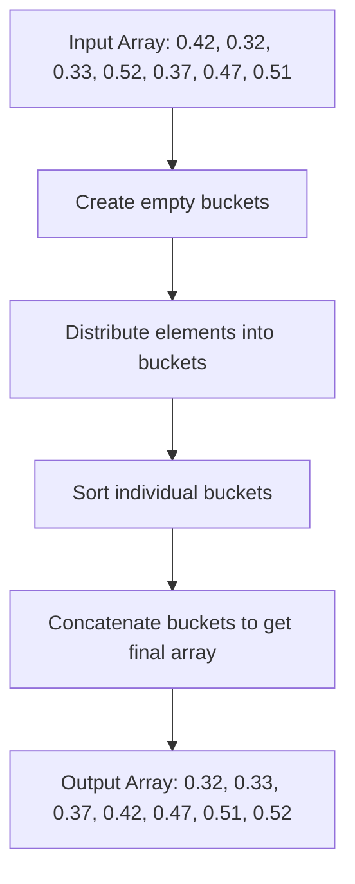

# Bucket Sort

## Introduction

Bucket Sort is a distribution-based sorting algorithm that works by distributing the elements of an array into a number of buckets. Each bucket is then sorted individually, either using a different sorting algorithm or by recursively applying the bucket sorting algorithm. After all buckets have been sorted, they are concatenated to produce the final sorted array.

Bucket Sort is particularly effective when the input is uniformly distributed over a range. For example, if you have floating-point values between 0 and 1, Bucket Sort can be very efficient.

## How Bucket Sort Works

The Bucket Sort algorithm follows these steps:

1. Create an array of empty buckets (or lists).
2. Distribute the elements of the input array into the buckets based on a specific formula.
3. Sort each bucket individually using any sorting algorithm (or recursively apply bucket sort).
4. Concatenate the sorted buckets to form the final sorted array.

Let's visualize this process:



## Implementation

Let's implement Bucket Sort in JavaScript for sorting an array of floating-point numbers between 0 and 1:

```javascript
function bucketSort(arr) {
    if (arr.length <= 1) {
        return arr;
    }
    
    // Create buckets
    const n = arr.length;
    const buckets = Array.from({ length: n }, () => []);
    
    // Add elements to the buckets
    for (let i = 0; i < n; i++) {
        // Calculate the index for the bucket
        const bucketIndex = Math.floor(n * arr[i]);
        buckets[bucketIndex].push(arr[i]);
    }
    
    // Sort each bucket individually (using insertion sort)
    for (let i = 0; i < n; i++) {
        buckets[i].sort((a, b) => a - b);
    }
    
    // Concatenate all buckets to get the final sorted array
    return buckets.flat();
}
```

For sorting integers in a specific range, we can modify the formula for determining bucket indices:

```javascript
function bucketSortIntegers(arr) {
    if (arr.length <= 1) {
        return arr;
    }
    
    // Find min and max values
    let min = arr[0];
    let max = arr[0];
    for (let i = 1; i < arr.length; i++) {
        if (arr[i] < min) {
            min = arr[i];
        } else if (arr[i] > max) {
            max = arr[i];
        }
    }
    
    // Create buckets
    const bucketCount = Math.floor(Math.sqrt(arr.length));
    const bucketRange = (max - min) / bucketCount + 1;
    const buckets = Array.from({ length: bucketCount }, () => []);
    
    // Add elements to the buckets
    for (let i = 0; i < arr.length; i++) {
        const bucketIndex = Math.floor((arr[i] - min) / bucketRange);
        buckets[bucketIndex].push(arr[i]);
    }
    
    // Sort each bucket individually
    for (let i = 0; i < bucketCount; i++) {
        // Using insertion sort for small arrays is often more efficient
        insertionSort(buckets[i]);
    }
    
    // Concatenate all buckets to get the final sorted array
    let result = [];
    for (let i = 0; i < bucketCount; i++) {
        result = result.concat(buckets[i]);
    }
    
    return result;
}

function insertionSort(arr) {
    for (let i = 1; i < arr.length; i++) {
        let current = arr[i];
        let j = i - 1;
        
        while (j >= 0 && arr[j] > current) {
            arr[j + 1] = arr[j];
            j--;
        }
        arr[j + 1] = current;
    }
    
    return arr;
}
```

## Example with Step-by-Step Execution

Let's go through a step-by-step execution of Bucket Sort for an array of floating-point numbers:

Input array: `[0.42, 0.32, 0.33, 0.52, 0.37, 0.47, 0.51]`

1. Create 7 empty buckets (one for each element):
   - Bucket 0: []
   - Bucket 1: []
   - Bucket 2: []
   - Bucket 3: []
   - Bucket 4: []
   - Bucket 5: []
   - Bucket 6: []

2. Distribute elements into buckets:
   - 0.42 → Bucket 2: [0.42]
   - 0.32 → Bucket 2: [0.42, 0.32]
   - 0.33 → Bucket 2: [0.42, 0.32, 0.33]
   - 0.52 → Bucket 3: [0.52]
   - 0.37 → Bucket 2: [0.42, 0.32, 0.33, 0.37]
   - 0.47 → Bucket 3: [0.52, 0.47]
   - 0.51 → Bucket 3: [0.52, 0.47, 0.51]

3. Sort each bucket:
   - Bucket 0: []
   - Bucket 1: []
   - Bucket 2: [0.32, 0.33, 0.37, 0.42]
   - Bucket 3: [0.47, 0.51, 0.52]
   - Bucket 4: []
   - Bucket 5: []
   - Bucket 6: []

4. Concatenate all buckets:
   - Final sorted array: [0.32, 0.33, 0.37, 0.42, 0.47, 0.51, 0.52]

## Time and Space Complexity

The time complexity of Bucket Sort depends on:
- The distribution of elements
- The sorting algorithm used for each bucket

Under the assumption that the elements are uniformly distributed:

- **Best case time complexity**: O(n + k) where n is the number of elements and k is the number of buckets.
- **Average case time complexity**: O(n + k)
- **Worst case time complexity**: O(n²) when all elements are placed in a single bucket.

The space complexity is O(n + k) for storing the buckets and the elements.

## Practical Applications

Bucket Sort is especially useful in the following scenarios:

1. **Sorting floating-point numbers between 0 and 1**: Bucket Sort is highly efficient for this case, as demonstrated in our example.

2. **When the input is uniformly distributed**: If you know that your data is evenly distributed across a range, Bucket Sort can provide near-linear performance.

3. **External sorting**: When dealing with large datasets that don't fit into memory, Bucket Sort can be useful by dividing data into manageable "buckets."

4. **Radix sort implementation**: Bucket Sort serves as a building block for Radix Sort, which sorts integers by processing individual digits.

## Code Example with Input and Output

Let's see a complete example with input and output:

```javascript
function bucketSort(arr) {
    if (arr.length <= 1) {
        return arr;
    }
    
    // Create buckets
    const n = arr.length;
    const buckets = Array.from({ length: n }, () => []);
    
    // Add elements to the buckets
    for (let i = 0; i < n; i++) {
        const bucketIndex = Math.floor(n * arr[i]);
        buckets[bucketIndex].push(arr[i]);
    }
    
    // Sort each bucket individually
    for (let i = 0; i < n; i++) {
        buckets[i].sort((a, b) => a - b);
    }
    
    // Concatenate all buckets to get the final sorted array
    return buckets.flat();
}

// Example usage
const unsortedArray = [0.42, 0.32, 0.33, 0.52, 0.37, 0.47, 0.51];
console.log("Unsorted array:", unsortedArray);

const sortedArray = bucketSort(unsortedArray);
console.log("Sorted array:", sortedArray);

// Output:
// Unsorted array: [0.42, 0.32, 0.33, 0.52, 0.37, 0.47, 0.51]
// Sorted array: [0.32, 0.33, 0.37, 0.42, 0.47, 0.51, 0.52]
```

## Advantages and Disadvantages

### Advantages
- Very efficient when data is uniformly distributed
- Can be faster than O(n log n) algorithms like Quick Sort and Merge Sort
- Easy to implement and understand
- Can be parallelized due to its distribution nature

### Disadvantages
- Not an in-place sorting algorithm (requires extra space)
- Performance heavily depends on data distribution
- If elements are not uniformly distributed, some buckets may have more elements, leading to worst-case performance
- Requires additional operations like hashing for determining bucket indices

## Summary

Bucket Sort is a distribution-based sorting algorithm that works efficiently when the input is uniformly distributed. It distributes elements into buckets, sorts each bucket individually, and then combines the buckets to get the final sorted array.

Key points to remember about Bucket Sort:

1. Its performance depends on the distribution of data
2. Best used when elements are uniformly distributed
3. Average time complexity is O(n + k)
4. Works well for floating-point numbers between 0 and 1
5. Can be optimized with the right choice of bucket count and underlying sorting algorithm

## Exercises

1. Implement Bucket Sort for an array of integers in the range 0-1000.
2. Modify the Bucket Sort algorithm to work with negative numbers.
3. Compare the performance of Bucket Sort against Quick Sort for different types of input distributions.
4. Implement a version of Bucket Sort that uses a linked list for each bucket instead of an array.
5. Create a visualization of the Bucket Sort algorithm working on a sample array.

## Additional Resources

- "Introduction to Algorithms" by Cormen, Leiserson, Rivest, and Stein provides an in-depth analysis of Bucket Sort
- Various online platforms like LeetCode and HackerRank have problems that can be efficiently solved using Bucket Sort
- For a deeper understanding of distribution sorts, research related algorithms like Counting Sort and Radix Sort

Happy Coding! 🧮 🪣 🔍